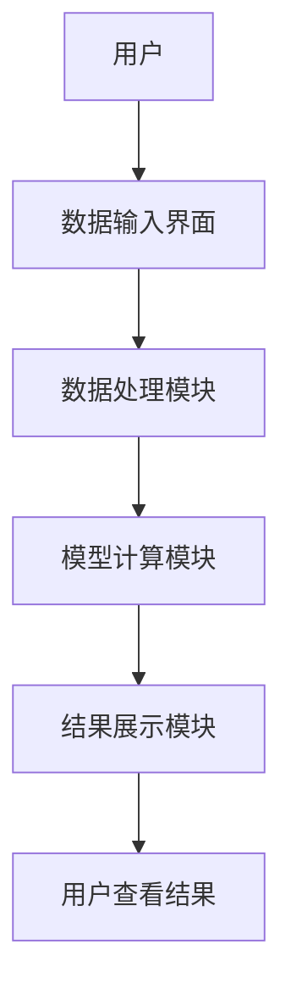
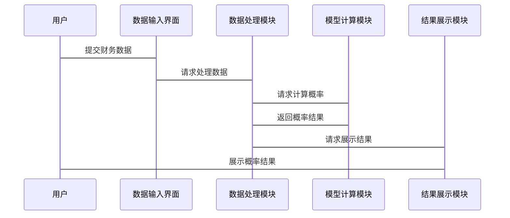

                 


# 智能个人财务目标达成概率计算器

## 关键词：
智能财务目标计算器, 个人财务规划, 概率计算模型, 风险评估, 人工智能算法, 量化投资

## 摘要：
本文旨在探讨如何利用人工智能算法和概率计算模型，构建一个智能个人财务目标达成概率计算器。文章从个人财务管理的重要性入手，详细分析了财务目标达成概率的核心概念、算法原理、系统架构，并通过实际案例展示了如何利用Python代码实现这一系统。本文不仅为个人用户提供了一个高效、智能的财务目标管理工具，也为金融领域的技术实现提供了新的思路。

# 第1章: 个人财务目标管理的现状与挑战

## 1.1 个人财务目标管理的重要性
### 1.1.1 财务目标在个人生活中的作用
- 财务目标是个人实现生活规划的重要基础
- 财务健康直接影响生活质量
- 财务目标管理是个人理财的核心

### 1.1.2 当前财务管理工具的局限性
- 传统财务管理工具的不足
- 数据分析的深度有限
- 缺乏智能化和个性化

### 1.1.3 智能化财务管理的必要性
- 技术进步推动财务管理智能化
- 个性化需求增加对智能工具的需求
- 数据分析能力提升财务管理效率

## 1.2 财务目标达成概率的核心问题
### 1.2.1 财务目标的定义与分类
- 短期目标与长期目标
- 消费目标与投资目标
- 保障目标与理财目标

### 1.2.2 影响目标达成概率的关键因素
- 收入水平
- 支出结构
- 投资收益
- 风险承受能力

### 1.2.3 概率计算的数学基础
- 概率论的基本概念
- 条件概率与独立事件
- 贝叶斯定理的应用

## 1.3 本章小结
- 财务目标管理的现状分析
- 智能计算器的核心问题
- 本书的研究目标

# 第2章: 财务目标达成概率的核心概念

## 2.1 概率计算模型
### 2.1.1 概率的基本概念
- 概率的定义
- 概率的范围
- 概率的计算方法

### 2.1.2 财务目标达成概率的数学模型
$$P(\text{达成目标}) = \frac{\text{成功案例数}}{\text{总案例数}}$$

### 2.1.3 概率计算的边界与外延
- 数据的准确性
- 模型的适用性
- 概率结果的解释

## 2.2 数据特征分析
### 2.2.1 财务数据的特征提取
- 收入来源
- 支出项目
- 资产配置
- 债务情况

### 2.2.2 数据特征与概率的关系
- 收入水平与概率的正相关性
- 支出结构对概率的负向影响
- 资产配置的多样性对概率的提升作用

### 2.2.3 数据预处理方法
- 数据清洗
- 数据标准化
- 数据特征选择

## 2.3 风险评估模型
### 2.3.1 风险的定义与分类
- 市场风险
- 利率风险
- 操作风险
- 信用风险

### 2.3.2 风险评估的数学模型
$$R = \sum_{i=1}^{n} w_i r_i$$
其中，\( w_i \) 是风险因素 \( i \) 的权重，\( r_i \) 是风险因素 \( i \) 的影响程度

### 2.3.3 风险与概率的关系
- 风险因素对概率的降低作用
- 风险控制对概率的提升作用
- 风险评估的动态性

## 2.4 核心概念的ER实体关系图
```mermaid
erDiagram
    用户 {
        string 用户ID
        string 用户名
        integer 年龄
        string 邮箱
    }
    财务目标 {
        integer 目标ID
        string 目标名称
        decimal 目标金额
        date 截止日期
    }
    风险因素 {
        integer 风险ID
        string 风险名称
        decimal 风险概率
    }
    用户 --> 财务目标 :
    用户 --> 风险因素 :
    财务目标 --> 风险因素 :
```

# 第3章: 概率计算模型的算法原理

## 3.1 贝叶斯定理在概率计算中的应用
### 3.1.1 贝叶斯定理的基本原理
$$P(A|B) = \frac{P(B|A) P(A)}{P(B)}$$

### 3.1.2 在财务目标概率计算中的应用
- 前验概率与后验概率
- 财务目标相关的条件概率

## 3.2 基于马尔可夫链的风险评估算法
### 3.2.1 马尔可夫链的基本原理
- 状态转移矩阵
- 状态转移概率

### 3.2.2 在风险评估中的应用
- 财务状态的转移
- 风险状态的预测

## 3.3 概率计算的数学模型实现
### 3.3.1 概率计算的流程
1. 数据预处理
2. 模型训练
3. 概率计算
4. 结果分析

### 3.3.2 Python实现代码
```python
import numpy as np
from sklearn.naive_bayes import GaussianNB

# 示例数据
X = np.array([[25000, 20000, 10000],
              [30000, 25000, 15000],
              [35000, 30000, 20000]])

y = np.array([1, 0, 1])  # 1代表达成，0代表未达成

# 训练模型
model = GaussianNB()
model.fit(X, y)

# 预测概率
test_sample = np.array([[30000, 25000, 18000]])
prob = model.predict_proba(test_sample)
print("预测概率:", prob)
```

## 3.4 算法的优化与改进
### 3.4.1 算法的选择与比较
- 贝叶斯算法与决策树算法的比较
- 支持向量机在概率计算中的应用

### 3.4.2 模型优化策略
- 参数调优
- 特征选择
- 集成学习

# 第4章: 风险评估模型的系统架构

## 4.1 系统功能设计
### 4.1.1 用户界面设计
- 数据输入界面
- 概率计算界面
- 风险评估界面

### 4.1.2 系统功能模块
- 数据处理模块
- 模型计算模块
- 结果展示模块

## 4.2 系统架构设计


## 4.3 接口设计与交互流程
### 4.3.1 数据接口设计
- 数据输入接口
- 数据输出接口

### 4.3.2 交互流程
1. 用户输入财务数据
2. 系统进行数据处理
3. 系统计算概率并评估风险
4. 系统展示结果

## 4.4 系统架构的实现
### 4.4.1 系统架构图


### 4.4.2 交互序列图


# 第5章: 项目实战与实现

## 5.1 环境安装与配置
### 5.1.1 安装Python
- 下载安装Python
- 配置环境变量

### 5.1.2 安装所需库
- numpy
- pandas
- scikit-learn
- matplotlib

## 5.2 系统核心实现
### 5.2.1 数据处理模块
```python
import pandas as pd

# 读取数据
data = pd.read_csv('financial_data.csv')

# 数据清洗
data.dropna(inplace=True)
data = data[~data['收入'].isnull()]
```

### 5.2.2 模型计算模块
```python
from sklearn.naive_bayes import GaussianNB

# 训练模型
model = GaussianNB()
model.fit(X_train, y_train)

# 预测概率
y_prob = model.predict_proba(X_test)
```

### 5.2.3 结果展示模块
```python
import matplotlib.pyplot as plt

# 绘制概率分布图
plt.hist(y_prob, bins=10)
plt.title('概率分布图')
plt.xlabel('概率')
plt.ylabel('频数')
plt.show()
```

## 5.3 项目实现的详细解读
### 5.3.1 数据预处理
- 数据清洗
- 数据标准化
- 数据特征选择

### 5.3.2 模型训练
- 模型选择
- 模型训练
- 模型评估

### 5.3.3 系统测试
- 功能测试
- 性能测试
- 安全测试

## 5.4 实际案例分析
### 5.4.1 案例背景
- 用户的基本信息
- 财务目标的具体内容

### 5.4.2 数据分析
- 收入与支出分析
- 资产与负债分析

### 5.4.3 概率计算
- 计算过程
- 结果分析

## 5.5 项目总结
### 5.5.1 项目成果
- 系统功能实现
- 模型准确率
- 用户体验优化

### 5.5.2 项目经验
- 系统设计的经验
- 模型优化的经验
- 项目管理的经验

## 5.6 项目注意事项
### 5.6.1 数据输入注意事项
- 数据的完整性
- 数据的准确性
- 数据的及时性

### 5.6.2 模型使用的注意事项
- 模型的适用性
- 模型的可解释性
- 模型的可扩展性

# 第6章: 总结与展望

## 6.1 本章小结
### 6.1.1 系统的核心功能
- 财务目标概率计算
- 风险评估
- 结果展示

### 6.1.2 系统的技术实现
- 数据处理技术
- 模型计算技术
- 结果展示技术

## 6.2 未来展望
### 6.2.1 系统优化方向
- 提高模型准确率
- 优化用户体验
- 增强系统安全性

### 6.2.2 新功能开发
- 多目标概率计算
- 风险规避策略
- 投资组合优化

### 6.2.3 技术发展趋势
- 人工智能技术的发展
- 大数据技术的应用
- 区块链技术的融合

## 6.3 最佳实践 tips
### 6.3.1 数据管理 tips
- 数据加密存储
- 数据定期备份
- 数据访问权限控制

### 6.3.2 模型优化 tips
- 使用集成学习提升准确率
- 调整模型参数优化性能
- 引入新的特征变量

## 6.4 本书的价值
### 6.4.1 提供了新的思路
- 智能化财务管理工具
- 概率计算模型
- 风险评估方法

### 6.4.2 为读者提供了实用的技术
- 人工智能算法
- 数据处理技术
- 系统架构设计

## 6.5 作者寄语
- 愿本书能为读者提供有价值的参考
- 希望本书能推动智能财务目标管理的发展
- 感谢读者的支持与关注

# 作者：AI天才研究院/AI Genius Institute & 禅与计算机程序设计艺术 /Zen And The Art of Computer Programming

