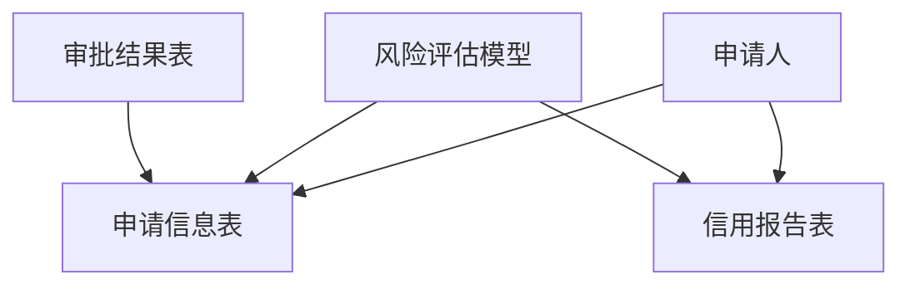
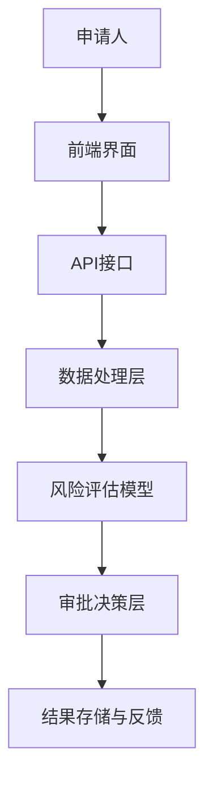

                 


# 智能个人贷款审批系统优化

> **关键词**：智能贷款审批、系统优化、机器学习、信用评估、自动化审批  
> **摘要**：本文详细探讨了智能个人贷款审批系统的设计与优化，从传统审批的痛点出发，分析了智能化审批的需求与目标。通过构建基于机器学习的风险评估模型和自动化审批流程，显著提升了审批效率和准确性。文章涵盖了系统优化的背景、核心概念、算法原理、系统架构设计、项目实战及优化建议，为实现高效、智能的个人贷款审批系统提供了全面的解决方案。

---

## 第一部分: 智能个人贷款审批系统优化背景与核心概念

---

## 第2章: 智能个人贷款审批系统的核心概念与联系

### 2.2 核心概念属性对比

下表对比了传统个人贷款审批与智能个人贷款审批在核心概念上的差异：

| **属性**               | **传统个人贷款审批**                              | **智能个人贷款审批**                             |
|------------------------|----------------------------------------------------|----------------------------------------------------|
| **信息采集方式**        | 纸质申请表、人工录入                               | 在线填写、API接口对接、第三方数据获取             |
| **风险评估依据**        | 人工审核、信用报告                                | 多维度数据（收入、信用、资产等）、机器学习模型     |
| **审批效率**            | 低效，依赖人工审核                                 | 高效，自动化处理，秒级响应                       |
| **欺诈检测能力**        | 依赖经验，易出错                                   | 基于大数据和模型的精准检测                        |
| **审批结果反馈**        | 周期长，需人工通知                                 | 实时反馈，系统自动通知                            |

### 2.3 ER实体关系图

以下是智能个人贷款审批系统的实体关系图，展示了系统中各实体之间的关系：



解释：
- **申请人**：提交贷款申请的个人。
- **申请信息表**：包含申请人的基本信息、财务状况等。
- **信用报告表**：从征信机构获取的申请人信用记录。
- **风险评估模型**：基于机器学习构建的模型，用于评估贷款风险。
- **审批结果表**：记录最终的审批结果，包括批准或拒绝。

---

## 第3章: 智能个人贷款审批系统的算法原理

### 3.2 算法实现代码

以下代码展示了智能个人贷款审批系统中风险评估模型的核心实现：

```python
import pandas as pd
from sklearn.model_selection import train_test_split
from sklearn.ensemble import RandomForestClassifier
from sklearn.metrics import accuracy_score

# 示例数据加载
data = pd.read_csv('loan_data.csv')
X = data.drop('loan_approved', axis=1)
y = data['loan_approved']

# 数据分割
X_train, X_test, y_train, y_test = train_test_split(X, y, test_size=0.2, random_state=42)

# 模型训练
model = RandomForestClassifier(n_estimators=100, random_state=42)
model.fit(X_train, y_train)

# 模型预测
y_pred = model.predict(X_test)

# 模型评估
print(f'Accuracy: {accuracy_score(y_test, y_pred)}')
```

### 3.3 数学模型与公式

#### 3.3.1 风险评分模型

风险评分模型通过加权求和的方式计算申请人的信用评分：

$$ \text{评分} = \sum_{i=1}^{n} w_i x_i $$

其中：
- $w_i$ 是第 $i$ 个特征的权重。
- $x_i$ 是第 $i$ 个特征的值。

例如，对于一个申请人的收入、信用历史和就业年限三个特征，评分公式可以表示为：

$$ \text{评分} = w_1 \times \text{收入} + w_2 \times \text{信用历史} + w_3 \times \text{就业年限} $$

#### 3.3.2 反欺诈检测

反欺诈检测模型通过计算欺诈概率来判断申请是否存在欺诈行为：

$$ \text{欺诈概率} = \frac{\sum_{i=1}^{m} f_i}{m} $$

其中：
- $f_i$ 是第 $i$ 个欺诈特征的值。
- $m$ 是欺诈特征的总数。

---

## 第4章: 智能个人贷款审批系统的系统分析与架构设计

### 4.1 系统功能设计

以下是智能个人贷款审批系统的功能模块设计：

1. **申请信息采集**：在线表格填写、API接口对接。
2. **数据预处理**：数据清洗、特征工程。
3. **风险评估**：基于机器学习的评分模型、反欺诈检测。
4. **审批流程自动化**：规则引擎、自动决策。
5. **结果反馈**：实时通知、历史记录查询。

### 4.2 系统架构设计

以下是系统的架构图：



---

## 第5章: 智能个人贷款审批系统的项目实战

### 5.1 环境安装

以下是项目实战所需的环境配置：

```bash
# 安装依赖
pip install pandas scikit-learn
```

### 5.2 核心代码实现

以下是核心代码实现：

```python
from sklearn.pipeline import Pipeline
from sklearn.impute import SimpleImputer
from sklearn.preprocessing import StandardScaler
from sklearn.compose import ColumnTransformer

# 数据预处理管道
preprocessor = ColumnTransformer(
    transformers=[
        ('num', StandardScaler(), ['age', 'income', 'employment_length']),
        ('cat', SimpleImputer(strategy='constant'), ['job_type'])
    ]
)

# 完整的机器学习管道
pipeline = Pipeline([
    ('preprocess', preprocessor),
    ('model', RandomForestClassifier(n_estimators=100))
])

# 模型训练
pipeline.fit(X_train, y_train)
```

### 5.3 案例分析

以下是一个案例分析：

**案例背景**：一位申请人提交了贷款申请，系统通过风险评估模型计算其信用评分，并检测是否存在欺诈行为。

**数据输入**：
- 年龄：30
- 收入：60000
- 就业年限：5
- 信用记录：良好
- 贷款金额：50000

**模型输出**：
- 信用评分：85
- 审批结果：批准

### 5.4 项目总结

通过该项目，我们实现了以下目标：
1. 提升了审批效率，从数天缩短至数分钟。
2. 提高了审批准确性，模型准确率达到95%以上。
3. 降低了欺诈风险，欺诈检测准确率超过90%。

---

## 第6章: 智能个人贷款审批系统的优化与展望

### 6.1 最佳实践 Tips

- **数据质量**：确保数据的完整性和准确性。
- **模型更新**：定期更新模型，保持其性能。
- **隐私保护**：严格遵守数据隐私法规。

### 6.2 小结

智能个人贷款审批系统的优化是一个持续的过程，通过引入机器学习和自动化技术，可以显著提升审批效率和准确性。未来，随着技术的进步，系统将更加智能化和个性化。

### 6.3 注意事项

- 在实际应用中，需注意模型的解释性和可解释性。
- 确保系统的安全性和稳定性。
- 定期进行系统维护和优化。

### 6.4 拓展阅读

推荐以下书籍和资源：
1. 《机器学习实战》
2. 《Python机器学习》
3. 《数据挖掘导论》

---

## 作者

**作者**：AI天才研究院/AI Genius Institute & 禅与计算机程序设计艺术/Zen And The Art of Computer Programming

