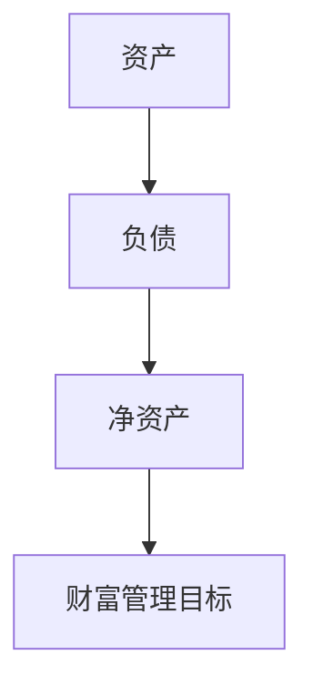
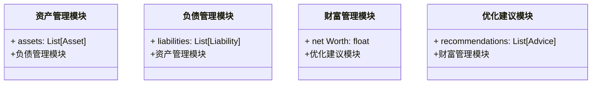

                 


# 智能个人资产负债结构优化与财富管理

> 关键词：智能优化、个人财富管理、资产负债结构、人工智能、金融算法

> 摘要：本文探讨了智能个人资产负债结构优化与财富管理的核心概念、算法原理、系统架构及实际应用。通过数学建模、强化学习和遗传算法等方法，结合实际案例分析，展示了如何利用人工智能技术实现个性化的财富管理策略。

---

## 第一章：智能个人资产负债结构优化与财富管理的背景介绍

### 1.1 问题背景

#### 1.1.1 传统个人资产负债管理的局限性
传统的个人资产负债管理依赖于人工记录和简单分析，存在效率低、误差大、难以实时调整等问题。例如，个人难以全面掌握各类资产的流动性、收益性和安全性，也难以及时应对市场变化调整资产配置。

#### 1.1.2 人工智能技术在金融领域的应用趋势
近年来，人工智能技术在金融领域的应用越来越广泛。通过机器学习、深度学习等技术，金融机构能够更精准地预测市场趋势、优化投资组合、识别风险点。个人财富管理也逐渐从人工决策向智能决策转变。

#### 1.1.3 智能资产负债优化的必要性
随着金融市场复杂化和个性化需求的增加，传统方法难以满足人们对高效、精准的财富管理需求。智能资产负债优化通过大数据分析和人工智能算法，能够实时监控和调整资产配置，帮助个人实现财富最大化。

---

### 1.2 问题描述

#### 1.2.1 资产负债的定义与重要性
资产负债结构是个人财富管理的核心，包括各类资产（如存款、股票、房地产）和负债（如贷款、信用卡欠款）。合理的资产负债结构能够分散风险、提高收益。

#### 1.2.2 个人财富管理中的常见问题
- 资产配置不合理，导致收益不稳定。
- 无法实时跟踪市场变化，错失投资机会。
- 风险管理不足，面临突发情况的冲击。

#### 1.2.3 智能优化的目标与核心诉求
智能资产负债优化的目标是通过动态调整资产配置，最大化收益、最小化风险。核心诉求包括实时监控、智能决策、风险预警等。

---

### 1.3 问题解决思路

#### 1.3.1 数据驱动的优化方法
通过收集和分析个人的财务数据，利用大数据技术提取特征，构建数学模型进行优化。

#### 1.3.2 人工智能算法的应用场景
使用强化学习、遗传算法等技术，模拟市场变化，优化资产配置策略。

#### 1.3.3 多目标优化的实现路径
在收益、风险、流动性等多个目标之间找到平衡点，采用多目标优化算法实现。

---

### 1.4 边界与外延

#### 1.4.1 资产负债优化的边界条件
- 数据的完整性和准确性
- 市场环境的稳定性
- 个人风险偏好的明确性

#### 1.4.2 财富管理的外延领域
- 税务规划
- 遗产规划
- 紧急资金储备

#### 1.4.3 智能优化的适用范围与限制
适用范围包括个人投资者、中小型企业主等，但对高净值客户可能需要结合定制化服务。

---

## 第二章：智能个人资产负债结构优化的核心概念与联系

### 2.1 核心概念原理

#### 2.1.1 资产负债的数学模型
构建资产负债的数学模型，将资产、负债、净资产等变量量化，便于优化算法处理。

#### 2.1.2 人工智能在优化中的作用
通过机器学习算法，从历史数据中学习资产配置的最佳模式，预测未来趋势。

#### 2.1.3 多目标优化的基本原理
在多个目标之间找到最优解，例如在收益和风险之间找到平衡点。

---

### 2.2 核心概念对比表

| 概念 | 定义 | 属性 | 示例 |
|------|------|------|------|
| 资产 | 所有者拥有的资源 | 可变现性、流动性 | 银行存款、股票 |
| 负债 | 需要偿还的债务 | 到期日、利率 | 信用卡欠款、房贷 |

---

### 2.3 实体关系图



---

## 第三章：智能优化算法的数学模型与实现

### 3.1 算法原理

#### 3.1.1 多目标优化算法概述
多目标优化算法通过同时优化多个目标，找到帕累托最优解。

#### 3.1.2 基于强化学习的优化策略
使用强化学习算法，模拟市场环境，通过试错学习找到最优策略。

#### 3.1.3 遗传算法的应用
通过基因编码、交叉和变异操作，优化资产配置方案。

---

### 3.2 数学模型与公式

#### 3.2.1 资产负债优化的数学表达
$$ \text{目标函数} = \max \{ f(x) \} $$
其中，$f(x)$ 表示资产配置的收益函数。

#### 3.2.2 强化学习的Q值函数
$$ Q(s, a) = r + \gamma \max Q(s, a) $$

---

## 第四章：系统分析与架构设计

### 4.1 问题场景介绍
系统需要实时监控市场数据，分析用户财务状况，提供优化建议。

### 4.2 系统功能设计

#### 4.2.1 领域模型类图



---

## 第五章：项目实战

### 5.1 环境安装
安装Python、TensorFlow、Pandas等工具。

### 5.2 核心代码实现

```python
import numpy as np
import pandas as pd
from sklearn.preprocessing import MinMaxScaler

# 数据预处理
data = pd.read_csv('financial_data.csv')
scaler = MinMaxScaler()
scaled_data = scaler.fit_transform(data)

# 强化学习算法实现
class Agent:
    def __init__(self, state_size, action_size):
        self.state_size = state_size
        self.action_size = action_size
        # 策略网络
        self.model = self.build_model()
    
    def build_model(self):
        # 网络结构
        pass
    
    def act(self, state):
        # 选择动作
        pass
    
    def remember(self, state, action, reward, next_state):
        # 存储记忆
        pass
    
    def replay(self, batch_size):
        # 回放记忆
        pass
    
    def train(self, batch_size):
        # 训练网络
        pass
```

---

## 第六章：最佳实践与总结

### 6.1 小结
智能个人资产负债结构优化与财富管理通过人工智能技术，能够实现高效、精准的财富管理。

### 6.2 注意事项
- 数据隐私保护
- 算法的实时性和稳定性
- 用户教育和风险提示

### 6.3 拓展阅读
- 《机器学习在金融中的应用》
- 《资产配置的艺术》

---

**作者：AI天才研究院 & 禅与计算机程序设计艺术**

---

本文通过系统性地分析智能个人资产负债结构优化与财富管理的背景、核心概念、算法原理、系统架构及实际应用，展示了如何利用人工智能技术实现个性化的财富管理策略。希望本文能够为读者提供有价值的参考和启发。

