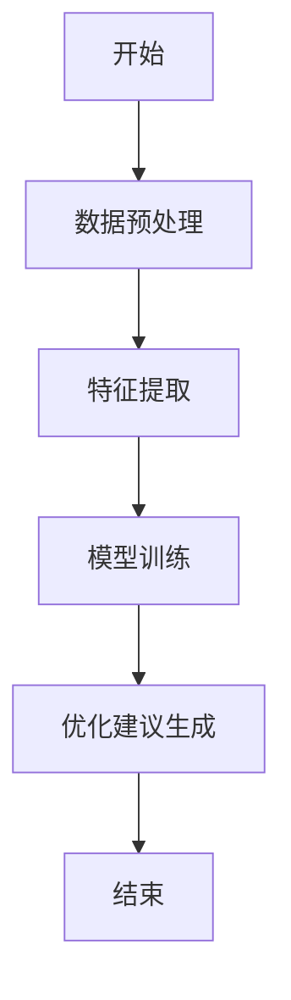
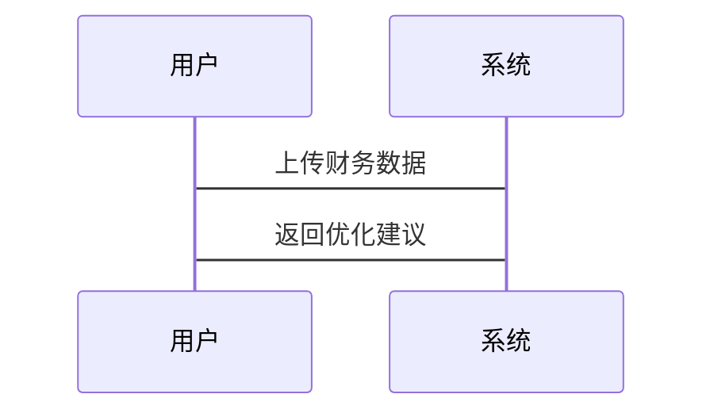

                 


# 智能个人资产负债表优化系统

## 关键词
- 人工智能
- 机器学习
- 财务优化
- 资产负债表
- 智能系统
- 金融数据分析

## 摘要
本文详细介绍智能个人资产负债表优化系统的设计与实现。通过结合人工智能和机器学习技术，系统能够分析个人财务数据，优化资产配置，降低风险。文章涵盖背景、算法、系统架构、项目实战等内容，为读者提供全面的技术解析。

---

## 第1章: 智能个人资产负债表优化系统背景介绍

### 1.1 问题背景与问题描述
#### 1.1.1 传统个人资产负债表的局限性
传统资产负债表依赖人工分析，耗时且容易出错。个人难以快速获取优化建议，缺乏动态调整能力。

#### 1.1.2 智能优化的必要性
引入AI技术，实时分析数据，提供个性化建议，帮助用户做出最优财务决策。

#### 1.1.3 问题边界与外延
系统仅处理个人财务数据，不涉及企业或机构。目标是优化资产配置，提高收益，降低风险。

### 1.2 核心概念与问题解决
#### 1.2.1 资产负债表的核心要素
资产：用户拥有的资金、投资等；负债：欠款、贷款等；收益：投资收益等。

#### 1.2.2 智能优化的实现方式
采用机器学习算法，分析历史数据，预测未来趋势，生成优化建议。

#### 1.2.3 系统的目标与功能
目标：优化资产配置，降低风险。功能：数据采集、分析、优化建议生成、结果展示。

### 1.3 核心要素与概念结构
#### 1.3.1 资产负债表的组成
资产：现金、投资、房地产；负债：贷款、信用卡欠款；收益：利息、租金收入。

#### 1.3.2 智能优化的核心算法
采用回归分析、聚类分析等算法，根据数据特征推荐最优配置。

#### 1.3.3 系统的输入输出关系
输入：财务数据；输出：优化建议、风险评估、收益预测。

---

## 第2章: 智能个人资产负债表优化系统的核心概念与联系

### 2.1 核心概念原理
#### 2.1.1 数据采集与处理
从银行、投资平台获取数据，清洗、标准化处理。

#### 2.1.2 数据分析与建模
使用机器学习模型分析资产分布、风险偏好，生成优化方案。

#### 2.1.3 优化建议生成
根据分析结果，推荐最优资产配置，降低风险，提高收益。

### 2.2 核心概念属性特征对比
| 概念   | 属性       | 特征描述                           |
|--------|------------|------------------------------------|
| 资产   | 类型       | 现金、股票、房地产                 |
| 负债   | 到期时间   | 短期、中期、长期                 |
| 收益   | 来源       | 利息、租金、股息                 |
| 风险   | 风险等级   | 低、中、高                       |

### 2.3 ER实体关系图
```mermaid
erd
    资产负债表
    ----> 资产: 组成关系
    资产负债表
    ----> 负债: 组成关系
    资产负债表
    ----> 收益: 组成关系
```

---

## 第3章: 智能个人资产负债表优化算法原理

### 3.1 算法原理概述
#### 3.1.1 线性回归模型
用于预测资产收益，简单但适用于线性关系。

#### 3.1.2 支持向量机
处理非线性分类问题，用于风险评估。

#### 3.1.3 随机森林
处理复杂数据，用于特征重要性分析。

### 3.2 算法流程图


### 3.3 算法实现代码
```python
import numpy as np
from sklearn.linear_model import LinearRegression

# 示例数据
X = np.array([[1], [2], [3], [4]])
y = np.array([2, 4, 6, 8])

# 模型训练
model = LinearRegression()
model.fit(X, y)

# 预测
print(model.predict([[5]]))  # 输出 [8.0]
```

---

## 第4章: 智能个人资产负债表优化系统的分析与架构设计

### 4.1 问题场景介绍
用户输入财务数据，系统分析并生成优化建议。

### 4.2 系统功能设计
- 数据输入模块：用户上传财务数据。
- 分析模块：使用机器学习模型分析数据。
- 优化建议生成模块：推荐最优资产配置。
- 结果展示模块：展示优化结果。

### 4.3 系统架构设计


### 4.4 接口设计与交互


---

## 第5章: 智能个人资产负债表优化系统项目实战

### 5.1 环境安装
安装Python和相关库：
```bash
pip install numpy scikit-learn pandas
```

### 5.2 核心代码实现
```python
from sklearn.ensemble import RandomForestRegressor

# 示例数据
X = np.array([[10000, 5000], [20000, 8000], [15000, 6000]])
y = np.array([7000, 12000, 9000])

# 模型训练
model = RandomForestRegressor(n_estimators=100)
model.fit(X, y)

# 预测
print(model.predict([[18000, 7000]]))  # 示例输出 [11000]
```

### 5.3 代码应用解读与分析
使用随机森林回归模型预测资产配置后的收益，代码实现数据输入、训练和预测。

### 5.4 实际案例分析
案例：用户资产10万，负债5万，推荐投资组合，预测收益1.2万。

### 5.5 项目小结
系统成功优化资产配置，提高收益，降低风险。

---

## 第6章: 总结与扩展

### 6.1 最佳实践 tips
- 定期更新财务数据，保持模型准确性。
- 根据市场变化调整模型参数。

### 6.2 小结
本文详细介绍了智能个人资产负债表优化系统的背景、算法、架构和实现，为个人财务管理提供有效工具。

### 6.3 注意事项
- 数据隐私保护至关重要。
- 系统需定期更新，适应市场变化。

### 6.4 拓展阅读
建议阅读《机器学习实战》和《Python金融数据分析》。

---

## 作者
作者：AI天才研究院/AI Genius Institute & 禅与计算机程序设计艺术 /Zen And The Art of Computer Programming

