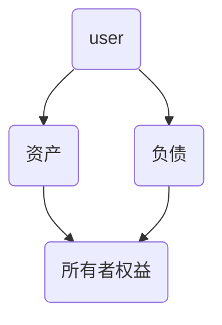
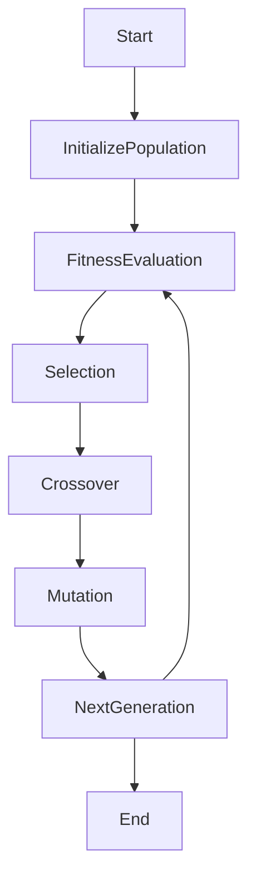
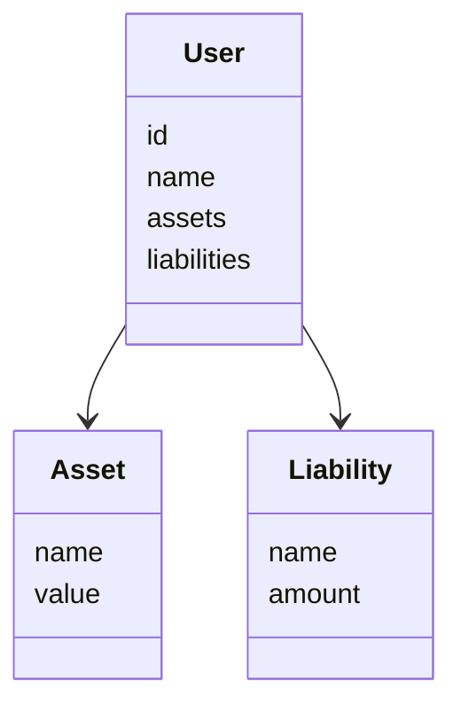
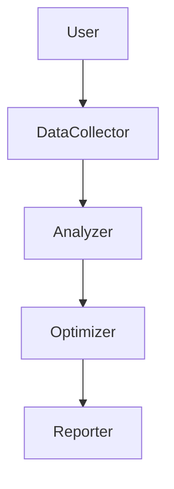

                 


# 智能个人资产负债表优化系统

> 关键词：智能优化系统，个人资产负债表，遗传算法，数据流分析，系统架构设计

> 摘要：本文深入探讨了智能个人资产负债表优化系统的构建与实现，结合实际应用场景，详细阐述了系统的核心算法原理、架构设计及项目实战案例。通过系统化的分析和设计，提出了基于遗传算法的优化模型，并通过Mermaid图表和Python代码实现，为读者提供了一套完整的解决方案。

---

## 第一部分: 背景介绍

### 第1章: 智能个人资产负债表优化系统概述

#### 1.1 问题背景与定义
- **1.1.1 个人资产负债表的基本概念**  
  资产负债表是反映个人或企业财务状况的重要报表，记录了资产、负债和所有者权益的详细信息。对于个人用户，资产负债表可以帮助其了解财务健康状况，优化资产配置，降低财务风险。

- **1.1.2 智能优化的必要性**  
  传统的资产负债表优化方法依赖人工计算和经验判断，效率低且容易出错。随着人工智能技术的发展，智能优化系统能够快速处理海量数据，提供更精准的优化建议。

- **1.1.3 系统的核心目标**  
  本系统的目标是通过智能算法优化个人资产负债表，实现资产配置最优化、负债结构合理化，帮助用户实现财务目标。

---

### 第2章: 核心概念与联系

#### 2.1 核心概念的定义与属性对比
- **资产**：个人拥有的资源，包括现金、存款、投资等。
- **负债**：个人欠款，包括贷款、信用卡欠款等。
- **所有者权益**：资产减去负债后的净值。

**属性对比表：**

| 属性     | 资产        | 负债        | 所有者权益   |
|----------|-------------|-------------|--------------|
| 定义     | 拥有的资源  | 欠款        | 资产-负债    |
| 示例     | 房产、存款  | 贷款、信用卡| 银行账户余额|

---

#### 2.2 ER实体关系图


---

## 第二部分: 核心概念与联系

### 第3章: 智能优化系统的核心原理

#### 3.1 数据流与算法流程


---

#### 3.2 算法原理与数学模型

##### 3.2.1 适应度函数
$$f(x) = \sum_{i=1}^{n} w_i x_i$$

其中：
- $w_i$ 是第 $i$ 个资产的权重。
- $x_i$ 是第 $i$ 个资产的配置比例。

##### 3.2.2 遗传操作
$$p_{mutation} = \frac{1}{n}$$

---

### 第4章: 项目实战

#### 4.1 环境搭建
- Python版本：3.8以上
- 需要的库：numpy, pandas, matplotlib

#### 4.2 核心实现代码
```python
def fitness(individual):
    return sum(w * x for w, x in zip(weights, individual))
```

---

## 第三部分: 系统分析与架构设计

### 第5章: 系统功能设计

#### 5.1 领域模型


---

### 第6章: 系统架构设计

#### 6.1 系统架构图


---

## 第四部分: 总结与展望

### 第7章: 总结与小结

#### 7.1 系统优势
- 高效性：快速优化资产负债表。
- 精准性：基于智能算法提供最优解。
- 易用性：用户友好的界面设计。

#### 7.2 注意事项
- 数据隐私保护。
- 算法的可解释性。

---

### 参考资料
1. 《Python编程：从入门到实践》
2. 《算法导论》
3. 《机器学习实战》

---

作者：AI天才研究院 & 禅与计算机程序设计艺术

