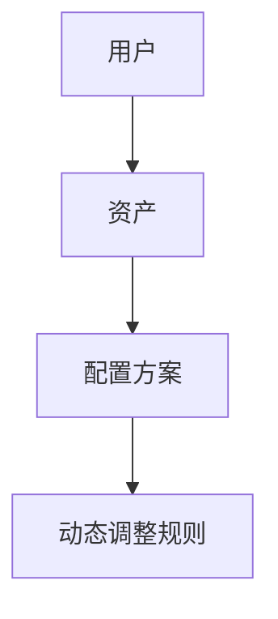
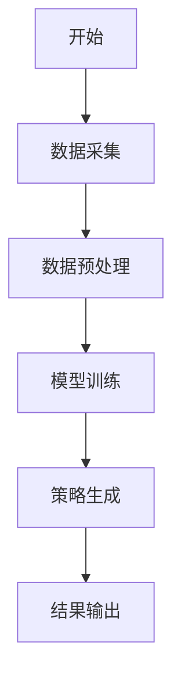
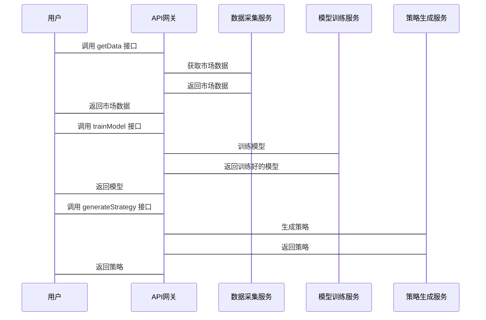

                 


# 智能个人资产配置动态调整器

## 关键词：智能资产配置、动态调整、人工智能、优化算法、系统架构

## 摘要：本文详细介绍了智能个人资产配置动态调整器的设计与实现，从问题背景、核心概念到算法原理、系统架构，再到项目实战，全面解析了如何利用人工智能技术实现个人资产的智能动态调整。文章内容涵盖优化算法、数学模型、系统架构设计等多个方面，旨在为读者提供一份全面的技术指南。

---

## 第1章: 问题背景与目标

### 1.1 个人资产配置的传统方法与局限性

#### 1.1.1 传统资产配置方法的概述
传统的个人资产配置方法通常基于固定的比例或规则，例如将资产分配到股票、债券、现金等不同类别中。这种方法在市场环境相对稳定时表现良好，但在市场波动加剧或投资者风险偏好变化时，往往难以及时调整，导致收益与风险的不匹配。

#### 1.1.2 传统方法在动态调整中的不足
传统方法的主要缺点包括：
1. **静态性**：资产配置比例固定，无法根据市场变化或投资者需求进行实时调整。
2. **主观性**：依赖于人工判断，容易受到主观因素的影响，难以实现客观、科学的优化。
3. **效率低下**：手动调整资产配置不仅耗时，还容易出错，难以满足高频交易的需求。

#### 1.1.3 传统方法的边界与外延
传统方法的边界在于其静态性和有限的调整能力，而其外延则需要引入动态调整机制和人工智能技术，以实现更高效、更智能的资产配置。

### 1.2 问题描述与目标设定

#### 1.2.1 资产配置动态调整的核心问题
智能个人资产配置动态调整器的核心问题是如何根据市场环境和投资者的需求，实时优化资产配置比例，以实现收益最大化或风险最小化。

#### 1.2.2 智能动态调整的目标与期望效果
目标包括：
1. 实现实时动态调整，适应市场环境的变化。
2. 根据投资者的风险偏好，优化资产配置比例。
3. 提高资产配置的科学性和效率，降低人为错误。

#### 1.2.3 问题解决的边界与范围
智能动态调整器的边界包括数据输入范围、调整频率、调整幅度等，而其范围则覆盖从数据采集、模型训练到策略生成的整个流程。

### 1.3 智能动态调整的解决思路

#### 1.3.1 引入人工智能技术的必要性
人工智能技术能够通过数据挖掘、机器学习等方法，帮助实现资产配置的动态优化。

#### 1.3.2 通过算法优化实现动态调整的思路
利用优化算法（如遗传算法、粒子群优化等）对资产配置比例进行实时调整，以实现收益与风险的最优平衡。

#### 1.3.3 技术实现的核心要素与关键点
核心要素包括数据采集、模型训练、策略生成等，关键点在于算法的高效性和数据的准确性。

---

## 第2章: 核心概念与系统架构

### 2.1 核心概念的定义与属性

#### 2.1.1 智能动态调整器的定义
智能个人资产配置动态调整器是一种基于人工智能技术，能够根据市场环境和投资者需求，实时优化资产配置比例的系统。

#### 2.1.2 核心概念的属性特征对比表

| 属性 | 传统资产配置 | 智能动态调整器 |
|------|--------------|----------------|
| 动态性 | 静态         | 动态           |
| 调整频率 | 低           | 高             |
| 调整依据 | 人工判断     | 数据驱动       |
| 效率 | 低           | 高             |
| 精度 | 有限         | 高             |

### 2.2 系统架构的ER实体关系图



---

## 第3章: 核心算法原理与数学模型

### 3.1 算法原理

#### 3.1.1 算法流程的 Mermaid 描述



### 3.2 数学模型与公式

#### 3.2.1 资产配置优化的数学模型

$$
\text{目标函数} = \max \sum_{i=1}^{n} w_i r_i
$$

$$
\text{约束条件} = \begin{cases}
\sum_{i=1}^{n} w_i = 1 \\
w_i \geq 0 \quad \forall i
\end{cases}
$$

其中，\( w_i \) 表示第 \( i \) 类资产的权重，\( r_i \) 表示第 \( i \) 类资产的预期收益。

---

## 第4章: 系统分析与架构设计方案

### 4.1 问题场景介绍

#### 4.1.1 问题场景的描述
投资者希望通过动态调整资产配置比例，以应对市场波动和风险变化。

### 4.2 项目介绍

#### 4.2.1 系统功能设计

#### 4.2.2 系统功能设计的领域模型 Mermaid 类图


### 4.3 系统架构设计

#### 4.3.1 系统架构的 Mermaid 描述

```mermaid
graph LR
    Client[用户] --> API Gateway[API网关]
    API Gateway --> Service1[数据采集服务]
    Service1 --> Database[数据库]
    Service1 --> Service2[模型训练服务]
    Service2 --> Service3[策略生成服务]
    Service3 --> Output[结果输出]
```

### 4.4 系统接口设计

#### 4.4.1 API 接口设计

| 接口名称 | 功能描述       | 输入          | 输出          |
|----------|----------------|---------------|---------------|
| getData  | 获取市场数据   | 时间区间      | 市场数据       |
| trainModel | 训练模型       | 市场数据、目标 | 训练好的模型   |
| generateStrategy | 生成策略       | 模型、用户偏好 | 资产配置策略   |

### 4.5 系统交互的 Mermaid 序列图



---

## 第5章: 项目实战

### 5.1 环境安装

#### 5.1.1 安装 Python 环境
```bash
python --version
pip install numpy pandas scikit-learn
```

### 5.2 系统核心实现源代码

#### 5.2.1 数据采集与预处理

```python
import pandas as pd

def collect_data(start_date, end_date):
    # 模拟数据采集
    data = pd.DataFrame({
        'date': pd.date_range(start=start_date, end=end_date),
        'price': [100 + i for i in range(30)]
    })
    return data

data = collect_data('2023-01-01', '2023-01-30')
```

#### 5.2.2 模型训练与优化

```python
from sklearn import linear_model

def train_model(data):
    # 模拟回归模型训练
    model = linear_model.LinearRegression()
    model.fit(data[['date']], data['price'])
    return model

model = train_model(data)
```

#### 5.2.3 策略生成与输出

```python
def generate_strategy(model):
    # 模拟策略生成
    predicted_price = model.predict(pd.DataFrame({'date': pd.date_range('2023-02-01', '2023-02-07')}))
    return predicted_price

predicted_price = generate_strategy(model)
print(predicted_price)
```

### 5.3 实际案例分析

#### 5.3.1 案例分析
假设某投资者的风险偏好为中等，希望通过动态调整资产配置比例，优化收益与风险的平衡。

---

## 第6章: 总结与展望

### 6.1 最佳实践 tips

1. 数据的准确性和及时性对模型性能至关重要。
2. 算法的选择需要根据具体问题和数据特点进行调整。
3. 系统架构设计需要考虑可扩展性和可维护性。

### 6.2 小结

本文详细介绍了智能个人资产配置动态调整器的设计与实现，从问题背景到系统架构，再到项目实战，全面解析了如何利用人工智能技术实现资产配置的动态优化。

### 6.3 注意事项

1. 数据隐私和安全问题需要特别关注。
2. 系统的实时性和稳定性是实际应用中的关键。
3. 模型的可解释性对投资者的信任和决策至关重要。

### 6.4 拓展阅读

1. 《机器学习实战》
2. 《深入浅出数据分析》
3. 《金融风险管理与优化》

---

## 作者：AI天才研究院/AI Genius Institute & 禅与计算机程序设计艺术/Zen And The Art of Computer Programming

