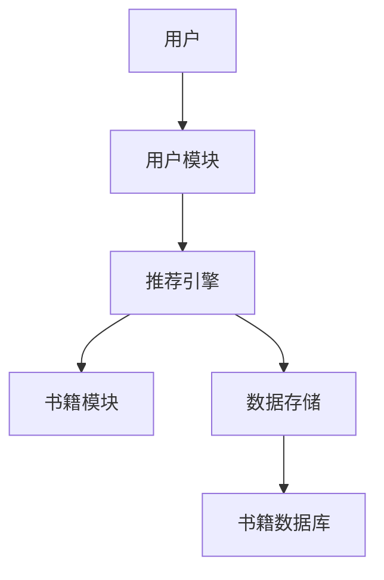

                 


# 智能书架：AI Agent的个性化阅读推荐系统

> 关键词：AI Agent，个性化阅读推荐，智能书架，推荐系统，协同过滤，机器学习，深度学习

> 摘要：智能书架是一种基于AI Agent的个性化阅读推荐系统，通过分析用户的阅读习惯和偏好，利用协同过滤、聚类分析和深度学习模型等算法，为用户提供精准的书籍推荐。本文详细探讨了智能书架的设计原理、算法实现、系统架构以及项目实战，并提出了相关的优化建议和未来发展方向。

---

## 第1章：智能书架的背景与问题描述

### 1.1 个性化阅读推荐的背景

个性化阅读推荐已成为现代信息管理的重要组成部分。随着书籍数量的爆炸式增长，用户在选择书籍时面临信息过载的问题。传统的阅读推荐系统基于简单的分类或标签推荐，难以满足用户的个性化需求。而AI Agent的引入，使得推荐系统更加智能化和个性化。

#### 1.1.1 问题背景
- **信息过载**：用户面对海量书籍，难以快速找到适合自己的读物。
- **推荐精度不足**：传统推荐系统基于简单的标签匹配，推荐结果缺乏深度和个性化。
- **用户行为多样性**：用户的阅读偏好可能随时间变化，需要动态调整推荐策略。

#### 1.1.2 解决方案
AI Agent通过分析用户的阅读历史、偏好和实时行为，结合机器学习算法，提供精准的个性化推荐。智能书架通过构建用户画像和内容分析，实现动态推荐。

#### 1.1.3 智能书架的优势
- **精准推荐**：基于用户行为和偏好，提供高度个性化的书籍推荐。
- **动态调整**：根据用户的阅读反馈，实时更新推荐结果。
- **多维度分析**：结合书籍内容、用户画像和社交网络信息，提供全面的推荐服务。

### 1.2 问题背景与问题描述

#### 1.2.1 传统推荐系统的局限性
传统推荐系统主要依赖基于内容的推荐和协同过滤推荐，但存在以下问题：
- 数据稀疏性：用户数量少或评分数据不足时，推荐效果差。
- �子里推荐：无法捕捉用户的隐含需求。
- 计算复杂度高：随着数据量的增加，推荐计算时间增加。

#### 1.2.2 AI Agent在推荐系统中的作用
AI Agent通过自然语言处理、机器学习和强化学习等技术，增强推荐系统的智能化水平。AI Agent能够实时分析用户的阅读行为和反馈，动态优化推荐策略。

#### 1.2.3 系统的边界与外延
智能书架系统的边界包括用户、书籍、推荐算法和AI Agent。系统外延涉及数据来源、推荐范围和用户反馈机制。

---

## 第2章：AI Agent与个性化推荐系统的核心概念

### 2.1 AI Agent的基本原理

#### 2.1.1 AI Agent的定义与特征
AI Agent是一种智能代理，能够感知环境、执行任务并做出决策。其特征包括自主性、反应性、主动性和社会性。

#### 2.1.2 AI Agent与推荐系统的对比分析
| 属性 | AI Agent | 推荐系统 |
|------|----------|----------|
| 输入 | 用户行为、环境反馈 | 用户偏好、历史数据 |
| 输出 | 动态推荐策略 | 静态推荐列表 |
| 核心技术 | 机器学习、自然语言处理 | 协同过滤、内容分析 |

#### 2.1.3 AI Agent在推荐系统中的角色
AI Agent作为推荐引擎的核心，负责数据采集、特征提取、模型训练和推荐决策。它能够根据用户反馈动态调整推荐策略，提高推荐精度。

### 2.2 个性化推荐系统的原理

#### 2.2.1 协同过滤算法
协同过滤基于用户行为相似性推荐书籍。分为基于用户的协同过滤和基于物品的协同过滤。

#### 2.2.2 基于内容的推荐算法
通过分析书籍内容特征，如主题、关键词和摘要，进行推荐。

#### 2.2.3 深度学习模型
使用神经网络模型，如DNN和CNN，进行推荐。模型能够捕捉复杂的用户-物品交互关系。

### 2.3 AI Agent在推荐系统中的优化

#### 2.3.1 动态调整推荐策略
AI Agent能够根据用户反馈实时调整推荐策略，提高推荐的实时性和准确性。

#### 2.3.2 多目标优化
通过多目标优化算法，平衡推荐的多样性和相关性，避免推荐过于单一。

---

## 第3章：智能书架的算法实现

### 3.1 协同过滤算法

#### 3.1.1 算法流程
1. 数据预处理：收集用户评分数据。
2. 计算相似度：使用余弦相似度计算用户相似度。
3. 生成推荐列表：基于相似用户的历史评分进行推荐。

#### 3.1.2 Python实现
```python
import numpy as np
from sklearn.metrics.pairwise import cosine_similarity

# 示例数据：用户-书籍矩阵
users = ['user1', 'user2', 'user3']
books = ['book1', 'book2', 'book3']
ratings = {'user1': {'book1': 5, 'book2': 4},
           'user2': {'book1': 3, 'book3': 5},
           'user3': {'book2': 2, 'book3': 4}}

# 转换为数值矩阵
rating_matrix = np.zeros((len(users), len(books)))
for i, user in enumerate(users):
    for j, book in enumerate(books):
        rating_matrix[i, j] = ratings[user].get(book, 0)

# 计算余弦相似度
similarity = cosine_similarity(rating_matrix)
```

#### 3.1.3 相似度计算公式
$$ \text{余弦相似度} = \frac{\sum_{i=1}^{n} x_i y_i}{\sqrt{\sum_{i=1}^{n} x_i^2} \cdot \sqrt{\sum_{i=1}^{n} y_i^2}} $$

### 3.2 基于深度学习的推荐模型

#### 3.2.1 模型选择
使用深度学习模型，如神经协同过滤（Neural Collaborative Filtering）。

#### 3.2.2 模型实现
```python
import tensorflow as tf

# 示例模型结构
class NCF(tf.keras.Model):
    def __init__(self, user_embedding_dim, book_embedding_dim):
        super(NCF, self).__init__()
        self.user_embedding = tf.keras.layers.Embedding(
            input_dim=number_of_users, output_dim=user_embedding_dim)
        self.book_embedding = tf.keras.layers.Embedding(
            input_dim=number_of_books, output_dim=book_embedding_dim)
        self.dense = tf.keras.layers.Dense(1, activation='sigmoid')

    def call(self, inputs):
        user_ids, book_ids = inputs
        user_embeddings = self.user_embedding(user_ids)
        book_embeddings = self.book_embedding(book_ids)
        concatenated = tf.keras.layers.Concatenate()([user_embeddings, book_embeddings])
        output = self.dense(concatenated)
        return output
```

---

## 第4章：智能书架的系统架构设计

### 4.1 系统功能设计

#### 4.1.1 用户模块
- 用户注册与登录
- 用户画像构建

#### 4.1.2 书籍模块
- 书籍信息管理
- 书籍推荐接口

### 4.2 系统架构设计

#### 4.2.1 系统架构图


#### 4.2.2 接口设计
- RESTful API：提供用户认证、书籍推荐和评分接口。

### 4.3 系统交互流程

#### 4.3.1 推荐流程
1. 用户登录系统。
2. 系统采集用户行为数据。
3. 推荐引擎生成推荐列表。
4. 用户查看推荐结果并提供反馈。
5. 系统根据反馈优化推荐策略。

---

## 第5章：项目实战与优化

### 5.1 环境安装

#### 5.1.1 安装Python和相关库
```bash
pip install numpy scikit-learn tensorflow
```

### 5.2 系统核心实现

#### 5.2.1 数据预处理
```python
import pandas as pd

# 加载数据
ratings = pd.read_csv('ratings.csv')
books = pd.read_csv('books.csv')
```

#### 5.2.2 模型训练
```python
model = NCF(user_embedding_dim=64, book_embedding_dim=64)
model.compile(optimizer='adam', loss='binary_crossentropy')
model.fit([user_input, book_input], labels, epochs=10)
```

### 5.3 项目优化

#### 5.3.1 模型优化
- 调整嵌入维度和网络结构。
- 使用正则化防止过拟合。

#### 5.3.2 性能优化
- 分布式训练。
- 使用缓存技术优化数据加载。

---

## 第6章：最佳实践与总结

### 6.1 最佳实践

#### 6.1.1 数据质量
确保数据的完整性和准确性，避免数据稀疏性问题。

#### 6.1.2 模型选择
根据实际需求选择合适的推荐算法，避免过度复杂化。

#### 6.1.3 性能优化
通过分布式计算和缓存技术提升系统性能。

### 6.2 项目小结

智能书架通过AI Agent实现了个性化的阅读推荐，结合协同过滤和深度学习模型，提高了推荐的精准度和实时性。本文详细介绍了系统的实现过程，并提出了优化建议。

### 6.3 注意事项

- **隐私保护**：确保用户数据的安全性和隐私性。
- **伦理问题**：避免推荐内容对用户造成负面影响。

### 6.4 拓展阅读

- 探索更先进的推荐算法，如图神经网络和强化学习。
- 结合知识图谱提升推荐的深度和广度。

---

## 附录

### 附录A：推荐数据集
- MovieLens 数据集：提供用户评分数据。
- GoodReads 数据集：提供书籍信息和用户评论。

### 附录B：工具与库
- Python：核心编程语言。
- TensorFlow：深度学习框架。
- scikit-learn：机器学习库。

---

作者：AI天才研究院/AI Genius Institute & 禅与计算机程序设计艺术/Zen And The Art of Computer Programming

