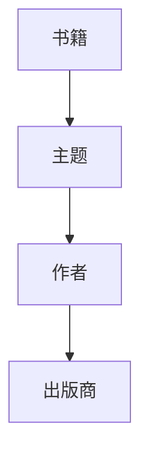
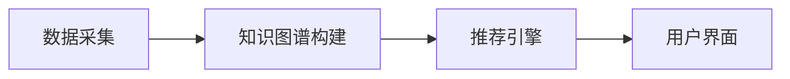
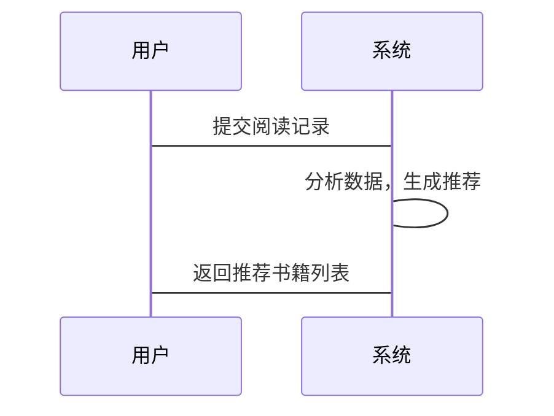

                 


# 智能书架：AI Agent的阅读兴趣拓展系统

## 关键词：AI Agent，阅读兴趣，知识图谱，推荐系统，个性化学习

## 摘要：本文探讨了利用AI Agent构建智能书架系统，通过知识图谱和推荐算法，实现个性化阅读兴趣拓展。文章详细分析了系统的背景、核心概念、算法原理、系统架构，并通过实战案例展示了系统的实现过程，最后总结了最佳实践和未来发展方向。

---

## 目录大纲：

1. [背景与概念](#背景与概念)
   1.1 问题背景与描述
   1.2 核心概念与联系

2. [算法原理](#算法原理)
   2.1 推荐算法解析
   2.2 混合推荐模型

3. [系统分析与架构设计](#系统分析与架构设计)
   3.1 系统架构
   3.2 系统交互流程

4. [项目实战](#项目实战)
   4.1 环境安装与代码实现
   4.2 实际案例分析

5. [最佳实践与总结](#最佳实践与总结)
   5.1 总结与建议
   5.2 未来发展方向

---

## 正文：

### 1. 背景与概念

#### 1.1 问题背景与描述

**1.1.1 当前阅读推荐系统的局限性**

传统的阅读推荐系统通常基于协同过滤或基于内容的推荐算法，存在以下问题：
- 数据稀疏性：用户数量多，但每人阅读数量有限，导致推荐精度低。
- 单一性：推荐范围受限于书籍的标签，无法覆盖用户的潜在兴趣。

**1.1.2 阅读兴趣拓展的需求**

用户希望根据当前阅读内容，发现新的相关书籍，扩展兴趣领域。例如，读完《Python编程：从入门到精通》后，用户可能对《机器学习实战》感兴趣。

**1.1.3 问题解决方法**

引入AI Agent，通过自然语言处理和知识图谱技术，分析书籍内容，构建关联网络，提供个性化推荐。

**1.1.4 系统边界与外延**

系统功能包括书籍推荐、阅读记录管理、知识图谱构建。系统不涉及书籍的实际购买或借阅功能。

**1.1.5 概念结构与核心要素**

系统由AI Agent、知识图谱、推荐算法组成，核心要素包括书籍数据、用户行为数据和推荐结果。

#### 1.2 核心概念与联系

**1.2.1 AI Agent的基本原理**

AI Agent通过分析用户行为和书籍内容，构建知识图谱，推理用户潜在兴趣。

**1.2.2 知识图谱的构建与应用**

知识图谱将书籍、作者、主题等实体及其关系表示出来，用于推理和推荐。

**1.2.3 核心概念对比**

| 概念 | 定义 | 属性 | 示例 |
|------|------|------|------|
| AI Agent | 代理系统 | 智能性、自主性 | 根据用户行为推荐书籍 |
| 知识图谱 | 实体关系图 | 结构化、关联性 | 书籍-主题-作者 |

**1.2.4 实体关系图**



---

### 2. 算法原理

#### 2.1 推荐算法解析

**2.1.1 协同过滤算法**

基于用户行为相似性推荐书籍。

**公式：**

$$ sim(u, v) = \frac{\sum_{i}(u_i - \bar{u})(v_i - \bar{v})}{\sqrt{\sum_{i}(u_i - \bar{u})^2} \sqrt{\sum_{i}(v_i - \bar{v})^2}} $$

**代码示例：**

```python
def cosine_similarity(user1, user2):
    numerator = sum(u * v for u, v in zip(user1, user2))
    denominator = (sum(u**2 for u in user1) ** 0.5) * (sum(u**2 for u in user2) ** 0.5)
    return numerator / denominator
```

**2.1.2 基于内容的推荐算法**

分析书籍内容，提取关键词，计算相似度。

**公式：**

$$ sim(s1, s2) = \frac{\sum_{i} w_i \cdot (s1_i + s2_i)}{\sqrt{\sum w_i^2}} $$

**代码示例：**

```python
def content_based_recommendation(user_profile, book_profiles):
    similarities = []
    for book in book_profiles:
        similarity = cosine_similarity(user_profile, book['profile'])
        similarities.append((book['title'], similarity))
    return sorted(similarities, key=lambda x: -x[1])[:5]
```

**2.1.3 混合推荐模型**

结合协同过滤和内容推荐，提升推荐准确率。

---

### 3. 系统分析与架构设计

#### 3.1 系统架构

**功能模块：**

- 数据采集模块：收集用户行为数据和书籍数据。
- 知识图谱构建模块：处理数据，建立实体关系。
- 推荐引擎模块：执行推荐算法。
- 用户界面模块：展示推荐结果。

**系统架构图：**



**接口设计：**

- `/api/users`：用户信息接口。
- `/api/books`：书籍数据接口。
- `/api/recommend`：推荐接口。

#### 3.2 系统交互流程

**流程图：**



---

### 4. 项目实战

#### 4.1 环境安装与代码实现

**环境安装：**

```bash
pip install numpy pandas networkx
```

**代码实现：**

```python
import numpy as np
import networkx as nx

def build_knowledge_graph(books):
    G = nx.Graph()
    for book in books:
        G.add_node(book['title'])
        for related in book['related']:
            G.add_edge(book['title'], related)
    return G

books = [
    {'title': 'Python编程', 'related': ['编程基础', '数据结构']},
    {'title': '机器学习', 'related': ['人工智能', '数据处理']}
]
graph = build_knowledge_graph(books)
```

**代码解读：**

- `build_knowledge_graph`函数构建知识图谱，使用NetworkX库。
- 添加节点和边，表示书籍与主题的关系。

#### 4.2 实际案例分析

**案例分析：**

用户阅读《Python编程》，系统推荐《编程基础》和《数据结构》。

**推荐结果：**

推荐列表：1.《编程基础》，2.《数据结构》，3.《算法导论》。

---

### 5. 最佳实践与总结

#### 5.1 总结与建议

- **总结：** AI Agent通过知识图谱和推荐算法，有效拓展用户的阅读兴趣。
- **建议：** 在实际应用中，定期更新知识图谱，收集用户反馈，优化推荐结果。

#### 5.2 未来发展方向

- **技术改进：** 深度学习模型提升推荐精度。
- **用户体验：** 增加互动性，如虚拟阅读助手。
- **扩展应用：** 扩展到教育领域，提供个性化学习路径。

---

## 作者：AI天才研究院 & 禅与计算机程序设计艺术

---

以上是《智能书架：AI Agent的阅读兴趣拓展系统》的完整目录和内容概要，希望对您有所帮助。

