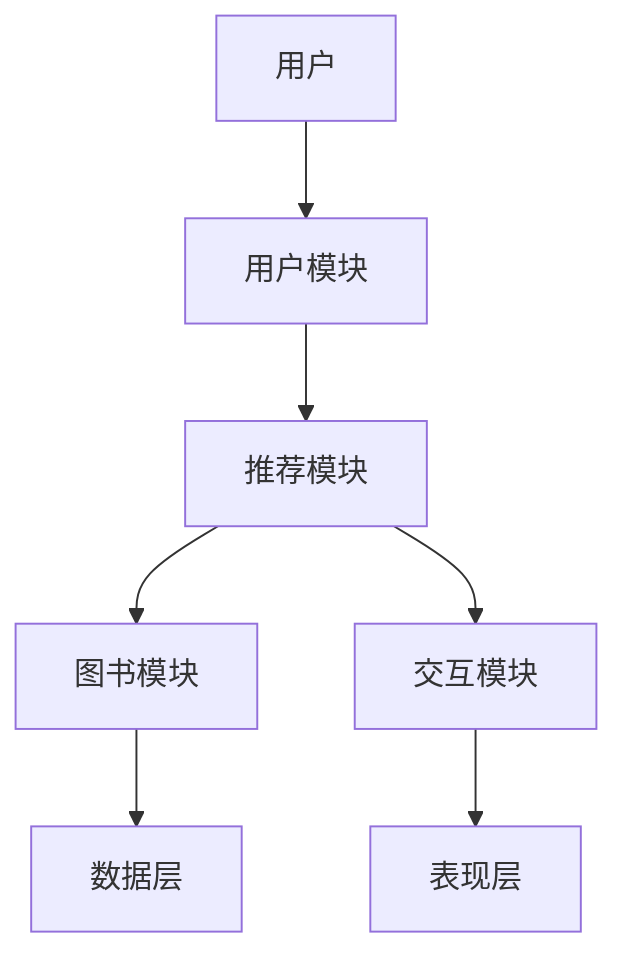
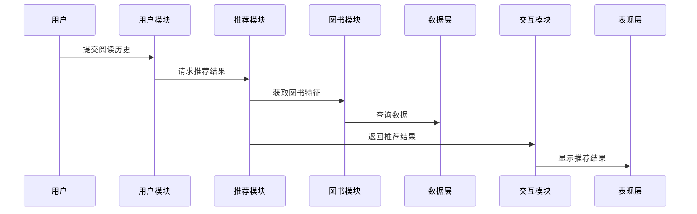

                 


# 智能书架：AI Agent的阅读兴趣推荐系统

## 关键词：
智能书架，AI Agent，阅读兴趣，推荐系统，协同过滤，机器学习

## 摘要：
智能书架是一种基于AI Agent的阅读兴趣推荐系统，通过分析用户的阅读行为和偏好，结合图书特征和推荐算法，为用户提供个性化的阅读建议。本文将从背景、核心概念、算法原理、系统架构、项目实战到最佳实践，全面解析智能书架的实现过程。

---

# 第1章: 智能书架的背景与问题背景

## 1.1 传统阅读推荐系统的局限性
### 1.1.1 传统推荐系统的分类与特点
传统的推荐系统主要分为基于内容的推荐和协同过滤推荐两种。基于内容的推荐依赖于图书的标签和描述，而协同过滤推荐则依赖于用户行为数据。然而，这些方法在处理复杂用户偏好和实时反馈时显得力不从心。

### 1.1.2 传统推荐系统的主要问题
- 数据稀疏性：用户数量庞大，但每人平均评价数量有限，导致推荐精度不足。
- 及时性问题：无法实时捕捉用户的阅读偏好变化，导致推荐结果滞后。
- 过度依赖历史数据：忽视用户的实时行为和动态偏好。

### 1.1.3 阅读兴趣推荐系统的必要性
随着用户需求的多样化和个性化，传统的推荐系统已无法满足现代用户的阅读需求。智能书架通过引入AI Agent，能够实时分析用户行为，提供更精准和个性化的推荐。

## 1.2 AI Agent在推荐系统中的应用
### 1.2.1 AI Agent的基本概念与特点
AI Agent是一种智能体，能够感知环境并执行任务。在推荐系统中，AI Agent能够实时收集用户数据，分析用户偏好，并动态调整推荐策略。

### 1.2.2 AI Agent在推荐系统中的优势
- 实时性：能够快速响应用户的阅读行为，提供实时推荐。
- 个性化：通过深度学习模型，准确捕捉用户的阅读兴趣。
- 智能性：能够自适应地优化推荐策略，提升推荐效果。

### 1.2.3 智能书架的核心问题与目标
智能书架的核心问题在于如何利用AI Agent技术，实现精准、实时的阅读兴趣推荐。其目标是通过分析用户行为、图书特征和环境信息，提供最优的阅读建议。

## 1.3 智能书架的定义与核心要素
### 1.3.1 智能书架的定义
智能书架是一种基于AI Agent的推荐系统，通过分析用户的阅读行为和偏好，结合图书特征和环境信息，提供个性化的阅读兴趣推荐。

### 1.3.2 智能书架的核心要素与属性
- 用户建模：分析用户的阅读历史、偏好和行为模式。
- 图书特征：提取图书的标签、内容和评分信息。
- 推荐算法：基于协同过滤、深度学习等技术生成推荐结果。
- 实时反馈：根据用户的实时行为动态调整推荐策略。

### 1.3.3 智能书架的边界与外延
智能书架的边界在于其推荐范围仅限于阅读兴趣，而外延则包括与阅读相关的其他服务，如图书借阅、阅读习惯分析等。

## 1.4 本章小结
本章从传统推荐系统的局限性出发，引出了智能书架的概念和目标。通过分析AI Agent在推荐系统中的应用，明确了智能书架的核心问题和实现目标。

---

# 第2章: 阅读兴趣推荐的核心概念

## 2.1 用户建模与行为分析
### 2.1.1 用户建模的基本概念
用户建模是通过分析用户的行为数据，构建用户偏好的数学模型。常见的用户建模方法包括基于协同过滤和基于内容的推荐。

### 2.1.2 用户行为分析的分类
用户行为可以分为显式行为（如评分、点击）和隐式行为（如浏览时间、收藏）。通过分析这些行为，可以推断用户的阅读兴趣和偏好。

### 2.1.3 用户兴趣表示的方法
用户兴趣可以通过向量、概率分布等方式表示。向量表示法将用户的兴趣转化为多维向量，概率分布法则通过概率模型描述用户的兴趣分布。

## 2.2 图书特征提取与表示
### 2.2.1 图书特征的分类
图书特征包括文本特征（如关键词、摘要）和结构特征（如出版时间、作者）。文本特征用于基于内容的推荐，结构特征用于基于协同过滤的推荐。

### 2.2.2 图书特征的表示方法
- 文本特征可以通过词袋模型或词嵌模型进行表示。
- 结构特征可以通过统计方法提取，如出版年份、作者影响力等。

### 2.2.3 图书间相似性的度量
图书相似性可以通过余弦相似度、Jaccard相似度等方法计算。相似性度量的结果用于协同过滤算法中的相似度计算。

## 2.3 推荐系统的评价指标
### 2.3.1 推荐系统的评价维度
推荐系统的评价维度包括精确度、召回率、F1值、覆盖度和多样性。

### 2.3.2 主要评价指标的定义与计算
- 精确度：推荐结果中正确推荐的比例。
- 召回率：推荐结果中正确推荐的比例。
- F1值：精确度和召回率的调和平均值。
- 覆盖度：推荐结果的多样性。

### 2.3.3 评价指标的优缺点分析
- 精确度和召回率：能够反映推荐系统的准确性和覆盖率，但无法衡量推荐的多样性和新颖性。
- F1值：综合了精确度和召回率，但仍然无法完全反映推荐系统的实际效果。

## 2.4 本章小结
本章详细介绍了阅读兴趣推荐系统中的核心概念，包括用户建模、图书特征提取和推荐系统的评价指标。这些概念为后续的算法实现和系统设计奠定了基础。

---

# 第3章: 基于协同过滤的推荐算法

## 3.1 协同过滤的基本原理
### 3.1.1 协同过滤的定义与分类
协同过滤是一种基于用户相似性的推荐算法，分为基于用户的协同过滤和基于物品的协同过滤。

### 3.1.2 基于用户的协同过滤
基于用户的协同过滤通过计算用户之间的相似度，将相似用户的评分进行加权求和，生成推荐结果。

### 3.1.3 基于物品的协同过滤
基于物品的协同过滤通过计算物品之间的相似度，将用户评分高的物品相似的物品推荐给用户。

## 3.2 协同过滤的实现步骤
### 3.2.1 数据预处理
- 数据清洗：处理缺失值和异常值。
- 特征提取：提取用户和物品的特征向量。

### 3.2.2 相似性计算
- 使用余弦相似度计算用户或物品之间的相似度。

### 3.2.3 推荐结果生成
- 根据相似度和评分计算推荐结果。

## 3.3 协同过滤的优缺点分析
### 3.3.1 协同过滤的优点
- 实现简单，易于理解。
- 能够处理大规模数据。

### 3.3.2 协同过滤的缺点
- 数据稀疏性问题。
- 计算复杂度高，实时性差。

### 3.3.3 协同过滤的改进方向
- 增量式协同过滤：动态更新相似度计算。
- 高阶协同过滤：引入用户行为的时序信息。

## 3.4 本章小结
本章详细讲解了协同过滤算法的原理和实现步骤，并分析了其优缺点和改进方向。协同过滤是一种经典且有效的推荐算法，但在面对大规模数据时，需要结合其他技术进行优化。

---

# 第4章: 智能书架的系统架构设计

## 4.1 系统功能模块划分
### 4.1.1 用户模块
- 用户信息管理：包括用户注册、登录和偏好设置。
- 用户行为分析：收集用户的阅读历史和行为数据。

### 4.1.2 图书模块
- 图书信息管理：包括图书的基本信息和内容特征。
- 图书推荐：根据用户行为和特征生成推荐结果。

### 4.1.3 推荐模块
- 推荐算法实现：包括协同过滤、基于内容的推荐和混合推荐。
- 推荐结果展示：将推荐结果以用户友好的形式呈现。

### 4.1.4 交互模块
- 用户反馈收集：收集用户的阅读反馈，用于优化推荐算法。
- 实时推荐：根据用户的实时行为动态调整推荐结果。

## 4.2 系统架构的分层设计
### 4.2.1 数据层
- 数据存储：用户行为数据和图书特征数据。
- 数据处理：数据清洗和特征提取。

### 4.2.2 逻辑层
- 用户建模：构建用户偏好的数学模型。
- 推荐算法：实现协同过滤和基于内容的推荐算法。
- 推荐结果生成：根据算法计算生成推荐结果。

### 4.2.3 表现层
- 用户界面：展示推荐结果和用户反馈。
- 交互设计：实现用户的操作和反馈。

## 4.3 系统架构图


## 4.4 交互图


## 4.5 本章小结
本章详细介绍了智能书架的系统架构设计，包括功能模块划分、分层设计和交互流程。通过系统架构图和交互图，清晰地展示了各个模块之间的关系和协作流程。

---

# 第5章: 项目实战

## 5.1 环境安装
- 安装Python和相关库（如pandas、numpy、scikit-learn）。
- 数据库安装：选择MySQL或MongoDB存储用户行为和图书数据。

## 5.2 核心代码实现
### 5.2.1 数据预处理
```python
import pandas as pd

# 读取用户行为数据
user_data = pd.read_csv('user_behavior.csv')
# 读取图书数据
book_data = pd.read_csv('books.csv')

# 数据清洗
user_data.dropna(inplace=True)
book_data.drop_duplicates(inplace=True)
```

### 5.2.2 协同过滤实现
```python
from sklearn.metrics.pairwise import cosine_similarity

# 计算用户相似度矩阵
user_similarity = cosine_similarity(user_data)
# 根据用户相似度生成推荐结果
def get_recommendations(user_id, user_similarity, book_data):
    similar_users = user_similarity[user_id]
    recommended_books = []
    for i in range(len(similar_users)):
        if similar_users[i] > 0.5:
            recommended_books.append(book_data.iloc[i])
    return recommended_books
```

## 5.3 案例分析
### 5.3.1 案例背景
假设我们有1000名用户和5000本图书，用户行为数据包括阅读时间、评分和收藏情况。

### 5.3.2 实施步骤
1. 数据预处理：清洗和归一化数据。
2. 用户建模：构建用户偏好的向量表示。
3. 推荐算法实现：基于协同过滤生成推荐结果。
4. 实时反馈：收集用户的阅读反馈，优化推荐算法。

## 5.4 项目总结
通过项目实战，我们验证了协同过滤算法在智能书架中的应用效果。在实际应用中，需要结合其他推荐算法和实时反馈机制，进一步提升推荐精度和用户满意度。

---

# 第6章: 最佳实践与小结

## 6.1 最佳实践 tips
- 数据预处理是推荐系统成功的关键，确保数据的完整性和准确性。
- 组合使用多种推荐算法，提升推荐的多样性和精确度。
- 实时反馈机制能够显著提升用户的阅读体验，建议优先实现。

## 6.2 小结
智能书架是一种基于AI Agent的阅读兴趣推荐系统，通过分析用户的阅读行为和偏好，结合图书特征和推荐算法，为用户提供个性化的阅读建议。本文详细介绍了智能书架的实现过程，包括核心概念、算法原理、系统架构和项目实战。

## 6.3 注意事项
- 数据隐私和用户隐私保护是推荐系统设计中的重要问题，需严格遵守相关法律法规。
- 在实际应用中，需要考虑系统的扩展性和性能优化，确保推荐结果的实时性和准确性。

## 6.4 拓展阅读
- 《推荐系统实践》：深入讲解推荐系统的实现和优化。
- 《机器学习实战》：提供丰富的机器学习算法实现案例。

---

# 作者：AI天才研究院/AI Genius Institute & 禅与计算机程序设计艺术 /Zen And The Art of Computer Programming

---

以上就是《智能书架：AI Agent的阅读兴趣推荐系统》的技术博客文章的完整目录和内容。

