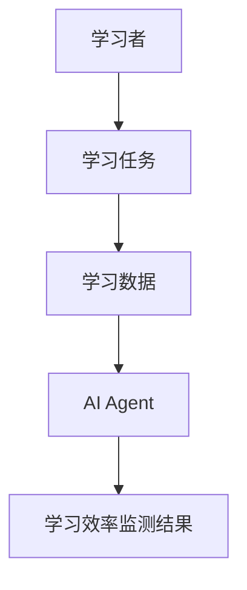
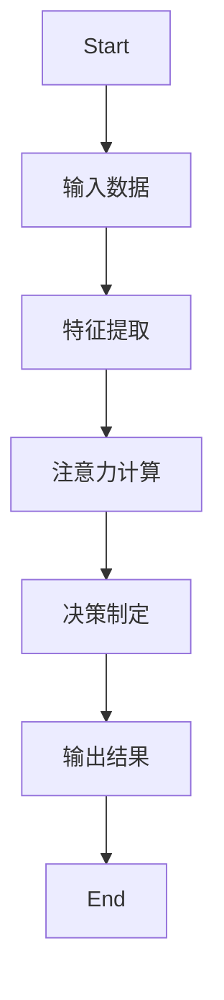
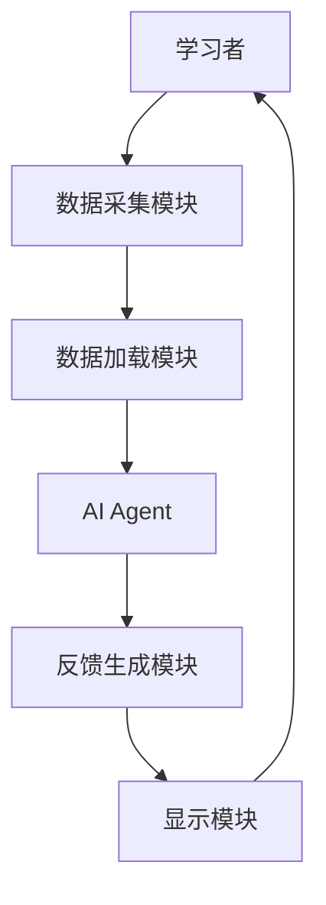

                 


# 智能书桌：AI Agent的学习效率监测

## 关键词：智能书桌，AI Agent，学习效率监测，算法原理，系统架构，项目实战

## 摘要：本文详细探讨了AI Agent在学习效率监测中的应用，通过分析其核心概念、算法原理和系统架构，结合实际案例，展示了如何利用AI技术提升学习效率监测的准确性和效率。文章内容涵盖背景介绍、核心概念、算法实现、系统设计、项目实战及最佳实践，为读者提供全面而深入的技术指导。

---

## 第1章: AI Agent与学习效率监测的背景介绍

### 1.1 AI Agent的基本概念

AI Agent（人工智能代理）是指能够感知环境、自主决策并执行任务的智能实体。它不同于传统软件，具有以下核心特点：
- **自主性**：能够在没有外部干预的情况下运行。
- **反应性**：能够实时感知环境并做出响应。
- **目标导向性**：具有明确的目标，并根据目标优化其行为。

### 1.2 学习效率监测的背景与意义

#### 1.2.1 学习效率监测的重要性
学习效率监测是评估学习效果的关键指标，直接影响学习成果。传统方法依赖手动记录和分析，耗时且不够准确。AI Agent的引入能够实时监测学习过程，提供客观数据支持。

#### 1.2.2 当前学习效率监测的挑战
- 数据碎片化：学习数据分散，难以整合分析。
- 方法单一：传统监测手段缺乏深度分析能力。
- 个性化不足：无法根据个体差异提供精准反馈。

#### 1.2.3 AI Agent在学习效率监测中的作用
AI Agent能够实时采集学习数据，利用机器学习算法分析学习者的行为模式，提供个性化反馈，优化学习策略。

---

## 第2章: 智能书桌的核心概念与问题背景

### 2.1 智能书桌的功能与目标

智能书桌是一个结合AI技术的学习辅助工具，其功能模块包括：
- **数据采集**：实时收集学习者的行为数据。
- **数据分析**：利用AI算法分析数据，评估学习效率。
- **反馈与优化**：根据分析结果，提供个性化建议，优化学习策略。

### 2.2 学习效率监测的核心问题

#### 2.2.1 学习效率监测的关键指标
- 学习时间：每次学习的时长。
- 注意力集中度：学习过程中的专注程度。
- 知识掌握程度：对学习内容的掌握情况。
- 学习情绪：学习过程中的情绪状态。

#### 2.2.2 学习效率监测的边界与外延
- 边界：专注于学习过程中的效率监测，不涉及学习内容的评价。
- 外延：包括学习环境、学习习惯等多个影响因素。

### 2.3 智能书桌与AI Agent的结合

智能书桌通过集成AI Agent，能够实时监测学习者的行为数据，分析其学习效率，并提供个性化的反馈和建议，帮助学习者提高学习效果。

---

## 第3章: AI Agent的原理与实现

### 3.1 AI Agent的核心原理

AI Agent通过感知环境、分析数据、制定决策并执行操作来实现其功能。核心工作流程包括：
1. **数据感知**：采集环境中的相关信息。
2. **数据处理**：对采集的数据进行预处理和特征提取。
3. **决策制定**：基于处理后的数据，利用算法生成决策。
4. **行动执行**：根据决策执行相应操作。

### 3.2 学习效率监测的算法原理

#### 3.2.1 基于AI Agent的学习效率监测模型
学习效率监测模型主要依赖机器学习算法，特别是监督学习和无监督学习方法。模型通过分析学习者的行为数据，预测其学习效率。

#### 3.2.2 监测算法的数学模型与公式
在学习效率监测中，常用注意力机制来分析学习者的行为模式。注意力机制的数学模型如下：
$$
\text{Attention}(Q, K, V) = \text{softmax}\left(\frac{QK^T}{\sqrt{d_k}}\right)V
$$
其中，\( Q \)、\( K \)、\( V \)分别为查询、键和值向量，\( d_k \)为键的维度。

---

## 第4章: AI Agent与学习效率监测的实体关系分析

### 4.1 实体关系图（ER图）

下图展示了智能书桌、AI Agent和学习效率监测之间的实体关系：



### 4.2 算法流程图（Mermaid）



---

## 第5章: 学习效率监测的算法实现

### 5.1 注意力机制在学习效率监测中的应用

#### 5.1.1 注意力机制的数学模型
注意力机制通过计算输入数据中各部分的重要性权重，聚焦于关键信息。其数学模型如下：
$$
\alpha_i = \text{softmax}(e_i)
$$
其中，\( e_i \)为第\( i \)个特征的注意力得分，\( \alpha_i \)为对应的权重。

#### 5.1.2 基于注意力机制的算法实现
以下为基于注意力机制的学习效率监测算法的Python代码示例：

```python
import numpy as np

def compute_attention(query, key, value):
    d_k = key.shape[-1]
    scores = np.dot(query, key.T) / np.sqrt(d_k)
    attention_weights = np.softmax(scores, axis=-1)
    output = np.dot(attention_weights, value)
    return output

# 示例输入
query = np.random.randn(1, 5, 64)
key = np.random.randn(1, 5, 64)
value = np.random.randn(1, 5, 64)

# 计算注意力
output = compute_attention(query, key, value)
print("输出结果:", output)
```

---

## 第6章: 系统分析与架构设计

### 6.1 问题场景介绍

智能书桌的学习效率监测系统主要用于帮助学习者实时了解自己的学习状态，并提供针对性的建议。系统应用场景包括在线学习平台、移动学习APP等。

### 6.2 系统功能设计

系统功能模块包括：
1. **数据采集模块**：实时采集学习者的行为数据。
2. **数据分析模块**：对数据进行处理和分析，评估学习效率。
3. **反馈模块**：根据分析结果，生成反馈信息并提供优化建议。

### 6.3 系统架构设计

下图展示了智能书桌系统的整体架构：



### 6.4 系统接口设计

系统主要接口包括：
- 数据采集接口：用于实时采集学习者的行为数据。
- 数据分析接口：用于处理和分析数据。
- 反馈生成接口：用于生成个性化反馈信息。

---

## 第7章: 项目实战

### 7.1 环境搭建

#### 7.1.1 安装Python环境
需要安装Python 3.6或更高版本，以及以下库：
- numpy
- matplotlib
- scikit-learn

### 7.2 核心代码实现

#### 7.2.1 数据采集模块

```python
import time

def collect_learning_data():
    data = []
    while True:
        # 采集学习数据，例如时间戳和注意力分数
        timestamp = time.time()
        attention_score = np.random.uniform(0.5, 0.9)
        data.append((timestamp, attention_score))
        time.sleep(1)
    return data
```

#### 7.2.2 数据分析模块

```python
from sklearn.linear_model import LinearRegression

def analyze_efficiency(data):
    # 提取时间戳和注意力分数
    timestamps = [d[0] for d in data]
    scores = [d[1] for d in data]
    # 使用线性回归模型进行分析
    model = LinearRegression()
    model.fit(timestamps.reshape(-1, 1), scores)
    return model
```

### 7.3 案例分析

#### 7.3.1 监测学习时间

假设学习者每天学习2小时，注意力分数分别为0.8、0.7、0.6。通过分析，发现注意力分数随时间呈下降趋势，建议分段学习，每30分钟休息5分钟。

#### 7.3.2 监测注意力变化

通过注意力机制分析，发现学习者在学习过程中注意力集中度较高，但在特定知识点上注意力下降明显，建议重点复习相关知识。

---

## 第8章: 最佳实践与小结

### 8.1 最佳实践

- **数据质量**：确保数据采集的准确性和完整性。
- **算法优化**：根据实际需求调整算法参数，优化模型性能。
- **用户体验**：设计友好的用户界面，提升用户体验。

### 8.2 小结

智能书桌通过集成AI Agent，能够实时监测学习者的效率，提供个性化的反馈和建议，帮助学习者提高学习效果。本文详细探讨了AI Agent的原理、算法实现及系统架构，并通过实际案例展示了其应用效果。

### 8.3 注意事项

- 数据隐私：确保学习数据的安全性和隐私性。
- 系统稳定性：保证系统的稳定运行，避免数据丢失。
- 用户教育：指导用户正确使用系统，发挥其最大效用。

### 8.4 拓展阅读

推荐以下书籍和资源，供读者深入学习：
- 《深度学习》—— Ian Goodfellow
- 《机器学习实战》—— 周志华
- 《Python机器学习》—— Andreas Müller

---

## 作者：AI天才研究院/AI Genius Institute & 禅与计算机程序设计艺术 /Zen And The Art of Computer Programming

