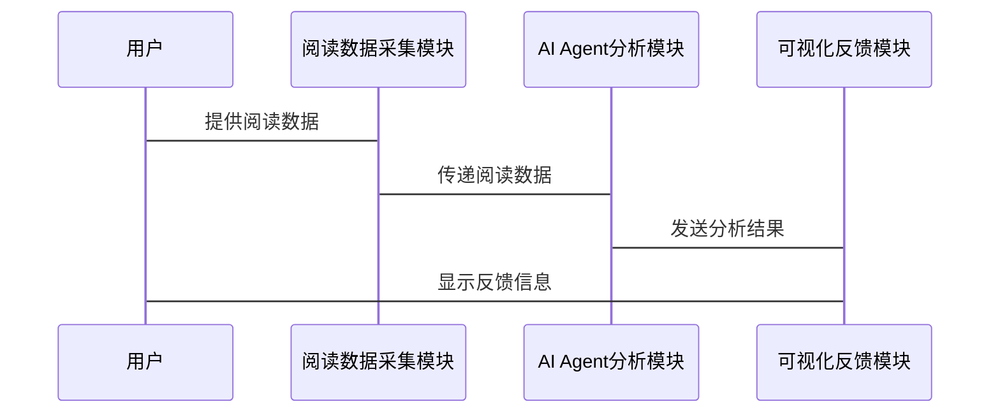

                 


# 智能书签：AI Agent的阅读进度追踪

> 关键词：智能书签，AI Agent，阅读进度追踪，机器学习，强化学习，系统架构，项目实战

> 摘要：随着数字化阅读的普及，传统的书签工具已无法满足现代读者的需求。本文探讨如何利用AI Agent技术实现智能书签，通过机器学习和强化学习算法，实时追踪和分析用户的阅读行为，优化阅读体验。文章详细介绍了AI Agent的核心算法、系统架构、项目实现及最佳实践，为开发者提供参考。

---

## 第一部分：智能书签与AI Agent的背景与概念

### 第1章：智能书签的背景与问题背景

#### 1.1 从传统书签到智能书签的演进
- 传统书签的局限性：只能记录物理位置，无法捕捉阅读行为和偏好。
- 数字化阅读的兴起：电子书、在线文章等数字化内容的普及，使得阅读行为更加动态和复杂。
- AI技术如何改变阅读体验：通过AI Agent实时分析阅读行为，提供个性化推荐和进度追踪。

#### 1.2 阅读进度追踪的核心问题
- 阅读进度追踪的定义：记录用户阅读内容的深度和广度，分析阅读偏好和习惯。
- 用户阅读行为的复杂性：阅读速度、注意力分布、兴趣点变化等多因素影响阅读进度。
- 阅读进度追踪的边界与外延：从简单的页面记录到深度内容理解和个性化推荐。

#### 1.3 AI Agent在阅读进度追踪中的作用
- AI Agent的基本概念：智能代理，能够感知环境、自主决策并执行任务。
- AI Agent的核心特点：学习能力、适应性、实时性。
- AI Agent与传统阅读工具的对比：传统工具注重记录，AI Agent注重分析和优化。

### 第2章：智能书签的核心概念与联系

#### 2.1 智能书签的核心概念
- 阅读数据的采集与分析：通过日志记录用户的阅读行为，提取特征。
- AI Agent的行为决策机制：基于阅读数据，动态调整推荐策略。
- 阅读进度的可视化与反馈：将分析结果以直观形式呈现给用户。

#### 2.2 核心概念的原理与联系
- AI Agent的感知与学习机制：通过监督学习和强化学习，不断优化阅读进度追踪模型。
- 阅读数据的特征提取：提取用户的阅读速度、停留时间、兴趣点等特征。
- 智能书签的实体关系图：
  ```mermaid
  graph LR
  A[用户] --> B[阅读行为]
  B --> C[阅读数据]
  C --> D[AI Agent]
  D --> E[阅读进度分析]
  ```

---

## 第二部分：AI Agent的算法原理

### 第3章：AI Agent的核心算法

#### 3.1 监督学习算法
- 线性回归模型：用于预测用户的阅读速度。
  $$ y = \beta_0 + \beta_1 x + \epsilon $$
- 支持向量机（SVM）：用于分类用户的阅读偏好。
- 随机森林与梯度提升树：用于特征选择和模型优化。

#### 3.2 强化学习算法
- Q-learning算法：通过状态-动作-奖励机制优化阅读推荐。
  ```mermaid
  graph TD
  S[状态] --> A[动作]
  A --> R[奖励]
  R --> S[新状态]
  ```
- Deep Q-Network（DQN）：使用深度神经网络近似Q值函数。
- 策略梯度方法：直接优化策略，减少探索空间。

#### 3.3 聚类与分类算法
- 聚类算法：将用户分为不同的阅读习惯群组。
- 文本分类算法：基于阅读内容进行主题分类。

---

## 第三部分：系统架构与设计

### 第4章：系统架构设计

#### 4.1 问题场景介绍
- 用户需求：实时追踪阅读进度，个性化推荐。
- 系统目标：构建一个基于AI Agent的智能书签系统。

#### 4.2 系统功能设计
- 阅读数据采集模块：记录用户的阅读行为。
- AI Agent分析模块：处理阅读数据，生成分析结果。
- 可视化反馈模块：将分析结果呈现给用户。

#### 4.3 系统架构图


#### 4.4 系统交互流程图


---

## 第四部分：项目实战

### 第5章：项目实战与代码实现

#### 5.1 环境安装
- 安装Python和相关库：`pip install numpy scikit-learn matplotlib`

#### 5.2 核心代码实现
- 读取阅读数据：
  ```python
  import numpy as np
  data = np.loadtxt('reading_data.csv', delimiter=',')
  ```

- 训练模型：
  ```python
  from sklearn.linear_model import LinearRegression
  model = LinearRegression()
  model.fit(data[:, :-1], data[:, -1])
  ```

- 模型预测：
  ```python
  prediction = model.predict(new_data)
  ```

#### 5.3 案例分析与解读
- 分析用户阅读速度的变化，优化推荐算法。

---

## 第五部分：最佳实践与总结

### 第6章：最佳实践与总结

#### 6.1 小结
- AI Agent在阅读进度追踪中的优势：实时性、个性化、动态优化。

#### 6.2 注意事项
- 数据隐私保护：确保用户数据的安全性。
- 模型调优：不断优化算法，提高准确性。

#### 6.3 未来趋势
- 结合自然语言处理（NLP）技术，进一步提升内容理解和推荐能力。

#### 6.4 拓展阅读
- 推荐阅读《强化学习导论》和《深度学习实战》。

---

## 作者信息

作者：AI天才研究院/AI Genius Institute & 禅与计算机程序设计艺术 /Zen And The Art of Computer Programming

