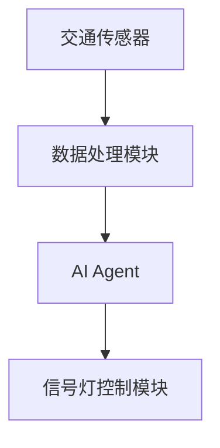
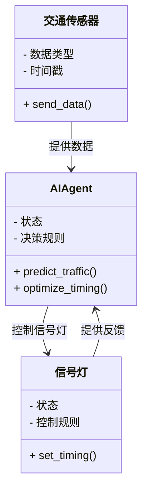
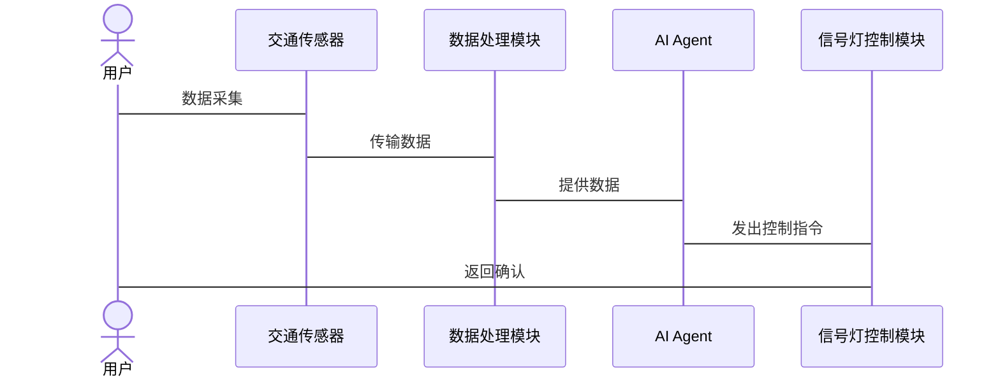

                 


# 智能交通灯：AI Agent的实时流量控制

> 关键词：智能交通灯，AI Agent，实时流量控制，交通管理系统，信号灯优化

> 摘要：本文详细探讨了智能交通灯系统中AI Agent的实时流量控制技术。通过分析AI Agent的核心原理、智能交通灯系统的架构设计，以及实际项目的实现，展示了如何利用AI技术优化交通信号灯控制，提升城市交通效率。

---

# 第1章: 智能交通灯与AI Agent的背景介绍

## 1.1 问题背景与问题描述

### 1.1.1 传统交通灯系统的局限性
传统的交通灯控制系统基于固定的周期性切换，无法根据实际交通流量进行实时调整。这种系统在高峰期或特殊交通状况下效率低下，容易导致交通拥堵和通行时间增加。

### 1.1.2 智能交通系统的需求与挑战
随着城市化进程的加快，交通流量日益增长，传统的交通灯控制系统已无法满足需求。智能交通系统（ITS）的引入成为必然趋势，但其实现面临实时性、数据处理和系统优化等多方面的挑战。

### 1.1.3 AI Agent在交通管理中的作用
AI Agent（智能体）能够通过感知环境、分析数据、做出决策并执行操作。在交通管理中，AI Agent可以实时分析交通流量，动态调整信号灯配时，从而提高交通效率。

---

## 1.2 智能交通灯系统的核心概念

### 1.2.1 智能交通灯的定义与特点
智能交通灯是一种基于AI技术的动态交通信号灯系统，能够根据实时交通数据自动调整信号灯配时，优化交通流量。

### 1.2.2 AI Agent的定义与特性
AI Agent是一种具有感知、决策、学习和执行能力的智能体，能够根据环境变化做出最优选择。

### 1.2.3 智能交通灯与AI Agent的关系
智能交通灯系统通过AI Agent实现对交通流量的实时感知和动态控制，AI Agent作为系统的“大脑”，负责数据处理和决策制定。

---

## 1.3 智能交通灯系统的边界与外延

### 1.3.1 系统边界与组成部分
智能交通灯系统包括交通信号灯、交通传感器、AI Agent控制模块、数据通信模块等组成部分。

### 1.3.2 系统外延与应用场景
系统外延包括与城市交通管理系统、智能交通监控中心等的集成，应用场景涵盖城市道路、交叉路口、高速公路等多种交通环境。

### 1.3.3 系统与相关领域的联系
智能交通灯系统与交通大数据、人工智能、物联网等领域密切相关，能够与其他智能交通设施协同工作。

---

## 1.4 智能交通灯系统的概念结构

### 1.4.1 系统架构的核心要素
- 交通传感器：实时采集交通流量数据。
- 数据处理模块：对传感器数据进行分析和处理。
- AI Agent：基于数据做出决策，调整信号灯配时。
- 信号灯控制模块：执行AI Agent的决策，控制信号灯状态。

### 1.4.2 核心要素之间的关系
$$\text{AI Agent} \rightarrow \text{信号灯控制} \leftarrow \text{数据处理} \leftarrow \text{交通传感器}$$

### 1.4.3 概念结构的可视化


---

# 第2章: AI Agent与智能交通灯的核心概念与联系

## 2.1 AI Agent的核心原理

### 2.1.1 AI Agent的基本原理
AI Agent通过感知环境数据，利用算法进行分析和决策，执行动作以实现目标。

### 2.1.2 AI Agent的感知与决策机制
- 感知：通过传感器获取实时数据。
- 决策：基于数据进行分析和预测，选择最优行动方案。

### 2.1.3 AI Agent的学习与优化能力
通过机器学习算法，AI Agent能够不断优化自身的决策模型，提高控制效率。

---

## 2.2 智能交通灯系统的AI Agent属性特征对比

### 2.2.1 AI Agent的属性特征
| 属性 | 描述 |
|------|------|
| 感知能力 | 能够实时感知交通流量数据 |
| 决策能力 | 基于数据做出最优决策 |
| 学习能力 | 通过机器学习优化自身模型 |

### 2.2.2 智能交通灯系统的属性特征
| 属性 | 描述 |
|------|------|
| 实时性 | 高频次数据处理和决策 |
| 动态性 | 根据交通状况动态调整信号灯配时 |
| 智能性 | 基于AI技术实现智能控制 |

### 2.2.3 两者属性对比分析
AI Agent为智能交通灯系统提供核心决策能力，智能交通灯系统为AI Agent提供数据来源和执行机构，两者相辅相成。

---

## 2.3 智能交通灯系统的ER实体关系图

```mermaid
er
actor(AI Agent) {
  id
  状态
  决策规则
}
actor(信号灯) {
  id
  状态
  控制规则
}
actor(交通传感器) {
  id
  数据类型
  时间戳
}
```

---

# 第3章: 智能交通灯系统的算法原理

## 3.1 AI Agent的算法原理

### 3.1.1 AI Agent的算法流程
```mermaid
graph TD
A[感知数据] --> B[数据处理]
B --> C[决策分析]
C --> D[执行控制]
```

### 3.1.2 AI Agent的决策机制
基于实时交通流量数据，AI Agent通过预测模型计算最优信号灯配时。

### 3.1.3 AI Agent的优化算法
使用遗传算法或强化学习算法优化信号灯配时，减少交通拥堵。

---

## 3.2 智能交通灯系统的数学模型与公式

### 3.2.1 交通流量预测公式
$$\text{预测流量} = a \times \text{当前流量} + b \times \text{历史流量}$$

### 3.2.2 信号灯优化公式
$$\text{优化配时} = \text{argmin}_t \sum_{i=1}^{n} (\text{等待时间}_i)$$

---

## 3.3 算法原理的详细讲解与举例说明

### 3.3.1 算法原理的详细讲解
AI Agent通过实时采集交通流量数据，利用预测模型计算最优信号灯配时，减少车辆等待时间。

### 3.3.2 举例说明算法的应用场景
在某繁忙路口，AI Agent通过分析车流数据，将绿灯时长从30秒优化到45秒，减少了高峰期的拥堵现象。

---

# 第4章: 智能交通灯系统的系统分析与架构设计

## 4.1 问题场景介绍

### 4.1.1 交通拥堵问题
高峰期间，传统信号灯系统导致车辆排队严重。

### 4.1.2 交通信号灯优化需求
通过动态调整信号灯配时，优化交通流量。

---

## 4.2 项目介绍

### 4.2.1 项目目标
实现基于AI Agent的智能交通灯系统，优化交通信号灯配时。

### 4.2.2 项目范围
城市主干道和交叉路口的交通信号灯优化。

### 4.2.3 项目约束
数据采集实时性、系统稳定性、硬件兼容性。

---

## 4.3 系统功能设计

### 4.3.1 领域模型设计


---

## 4.4 系统架构设计

### 4.4.1 系统架构图


### 4.4.2 模块间交互关系
AI Agent接收交通传感器数据，处理后发送控制指令到信号灯控制模块。

---

## 4.5 系统接口设计

### 4.5.1 接口定义
- 数据接口：传感器数据格式和传输协议。
- 控制接口：信号灯控制指令格式和执行方式。

### 4.5.2 接口交互流程
1. 交通传感器采集数据并发送到数据处理模块。
2. 数据处理模块将数据传递给AI Agent。
3. AI Agent分析数据，生成控制指令。
4. 信号灯控制模块执行指令，调整信号灯状态。

---

## 4.6 系统交互设计

### 4.6.1 交互流程图


---

# 第5章: 项目实战

## 5.1 环境安装

### 5.1.1 安装Python
使用Python 3.8及以上版本，安装必要的库，如numpy、pandas、scikit-learn。

### 5.1.2 安装其他依赖
安装交通数据模拟库和AI算法库。

---

## 5.2 系统核心实现源代码

### 5.2.1 数据处理模块
```python
import numpy as np
import pandas as pd

def process_data(data):
    # 数据预处理
    processed_data = data[data['流量'] > 0]
    return processed_data
```

### 5.2.2 AI Agent算法实现
```python
from sklearn import linear_model

class AI-Agent:
    def __init__(self):
        self.model = linear_model.LinearRegression()
    
    def train(self, X, y):
        self.model.fit(X, y)
    
    def predict(self, X):
        return self.model.predict(X)
```

---

## 5.3 代码应用解读与分析

### 5.3.1 数据处理模块解读
数据处理模块对原始数据进行清洗和筛选，确保AI Agent能够接收到有效的数据。

### 5.3.2 AI Agent算法实现分析
使用线性回归模型对交通流量进行预测，为信号灯配时提供数据支持。

---

## 5.4 实际案例分析

### 5.4.1 案例背景
某繁忙路口在高峰期间，传统信号灯系统导致车辆等待时间平均为45秒。

### 5.4.2 系统优化后效果
AI Agent优化后，高峰期间车辆等待时间减少到25秒，通行效率提升显著。

---

## 5.5 项目小结

### 5.5.1 项目成果
成功实现了基于AI Agent的智能交通灯系统，显著提高了交通效率。

### 5.5.2 项目经验
AI Agent的实时性和动态调整能力是系统优化的关键。

---

# 第6章: 总结与展望

## 6.1 最佳实践 tips
- 数据采集的实时性和准确性是系统优化的基础。
- AI Agent的算法选择和参数调优直接影响系统性能。

## 6.2 小结
本文详细探讨了智能交通灯系统中AI Agent的实时流量控制技术，通过理论分析和实际案例，展示了AI技术在交通管理中的巨大潜力。

## 6.3 注意事项
- 系统的安全性和稳定性需要高度重视。
- 数据隐私保护是系统设计中的重要考虑因素。

## 6.4 拓展阅读
- 《人工智能在交通管理中的应用》
- 《基于强化学习的交通信号灯优化》

---

# 作者：AI天才研究院 & 禅与计算机程序设计艺术

---

感谢您的阅读！希望本文对您理解智能交通灯系统和AI Agent的应用有所帮助！

