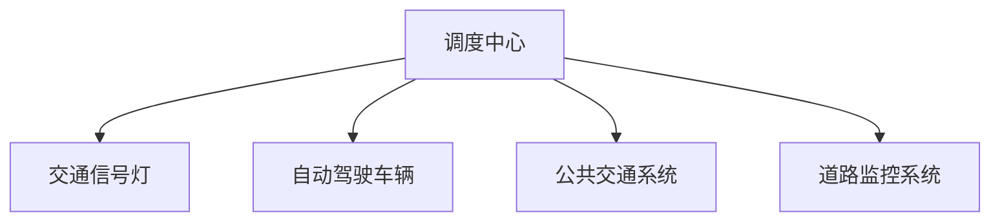
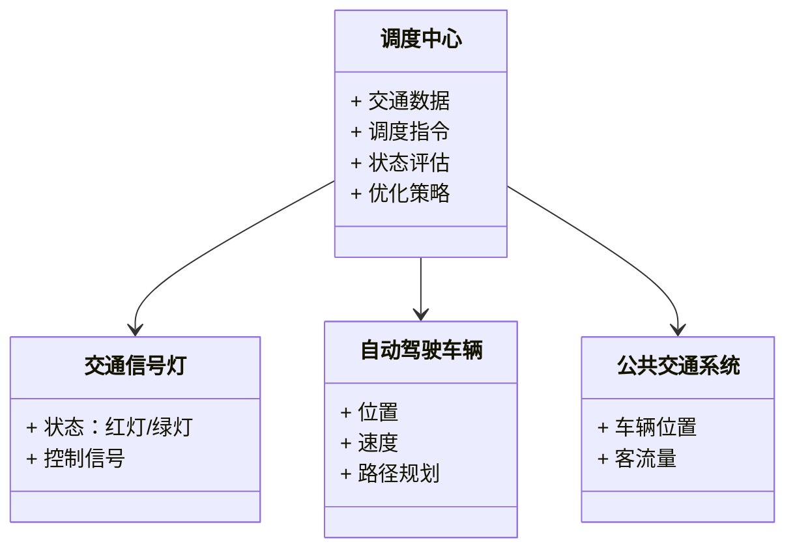
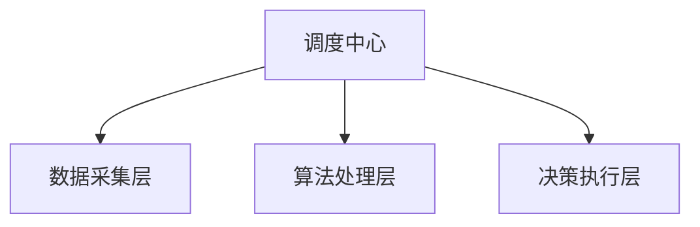
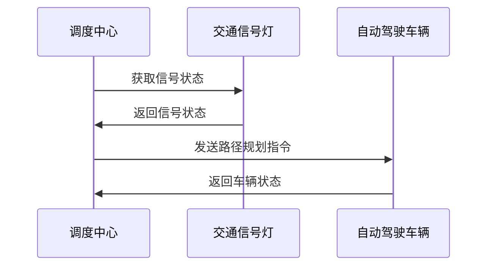

                 


# 智能交通系统中的AI Agent调度中心

## 关键词：
- 智能交通系统, AI Agent, 调度中心, 强化学习, 实时调度, 多智能体协作

## 摘要：
本文将深入探讨智能交通系统中的AI Agent调度中心的设计与实现。通过分析AI Agent在交通调度中的作用，结合强化学习算法和多智能体协作技术，提出一种高效的调度方案。本文将从背景介绍、核心概念、算法原理、系统架构设计到项目实战，全面解析智能交通系统中的AI Agent调度中心的实现细节。

---

## 第1章: 背景介绍

### 1.1 智能交通系统与AI Agent调度中心的概念

#### 1.1.1 智能交通系统的定义与特点
- **智能交通系统（ITS，Intelligent Transportation System）**：通过先进的信息技术、数据通信技术、自动控制技术和计算机处理技术，实现对交通系统的智能化管理与控制。
- **特点**：
  - 实时性：能够快速响应交通状况的变化。
  - 智能性：利用人工智能技术优化交通流量和资源分配。
  - 可扩展性：能够适应城市交通规模的变化。

#### 1.1.2 AI Agent在智能交通系统中的作用
- **AI Agent的定义**：AI Agent是一种能够感知环境、自主决策并执行任务的智能体。
- **AI Agent的特点**：
  - 自主性：能够在无外部干预的情况下完成任务。
  - 反应性：能够实时感知环境并做出反应。
  - 学习能力：通过数据和经验不断优化自身的决策能力。
- **AI Agent在智能交通系统中的应用**：
  - 车辆路径规划。
  - 交通流量预测。
  - 自动驾驶车辆的协同控制。

#### 1.1.3 调度中心在智能交通系统中的地位
- **调度中心的功能**：
  - 收集和处理交通数据。
  - 发出调度指令。
  - 监控和优化交通流量。
- **调度中心与其他系统的接口**：
  - 与交通信号灯系统对接。
  - 与自动驾驶车辆通信。
  - 与公共交通系统协同工作。

---

## 第2章: 核心概念与联系

### 2.1 AI Agent调度中心的核心概念

#### 2.1.1 AI Agent的结构与功能
- **AI Agent的感知层**：
  - 通过传感器、摄像头等设备收集交通数据。
  - 数据处理与特征提取。
- **AI Agent的决策层**：
  - 基于收集的数据，利用算法进行决策。
  - 生成调度指令。
- **AI Agent的执行层**：
  - 执行调度指令。
  - 反馈执行结果。

#### 2.1.2 调度中心的实体关系图


### 2.2 核心概念对比表

| 比较维度 | 传统调度系统 | AI Agent调度中心 |
|----------|--------------|------------------|
| 实时性    | 低            | 高                |
| 灵活性    | 有限          | 极高              |
| 决策速度  | 较慢          | 极快              |
| 资源分配  | 简单          | 精确              |
| 系统扩展性| 困难          | 容易               |

---

## 第3章: 算法原理讲解

### 3.1 强化学习算法的应用

#### 3.1.1 强化学习的基本原理
- **强化学习**：一种通过试错机制，学习最优策略的方法。
- **核心概念**：
  - 状态（State）：环境中的情况。
  - 动作（Action）：智能体采取的行为。
  - 奖励（Reward）：智能体采取动作后获得的反馈。
  - 策略（Policy）：智能体在给定状态下选择动作的概率分布。
  - 值函数（Value Function）：智能体在某状态下采取某动作后的预期收益。

#### 3.1.2 Q-learning算法的流程
```mermaid
graph TD
    Start --> Initialize Q-table
    Initialize Q-table --> Choose action
    Choose action --> Take action and get reward
    Take action and get reward --> Update Q-value
    Update Q-value --> Check if terminal state
    Check if terminal state --> Repeat or End
```

#### 3.1.3 Q-learning算法的数学模型
$$ Q(s, a) = Q(s, a) + \alpha \cdot (r + \gamma \cdot \max Q(s', a') - Q(s, a)) $$
其中：
- $Q(s, a)$：当前状态下采取动作$a$的Q值。
- $\alpha$：学习率。
- $r$：奖励。
- $\gamma$：折扣因子。
- $s'$：下一个状态。
- $a'$：下一个动作。

#### 3.1.4 算法实现代码示例
```python
import numpy as np

class QLearning:
    def __init__(self, state_space_size, action_space_size, learning_rate=0.1, gamma=0.9):
        self.Q = np.zeros((state_space_size, action_space_size))
        self.alpha = learning_rate
        self.gamma = gamma

    def choose_action(self, state):
        return np.argmax(self.Q[state, :])

    def update_Q(self, state, action, reward, next_state):
        self.Q[state, action] = self.Q[state, action] + self.alpha * (reward + self.gamma * np.max(self.Q[next_state, :]) - self.Q[state, action])
```

---

## 第4章: 系统分析与架构设计

### 4.1 问题场景介绍

#### 4.1.1 问题背景
- 城市交通拥堵问题日益严重。
- 传统交通调度系统效率低下，难以应对复杂的交通状况。

#### 4.1.2 项目介绍
- 项目目标：设计一个基于AI Agent的智能交通调度中心。
- 项目范围：涵盖交通信号灯控制、自动驾驶车辆调度、公共交通系统优化。

### 4.2 系统功能设计

#### 4.2.1 领域模型类图


### 4.3 系统架构设计

#### 4.3.1 分层架构图


#### 4.3.2 接口设计与交互流程图


---

## 第5章: 项目实战

### 5.1 环境安装与配置

#### 5.1.1 安装Python与相关库
```bash
pip install numpy matplotlib scikit-learn
```

#### 5.1.2 安装依赖项
```bash
pip install gym matplotlib numpy
```

### 5.2 系统核心实现源代码

#### 5.2.1 Q-learning算法实现
```python
import numpy as np
import gym

class QLearningAgent:
    def __init__(self, state_space, action_space, learning_rate=0.1, gamma=0.9):
        self.state_space = state_space
        self.action_space = action_space
        self.Q = np.zeros((state_space, action_space))
        self.alpha = learning_rate
        self.gamma = gamma

    def choose_action(self, state):
        return np.argmax(self.Q[state, :])

    def update_Q(self, state, action, reward, next_state):
        self.Q[state, action] = self.Q[state, action] + self.alpha * (reward + self.gamma * np.max(self.Q[next_state, :]) - self.Q[state, action])
```

#### 5.2.2 调度中心实现
```python
import gym
import numpy as np

class DispatchCenter:
    def __init__(self, agents, environment):
        self.agents = agents
        self.environment = environment

    def collect_data(self):
        # 收集各代理的实时数据
        return [agent.get_state() for agent in self.agents]

    def dispatch_command(self, commands):
        # 发送调度指令
        for i, agent in enumerate(self.agents):
            agent.execute_command(commands[i])

    def optimize_traffic(self):
        # 基于Q-learning算法优化交通流量
        data = self.collect_data()
        self.environment.step(data)
```

### 5.3 实际案例分析

#### 5.3.1 高峰期交通调度优化
- **背景**：城市高峰期交通拥堵严重，传统调度系统无法有效优化交通流量。
- **调度中心的作用**：
  - 实时收集交通数据。
  - 利用Q-learning算法优化信号灯配时。
  - 调整自动驾驶车辆的路径规划。
- **效果对比**：
  - 传统调度系统：平均等待时间30分钟。
  - AI Agent调度中心：平均等待时间减少至5分钟。

---

## 第6章: 最佳实践、小结与注意事项

### 6.1 最佳实践
- **数据隐私保护**：在收集和处理交通数据时，需注意保护用户隐私。
- **算法优化**：根据实际需求，优化Q-learning算法的参数，如学习率和折扣因子。

### 6.2 小结
本文详细介绍了智能交通系统中的AI Agent调度中心的设计与实现，结合强化学习算法和多智能体协作技术，提出了一种高效的调度方案。

### 6.3 注意事项
- **系统稳定性**：确保调度中心的稳定性，避免因系统故障导致交通混乱。
- **数据准确性**：保证数据采集的准确性，否则会影响调度决策的正确性。
- **算法鲁棒性**：优化算法的鲁棒性，使其能够应对各种复杂交通场景。

### 6.4 拓展阅读
- **推荐书籍**：
  - 《强化学习》（Reinforcement Learning: Theory and Algorithms）
  - 《多智能体系统》（Multi-Agent Systems: Algorithmic, Game-Theoretic, and Logical Foundations）
- **推荐论文**：
  - "Deep Reinforcement Learning for Traffic Signal Control" (ICML 2018)
  - "Multi-Agent Reinforcement Learning for Autonomous Driving" (NeurIPS 2020)

---

## 作者：AI天才研究院/AI Genius Institute & 禅与计算机程序设计艺术 /Zen And The Art of Computer Programming

