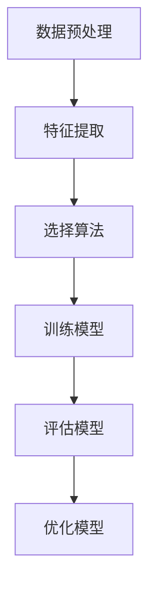
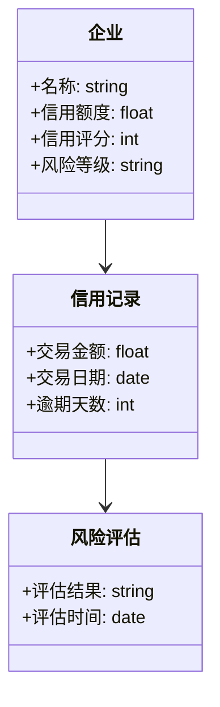

                 


```markdown
# 智能企业信用限额管理系统

## 关键词：智能信用管理、企业信用、限额管理、人工智能、大数据分析

## 摘要：本文深入探讨了智能企业信用限额管理系统的构建与应用，结合实际案例，分析了传统信用管理的局限性，提出了基于人工智能和大数据分析的智能化解决方案，详细讲解了系统的算法原理、架构设计及项目实现，为企业信用管理的智能化转型提供理论支持与实践指导。

---

# 第1章: 企业信用限额管理的背景与问题

## 1.1 企业信用管理的重要性

### 1.1.1 企业信用管理的核心作用
企业信用管理是企业财务管理的重要组成部分，直接关系到企业的资金周转、客户关系维护以及风险控制。有效的信用管理能够帮助企业合理分配信用资源，降低坏账风险，提升经营效率。

### 1.1.2 传统信用管理的局限性
传统的信用管理方式依赖人工审核和经验判断，存在效率低下、主观性强、数据利用不足等问题。随着市场竞争的加剧和客户需求的多样化，传统方法难以满足现代企业的需求。

### 1.1.3 智能化信用管理的必要性
智能化信用管理能够通过大数据分析和人工智能技术，实现信用限额的自动化计算、实时监控和智能调整，显著提升管理效率和准确性。

## 1.2 信用限额管理的定义与目标

### 1.2.1 信用限额管理的定义
信用限额管理是指根据企业的信用状况和风险承受能力，设定合理的信用额度，以控制赊销风险，保障企业资金安全。

### 1.2.2 信用限额管理的目标
- 优化企业信用资源分配
- 减少信用风险
- 提高客户满意度
- 提升企业运营效率

### 1.2.3 信用限额管理的边界与外延
- 边界：仅限于企业与客户的信用关系，不涉及企业内部员工信用管理。
- 外延：与企业供应链管理、风险管理、客户关系管理等领域密切相关。

## 1.3 问题背景与问题描述

### 1.3.1 企业信用管理中的常见问题
- 数据分散，难以整合
- 风险评估不准确
- 信用限额调整不及时
- 缺乏实时监控能力

### 1.3.2 信用限额管理的难点与挑战
- 数据质量参差不齐
- 模型复杂，难以快速迭代
- 需要实时处理大量数据
- 法律法规和行业标准的限制

### 1.3.3 智能化信用限额管理的解决方案
- 引入人工智能技术
- 构建大数据分析平台
- 实现自动化决策流程
- 提供实时监控功能

## 1.4 本章小结
本章从企业信用管理的重要性出发，分析了传统信用管理的局限性，提出了智能化信用管理的必要性。同时，明确了信用限额管理的定义、目标及其边界与外延，为后续章节的深入探讨奠定了基础。

---

# 第2章: 智能企业信用限额管理系统的概念与核心要素

## 2.1 智能信用限额管理的核心概念

### 2.1.1 智能化的核心要素
- 数据驱动：通过收集和分析大量数据，提供决策支持。
- 人工智能：利用机器学习算法进行风险评估和预测。
- 实时性：系统能够实时处理数据，快速响应变化。

### 2.1.2 数据驱动的管理方式
- 数据来源：企业内部数据、外部征信数据、市场数据。
- 数据处理：数据清洗、特征提取、数据建模。
- 数据应用：信用评分、限额计算、风险预警。

### 2.1.3 人工智能在信用管理中的应用
- 机器学习：用于信用评分、风险预测。
- 自然语言处理：分析文本数据，提取潜在风险。
- 图神经网络：构建企业关系图，识别关联风险。

## 2.2 核心概念的联系与对比

### 2.2.1 核心概念属性对比表
| 概念       | 实时性 | 准确性 | 可扩展性 |
|------------|--------|--------|----------|
| 传统信用管理 | 低     | 一般   | 有限     |
| 智能信用管理 | 高     | 高     | 强        |

### 2.2.2 ER实体关系图
```mermaid
erd
    企业
    信用记录
    限额规则
    风险评估
    用户权限
    数据接口
    系统日志
    关系：企业-信用记录(1:多), 信用记录-限额规则(1:多), 风险评估-限额规则(1:1), 用户权限-系统日志(1:多)
```

## 2.3 本章小结
本章详细阐述了智能信用限额管理的核心概念，对比了传统管理与智能管理的差异，并通过ER实体关系图展示了系统的整体架构，为后续章节的算法实现和系统设计提供了理论基础。

---

# 第3章: 智能信用限额管理系统的算法原理

## 3.1 算法原理概述

### 3.1.1 机器学习在信用管理中的应用
机器学习算法能够从大量数据中提取特征，建立信用评分模型，预测客户违约概率。

### 3.1.2 算法选择与优化
- 算法选择：根据数据类型和业务需求选择合适的算法，如线性回归、决策树、随机森林等。
- 算法优化：通过参数调优、特征选择等方法提升模型性能。

### 3.1.3 算法流程图


## 3.2 机器学习算法实现

### 3.2.1 线性回归算法
线性回归用于预测客户信用评分，公式为：
$$y = \beta_0 + \beta_1x_1 + \beta_2x_2 + \ldots + \beta_nx_n + \epsilon$$

### 3.2.2 决策树算法
决策树用于分类客户信用等级，通过ID3、C4.5或CART算法构建树结构。

### 3.2.3 支持向量机算法
支持向量机用于客户信用评分，通过优化超平面实现分类。

### 3.2.4 神经网络算法
神经网络用于复杂的信用评分模型，通过多层网络结构捕捉数据特征。

## 3.3 算法实现代码

### 3.3.1 数据预处理
```python
import pandas as pd
import numpy as np

# 读取数据
data = pd.read_csv('credit_data.csv')

# 处理缺失值
data = data.dropna()

# 标准化数据
from sklearn.preprocessing import StandardScaler
scaler = StandardScaler()
data_scaled = scaler.fit_transform(data)
```

### 3.3.2 算法实现
```python
from sklearn.tree import DecisionTreeClassifier
from sklearn.metrics import accuracy_score

# 训练决策树模型
model = DecisionTreeClassifier()
model.fit(X_train, y_train)

# 预测结果
y_pred = model.predict(X_test)

# 评估准确率
print('Accuracy:', accuracy_score(y_test, y_pred))
```

## 3.4 本章小结
本章详细讲解了机器学习算法在智能信用限额管理中的应用，通过对比不同算法的优缺点，选择了合适的算法，并通过代码示例展示了算法的实现过程。

---

# 第4章: 智能信用限额管理系统的系统分析与架构设计

## 4.1 系统分析

### 4.1.1 问题场景介绍
企业需要实时监控客户的信用状况，动态调整信用限额，减少信用风险。

### 4.1.2 项目介绍
开发一个基于人工智能的信用限额管理系统，实现数据采集、风险评估、限额计算等功能。

## 4.2 系统功能设计

### 4.2.1 领域模型类图


### 4.2.2 系统架构设计


## 4.3 系统接口设计

### 4.3.1 数据接口
- 数据采集接口：从企业系统中获取客户数据。
- 数据存储接口：将处理后的数据存储到数据库。

### 4.3.2 系统交互序列图
```mermaid
sequenceDiagram
    客户请求 --> 前端
    前端 --> 后端
    后端 --> 数据库
    数据库 --> 后端
    后端 --> 第三方接口
    第三方接口 --> 后端
    后端 --> 前端
    前端 --> 客户
```

## 4.4 本章小结
本章通过系统分析和架构设计，明确了智能信用限额管理系统的功能模块和系统架构，为后续的开发工作奠定了基础。

---

# 第5章: 智能信用限额管理系统的项目实战

## 5.1 环境安装

### 5.1.1 安装Python
```bash
# 安装Python
sudo apt-get install python3 python3-pip
```

### 5.1.2 安装依赖库
```bash
pip install pandas numpy scikit-learn
```

## 5.2 系统核心实现

### 5.2.1 数据处理代码
```python
import pandas as pd
import numpy as np
from sklearn import preprocessing

# 读取数据
data = pd.read_csv('credit_data.csv')

# 处理缺失值
data = data.dropna()

# 标准化数据
scaler = preprocessing.StandardScaler()
data_scaled = scaler.fit_transform(data)
```

### 5.2.2 算法实现代码
```python
from sklearn.tree import DecisionTreeClassifier
from sklearn.metrics import accuracy_score

# 训练决策树模型
model = DecisionTreeClassifier()
model.fit(X_train, y_train)

# 预测结果
y_pred = model.predict(X_test)

# 评估准确率
print('Accuracy:', accuracy_score(y_test, y_pred))
```

## 5.3 代码应用解读与分析

### 5.3.1 代码功能解读
- 数据预处理：清洗数据，提取特征。
- 模型训练：使用决策树算法训练模型。
- 模型评估：计算准确率，评估模型性能。

### 5.3.2 代码优化建议
- 增加特征工程：如特征选择、降维等。
- 使用更复杂的模型：如随机森林、梯度提升树。
- 增加实时数据处理功能。

## 5.4 实际案例分析

### 5.4.1 案例背景
某企业客户信用数据，包括交易金额、交易日期、逾期天数等。

### 5.4.2 数据分析
通过数据分析发现，客户的信用评分与交易金额和逾期天数密切相关。

### 5.4.3 模型应用
使用训练好的模型预测客户信用评分，动态调整信用限额。

## 5.5 项目小结
本章通过实际案例分析，展示了智能信用限额管理系统的实现过程，包括环境安装、数据处理、算法实现和模型评估。

---

# 第6章: 智能信用限额管理系统的最佳实践

## 6.1 小结

### 6.1.1 核心要点总结
- 数据是关键，确保数据质量和完整性。
- 算法选择要根据业务需求和数据特点。
- 系统架构要灵活扩展，支持实时处理。

## 6.2 注意事项

### 6.2.1 数据隐私与安全
- 确保客户数据隐私，符合相关法律法规。
- 加强数据安全防护，防止数据泄露。

### 6.2.2 系统稳定性与可靠性
- 建立完善的监控体系，及时发现和处理系统故障。
- 定期进行系统维护和更新。

## 6.3 拓展阅读

### 6.3.1 推荐书籍
- 《机器学习实战》
- 《深入理解机器学习》

### 6.3.2 推荐博客
- [人工智能博客](https://example.com)
- [大数据分析博客](https://example.com)

## 6.4 本章小结
本章总结了智能信用限额管理系统的最佳实践，强调了数据安全、系统稳定性和持续优化的重要性，并提供了进一步学习的资源。

---

# 第7章: 总结与展望

## 7.1 总结
智能企业信用限额管理系统通过人工智能和大数据技术，显著提升了信用管理的效率和准确性，为企业降低了信用风险，优化了客户关系管理。

## 7.2 展望
未来，随着人工智能技术的不断发展，信用限额管理系统将更加智能化和个性化，可能的应用方向包括：
- 更加精准的风险评估
- 实时信用限额调整
- 智能化信用报告生成
- 多维度信用评估

## 7.3 本章小结
本章总结了全文的主要内容，并对未来的发展方向进行了展望，为读者提供了进一步思考的空间。

---

# 作者：AI天才研究院/AI Genius Institute & 禅与计算机程序设计艺术 /Zen And The Art of Computer Programming
```

