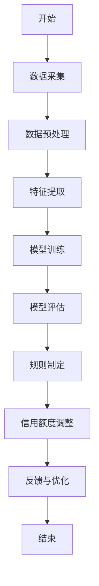
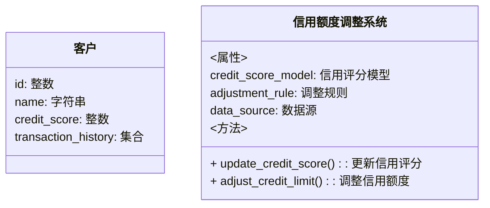
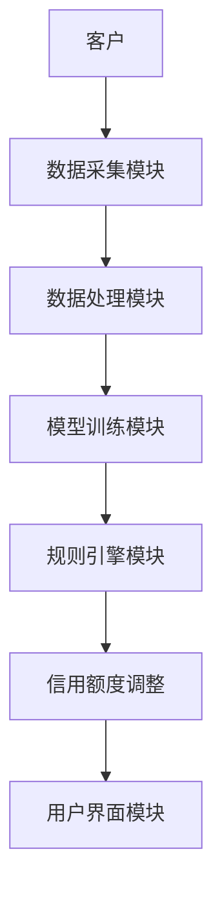
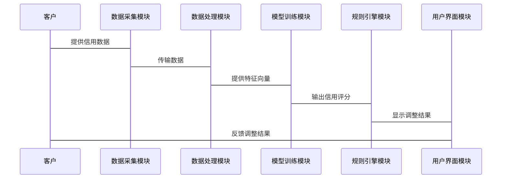

                 


# 智能企业信用额度动态调整与控制系统

**关键词：** 企业信用管理、智能动态调整、信用额度控制、机器学习、系统架构

**摘要：**  
本文深入探讨了智能企业信用额度动态调整与控制系统的构建与实现。文章首先分析了传统信用管理的局限性，引出了智能化信用管理的必要性。接着，详细阐述了智能信用控制系统的定义、核心概念与动态调整机制的原理。然后，从算法层面分析了基于机器学习的动态调整模型，包括数据预处理、特征提取、模型训练与优化等内容。随后，从系统架构的角度，探讨了系统的功能设计、架构设计及接口设计。最后，通过实际案例分析了系统的实现与应用，并提出了最佳实践建议。本文旨在为企业信用管理的智能化转型提供理论支持与实践指导。

---

# 第一部分: 智能企业信用额度动态调整与控制系统的背景与核心概念

## 第1章: 企业信用额度管理的背景与挑战

### 1.1 企业信用管理的重要性

#### 1.1.1 信用管理在企业经营中的作用
企业信用管理是企业经营中的核心环节之一，直接关系到企业的资金流动、客户关系维护以及风险控制。有效的信用管理能够帮助企业合理分配资源、优化现金流，并降低坏账风险。

#### 1.1.2 传统信用管理的局限性
传统的信用管理方式主要依赖人工审核和静态规则，存在以下问题：
- **信息不全**：难以全面收集和分析客户的信用数据。
- **效率低下**：人工审核耗时长，难以满足企业快速决策的需求。
- **规则僵化**：静态规则无法适应市场环境的动态变化。

#### 1.1.3 智能化信用管理的必要性
随着大数据和人工智能技术的发展，企业需要更加智能化、动态化的信用管理方式，以应对复杂的市场环境和客户需求。

### 1.2 信用额度动态调整的背景

#### 1.2.1 企业信用额度管理的现状
企业信用额度管理通常基于客户的信用评分和历史交易数据，但这种方式难以实时响应市场变化和客户需求。

#### 1.2.2 动态调整信用额度的市场需求
企业希望信用额度能够根据客户的实时信用状况、市场环境和交易行为进行动态调整，以优化客户体验和企业收益。

#### 1.2.3 智能化信用管理的技术支撑
大数据分析、机器学习和实时计算等技术为信用额度的动态调整提供了技术保障。

### 1.3 本章小结
本章介绍了企业信用管理的重要性，分析了传统信用管理的局限性，并提出了智能化信用管理的必要性。信用额度的动态调整是实现智能化信用管理的关键，其背景和需求为后续系统的构建奠定了基础。

---

## 第2章: 智能企业信用额度动态调整的核心概念

### 2.1 智能信用控制系统的定义与特点

#### 2.1.1 智能信用控制系统的定义
智能信用控制系统是一种基于大数据和人工智能技术的自动化信用管理系统，能够实时分析客户的信用状况，并动态调整信用额度。

#### 2.1.2 系统的核心特点
- **实时性**：能够实时采集和分析客户的信用数据。
- **动态性**：根据市场环境和客户需求，动态调整信用额度。
- **智能化**：基于机器学习算法，自动优化信用评估模型。

#### 2.1.3 系统与传统信用管理的区别
智能信用控制系统与传统信用管理相比，具有更高的效率、更强的适应性和更低的管理成本。

### 2.2 动态调整机制的原理

#### 2.2.1 动态调整的触发条件
动态调整的触发条件包括：
- 客户信用评分的变化。
- 市场环境的变化（如经济波动）。
- 客户交易行为的变化。

#### 2.2.2 调整规则的制定
调整规则基于信用评分模型和业务目标，通常包括以下步骤：
1. 数据采集与预处理。
2. 特征提取与模型训练。
3. 模型评估与优化。
4. 规则制定与验证。

#### 2.2.3 调整结果的反馈机制
调整结果需要及时反馈给客户和相关业务部门，并根据反馈进一步优化调整规则。

### 2.3 系统的核心要素与组成

#### 2.3.1 数据来源与处理
数据来源包括客户信息、交易记录、市场数据等，需要进行清洗、归一化和特征提取。

#### 2.3.2 智能算法模型
基于机器学习的信用评分模型，如逻辑回归、随机森林和神经网络等。

#### 2.3.3 系统架构与功能模块
系统架构包括数据采集模块、模型训练模块、规则引擎模块和用户界面模块。

### 2.4 本章小结
本章详细介绍了智能信用控制系统的定义、特点和核心要素，并分析了动态调整机制的原理和实现方法，为后续的算法设计和系统实现奠定了基础。

---

# 第二部分: 智能信用额度动态调整的算法原理

## 第3章: 智能信用额度动态调整的算法原理

### 3.1 动态调整算法的概述

#### 3.1.1 算法的基本原理
动态调整算法基于客户的实时信用数据，利用机器学习模型预测客户的信用风险，并根据预测结果调整信用额度。

#### 3.1.2 算法的分类与选择
常见的动态调整算法包括：
- 基于逻辑回归的信用评分模型。
- 基于随机森林的风险评估模型。
- 基于神经网络的深度学习模型。

#### 3.1.3 算法的性能指标
算法的性能指标包括准确率、召回率、F1分数和运行时间等。

### 3.2 基于机器学习的动态调整模型

#### 3.2.1 数据预处理与特征提取
数据预处理包括数据清洗、归一化和特征工程。特征提取是将原始数据转换为模型可识别的特征向量。

#### 3.2.2 模型训练与优化
使用训练数据训练信用评分模型，并通过交叉验证优化模型参数。

#### 3.2.3 模型的评估与验证
通过测试数据评估模型的性能，并根据评估结果进一步优化模型。

### 3.3 动态调整算法的流程图


### 3.4 本章小结
本章详细讲解了动态调整算法的原理和实现步骤，并通过流程图展示了算法的整体流程。基于机器学习的模型为信用额度的动态调整提供了技术支持。

---

# 第三部分: 智能信用额度动态调整系统的架构与设计

## 第4章: 智能信用额度动态调整系统的架构与设计

### 4.1 系统功能设计

#### 4.1.1 领域模型类图


#### 4.1.2 系统功能模块
系统功能模块包括数据采集模块、模型训练模块、规则引擎模块和用户界面模块。

### 4.2 系统架构设计

#### 4.2.1 系统架构图


#### 4.2.2 系统接口设计
系统接口包括数据接口、模型接口和用户接口。

### 4.3 系统交互流程图

#### 4.3.1 序列图


### 4.4 本章小结
本章从系统架构的角度，详细设计了智能信用额度动态调整系统的功能模块、架构和接口，并通过序列图展示了系统的交互流程。

---

# 第四部分: 项目实战与案例分析

## 第5章: 项目实战

### 5.1 环境安装与配置

#### 5.1.1 安装Python环境
安装Python 3.x，并配置虚拟环境。

#### 5.1.2 安装依赖库
安装必要的依赖库，如Pandas、Scikit-learn、TensorFlow等。

### 5.2 系统核心代码实现

#### 5.2.1 数据预处理代码
```python
import pandas as pd

# 读取数据
data = pd.read_csv('credit_data.csv')

# 数据清洗
data.dropna(inplace=True)

# 特征工程
data['credit_score'] = data['credit_score'].apply(lambda x: x if x >= 0 else 0)
```

#### 5.2.2 模型训练代码
```python
from sklearn.model_selection import train_test_split
from sklearn.linear_model import LogisticRegression

# 划分训练集和测试集
X_train, X_test, y_train, y_test = train_test_split(data.drop('credit_score', axis=1), data['credit_score'], test_size=0.2)

# 训练逻辑回归模型
model = LogisticRegression()
model.fit(X_train, y_train)

# 模型评估
print(f"模型准确率：{model.score(X_test, y_test)}")
```

#### 5.2.3 系统实现代码
```python
class CreditAdjustmentSystem:
    def __init__(self):
        self.model = LogisticRegression()
        self.data_source = None

    def update_credit_score(self):
        # 更新信用评分
        pass

    def adjust_credit_limit(self):
        # 调整信用额度
        pass
```

### 5.3 案例分析与应用

#### 5.3.1 案例背景
假设某企业客户的历史交易数据和信用评分为输入，目标是动态调整其信用额度。

#### 5.3.2 案例实现
通过模型预测客户的信用风险，并根据预测结果调整信用额度。

#### 5.3.3 案例分析
分析模型预测结果与实际信用评分的差异，并优化模型参数。

### 5.4 本章小结
本章通过实际案例分析，详细讲解了智能信用额度动态调整系统的实现过程，并展示了系统的实际应用效果。

---

# 第五部分: 最佳实践与总结

## 第6章: 最佳实践与总结

### 6.1 小结

#### 6.1.1 系统的核心优势
- 实时性：能够实时采集和分析信用数据。
- 动态性：根据市场环境和客户需求，动态调整信用额度。
- 智能化：基于机器学习算法，自动优化信用评估模型。

#### 6.1.2 系统的局限性
- 数据依赖性：模型的准确性依赖于高质量的数据。
- 模型解释性：部分机器学习模型的解释性较差。

### 6.2 注意事项

#### 6.2.1 数据安全
确保客户数据的安全性，避免数据泄露。

#### 6.2.2 模型优化
定期更新模型，确保模型的准确性和适应性。

#### 6.2.3 系统维护
定期维护系统，确保系统的稳定性和高效性。

### 6.3 未来发展趋势

#### 6.3.1 技术进步
随着人工智能和大数据技术的不断发展，信用额度动态调整系统将更加智能化和自动化。

#### 6.3.2 应用场景扩展
信用额度动态调整系统将应用于更多领域，如供应链金融、风险管理等。

#### 6.3.3 用户体验优化
未来的系统将更加注重用户体验，提供更加个性化的服务。

### 6.4 拓展阅读

#### 6.4.1 推荐书籍
- 《机器学习实战》
- 《信用风险管理》

#### 6.4.2 推荐博客与资源
- 人工智能技术博客
- 信用风险管理论坛

### 6.5 本章小结
本章总结了智能信用额度动态调整系统的最佳实践，并提出了未来的发展方向和注意事项，为读者提供了宝贵的参考。

---

# 作者：AI天才研究院/AI Genius Institute & 禅与计算机程序设计艺术 /Zen And The Art of Computer Programming

---

以上是《智能企业信用额度动态调整与控制系统》的技术博客文章的完整内容，涵盖了从背景分析到系统实现的各个方面，内容详实且结构清晰。

