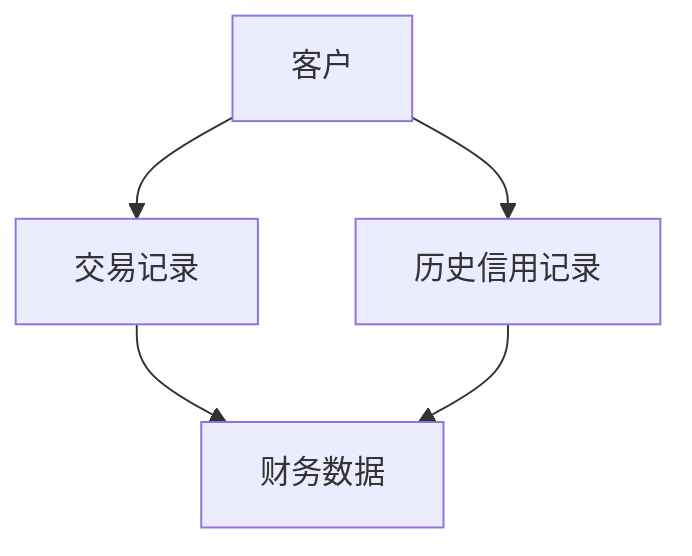
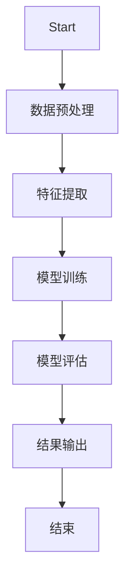
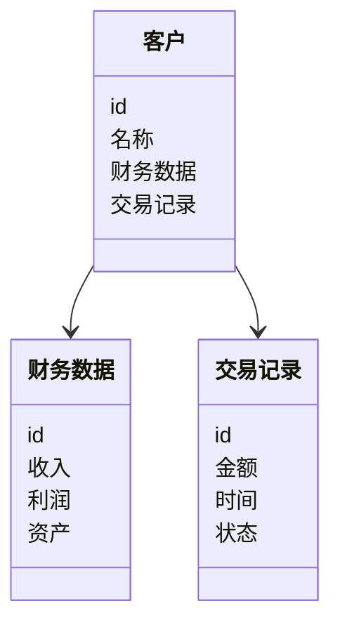

                 


# 智能企业信用额度动态调整系统

> 关键词：企业信用额度、动态调整、机器学习、评分模型、系统架构、风险控制

> 摘要：本文详细探讨了智能企业信用额度动态调整系统的设计与实现。通过分析企业信用管理的核心问题，提出了基于机器学习的动态调整模型，并结合系统架构设计与实际案例，展示了如何利用技术手段提升企业信用额度管理的智能化水平。文章内容涵盖背景介绍、核心概念、算法原理、系统架构、项目实战和最佳实践，旨在为企业信用管理提供新的思路和解决方案。

---

## 第一部分: 企业信用额度动态调整的背景与问题

### 第1章: 企业信用额度动态调整的背景与问题

#### 1.1 企业信用额度管理的重要性

##### 1.1.1 信用额度管理的核心作用
企业信用额度管理是企业财务管理中的核心环节，直接关系到企业的资金周转、客户信任和市场竞争力。传统的信用额度管理依赖于人工审核和静态评估，存在效率低、风险高、灵活性差等问题。随着企业规模的扩大和市场竞争的加剧，传统的管理方式已无法满足现代企业的需求。

##### 1.1.2 传统信用额度管理的局限性
传统的信用额度管理方式主要依赖于历史交易数据和财务报表，缺乏实时性和动态性。例如，企业可能在季度末集中调整信用额度，导致资源浪费和客户体验下降。此外，传统方法难以捕捉市场波动和客户行为变化的实时信息，容易导致信用风险的积累。

##### 1.1.3 智能化管理的必要性
随着人工智能和大数据技术的快速发展，智能化信用额度管理成为必然趋势。通过实时数据分析和机器学习算法，企业可以更精准地评估客户的信用状况，动态调整信用额度，降低风险并提升客户满意度。

---

#### 1.2 信用额度动态调整的定义与目标

##### 1.2.1 动态调整的定义
信用额度动态调整是指根据企业的实时经营状况、市场环境和客户行为，自动调整客户的信用额度。与传统的静态管理不同，动态调整强调实时性、灵活性和智能化。

##### 1.2.2 调整的目标与意义
- **目标**：通过实时数据驱动的决策，优化信用额度分配，降低信用风险，提升客户忠诚度。
- **意义**：动态调整能够帮助企业更快地响应市场变化，提高资金使用效率，降低坏账率。

##### 1.2.3 边界与外延
信用额度动态调整的边界包括企业的财务数据、交易记录和客户行为数据。外延则涉及与供应链管理、客户关系管理（CRM）等系统的集成。

---

#### 1.3 问题背景与需求分析

##### 1.3.1 企业信用管理的痛点
- 数据孤岛：企业内部数据分散在不同的系统中，难以实现有效整合。
- 数据滞后：传统管理方式依赖于定期报告，无法捕捉实时变化。
- 风险控制：传统方法难以及时发现潜在风险，导致信用损失。

##### 1.3.2 动态调整的需求场景
- **实时监控**：企业需要实时监控客户的信用状况，及时调整额度。
- **个性化服务**：根据客户的信用评分和行为特征，提供个性化的信用额度。
- **风险预警**：通过动态调整，提前预警潜在的信用风险。

##### 1.3.3 业务目标与技术目标
- **业务目标**：提升客户满意度，降低坏账率，优化资金周转。
- **技术目标**：构建智能化的动态调整系统，实现数据实时分析和自动化决策。

---

### 第2章: 核心概念与系统架构

#### 2.1 核心概念与联系

##### 2.1.1 信用评分模型
信用评分模型是动态调整系统的核心，用于评估客户的信用风险。常见的模型包括线性回归模型、逻辑回归模型和随机森林模型。

##### 2.1.2 动态调整机制
动态调整机制基于信用评分模型的结果，根据实时数据调整客户的信用额度。调整机制需要考虑的因素包括客户的信用评分、交易频率和市场环境。

##### 2.1.3 实体关系图（ER图）



---

#### 2.2 系统架构与模块划分

##### 2.2.1 系统功能模块
- **数据采集模块**：从企业内部系统和外部数据源获取实时数据。
- **评分计算模块**：基于机器学习模型计算客户的信用评分。
- **规则引擎模块**：根据评分结果和预设规则调整信用额度。
- **决策模块**：输出最终的信用额度调整结果。

##### 2.2.2 系统架构图


---

## 第二部分: 动态调整模型与算法原理

### 第3章: 动态调整模型与算法原理

#### 3.1 动态调整模型

##### 3.1.1 模型概述
动态调整模型基于机器学习算法，通过实时数据更新客户信用评分，并根据评分结果调整信用额度。

##### 3.1.2 模型输入与输出
- **输入**：客户的交易记录、财务数据、市场环境等。
- **输出**：客户的信用评分和建议调整的信用额度。

##### 3.1.3 模型训练与优化
通过历史数据训练机器学习模型，并通过实时数据不断优化模型参数。

---

#### 3.2 算法原理与流程

##### 3.2.1 算法流程图



##### 3.2.2 算法实现代码

```python
def dynamic_adjustment_model(data):
    # 数据预处理
    preprocessed_data = preprocess(data)
    # 特征提取
    features = extract_features(preprocessed_data)
    # 模型训练
    model = train_model(features)
    # 模型预测
    prediction = model.predict(features)
    return prediction
```

---

## 第三部分: 系统分析与架构设计方案

### 第4章: 系统分析与架构设计方案

#### 4.1 问题场景介绍
企业信用管理中存在的数据孤岛、实时性差和风险控制不足等问题，亟需通过智能化系统解决。

#### 4.2 项目介绍
本项目旨在构建一个智能化的企业信用额度动态调整系统，利用机器学习算法和实时数据分析技术，实现信用额度的自动调整。

#### 4.3 系统功能设计

##### 4.3.1 领域模型mermaid类图



#### 4.4 系统架构设计

##### 4.4.1 系统架构图


---

## 第四部分: 项目实战

### 第5章: 项目实战

#### 5.1 环境安装
安装必要的开发环境和工具，例如Python、Jupyter Notebook和相关机器学习库（如Scikit-learn、XGBoost）。

#### 5.2 核心代码实现

##### 5.2.1 数据预处理代码

```python
import pandas as pd
from sklearn.preprocessing import StandardScaler

def preprocess(data):
    # 假设data是一个DataFrame
    # 删除缺失值
    data = data.dropna()
    # 标准化处理
    scaler = StandardScaler()
    processed_data = scaler.fit_transform(data)
    return processed_data
```

##### 5.2.2 模型训练代码

```python
from sklearn.linear_model import LinearRegression
from sklearn.metrics import mean_squared_error

def train_model(features, labels):
    model = LinearRegression()
    model.fit(features, labels)
    return model
```

---

## 第五部分: 最佳实践与总结

### 第6章: 最佳实践与总结

#### 6.1 小结
智能企业信用额度动态调整系统通过实时数据分析和机器学习算法，显著提升了企业的信用管理效率和风险控制能力。

#### 6.2 注意事项
- 数据隐私保护：确保客户数据的安全性和隐私性。
- 模型更新：定期更新模型，以适应市场变化和客户行为的变化。
- 系统稳定性：确保系统的高可用性和稳定性，避免因系统故障导致信用额度调整失败。

#### 6.3 拓展阅读
推荐阅读《机器学习实战》和《大数据系统设计与实现》等相关书籍，深入了解机器学习和大数据技术的应用。

---

## 作者：AI天才研究院/AI Genius Institute & 禅与计算机程序设计艺术 /Zen And The Art of Computer Programming

---

以上是《智能企业信用额度动态调整系统》的技术博客文章大纲和部分内容。如果需要进一步扩展或补充，请随时告知。

