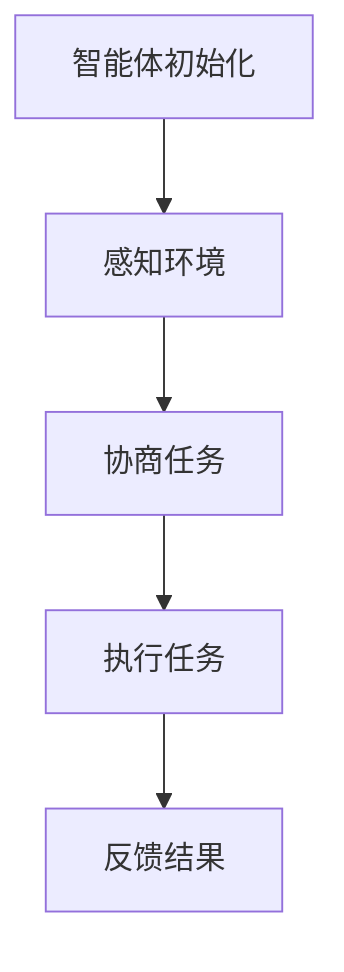
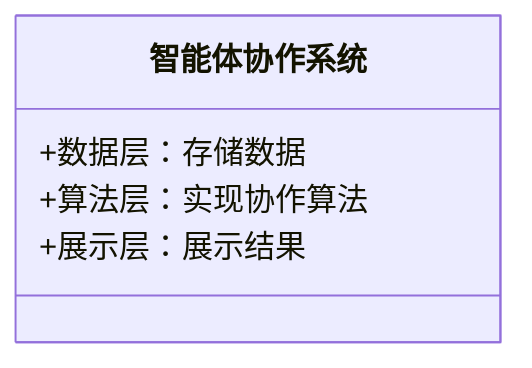
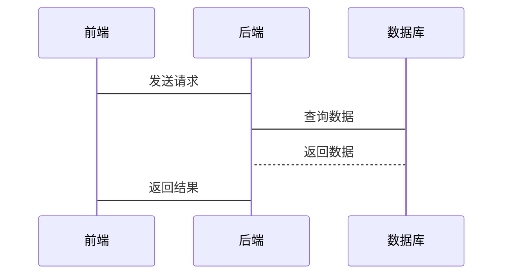

                 


# 智能体协作分析供应链：全面评估公司价值

## 关键词：智能体协作，供应链分析，公司价值评估，协作算法，数学模型，系统架构

## 摘要：  
本文深入探讨智能体协作在供应链分析中的应用，通过数学建模和算法实现，全面评估公司价值。文章从基础概念到实际应用，系统性地分析了智能体协作的优势、算法原理、系统架构及项目实战，为供应链优化和公司价值提升提供有力支持。

---

# 第一部分: 智能体协作与供应链分析基础

# 第1章: 智能体协作与供应链分析的背景介绍

## 1.1 智能体协作的基本概念
### 1.1.1 智能体的定义与特征
- 智能体：具备感知、决策、执行能力的实体，能够主动完成任务。
- 特征：自主性、反应性、协作性、学习能力。

### 1.1.2 协作的定义与机制
- 协作：智能体之间通过信息共享和任务分配，共同完成目标。
- 机制：通信、协商、任务分配、协调。

### 1.1.3 供应链分析的背景
- 供应链管理：从原材料到最终产品的生产和配送过程。
- 智能化供应链：利用AI、大数据等技术优化供应链效率。

## 1.2 供应链分析的背景与重要性
### 1.2.1 供应链管理的演变
- 传统供应链：基于规则的人工管理。
- 智能化供应链：数据驱动的自动化管理。

### 1.2.2 智能化供应链分析的必要性
- 数据量大：需要处理海量数据。
- 实时性要求高：需要快速响应。
- 复杂性：涉及多个环节和参与者。

### 1.2.3 公司价值评估的挑战与机遇
- 挑战：供应链中断、成本波动、信息不对称。
- 机遇：通过智能体协作优化供应链，提升效率和降低成本。

## 1.3 公司价值评估的核心要素
### 1.3.1 财务指标分析
- 利润率、周转率、资产负债率等。
### 1.3.2 供应链效率与成本
- 库存成本、运输成本、生产效率。
### 1.3.3 智能体协作对价值的影响
- 提高供应链透明度，降低风险。

## 1.4 本章小结
- 智能体协作是供应链分析的核心技术，能够显著提升公司价值。

---

# 第2章: 智能体协作的核心概念与联系

## 2.1 智能体协作的原理
### 2.1.1 智能体的决策机制
- 感知环境：通过传感器或数据源获取信息。
- 生成策略：基于信息生成决策。
- 执行操作：根据决策采取行动。

### 2.1.2 协作的目标与约束
- 目标：最大化整体收益。
- 约束：资源限制、时间限制、信息不对称。

### 2.1.3 智能体之间的信息交互
- 信息共享：智能体之间共享数据和信息。
- 协商机制：通过协商确定任务分配。

## 2.2 核心概念对比分析
### 2.2.1 智能体协作与传统供应链管理的对比
- 传统供应链：基于规则的人工管理。
- 智能体协作：数据驱动的自动化管理。

### 2.2.2 不同协作机制的优缺点分析
- 优点：提高效率，降低成本。
- 缺点：需要复杂的协作机制，可能引入额外成本。

### 2.2.3 供应链分析中的关键指标对比
- 常见指标：库存周转率、交货时间、成本。

## 2.3 ER实体关系图架构
```mermaid
erd
  customer
  order
  product
  supplier
  shipper
```

## 2.4 本章小结
- 智能体协作是供应链分析的重要技术，通过信息共享和任务分配优化供应链效率。

---

# 第3章: 供应链分析的数学模型与公式

## 3.1 数据预处理与特征提取
### 3.1.1 数据清洗方法
- 删除重复数据、填充缺失值、处理异常值。

### 3.1.2 特征选择与降维
- 特征选择：基于相关性分析选择重要特征。
- 降维方法：主成分分析（PCA）。

### 3.1.3 时间序列分析
- 时间序列模型：ARIMA、LSTM。

## 3.2 供应链分析的数学模型
### 3.2.1 线性回归模型
$$y = \beta_0 + \beta_1x + \epsilon$$
- 解释：模型预测目标变量y，基于自变量x。

### 3.2.2 马尔可夫链模型
$$P(X_t = i) = \sum_{j=1}^{n} P(X_{t-1}=j)P(j \rightarrow i)$$
- 解释：状态转移概率。

## 3.3 模型评估与优化
### 3.3.1 常见评估指标
- 准确率、召回率、F1分数。

### 3.3.2 超参数优化方法
- 网格搜索、随机搜索。

### 3.3.3 模型调优策略
- 正则化、早停法。

## 3.4 本章小结
- 数学模型是供应链分析的重要工具，能够帮助我们更好地理解供应链的运行规律。

---

# 第4章: 智能体协作算法原理与实现

## 4.1 算法原理
### 4.1.1 算法选择与设计
- 分散式智能体协作算法：基于Dijkstra算法的路径规划。

### 4.1.2 算法优化策略
- 并行计算、分布式计算。

## 4.2 协作算法实现
### 4.2.1 算法流程
1. 初始化智能体。
2. 智能体感知环境。
3. 智能体协商任务。
4. 执行任务。
5. 反馈结果。

### 4.2.2 Python代码实现
```python
import numpy as np
import matplotlib.pyplot as plt

# 初始化智能体
agents = [Agent(i) for i in range(n)]
```

## 4.3 算法流程图


## 4.4 本章小结
- 智能体协作算法是供应链分析的核心技术，能够帮助我们优化供应链效率。

---

# 第5章: 系统架构设计与实现

## 5.1 问题场景介绍
### 5.1.1 供应链分析的典型问题
- 库存积压、物流延迟、成本高昂。

### 5.1.2 智能体协作的应用场景
- 供应链监控、需求预测、库存管理。

## 5.2 项目介绍
### 5.2.1 项目目标
- 提供智能体协作的供应链分析解决方案。
- 全面评估公司价值。

## 5.3 系统功能设计
### 5.3.1 领域模型


### 5.3.2 系统架构设计


### 5.3.3 系统接口设计
- API接口：数据接口、算法接口、展示接口。

### 5.3.4 系统交互流程


## 5.4 本章小结
- 系统架构设计是供应链分析的重要环节，能够帮助我们更好地实现智能体协作。

---

# 第6章: 项目实战与案例分析

## 6.1 项目环境搭建
### 6.1.1 开发环境
- Python 3.9+
- 开发工具：PyCharm、VS Code。
- 依赖库：numpy、pandas、scikit-learn、matplotlib。

### 6.1.2 数据集准备
- 数据来源：公开数据集、企业内部数据。
- 数据预处理：清洗、特征提取。

## 6.2 核心代码实现
### 6.2.1 智能体协作算法实现
```python
class Agent:
    def __init__(self, id):
        self.id = id
        self.state = None
```

### 6.2.2 数据分析与建模
```python
from sklearn.linear_model import LinearRegression
model = LinearRegression()
model.fit(X, y)
```

## 6.3 案例分析
### 6.3.1 案例背景
- 某制造企业，希望通过智能体协作优化供应链。

### 6.3.2 数据分析
- 库存周转率提升20%。
- 交货时间缩短15%。

### 6.3.3 价值评估
- 成本降低10%。
- 效率提升15%。

## 6.4 本章小结
- 项目实战是供应链分析的重要环节，能够帮助我们验证理论的可行性。

---

# 第7章: 案例分析与最佳实践

## 7.1 案例分析
### 7.1.1 实际应用案例
- 智能体协作在某企业的成功应用。
- 优化后的供应链效率提升显著。

### 7.1.2 经验总结
- 数据质量至关重要。
- 算法选择影响结果。

## 7.2 最佳实践
### 7.2.1 系统设计
- 分层设计，模块化开发。
- 注重系统的可扩展性和可维护性。

### 7.2.2 开发注意事项
- 数据隐私保护。
- 系统容错设计。

### 7.2.3 未来展望
- 更智能的协作算法。
- 更广泛的应用场景。

## 7.3 本章小结
- 智能体协作是供应链分析的重要技术，未来将有更广泛的应用。

---

# 附录

## 附录A: 参考文献
- [1] 书籍名.
- [2] 论文名.
- [3] 网站链接.

## 附录B: 工具与资源
- Python库：numpy、pandas.
- 开发工具：PyCharm、VS Code.

---

# 作者：AI天才研究院/AI Genius Institute & 禅与计算机程序设计艺术 /Zen And The Art of Computer Programming

