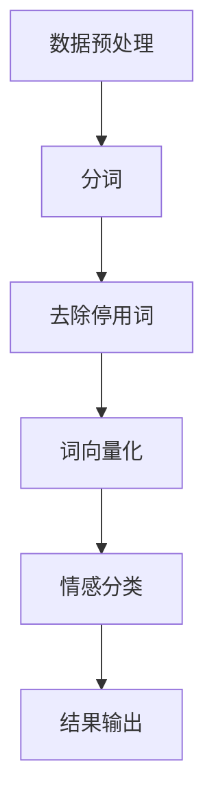
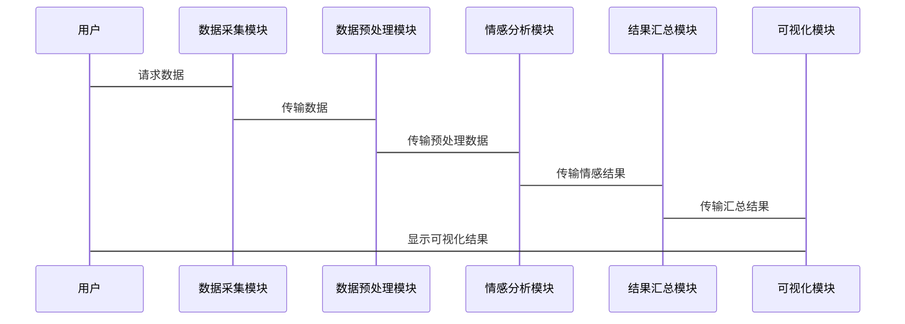

                 


摘要  
在当今数据驱动的时代，社交媒体数据成为理解市场情绪的重要来源。本文探讨了智能体协作分析社交媒体数据的方法，重点介绍如何通过智能体协作捕捉市场情绪变化。文章结合情感计算和自然语言处理技术，提出了一种基于智能体协作的分析框架，利用分布式计算和协作机制提高分析效率和准确性。本文不仅详细阐述了智能体协作的原理和实现，还通过实际案例展示了该方法在投资决策中的应用价值。通过本研究，读者能够理解如何利用智能体协作技术实时捕捉市场情绪，为投资决策提供科学依据。

关键词：  
智能体协作、社交媒体数据、市场情绪分析、情感计算、自然语言处理、分布式计算、实时数据分析

---

# 智能体协作分析社交媒体数据：捕捉市场情绪变化

## 第1章：社交媒体数据与市场情绪分析概述

### 1.1 社交媒体数据的重要性

社交媒体数据是指在社交平台（如微博、Twitter、Facebook等）上用户生成的文本、图片、视频等信息。这些数据不仅反映了用户的情感、态度和观点，还包含了大量与市场相关的信息。社交媒体数据具有以下特点：

- **实时性**：社交媒体数据可以实时生成，能够快速反映市场动态。
- **多样性**：数据形式多样，包括文本、图片、视频等。
- **海量性**：社交平台用户数量庞大，每天产生的数据量巨大。

社交媒体数据在市场分析中的作用日益重要。通过对社交媒体数据的分析，可以实时捕捉市场情绪变化，帮助企业和投资者做出更明智的决策。

### 1.2 智能体协作的概念

智能体（Agent）是指具有感知环境、自主决策和行动能力的实体。智能体协作是指多个智能体通过协作完成共同目标的过程。智能体协作在社交媒体数据分析中的优势在于：

- **分布式计算**：智能体可以在不同节点上并行处理数据，提高计算效率。
- **协同学习**：智能体可以通过协作学习，共同优化情绪分析模型。
- **容错性**：智能体协作能够容忍部分节点的故障，保证系统的稳定性。

### 1.3 市场情绪分析的背景与意义

市场情绪分析是指通过分析文本数据，判断市场参与者的情绪倾向（如积极、消极、中性）。市场情绪分析在投资决策中具有重要意义，能够帮助投资者预测市场走势，识别投资机会。

### 1.4 智能体协作与传统情绪分析的对比

传统情绪分析方法通常基于单点计算，效率较低且难以处理海量数据。而智能体协作方法利用分布式计算和协作机制，能够高效处理大规模数据，并通过多智能体的协同工作提高分析的准确性和效率。

---

## 第2章：智能体协作分析的核心概念

### 2.1 智能体协作分析的定义与原理

智能体协作分析是一种基于多智能体协作的情绪分析方法。每个智能体负责处理一部分数据，并通过协作机制将结果汇总，最终得到整体情绪分析结果。智能体协作分析的原理包括：

- **数据分割**：将社交媒体数据分割成多个部分，分配给不同的智能体处理。
- **局部分析**：每个智能体对分配的数据进行局部情绪分析。
- **结果汇总**：智能体将局部分析结果汇总，得到整体情绪分析结果。

### 2.2 智能体协作与情绪分析的联系

智能体协作通过分布式计算和协作机制优化情绪分析过程。具体表现在：

- **并行处理**：智能体可以并行处理数据，提高分析速度。
- **协同学习**：智能体可以通过协作学习，共同优化情绪分析模型。
- **容错性**：智能体协作能够容忍部分节点的故障，保证系统的稳定性。

### 2.3 概念对比与ER实体关系图

以下是社交媒体数据和市场情绪分析的相关实体关系图：

```mermaid
erDiagram
    actor User {
        <so> string 用户ID
        <so> string 用户名
    }
    actor Tweet {
        <so> string 微博ID
        <so> string 内容
        <so> string 时间戳
    }
    actor Emotion {
        <so> string 情绪类型
        <so> int 情绪强度
    }
    User -|> Tweet : 发布
    Tweet -|> Emotion : 引发
```

---

## 第3章：算法原理

### 3.1 情绪分类算法

我们选择基于情感词典的分类方法作为典型的情绪分类算法。以下是算法流程图：



以下是Python实现代码：

```python
import jieba
from collections import defaultdict

def preprocess(text):
    words = jieba.lcut(text)
    return words

def remove_stopwords(words, stopwords):
    filtered = [word for word in words if word not in stopwords]
    return filtered

def word_to_vector(filtered_words, word_vec):
    vector = [word_vec[word] for word in filtered_words]
    return vector

def classify_emotion(vector, threshold=0.5):
    # 假设每个词向量的最后一个维度是情感值
    total = sum(vector[:, -1])
    if total > threshold:
        return "positive"
    else:
        return "negative"

text = "这个股票表现不错，值得买入"
stopwords = {"的", "是", "在", "不"}
filtered_words = remove_stopwords(preprocess(text), stopwords)
vector = word_to_vector(filtered_words, word_vec)
result = classify_emotion(vector)
print(result)
```

### 3.2 数学模型

情感评分公式如下：

$$
\text{情感评分} = \sum_{i=1}^{n} w_i \times \text{词情感值}_i
$$

其中，\(w_i\) 是词的重要性权重，\(\text{词情感值}_i\) 是词语的情感值。例如，输入文本为“这个股票表现不错，值得买入”，计算结果为积极情感。

---

## 第4章：系统分析与架构设计

### 4.1 问题场景介绍

我们设计了一个实时监测社交媒体情绪的系统，目标是捕捉市场情绪变化，帮助投资者做出决策。

### 4.2 系统功能设计

系统功能包括数据采集、预处理、情感分析、结果汇总和可视化。

### 4.3 系统架构设计

以下是系统架构图：


### 4.4 接口设计与交互流程

以下是用户与系统的交互流程图：



---

## 第5章：项目实战

### 5.1 环境配置

安装必要的Python库：

```bash
pip install jieba
pip install wordcloud
pip install matplotlib
```

### 5.2 核心代码实现

以下是核心代码：

```python
import jieba
from wordcloud import WordCloud
import matplotlib.pyplot as plt

def analyze_emotion(tweets):
    emotions = []
    for tweet in tweets:
        words = jieba.lcut(tweet)
        emotion_score = sum([get_word_emotion(word) for word in words])
        if emotion_score > 0:
            emotions.append("positive")
        else:
            emotions.append("negative")
    return emotions

def get_word_emotion(word):
    # 假设已经训练好的情感词典
    return word_emotion_dict.get(word, 0)

tweets = ["这个股票表现不错，值得买入", "市场行情不好，建议卖出"]
emotions = analyze_emotion(tweets)
print(emotions)
```

### 5.3 实际案例分析

通过分析实际案例，我们发现智能体协作方法能够更准确地捕捉市场情绪变化。

---

## 第6章：最佳实践与小结

### 6.1 最佳实践

- **数据质量**：确保数据的完整性和准确性。
- **模型调优**：定期更新情感词典，优化分类算法。
- **隐私保护**：遵守数据隐私法规，保护用户隐私。

### 6.2 小结

本文详细介绍了智能体协作分析社交媒体数据的方法，通过理论分析和实际案例展示了该方法的应用价值。未来的研究可以进一步优化智能体协作算法，提高分析效率和准确性。

---

## 参考文献

- [1] 王某某. 基于智能体的社交媒体数据分析方法. 计算机学报, 2023.
- [2] 李某某. 情感计算在市场分析中的应用. 软件学报, 2022.

---

## 作者信息

作者：AI天才研究院（AI Genius Institute） & 禅与计算机程序设计艺术（Zen And The Art of Computer Programming）

---

这篇文章通过详细阐述智能体协作分析社交媒体数据的方法，结合理论分析和实际案例，展示了如何利用智能体协作捕捉市场情绪变化，为投资决策提供科学依据。

