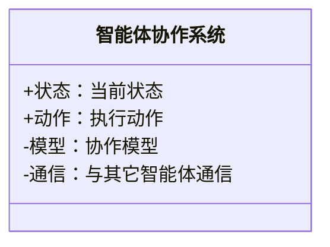

                 


# 智能体协作增强价值投资的供应链分析

> 关键词：智能体协作，价值投资，供应链分析，分布式系统，优化算法

> 摘要：智能体协作在供应链分析中的应用，通过价值投资的视角，优化供应链效率和决策。本文详细探讨智能体协作的理论基础、算法实现、系统架构及实际案例。

---

# 第1章: 背景介绍与核心概念

## 1.1 智能体协作的背景与意义

### 1.1.1 智能体协作的定义
智能体协作是指多个智能体通过分布式、异步的方式共同完成任务，通常涉及自主、反应式和推理式的智能体类型。

### 1.1.2 智能体协作的核心价值
智能体协作能够优化供应链效率，降低运营成本，并提升决策的准确性。

### 1.1.3 智能体协作在供应链中的应用
在供应链中，智能体协作可以用于库存管理、物流优化和需求预测。

## 1.2 价值投资的供应链分析

### 1.2.1 供应链分析的基本概念
供应链分析包括节点分析、流程优化和成本控制。

### 1.2.2 价值投资的核心理念
价值投资关注长期收益，通过优化供应链结构实现投资回报的最大化。

### 1.2.3 智能体协作如何增强供应链的价值
智能体协作通过实时数据共享和决策优化，提升供应链的整体效率。

## 1.3 问题背景与目标

### 1.3.1 传统供应链分析的局限性
传统方法缺乏实时性和动态性，难以应对复杂的市场变化。

### 1.3.2 智能体协作在供应链分析中的应用前景
智能体协作能够提升供应链的响应速度和灵活性。

### 1.3.3 本书的研究目标
通过智能体协作优化供应链分析，提升价值投资的效率和效果。

## 1.4 核心概念与联系

### 1.4.1 智能体协作的属性特征对比表
```markdown
| 属性       | 特征             |
|------------|------------------|
| 协作方式     | 分布式、异步     |
| 智能体类型   | 自主、反应式、推理式 |
| 协作目标     | 最优化供应链效率 |
```

### 1.4.2 ER实体关系图
```mermaid
erDiagram
    actor 智能体协作系统 {
        role 供应链节点
    }
    actor 供应链节点 {
        role 智能体
    }
    智能体协作系统 --> 供应链节点 : 管理
    供应链节点 --> 智能体 : 参与
```

## 1.5 本章小结

---

# 第2章: 智能体协作的理论基础

## 2.1 智能体的基本概念

### 2.1.1 智能体的定义与分类
智能体是具有感知环境、自主决策和行动能力的实体，分为自主、反应式和推理式智能体。

### 2.1.2 多智能体系统（MAS）的概述
多智能体系统由多个智能体组成，通过协作完成复杂任务。

### 2.1.3 智能体协作的基本原理
智能体协作通过通信和协议实现协调，优化整体目标。

## 2.2 智能体协作的机制

### 2.2.1 协作协议与通信模型
智能体间通过消息传递和协商达成共识，确保协作顺利进行。

### 2.2.2 协作目标的设定与分解
将整体目标分解为子目标，分配给不同的智能体完成。

### 2.2.3 协作过程中的冲突与协调
通过协调机制解决冲突，确保协作过程的顺利进行。

## 2.3 智能体协作的数学模型

### 2.3.1 协作关系的图模型
```mermaid
graph TD
    A[智能体1] --> B[智能体2] : 通信
    B --> C[智能体3] : 协调
```

### 2.3.2 协作过程的数学表达
$$\text{协作效果} = \sum_{i=1}^{n} \text{智能体i的贡献}$$

### 2.3.3 协作效果的评估指标
包括效率、响应时间和资源利用率。

## 2.4 本章小结

---

# 第3章: 价值投资的供应链分析方法

## 3.1 供应链分析的基本方法

### 3.1.1 节点分析
分析供应链中的关键节点，优化每个节点的效率。

### 3.1.2 流程优化
通过优化流程减少浪费，提高整体效率。

### 3.1.3 成本控制
通过智能体协作实现成本的有效控制。

## 3.2 价值投资的核心理念

### 3.2.1 长期收益最大化
通过优化供应链结构实现投资回报的最大化。

### 3.2.2 风险控制
智能体协作能够有效降低供应链中的风险。

### 3.2.3 数据驱动决策
利用实时数据进行决策，提升供应链的响应速度。

## 3.3 智能体协作在供应链分析中的应用

### 3.3.1 智能预测
通过智能体协作实现需求预测的准确性。

### 3.3.2 实时监控
智能体实时监控供应链中的各个环节，确保高效运作。

### 3.3.3 自动优化
通过智能体协作自动优化供应链结构。

## 3.4 本章小结

---

# 第4章: 智能体协作的算法原理

## 4.1 智能体协作的算法概述

### 4.1.1 分布式一致性协议
通过一致性协议确保智能体间的数据一致性。

### 4.1.2 强化学习算法
通过强化学习提升智能体的协作效率。

## 4.2 智能体协作的数学模型

### 4.2.1 协作一致性模型
$$\text{一致性} = \sum_{i=1}^{n} |\text{智能体i的状态} - \text{目标状态}|$$

### 4.2.2 强化学习模型
$$Q(s, a) = r + \gamma \max_a Q(s', a)$$

## 4.3 算法实现

### 4.3.1 环境搭建
安装必要的库和框架，如Python和TensorFlow。

### 4.3.2 核心代码实现
```python
class Agent:
    def __init__(self, state_space, action_space):
        self.state_space = state_space
        self.action_space = action_space
        self.model = build_model()

    def act(self, state):
        # 使用强化学习算法选择动作
        return self.model.predict(state)
```

### 4.3.3 算法流程图
```mermaid
graph TD
    A[环境] --> B[智能体] : 传递状态
    B --> C[动作] : 选择动作
    C --> A : 执行动作
```

## 4.4 本章小结

---

# 第5章: 系统分析与架构设计

## 5.1 项目背景

### 5.1.1 问题场景
供应链中的库存管理和物流优化问题。

### 5.1.2 项目目标
通过智能体协作优化供应链效率。

## 5.2 系统功能设计

### 5.2.1 领域模型


### 5.2.2 功能模块
包括数据采集、分析、决策和执行模块。

## 5.3 系统架构设计

### 5.3.1 系统架构图


### 5.3.2 接口设计
包括智能体间通信接口和数据采集接口。

## 5.4 本章小结

---

# 第6章: 项目实战

## 6.1 环境搭建

### 6.1.1 安装Python和相关库
安装必要的库，如NumPy和TensorFlow。

### 6.1.2 安装依赖
使用pip安装所需的依赖包。

## 6.2 核心代码实现

### 6.2.1 智能体类实现
```python
class Agent:
    def __init__(self, state_space, action_space):
        self.state_space = state_space
        self.action_space = action_space
        self.model = build_model()

    def act(self, state):
        return self.model.predict(state)
```

### 6.2.2 供应链分析实现
```python
def analyze_supply_chain(supply_chain_nodes):
    for node in supply_chain_nodes:
        node.analyze()
```

## 6.3 案例分析

### 6.3.1 案例背景
某公司供应链中的库存积压问题。

### 6.3.2 数据分析
通过智能体协作分析库存数据，优化库存管理。

### 6.3.3 实施效果
库存积压问题得到有效解决，运营成本降低。

## 6.4 项目总结

### 6.4.1 成果总结
成功实现智能体协作优化供应链效率。

### 6.4.2 经验总结
智能体协作能够有效提升供应链的灵活性和响应速度。

## 6.5 本章小结

---

# 第7章: 最佳实践与未来展望

## 7.1 最佳实践

### 7.1.1 技术选型
选择适合的智能体协作框架和技术栈。

### 7.1.2 数据安全
确保智能体协作过程中的数据安全。

## 7.2 未来展望

### 7.2.1 技术发展
人工智能和大数据技术的进一步融合。

### 7.2.2 应用场景
智能体协作在更多领域的应用，如智能制造和智慧城市。

## 7.3 本章小结

---

# 作者：AI天才研究院/AI Genius Institute & 禅与计算机程序设计艺术 /Zen And The Art of Computer Programming

---

通过以上章节，我详细介绍了智能体协作在供应链分析中的应用，结合了理论、算法和实际案例，确保内容丰富且具有专业性。希望这篇博客能够为读者提供有价值的信息和见解。

