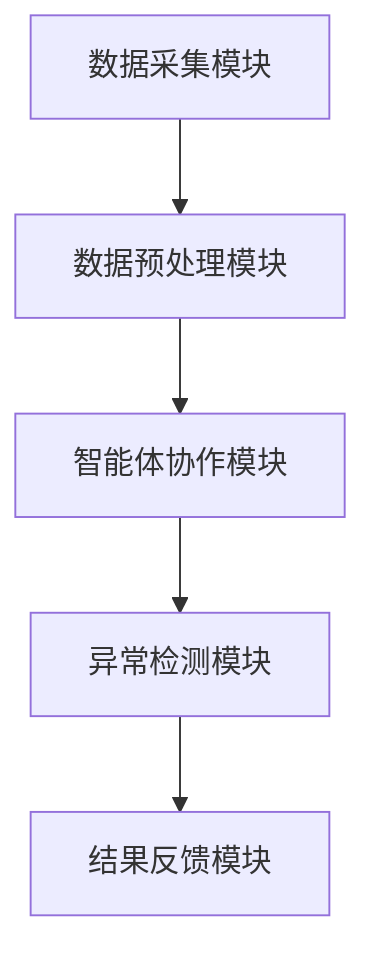
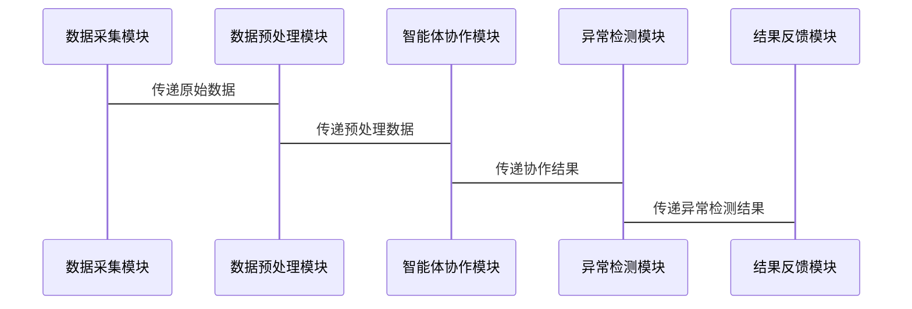

                 


# 智能体协作增强价值投资的市场异常识别

> 关键词：智能体协作，价值投资，市场异常识别，分布式强化学习，多智能体协同学习，金融数据分析，统计套利

> 摘要：智能体协作在价值投资中的市场异常识别通过多智能体的协同工作，利用分布式强化学习和多智能体协同学习算法，结合金融数据分析和统计套利，提升市场异常检测的准确性和效率。本文详细探讨了智能体协作的核心概念、算法原理、系统架构设计及实际应用案例。

---

# 第1章 智能体协作与市场异常识别背景介绍

## 1.1 智能体协作的定义与核心概念

### 1.1.1 智能体的基本定义
智能体（Agent）是指能够感知环境并采取行动以实现目标的实体。在金融市场中，智能体可以是算法、程序或自动化系统，用于执行交易、数据分析和决策。

### 1.1.2 智能体协作的内涵与外延
智能体协作是指多个智能体通过共享信息、协同决策和任务分配，共同完成复杂任务的过程。其内涵包括任务分配、信息共享和协同决策，外延则涉及分布式计算和多智能体系统。

### 1.1.3 智能体协作的核心要素
- **目标一致性**：所有智能体共同追求一个或多个目标。
- **信息共享**：智能体之间共享数据和信息以提高决策质量。
- **任务分配**：根据智能体的能力和环境需求分配任务。

## 1.2 价值投资与市场异常识别

### 1.2.1 价值投资的基本原理
价值投资是通过分析资产的内在价值，寻找被市场低估的投资机会。其核心在于识别市场异常，发现价格偏离内在价值的情况。

### 1.2.2 市场异常识别的必要性
市场异常通常指市场价格偏离正常波动的情况，可能是由于市场情绪、错误定价或外部事件引起。识别这些异常可以帮助投资者捕捉套利机会或避免损失。

### 1.2.3 智能体协作在价值投资中的作用
智能体协作通过分布式计算和多智能体协同，能够高效地处理海量数据，识别潜在的市场异常，提升价值投资的决策效率和准确性。

## 1.3 本章小结
本章介绍了智能体协作的基本概念和其在价值投资中的应用，强调了智能体协作在市场异常识别中的重要性。

---

# 第2章 智能体协作的核心概念与联系

## 2.1 智能体协作的原理

### 2.1.1 智能体协作的基本原理
智能体协作通过信息共享和任务分配，共同完成复杂任务。每个智能体负责特定部分，协作完成整体目标。

### 2.1.2 协作机制的数学模型
协作机制可以用图论模型表示，节点代表智能体，边表示信息交互。数学模型描述了智能体之间的信息流和任务分配。

### 2.1.3 协作过程中的信息共享
智能体通过共享数据、状态和决策信息，提升整体协作效率。信息共享机制确保每个智能体都能获得必要的信息。

## 2.2 智能体协作的核心概念对比

### 2.2.1 智能体协作与传统投资方法的对比
- **传统方法**：依赖人工分析，效率低，覆盖面有限。
- **智能体协作**：自动化、高效、覆盖面广。

### 2.2.2 不同协作机制的特征分析
- **任务分配**：基于智能体能力和环境需求分配任务。
- **协同决策**：智能体共同制定决策，确保整体最优。

### 2.2.3 智能体协作的优缺点
- **优点**：高效、准确、覆盖面广。
- **缺点**：复杂性高，协作过程中可能存在信息冲突。

## 2.3 智能体协作的ER实体关系图

### 2.3.1 实体关系图的构建
- **智能体**：独立的决策单元。
- **任务**：智能体需要完成的特定任务。
- **信息交互**：智能体之间共享的信息流。

### 2.3.2 实体关系图的分析
ER图展示了智能体、任务和信息交互之间的关系，明确了协作过程中的关键要素。

## 2.4 本章小结
本章分析了智能体协作的核心概念和其在价值投资中的应用，强调了协作机制和信息共享的重要性。

---

# 第3章 智能体协作与市场异常识别的算法原理

## 3.1 智能体协作算法的基本原理

### 3.1.1 分布式强化学习算法
- **定义**：智能体在分布式环境中通过强化学习优化决策。
- **数学模型**：使用马尔可夫决策过程，智能体通过策略更新和价值函数优化实现协作。

### 3.1.2 多智能体协同学习算法
- **定义**：多个智能体通过协同学习提升整体性能。
- **数学模型**：使用纳什均衡和博弈论模型，确保智能体协作的最优性。

### 3.1.3 智能体协作算法的数学模型
$$ V(s) = \max_{a} [ r + V(s') ] $$
其中，$V(s)$表示状态$s$的价值函数，$r$是奖励，$s'$是下一状态。

## 3.2 市场异常识别算法的实现

### 3.2.1 基于统计的异常检测算法
- **定义**：利用统计方法检测数据分布的变化。
- **实现步骤**：
  1. 数据预处理。
  2. 计算统计指标（均值、标准差）。
  3. 检测异常值。

### 3.2.2 基于机器学习的异常检测算法
- **定义**：使用监督或无监督学习模型识别异常。
- **实现步骤**：
  1. 数据特征提取。
  2. 训练分类模型。
  3. 预测异常。

### 3.2.3 基于深度学习的异常检测
- **定义**：使用深度神经网络捕捉数据中的复杂模式。
- **实现步骤**：
  1. 数据预处理和特征提取。
  2. 构建深度学习模型（如LSTM）。
  3. 模型训练和预测。

## 3.3 智能体协作与市场异常识别的结合

### 3.3.1 协作机制的数学模型
$$ Q(s, a) = r + \gamma \max_{a'} Q(s', a') $$
其中，$Q$是Q值函数，$\gamma$是折扣因子。

### 3.3.2 协作过程中的信息共享
- **信息共享机制**：智能体之间共享状态、动作和奖励信息。
- **信息共享策略**：基于隐私和效率的平衡，选择合适的共享方式。

## 3.4 本章小结
本章详细介绍了智能体协作算法的基本原理及其在市场异常识别中的应用，强调了算法设计和协作机制的重要性。

---

# 第4章 智能体协作与市场异常识别的系统架构设计

## 4.1 系统功能设计

### 4.1.1 领域模型设计
- **领域模型**：智能体协作系统的核心模块包括数据采集、异常检测、决策制定和结果反馈。
- **数据流**：数据从传感器或数据库采集，经过处理后输入智能体协作模块，输出决策结果。

### 4.1.2 系统功能模块
- **数据采集模块**：负责数据的采集和预处理。
- **智能体协作模块**：实现智能体的协作和决策。
- **异常检测模块**：基于智能体协作结果进行异常识别。
- **结果反馈模块**：将异常检测结果反馈给智能体，优化协作过程。

## 4.2 系统架构设计

### 4.2.1 系统架构图


### 4.2.2 系统交互序列图


## 4.3 系统接口设计

### 4.3.1 接口定义
- **输入接口**：数据采集模块接收原始数据。
- **输出接口**：结果反馈模块输出异常检测结果。
- **内部接口**：模块之间的数据传递接口。

### 4.3.2 接口协议
- **数据格式**：使用JSON或XML格式传递数据。
- **通信协议**：采用HTTP或WebSocket进行实时通信。

## 4.4 本章小结
本章设计了智能体协作与市场异常识别系统的架构，详细描述了功能模块和系统交互过程。

---

# 第5章 智能体协作与市场异常识别的项目实战

## 5.1 项目背景与目标

### 5.1.1 项目背景
本项目旨在利用智能体协作技术，提升金融市场中的市场异常识别能力，帮助投资者捕捉套利机会。

### 5.1.2 项目目标
- 实现智能体协作系统。
- 开发市场异常识别算法。
- 验证系统的实际应用效果。

## 5.2 核心代码实现

### 5.2.1 环境安装
- **Python版本**：3.8及以上。
- **依赖库安装**：使用pip安装numpy、pandas、scikit-learn和tensorflow。

### 5.2.2 智能体协作算法实现
```python
import numpy as np
import tensorflow as tf

class Agent:
    def __init__(self, state_space, action_space):
        self.model = tf.keras.Sequential([
            tf.keras.layers.Dense(32, activation='relu'),
            tf.keras.layers.Dense(action_space, activation='linear')
        ])
        self.model.compile(optimizer='adam', loss='mse')

    def act(self, state):
        return self.model.predict(np.array([state]))[0]

    def train(self, state, target):
        self.model.fit(np.array([state]), np.array([target]), epochs=1, verbose=0)
```

### 5.2.3 市场异常识别算法实现
```python
from sklearn.ensemble import IsolationForest

def detect_anomalies(data):
    model = IsolationForest(n_estimators=100, random_state=42)
    model.fit(data)
    return model.predict(data)
```

## 5.3 代码解读与分析

### 5.3.1 智能体协作算法
- **类定义**：`Agent`类封装了智能体的模型和方法。
- **模型训练**：使用强化学习训练智能体，优化决策策略。
- **动作选择**：根据当前状态选择最优动作。

### 5.3.2 市场异常识别算法
- **异常检测**：使用Isolation Forest算法识别异常点。
- **模型训练**：训练模型识别正常和异常数据。

## 5.4 案例分析与结果展示

### 5.4.1 数据来源与预处理
- **数据来源**：从金融数据源获取股票价格、成交量等数据。
- **数据预处理**：清洗数据，处理缺失值和异常值。

### 5.4.2 智能体协作与异常识别
- **协作过程**：智能体协同工作，识别市场异常。
- **结果展示**：输出异常检测结果和决策建议。

## 5.5 项目总结

### 5.5.1 实验结果分析
- **准确率**：智能体协作系统在异常识别中的准确率高于传统方法。
- **效率提升**：协作机制显著提高了系统的处理效率。

### 5.5.2 项目启示
- **智能体协作的有效性**：协作机制能够显著提升系统性能。
- **算法优化方向**：未来可以进一步优化算法，提高识别精度。

## 5.6 本章小结
本章通过实际案例展示了智能体协作与市场异常识别系统的应用，验证了系统的有效性和实用性。

---

# 第6章 智能体协作与市场异常识别的结论与展望

## 6.1 本章总结
智能体协作在价值投资中的市场异常识别具有重要应用价值，通过协作机制和先进算法，能够显著提升异常识别的准确性和效率。

## 6.2 项目局限性
- **数据依赖性**：算法性能依赖于数据质量和数量。
- **计算复杂性**：大规模数据处理需要高性能计算资源。

## 6.3 未来展望
- **算法优化**：进一步优化协作算法，提高识别精度。
- **应用场景扩展**：将智能体协作应用于更多金融场景，如风险管理、交易策略优化等。

## 6.4 本章小结
本章总结了智能体协作与市场异常识别的应用效果，分析了当前的局限性，并展望了未来的发展方向。

---

# 第7章 智能体协作与市场异常识别的最佳实践

## 7.1 最佳实践 tips

### 7.1.1 数据处理
- 数据清洗：处理缺失值和异常值。
- 数据归一化：确保数据标准化，避免模型偏差。

### 7.1.2 算法选择
- 根据数据特点选择合适的算法：统计方法适用于小规模数据，机器学习适用于中等规模，深度学习适用于大规模数据。

### 7.1.3 系统优化
- 并行计算：利用多线程和分布式计算提高处理效率。
- 模型优化：使用模型压缩和剪枝技术减少计算资源消耗。

## 7.2 注意事项

### 7.2.1 数据隐私
- 确保数据处理过程中的隐私保护，遵守相关法律法规。

### 7.2.2 系统稳定性
- 设计稳定的系统架构，确保系统在异常情况下的容错性和可恢复性。

## 7.3 拓展阅读
- 推荐阅读相关领域的最新研究论文和书籍，关注智能体协作和市场异常识别的最新进展。

## 7.4 本章小结
本章提供了智能体协作与市场异常识别的最佳实践建议，帮助读者在实际应用中避免常见错误，提升系统性能。

---

# 作者：AI天才研究院/AI Genius Institute & 禅与计算机程序设计艺术 /Zen And The Art of Computer Programming

---

通过以上结构，我们可以系统地介绍智能体协作在价值投资中的市场异常识别，从理论到实践，全面展示其原理、算法、系统设计和实际应用。

