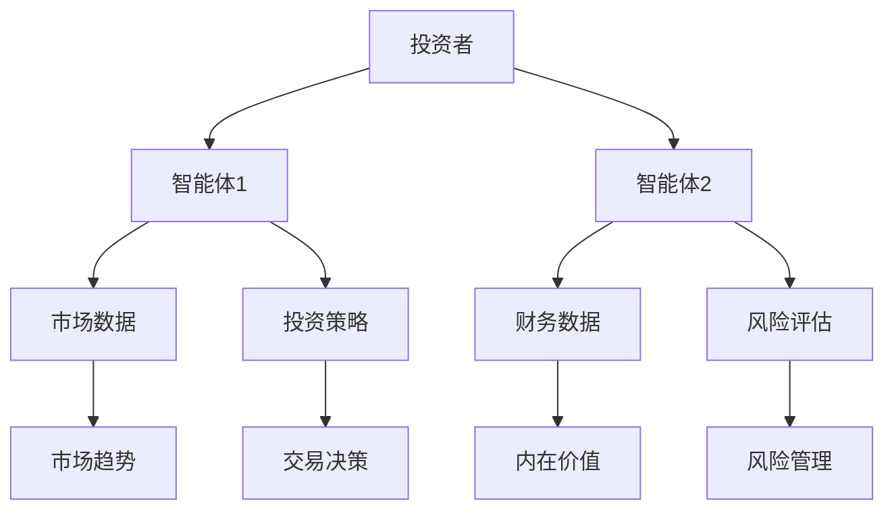
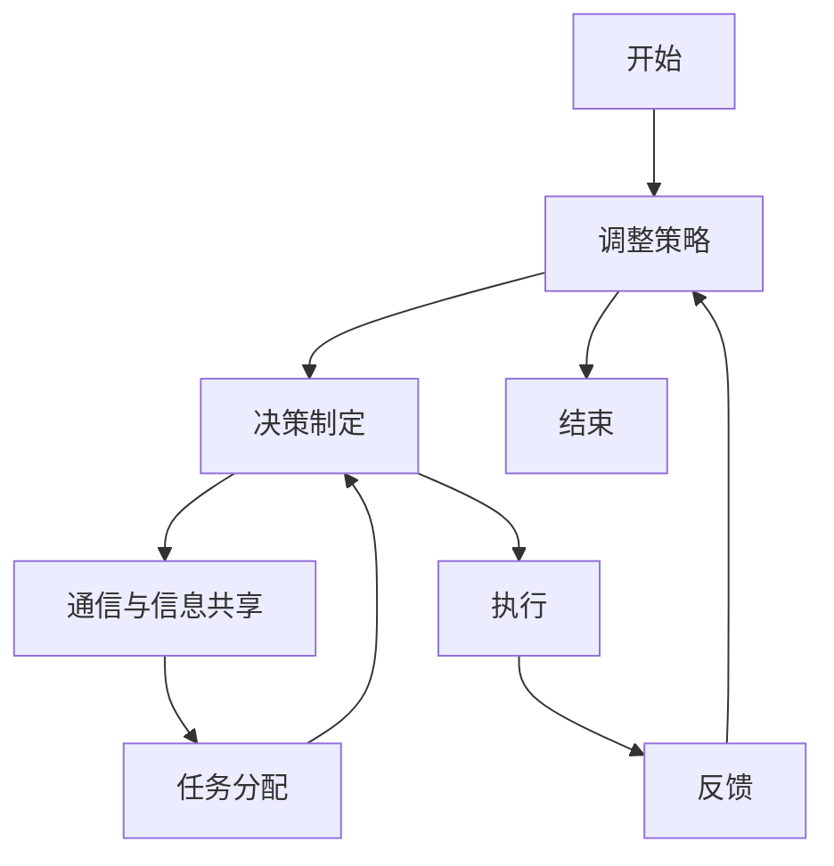
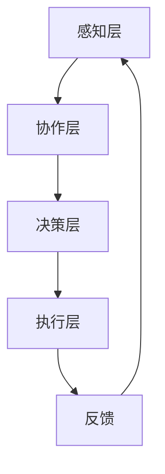

                 


# 智能体协作增强价值投资的行业趋势预测

## 关键词：
智能体协作、价值投资、行业趋势、预测模型、人工智能、分布式系统

## 摘要：
智能体协作是一种通过多个智能体协同工作来提升决策能力的新兴技术，其在价值投资和行业趋势预测中的应用前景广阔。本文将从智能体协作的基本概念出发，结合价值投资的核心要素，深入探讨智能体协作如何增强行业趋势预测的准确性。通过构建数学模型和算法原理，本文详细分析了智能体协作在价值投资中的具体应用场景，并通过实际案例展示了智能体协作系统的实现过程和优化策略。最后，本文总结了智能体协作在价值投资中的优势，并展望了未来的发展方向。

---

## 第1章 智能体协作的定义与背景

### 1.1 智能体协作的定义与特点
智能体（Agent）是指能够感知环境、自主决策并执行任务的实体。智能体协作是指多个智能体通过信息共享和协同决策来实现共同目标的过程。其特点包括：

- **自主性**：每个智能体都能独立感知环境并做出决策。
- **协作性**：智能体之间通过信息共享和任务分配实现协同。
- **分布式性**：协作过程通常发生在分布式系统中，各智能体独立运行但通过通信机制进行交互。
- **适应性**：智能体能够根据环境变化动态调整协作策略。

### 1.2 价值投资的核心要素
价值投资是一种基于对公司内在价值评估的投资策略，其核心要素包括：

- **基本面分析**：通过对公司财务数据、行业地位等进行分析，评估其内在价值。
- **市场情绪**：投资者情绪和市场波动对资产价格的影响。
- **行业趋势**：行业的发展趋势和政策变化对投资决策的影响。

### 1.3 行业趋势预测的背景与意义
行业趋势预测是通过对市场数据和行业动态的分析，预测未来行业发展方向和变化趋势。其意义在于帮助投资者做出更科学的投资决策，降低投资风险。然而，行业趋势预测面临以下挑战：

- 数据复杂性：行业数据涉及多个维度，且具有高度动态性。
- 模型局限性：传统模型难以捕捉复杂的市场动态。
- 信息滞后性：市场数据的滞后性可能影响预测的准确性。

智能体协作通过分布式计算和协同决策，能够有效解决这些挑战，提升行业趋势预测的准确性和实时性。

---

## 第2章 智能体协作的核心概念与联系

### 2.1 智能体协作的核心原理
智能体协作的核心原理包括以下步骤：

1. **感知环境**：智能体通过传感器或数据源获取环境信息。
2. **信息共享**：智能体之间通过通信机制共享信息。
3. **任务分配**：根据任务需求和智能体能力，动态分配任务。
4. **协同决策**：基于共享信息，智能体共同制定决策方案。
5. **执行与反馈**：智能体执行决策并根据反馈调整协作策略。

### 2.2 智能体协作与价值投资的关联
价值投资的核心在于发现市场价格与内在价值的偏离，而智能体协作能够通过以下方式增强价值投资的效果：

- **多维度数据分析**：智能体协作能够整合市场数据、财务数据、行业动态等多维度信息，提供更全面的投资分析。
- **动态调整策略**：智能体通过实时数据共享和协同决策，能够快速调整投资策略，应对市场变化。
- **风险分散**：通过智能体的分布式协作，可以分散投资风险，避免单一决策的错误。

### 2.3 智能体协作的实体关系图
以下是智能体协作在价值投资中的实体关系图：



---

## 第3章 智能体协作的数学模型与算法原理

### 3.1 智能体协作的数学模型
智能体协作的数学模型通常包括以下组成部分：

- **状态表示**：用变量表示智能体的感知状态。
- **动作选择**：基于状态选择最优动作。
- **奖励函数**：衡量智能体协作的效果。

以下是一个简单的智能体协作模型：

$$
V(s) = \max_{a} \left( r(s, a) + \gamma V(s', a') \right)
$$

其中：
- $s$ 表示当前状态。
- $a$ 表示动作。
- $r(s, a)$ 表示执行动作 $a$ 后获得的奖励。
- $\gamma$ 表示折扣因子。
- $s'$ 表示下一个状态。
- $a'$ 表示下一个动作。

### 3.2 智能体协作的算法实现
以下是基于分布式智能体协作的算法实现流程：



以下是一个简单的Python实现示例：

```python
class Agent:
    def __init__(self, id):
        self.id = id
        self.state = None
        self.reward = 0

    def感知环境(self, environment):
        self.state = environment.get_state()

    def 选择动作(self):
        # 简单策略：基于当前状态选择动作
        if self.state == '上升':
            return '买入'
        elif self.state == '下降':
            return '卖出'
        else:
            return '持有'

# 初始化多个智能体
agents = [Agent(i) for i in range(5)]

# 通信与协作
for agent in agents:
    for other in agents:
        if other.id != agent.id:
            agent.state = agent.state + ',' + other.state

# 任务分配与决策
for agent in agents:
    action = agent.选择动作()
    print(f"智能体 {agent.id} 的决策：{action}")
```

---

## 第4章 智能体协作的系统架构与实现

### 4.1 系统架构设计
智能体协作系统的架构通常包括以下部分：

- **感知层**：负责数据采集和环境感知。
- **协作层**：负责智能体之间的通信与协作。
- **决策层**：负责任务分配和决策制定。
- **执行层**：负责执行决策并反馈结果。

以下是一个智能体协作系统的架构图：



### 4.2 系统实现与优化
以下是系统实现的关键步骤：

1. **环境感知**：通过数据接口获取市场数据和财务数据。
2. **通信与协作**：通过消息队列或数据库实现智能体之间的信息共享。
3. **任务分配**：根据智能体的能力和当前状态分配任务。
4. **决策制定**：基于共享信息制定投资策略。
5. **执行与反馈**：执行交易并根据反馈调整协作策略。

优化策略包括：
- 增强智能体的自主学习能力。
- 提高通信效率和数据处理能力。
- 引入自适应算法以应对动态变化。

---

## 第5章 项目实战与案例分析

### 5.1 项目背景与目标
项目目标是通过智能体协作技术提升价值投资的预测能力。项目背景包括：

- **数据来源**：股票市场数据、财务报表数据、行业报告等。
- **技术需求**：构建智能体协作系统，实现多维度数据分析和协同决策。
- **应用场景**：股票投资、风险管理、行业趋势预测等。

### 5.2 核心代码实现
以下是项目的核心代码示例：

```python
import pandas as pd
import numpy as np

class MarketData:
    def get_state(self):
        # 获取市场数据
        data = pd.read_csv('market_data.csv')
        return data['price'].iloc[-1]

class Agent:
    def __init__(self, id):
        self.id = id
        self.data = None

    def 感知环境(self, market_data):
        self.data = market_data.get_state()

    def 选择动作(self):
        if self.data > 100:
            return '卖出'
        elif self.data < 80:
            return '买入'
        else:
            return '持有'

# 初始化智能体
agents = [Agent(i) for i in range(3)]

# 通信与协作
for i in range(len(agents)):
    for j in range(len(agents)):
        if i != j:
            agents[i].data = agents[j].data

# 执行交易
for agent in agents:
    action = agent.选择动作()
    print(f"智能体 {agent.id} 的决策：{action}")
```

### 5.3 实际案例分析
以股票市场为例，智能体协作能够通过以下方式提升价值投资的预测能力：

- **多维度分析**：智能体协作能够整合市场数据、财务数据和行业趋势，提供更全面的投资分析。
- **动态调整策略**：智能体通过实时数据共享和协同决策，能够快速调整投资策略，应对市场变化。
- **风险分散**：通过智能体的分布式协作，可以分散投资风险，避免单一决策的错误。

---

## 第6章 总结与展望

### 6.1 总结
智能体协作是一种能够显著提升价值投资和行业趋势预测能力的技术。通过多智能体协作，投资者能够更全面地分析市场数据，制定更科学的投资策略。智能体协作的优势包括：

- **分布式计算**：能够处理复杂数据和任务。
- **协同决策**：通过信息共享提升决策的准确性。
- **动态调整**：能够快速应对市场变化。

### 6.2 展望
未来，智能体协作在价值投资和行业趋势预测中的应用前景广阔。以下是一些可能的发展方向：

- **增强学习**：通过增强学习算法提升智能体的自主学习能力。
- **边缘计算**：利用边缘计算技术提升数据处理效率。
- **区块链技术**：通过区块链技术实现智能体协作的安全性和透明性。

---

## 作者：AI天才研究院 & 禅与计算机程序设计艺术

---

以上是《智能体协作增强价值投资的行业趋势预测》的技术博客的详细内容。

