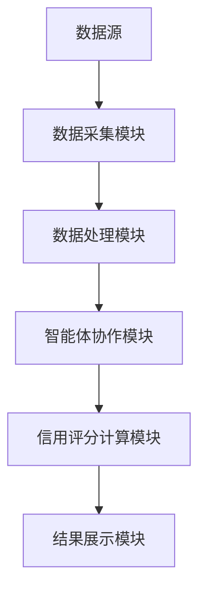
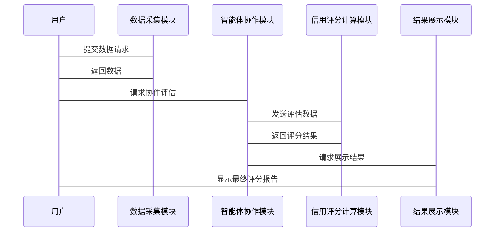

                 

# 智能体协作实现全面的公司信用评级

## 关键词：智能体协作、信用评级、多智能体系统、算法原理、系统架构

## 摘要：
智能体协作在现代信用评级体系中扮演着越来越重要的角色。通过多智能体的协同工作，能够更高效、更准确地评估公司的信用状况。本文从智能体协作的基本概念出发，详细探讨其在信用评级中的应用原理、算法实现、系统架构设计以及实际案例分析，帮助读者全面理解智能体协作如何实现全面的公司信用评级。

---

# 目录

## 第1章: 智能体协作与信用评级的背景介绍

### 1.1 智能体协作的基本概念
#### 1.1.1 什么是智能体协作
- 智能体的定义
- 智能体协作的核心特征
- 智能体协作的优势

#### 1.1.2 智能体协作的核心要素
- 智能体的独立性与协作性
- 通信机制与决策机制
- 协作目标与利益均衡

#### 1.1.3 智能体协作在信用评级中的作用
- 提高信用评级的准确性
- 优化信用评级的效率
- 降低信用评级的成本

### 1.2 公司信用评级的定义与重要性
#### 1.2.1 信用评级的定义
- 信用评级的内涵
- 信用评级的对象与范围
- 信用评级的分类

#### 1.2.2 信用评级的重要性
- 信用评级在金融领域的地位
- 信用评级对企业的意义
- 信用评级对投资者的价值

#### 1.2.3 信用评级的基本标准与流程
- 信用评级的五个核心要素
- 信用评级的分类标准
- 信用评级的实施流程

### 1.3 智能体协作实现信用评级的背景与趋势
#### 1.3.1 传统信用评级的局限性
- 传统信用评级的主观性问题
- 数据不足与信息孤岛
- 人工评估的效率低下

#### 1.3.2 智能技术在信用评级中的应用趋势
- 人工智能与大数据技术的兴起
- 智能体协作在信用评级中的潜力
- 区块链技术的应用前景

#### 1.3.3 智能体协作的优势与挑战
- 智能体协作的核心优势
- 智能体协作面临的挑战
- 智能体协作的未来发展

---

## 第2章: 智能体协作的核心概念与联系

### 2.1 智能体协作的原理与机制
#### 2.1.1 多智能体系统的基本原理
- 多智能体系统的定义
- 多智能体系统的分类
- 多智能体系统的协作机制

#### 2.1.2 智能体协作的通信机制
- 智能体之间的通信方式
- 信息传递的标准化与安全性
- 智能体通信的协议设计

#### 2.1.3 智能体协作的决策机制
- 分布式决策与集中式决策的对比
- 协作决策的共识算法
- 智能体协作的动态调整机制

### 2.2 信用评级的核心要素与模型
#### 2.2.1 信用评级的五大核心要素
- 企业信用评级的核心维度
- 信用评级的关键指标
- 信用评级的权重分配

#### 2.2.2 信用评分模型的构建
- 信用评分模型的类型
- 信用评分模型的构建步骤
- 信用评分模型的优化方法

#### 2.2.3 信用评级的分类标准
- 信用评级的五级分类法
- 信用评级的行业标准
- 信用评级的动态调整

### 2.3 智能体协作与信用评级的结合
#### 2.3.1 智能体协作如何提升信用评级的准确性
- 多源数据的融合与分析
- 智能体协作的多维度评估
- 智能体协作的动态更新机制

#### 2.3.2 智能体协作如何优化信用评级的效率
- 并行计算与分布式处理
- 智能体协作的自动化流程
- 智能体协作的实时响应

#### 2.3.3 智能体协作如何降低信用评级的成本
- 资源共享与成本分摊
- 智能体协作的自动化优势
- 智能体协作的长期经济效益

---

## 第3章: 智能体协作实现信用评级的算法原理

### 3.1 多智能体协作算法概述
#### 3.1.1 分布式计算与智能体协作
- 分布式计算的基本原理
- 分布式计算在智能体协作中的应用
- 分布式计算的优势与挑战

#### 3.1.2 共识算法在智能体协作中的应用
- 共识算法的定义与分类
- 共识算法在智能体协作中的作用
- 常见共识算法的比较与选择

#### 3.1.3 智能体协作的优化算法
- 智能体协作的优化目标
- 智能体协作的优化策略
- 智能体协作的性能提升方法

### 3.2 信用评级算法的数学模型
#### 3.2.1 信用评分的线性回归模型
- 线性回归模型的建立
- 线性回归模型的参数优化
- 线性回归模型的应用与局限

#### 3.2.2 信用评分的决策树模型
- 决策树模型的基本原理
- 决策树模型的构建与优化
- 决策树模型的适用场景

#### 3.2.3 信用评分的神经网络模型
- 神经网络模型的基本结构
- 神经网络模型的训练与优化
- 神经网络模型的信用评分应用

### 3.3 智能体协作算法的实现步骤
#### 3.3.1 数据预处理与特征提取
- 数据清洗与标准化
- 特征选择与降维
- 数据分组与标签化

#### 3.3.2 智能体协作网络的构建
- 智能体的分配与角色划分
- 智能体之间的通信与协作
- 智能体协作网络的拓扑结构

#### 3.3.3 算法训练与模型优化
- 算法的训练流程
- 模型的验证与评估
- 模型的优化与迭代

---

## 第4章: 智能体协作与信用评级的系统分析与架构设计

### 4.1 系统需求分析
#### 4.1.1 信用评级系统的功能需求
- 数据采集与处理功能
- 智能体协作功能
- 信用评分计算功能
- 结果展示与报告生成

#### 4.1.2 智能体协作系统的性能需求
- 处理能力与响应时间
- 数据存储与安全性
- 系统的可扩展性与可维护性

#### 4.1.3 系统的边界与接口
- 系统的输入与输出
- 系统与外部系统的接口
- 系统的用户权限管理

### 4.2 系统架构设计
#### 4.2.1 系统功能模块设计
- 数据采集模块
- 智能体协作模块
- 信用评分计算模块
- 结果展示模块

#### 4.2.2 系统架构图（Mermaid）

#### 4.2.3 系统交互流程图（Mermaid）

### 4.3 系统接口设计
#### 4.3.1 数据接口设计
- 数据接口的定义与标准
- 数据接口的安全性与可靠性
- 数据接口的兼容性与扩展性

#### 4.3.2 系统接口的交互协议
- HTTP协议的应用
- RESTful API的设计
- WebSocket的实时通信

### 4.4 本章小结

---

## 第5章: 智能体协作实现信用评级的项目实战

### 5.1 环境安装与配置
#### 5.1.1 开发环境的选择
- Python编程环境的安装与配置
- 开发工具的安装与配置
- 数据库的安装与配置

#### 5.1.2 依赖库的安装
- Python库的安装（如：pandas, numpy, scikit-learn）
- 区块链开发框架的选择（如：Solidity）
- 智能体协作框架的选择（如：Multi-Agent Framework）

### 5.2 核心代码实现
#### 5.2.1 数据预处理与特征提取
- 数据清洗的代码实现
- 特征选择的代码实现
- 数据分组的代码实现

#### 5.2.2 智能体协作网络的构建
- 智能体的分配与角色划分
- 智能体之间的通信机制
- 智能体协作网络的拓扑结构

#### 5.2.3 算法训练与模型优化
- 算法的训练流程
- 模型的验证与评估
- 模型的优化与迭代

### 5.3 项目实战案例分析
#### 5.3.1 数据来源与数据集介绍
- 数据来源的说明
- 数据集的结构与特点
- 数据集的预处理步骤

#### 5.3.2 信用评分模型的训练与评估
- 模型训练的具体步骤
- 模型评估的指标与结果
- 模型优化的具体方法

#### 5.3.3 智能体协作的实际应用
- 智能体协作在信用评分中的具体应用
- 智能体协作的优势与效果
- 智能体协作的实际案例分析

### 5.4 本章小结

---

## 第6章: 总结与展望

### 6.1 总结
- 智能体协作在信用评级中的核心作用
- 智能体协作的优势与局限
- 本文的主要内容与结论

### 6.2 最佳实践与注意事项
- 智能体协作的实际应用建议
- 系统设计中的注意事项
- 项目实施中的常见问题与解决方案

### 6.3 未来展望
- 智能体协作的未来发展趋势
- 新技术对智能体协作的影响
- 智能体协作在信用评级中的进一步应用

---

## 附录: 参考文献与拓展阅读

### 附录A: 参考文献
- 国内外相关文献的引用
- 相关技术标准的参考
- 相关学术论文的引用

### 附录B: 拓展阅读
- 智能体协作的其他应用场景
- 信用评级的其他技术方法
- 相关技术的发展趋势

---

## 作者：AI天才研究院/AI Genius Institute & 禅与计算机程序设计艺术 /Zen And The Art of Computer Programming

