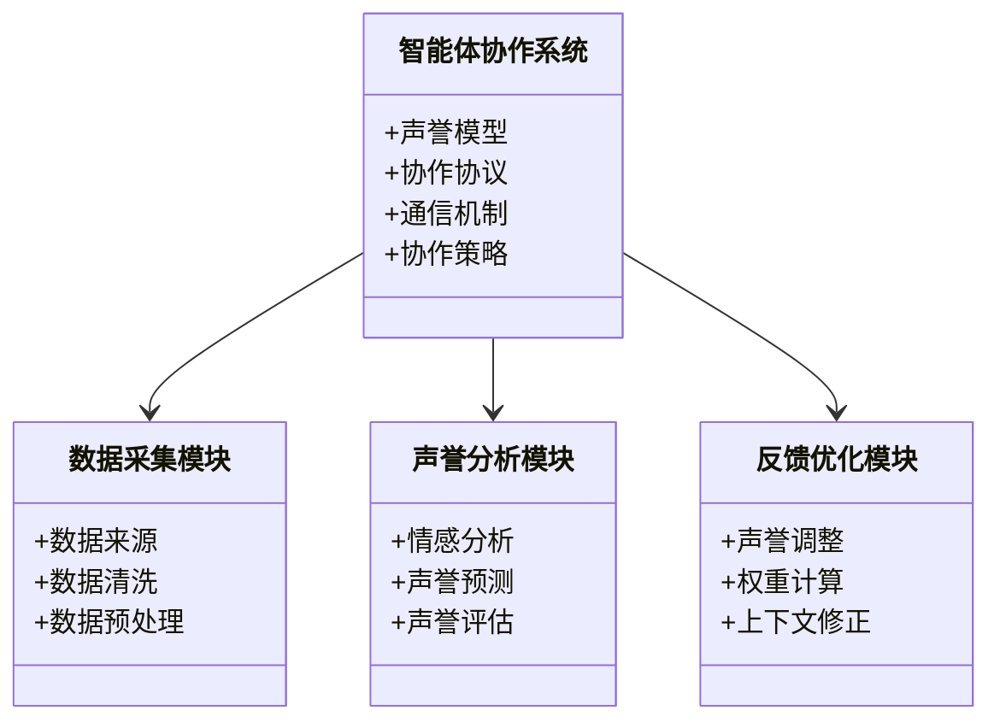
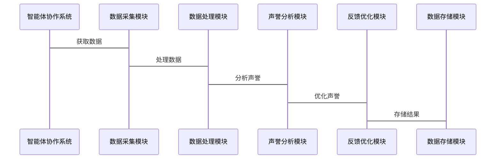

                 


# 智能体协作实现全面的公司声誉分析

> 关键词：智能体协作、公司声誉、多智能体系统、声誉模型、算法原理

> 摘要：本文探讨了智能体协作在公司声誉分析中的应用，从核心概念、算法原理到系统架构，再到项目实战，详细阐述了如何通过智能体协作实现对公司声誉的全面分析。

---

## 第一部分：智能体协作与公司声誉分析概述

### 第1章：智能体协作与公司声誉分析概述

#### 1.1 智能体协作的基本概念

##### 1.1.1 智能体的定义与特点
智能体（Agent）是指能够感知环境并采取行动以实现目标的实体。智能体具有以下特点：
- **自主性**：能够自主决策。
- **反应性**：能够根据环境变化调整行为。
- **社会性**：能够与其他智能体或人类进行交互协作。

##### 1.1.2 智能体协作的定义
智能体协作是指多个智能体通过共享信息、分配任务和协调行动，共同完成复杂目标的过程。协作的核心在于智能体之间的通信与协调。

##### 1.1.3 智能体协作的重要性
在现代商业环境中，智能体协作能够提高决策的准确性和效率，尤其是在需要实时数据处理和多团队协作的场景中。

#### 1.2 公司声誉分析的背景与意义

##### 1.2.1 公司声誉的定义
公司声誉是公众对公司在市场中的信任度和形象的综合评价，通常包括产品、服务、管理等方面的表现。

##### 1.2.2 公司声誉分析的必要性
随着市场竞争的加剧，公司声誉直接影响客户信任和市场地位。通过智能体协作进行声誉分析，可以帮助企业及时发现和解决问题，提升品牌形象。

##### 1.2.3 智能体协作在声誉分析中的作用
智能体协作能够实时收集、处理和分析海量数据，提供精准的声誉评估，为决策者提供数据支持。

#### 1.3 本章小结
本章介绍了智能体协作的基本概念及其在公司声誉分析中的重要性，为后续内容奠定了基础。

---

## 第二部分：智能体协作的核心概念与联系

### 第2章：智能体协作的核心概念

#### 2.1 多智能体系统

##### 2.1.1 多智能体系统的定义
多智能体系统（Multi-Agent System, MAS）是由多个智能体组成的系统，智能体之间通过协作完成任务。

##### 2.1.2 多智能体系统的分类
- **简单协作**：智能体之间协作简单，如信息共享。
- **复杂协作**：智能体之间需要解决冲突，优化资源分配。

##### 2.1.3 多智能体系统的优缺点
- **优点**：提高效率，增强适应性。
- **缺点**：协作复杂，可能存在冲突。

#### 2.2 声誉模型

##### 2.2.1 声誉模型的定义
声誉模型是用于评估和预测智能体声誉的数学模型。

##### 2.2.2 声誉模型的构建方法
- 数据收集：从多个渠道收集智能体行为数据。
- 数据处理：清洗和预处理数据。
- 模型构建：使用统计或机器学习方法构建声誉模型。

##### 2.2.3 声誉模型的评估指标
- 准确率：模型预测的准确程度。
- 召回率：模型识别出的正例比例。
- F1分数：综合准确率和召回率的指标。

#### 2.3 智能体协作的机制

##### 2.3.1 协作协议
智能体之间需要遵循一定的协议，确保协作顺利进行。

##### 2.3.2 通信机制
智能体之间通过通信机制交换信息，如消息传递。

##### 2.3.3 协作策略
智能体根据当前状态和目标选择最优行动策略。

### 第3章：智能体协作与声誉模型的联系

#### 3.1 智能体协作对声誉模型的影响

##### 3.1.1 协作效率对声誉的影响
协作效率高的智能体，其声誉通常较高。

##### 3.1.2 协作质量对声誉的影响
高质量的协作结果有助于提升智能体声誉。

##### 3.1.3 协作透明度对声誉的影响
透明的协作过程能够增强公众的信任，提升声誉。

#### 3.2 声誉模型对智能体协作的反馈作用

##### 3.2.1 声誉评分对协作决策的影响
智能体的声誉评分会影响其在协作中的角色分配。

##### 3.2.2 声誉激励对协作行为的引导作用
高声誉激励智能体积极参与协作。

##### 3.2.3 声誉惩罚对协作违规的约束作用
低声誉或负面评价会约束智能体的不当行为。

#### 3.3 本章小结
本章探讨了智能体协作与声誉模型之间的相互作用，强调了声誉在协作中的重要性。

---

## 第三部分：智能体协作实现公司声誉分析的算法原理

### 第4章：智能体协作算法

#### 4.1 多智能体协作算法概述

##### 4.1.1 合作式算法
合作式算法强调智能体之间的合作，如分布式协作算法。

##### 4.1.2 对抗式算法
对抗式算法用于处理智能体之间的竞争关系，如拍卖算法。

##### 4.1.3 分布式算法
分布式算法允许智能体在无中心控制的情况下协作。

#### 4.2 基于声誉的智能体协作算法

##### 4.2.1 声誉计算算法
$$ \text{声誉} = \frac{\sum \text{评分}}{\text{评分数量}} $$

##### 4.2.2 声誉更新算法
声誉会根据新的评分动态更新：
$$ \text{新声誉} = \text{旧声誉} \times \alpha + \text{新评分} \times (1-\alpha) $$

##### 4.2.3 声誉传播算法
声誉传播算法将智能体的声誉传递给相关方，如：
$$ \text{传播范围} = \text{智能体的影响力} \times \text{声誉值} $$

### 第5章：公司声誉分析算法

#### 5.1 公司声誉数据收集算法

##### 5.1.1 数据来源
- **社交媒体**：如Twitter、Facebook。
- **新闻媒体**：如报纸、行业报告。
- **客户反馈**：如在线评价。

##### 5.1.2 数据清洗
去除无效数据，如重复数据、噪声数据。

##### 5.1.3 数据预处理
转换数据格式，提取关键特征。

#### 5.2 公司声誉评估算法

##### 5.2.1 基于自然语言处理的声誉分析
使用NLP技术分析文本情感，如：
$$ \text{情感倾向} = \sum (\text{词权重} \times \text{词情感}) $$

##### 5.2.2 基于机器学习的声誉预测
训练机器学习模型，如支持向量机（SVM）或随机森林（Random Forest），预测声誉。

##### 5.2.3 基于深度学习的声誉评估
使用深度学习模型，如LSTM或BERT，进行情感分析。

#### 5.3 声誉分析结果优化算法

##### 5.3.1 基于反馈的声誉调整
根据用户反馈调整声誉评分。

##### 5.3.2 基于权重的声誉计算
$$ \text{加权声誉} = \sum (\text{权重}_i \times \text{评分}_i) $$

##### 5.3.3 基于上下文的声誉修正
考虑上下文因素，如时间、地点，调整声誉评估。

---

## 第四部分：智能体协作实现公司声誉分析的系统架构与项目实战

### 第6章：智能体协作实现公司声誉分析的系统架构

#### 6.1 问题场景介绍
公司需要实时监控和分析市场反馈，维护品牌形象。

#### 6.2 系统功能设计

##### 6.2.1 领域模型


#### 6.3 系统架构设计


#### 6.4 系统接口设计

##### 6.4.1 接口定义
- 数据接口：提供数据采集和预处理功能。
- 分析接口：提供声誉分析和预测功能。
- 反馈接口：提供声誉调整和优化功能。

##### 6.4.2 接口交互


### 第7章：项目实战

#### 7.1 环境安装

##### 7.1.1 安装Python
安装Python 3.8及以上版本。

##### 7.1.2 安装依赖库
安装numpy、pandas、scikit-learn、tensorflow等库。

#### 7.2 系统核心实现

##### 7.2.1 数据采集模块
```python
import requests
from bs4 import BeautifulSoup

def collect_data(url):
    response = requests.get(url)
    soup = BeautifulSoup(response.text, 'html.parser')
    return [text for text in soup.stripped_strings]
```

##### 7.2.2 声誉分析模块
```python
from sklearn.svm import SVC
from sklearn.feature_extraction.text import TfidfVectorizer

def analyze_reputation(texts):
    vectorizer = TfidfVectorizer()
    X = vectorizer.fit_transform(texts)
    model = SVC()
    model.fit(X, labels)
    return model.predict(X)
```

##### 7.2.3 反馈优化模块
```python
def optimize_reputation(reputation_scores):
    weights = [0.7, 0.2, 0.1]
    return sum(weight * score for weight, score in zip(weights, reputation_scores))
```

#### 7.3 案例分析

##### 7.3.1 数据收集与预处理
收集某公司的社交媒体评论，清洗数据，提取关键词。

##### 7.3.2 声誉分析与优化
使用机器学习模型分析评论情感，优化声誉评分。

#### 7.4 项目总结
通过项目实战，验证了智能体协作在公司声誉分析中的有效性，为实际应用提供了参考。

---

## 第五部分：总结与展望

### 8.1 总结

智能体协作在公司声誉分析中的应用，不仅提高了分析效率，还增强了结果的准确性。通过多智能体系统的协作，能够实时监控和优化公司声誉，为决策提供数据支持。

### 8.2 展望

未来，随着人工智能技术的发展，智能体协作在公司声誉分析中的应用将更加广泛和深入。可以通过引入更多的数据源和优化算法，进一步提升声誉分析的精准度和效率。

---

作者：AI天才研究院/AI Genius Institute & 禅与计算机程序设计艺术 /Zen And The Art of Computer Programming

---

这篇文章按照目录大纲逐步展开，详细讲解了智能体协作在公司声誉分析中的应用，从基本概念到算法原理，再到系统架构和项目实战，内容丰富且结构清晰，为读者提供了全面的视角。

