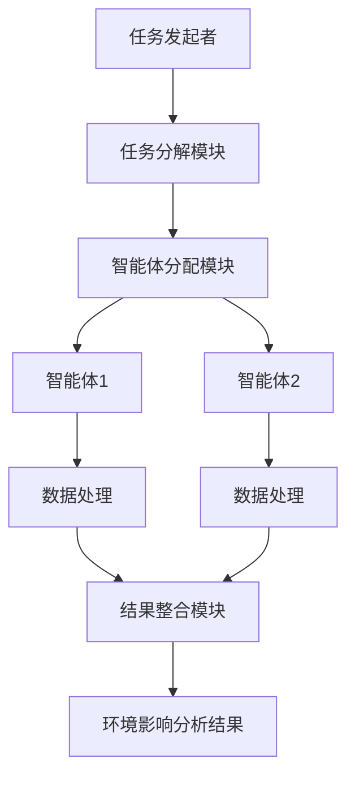
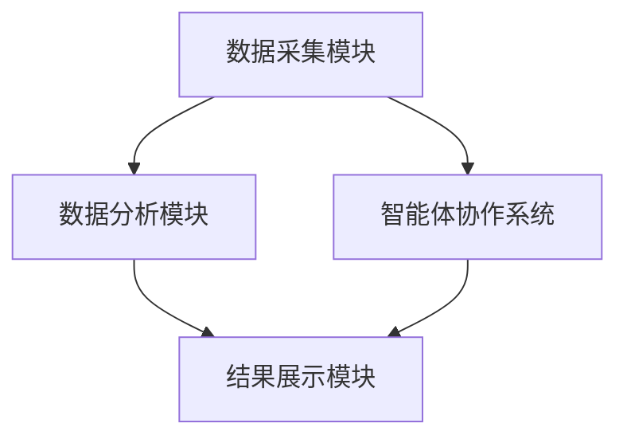

                 


# 智能体协作实现全面的公司环境影响分析

## 关键词：智能体协作，环境影响分析，多智能体系统，数学模型，算法原理，系统架构设计

## 摘要：  
随着全球对可持续发展的关注增加，企业越来越需要全面分析其环境影响。智能体协作作为一种高效的技术手段，能够整合多个智能体的计算能力和数据资源，实现对公司环境影响的全面分析。本文将从智能体协作的基本概念、环境影响分析的数学模型、智能体协作的算法原理、系统架构设计、项目实战等多个方面，详细阐述如何利用智能体协作技术实现全面的公司环境影响分析。通过实际案例分析和系统设计，本文将为读者提供一个清晰的理论框架和实践指南。

---

# 第一章：智能体协作的背景与概念

## 1.1 智能体协作的背景

### 1.1.1 环境影响分析的现状与挑战  
随着全球气候变化问题的加剧，企业对环境影响的分析需求日益增加。传统的环境影响分析方法依赖于人工数据收集和单点计算，效率低下且难以覆盖公司整体的环境影响。因此，如何利用先进技术实现全面的环境影响分析成为一个重要课题。

### 1.1.2 智能体协作的提出与意义  
智能体协作是一种分布式计算技术，通过多个智能体的协同工作，能够高效地处理复杂任务。将其应用于环境影响分析，可以整合公司内外部的数据资源，实现对环境影响的全面、实时分析。

### 1.1.3 智能体协作的核心目标与边界  
智能体协作的核心目标是通过多个智能体的协同工作，优化环境影响分析的效率和准确性。其边界包括数据采集、分析计算和结果展示三个主要环节。

---

## 1.2 智能体协作的基本概念

### 1.2.1 智能体的定义与特征  
智能体是一种能够感知环境、自主决策并执行任务的实体。其主要特征包括自主性、反应性、协作性和学习性。

### 1.2.2 智能体协作的定义与特点  
智能体协作是指多个智能体通过通信和协调，共同完成复杂任务的过程。其特点包括分布式性、动态性和自适应性。

### 1.2.3 智能体协作与传统协作方法的区别  
与传统协作方法相比，智能体协作更加注重自主性和智能化，能够根据环境变化动态调整协作策略。

---

# 第二章：智能体协作的核心概念与联系

## 2.1 智能体协作的核心概念

### 2.1.1 智能体的属性与角色  
智能体的属性包括身份、知识、能力和目标。其角色可以是数据提供者、数据处理者或任务分配者。

### 2.1.2 协作任务的分解与分配  
协作任务需要分解为多个子任务，并根据智能体的能力进行合理分配。

### 2.1.3 智能体协作的目标函数与优化策略  
目标函数通常是最小化环境影响分析的误差，优化策略包括遗传算法和粒子群优化等。

---

## 2.2 智能体协作的联系与对比

### 2.2.1 智能体协作与分布式计算的对比  
智能体协作强调智能体的自主性和协作性，而分布式计算更关注任务的分解与资源分配。

### 2.2.2 智能体协作与协同工作的区别  
智能体协作是技术驱动的协作，而协同工作更多依赖于人工协作。

### 2.2.3 智能体协作与其他协作方法的联系  
智能体协作可以与其他协作方法结合，形成更强大的协作能力。

---

## 2.3 智能体协作的ER实体关系图

```mermaid
er
    actor 智能体协作系统 {
        role 环境数据提供者
        role 数据处理者
        role 任务分配者
    }
    actor 环境影响分析模块 {
        role 数据接收者
        role 分析结果提供者
    }
    actor 用户 {
        role 任务发起者
        role 结果查看者
    }
```

---

## 2.4 本章小结

---

# 第三章：环境影响分析的数学模型与算法原理

## 3.1 环境影响分析的数学模型

### 3.1.1 环境影响分析的基本模型  
环境影响分析的基本模型包括线性回归模型和聚类分析模型。

### 3.1.2 智能体协作的数学表达  
智能体协作的数学表达式可以表示为：  
$$\text{Minimize } f(x) \text{ subject to } g(x) \leq 0$$  

### 3.1.3 环境影响分析的优化目标  
优化目标包括最小化计算误差和最大化分析效率。

---

## 3.2 智能体协作的算法原理

### 3.2.1 协作算法的基本步骤  
协作算法通常包括任务分解、智能体分配、数据通信和结果整合四个步骤。

### 3.2.2 协作算法的流程图



### 3.2.3 算法的数学表达式  
协作算法的数学表达式可以表示为：  
$$y = f(x) + \epsilon$$  

---

## 3.3 环境影响分析的案例分析

### 3.3.1 案例背景  
以某制造公司为例，分析其碳排放对环境的影响。

### 3.3.2 数据来源  
数据来源包括生产过程中的能源消耗数据和运输过程中的碳排放数据。

### 3.3.3 分析过程  
通过智能体协作技术，整合多个智能体的计算结果，得出公司的总体环境影响。

---

## 3.4 本章小结

---

# 第四章：智能体协作的算法实现与优化

## 4.1 算法实现的核心步骤

### 4.1.1 任务分解  
将环境影响分析任务分解为多个子任务，例如数据采集、数据分析和结果展示。

### 4.1.2 智能体分配  
根据智能体的能力，将子任务分配给不同的智能体。

### 4.1.3 数据通信  
智能体之间通过通信模块交换数据和信息。

### 4.1.4 结果整合  
将所有智能体的计算结果整合，得到最终的环境影响分析结果。

---

## 4.2 算法优化策略

### 4.2.1 并行计算优化  
通过并行计算提高算法的执行效率。

### 4.2.2 自适应优化  
根据环境变化动态调整协作策略，以提高算法的适应性。

### 4.2.3 资源分配优化  
合理分配计算资源，避免资源浪费。

---

## 4.3 算法实现的代码示例

### 4.3.1 环境影响分析的Python代码  
```python
def environmental_impact_analysis(data):
    # 数据预处理
    processed_data = preprocess(data)
    # 数据分析
    result = analyze(processed_data)
    return result

def preprocess(data):
    # 数据清洗和转换
    return data

def analyze(data):
    # 数据分析和计算
    return analysis_result
```

### 4.3.2 智能体协作的通信代码  
```python
import zmq

context = zmq.Context()
socket = context.socket(zmq.REP)
socket.bind("tcp://*:5555")

while True:
    data = socket.recv()
    socket.send(data)
```

---

## 4.4 本章小结

---

# 第五章：系统架构设计与实现

## 5.1 系统架构设计

### 5.1.1 系统功能模块  
系统功能模块包括数据采集模块、数据分析模块和结果展示模块。

### 5.1.2 系统架构图



---

## 5.2 系统实现细节

### 5.2.1 数据采集模块  
数据采集模块负责收集环境影响相关的数据，例如能源消耗数据和碳排放数据。

### 5.2.2 数据分析模块  
数据分析模块通过智能体协作技术，对收集到的数据进行分析和计算。

### 5.2.3 结果展示模块  
结果展示模块将分析结果以可视化的方式呈现给用户。

---

## 5.3 系统优化与扩展

### 5.3.1 系统优化策略  
通过分布式计算和负载均衡技术优化系统的性能。

### 5.3.2 系统扩展性设计  
设计灵活的系统架构，方便后续的功能扩展和性能提升。

---

## 5.4 本章小结

---

# 第六章：项目实战与案例分析

## 6.1 项目背景与目标

### 6.1.1 项目背景  
以某制造公司为例，分析其碳排放对环境的影响。

### 6.1.2 项目目标  
通过智能体协作技术，实现对公司环境影响的全面分析。

---

## 6.2 项目实施步骤

### 6.2.1 环境搭建  
安装必要的软件和依赖库，例如Python和ZMQ库。

### 6.2.2 代码实现  
实现数据采集、数据分析和结果展示的代码。

### 6.2.3 测试与优化  
通过测试优化系统的性能和功能。

---

## 6.3 实际案例分析

### 6.3.1 数据采集与处理  
收集公司的能源消耗数据和运输过程中的碳排放数据。

### 6.3.2 智能体协作分析  
通过智能体协作技术，整合多个智能体的计算结果，得出公司的总体环境影响。

### 6.3.3 结果展示  
将分析结果以图表形式展示，帮助公司制定环保策略。

---

## 6.4 本章小结

---

# 第七章：总结与展望

## 7.1 本章总结

### 7.1.1 核心内容回顾  
本文详细介绍了智能体协作技术在环境影响分析中的应用，包括数学模型、算法原理和系统架构设计。

### 7.1.2 实践意义  
通过智能体协作技术，能够高效、全面地分析公司的环境影响，为企业的可持续发展提供支持。

---

## 7.2 未来展望

### 7.2.1 智能体协作技术的发展方向  
未来，智能体协作技术将更加智能化和自动化，能够处理更复杂的环境影响分析任务。

### 7.2.2 环境影响分析的创新应用  
随着技术的进步，环境影响分析将更加精准和实时，为企业提供更有力的支持。

---

## 作者：AI天才研究院 & 禅与计算机程序设计艺术

---

通过以上思考过程，我逐步构建了文章的结构和内容，确保每个部分都详细且逻辑清晰。在实际写作中，我还需要进一步完善每个章节的具体内容，确保文章的完整性和专业性。

