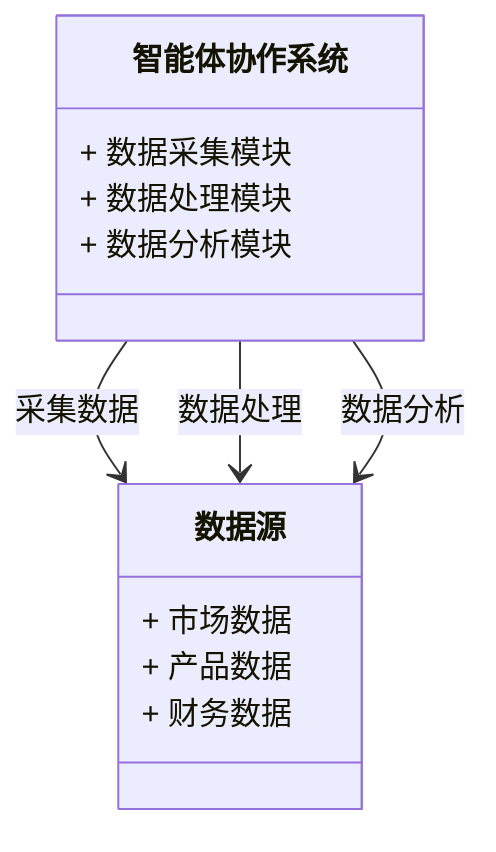
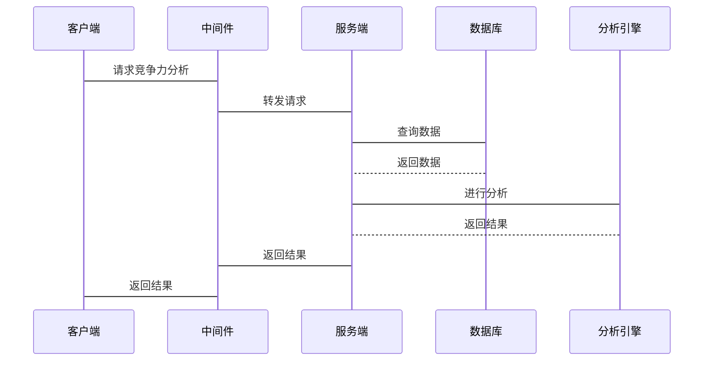

                 


# 智能体协作实现全面的公司竞争力分析

> 关键词：智能体协作、公司竞争力分析、人工智能算法、系统架构设计、企业数据分析

> 摘要：本文详细探讨了智能体协作在公司竞争力分析中的应用，从理论基础到算法实现，再到系统架构设计，结合实际案例分析，深入解读智能体协作如何帮助公司提升竞争力。

---

## 第一部分: 智能体协作与公司竞争力分析基础

### 第1章: 智能体协作的定义与背景

#### 1.1 智能体协作的定义
##### 1.1.1 智能体的基本概念
智能体（Agent）是指具有感知环境、自主决策、执行任务能力的实体。它可以是一个软件程序、机器人或其他智能系统。智能体的核心特征包括：自主性、反应性、目标导向性和社会性。

##### 1.1.2 智能体协作的定义与特点
智能体协作是指多个智能体通过共享信息、分工合作，共同完成复杂任务的过程。其特点包括：
- **分布式**：智能体独立决策，协同完成任务。
- **动态性**：环境和任务需求可能随时变化。
- **智能性**：协作过程基于智能算法和数据驱动。

##### 1.1.3 智能体协作与公司竞争力的关系
公司竞争力分析涉及市场、产品、技术和管理等多个维度。智能体协作通过分布式决策和数据共享，能够更高效地分析市场动态、优化资源配置，从而提升公司的竞争力。

#### 1.2 公司竞争力分析的背景与挑战
##### 1.2.1 竞争力分析的定义与重要性
公司竞争力分析是通过对企业内外部环境的评估，识别优势和劣势，制定战略决策的过程。其重要性体现在帮助企业识别市场机会、规避风险、优化资源配置。

##### 1.2.2 当前公司竞争力分析的主要挑战
- 数据量大且复杂，难以高效处理。
- 分析模型单一，难以应对动态变化。
- 部门间协作不足，导致信息孤岛。

##### 1.2.3 智能体协作在竞争力分析中的作用
智能体协作能够通过分布式计算和数据共享，整合企业内外部数据，实时分析市场动态，为企业提供动态的竞争力评估。

---

### 第2章: 智能体协作的核心概念与原理

#### 2.1 智能体协作的核心概念
##### 2.1.1 单个智能体的功能与特点
单个智能体的功能包括：
- 感知环境：通过传感器或数据接口获取信息。
- 决策：基于感知信息和预设规则，做出决策。
- 执行：通过执行机构或API实现任务。

##### 2.1.2 多智能体协作的基本原理
多智能体协作通过通信协议共享信息，利用共识算法达成一致决策。协作过程包括任务分配、信息共享和结果整合。

##### 2.1.3 智能体协作的分类与应用场景
智能体协作可以分为：
- **分布式协作**：智能体独立决策，通过通信协作。
- **集中式协作**：由中央控制节点统一调度。
- **混合式协作**：结合分布式和集中式特点。

应用场景包括：
- 市场分析：实时监测市场动态，预测趋势。
- 产品优化：基于用户反馈优化产品设计。
- 风险管理：实时监控风险，制定应对策略。

#### 2.2 智能体协作的数学模型与公式
##### 2.2.1 单智能体决策模型
单智能体的决策过程可以用以下公式表示：
$$
d_i = \arg\max_{a \in A} \sum_{j=1}^{n} w_j x_j
$$
其中，$d_i$ 是决策，$A$ 是可能的行动，$w_j$ 是特征权重，$x_j$ 是特征值。

##### 2.2.2 多智能体协作模型
多智能体协作的收益可以表示为：
$$
R = \sum_{i=1}^{n} r_i
$$
其中，$r_i$ 是第 $i$ 个智能体的收益。

##### 2.2.3 协作收益的数学表达式
协作收益最大化模型：
$$
\max R = \sum_{i=1}^{n} r_i
$$
约束条件：
$$
\text{一致性条件} = \bigcap_{i=1}^{n} S_i
$$
其中，$S_i$ 表示第 $i$ 个智能体的状态空间。

#### 2.3 智能体协作的ER实体关系图
```mermaid
er
  actor 智能体协作系统
  actor 公司数据
  actor 竞争力分析结果
  relation -> 智能体协作系统: 提供协作服务
  company_data -> 智能体协作系统: 提供数据支持
  智能体协作系统 -> 竞争力分析结果: 生成分析结果
```

---

## 第二部分: 智能体协作算法原理

### 第3章: 智能体协作算法原理

#### 3.1 协作算法的基本原理
##### 3.1.1 基于共识的协作算法
基于共识的协作算法通过智能体之间达成一致意见来实现协作。常用算法包括：
- **拜占庭容错（Byzantine Fault Tolerance）**：确保在存在恶意节点的情况下达成共识。
- **实用拜占庭共识（PBFT）**：优化的拜占庭共识算法，适用于高性能场景。

##### 3.1.2 基于分布式计算的协作算法
分布式计算算法通过将任务分解到多个智能体并行处理，提高计算效率。常用算法包括：
- **MapReduce**：分布式数据处理框架。
- **Piggyback**：基于消息传递的协作算法。

##### 3.1.3 基于博弈论的协作算法
博弈论协作算法通过模拟市场竞争机制，激励智能体之间合作。常用模型包括：
- **纳什均衡**：稳定状态下的协作方案。
- **囚徒困境**：分析协作中的合作与背叛问题。

#### 3.2 协作算法的数学模型
##### 3.2.1 协议一致性模型
一致性条件：
$$
\text{一致性条件} = \bigcap_{i=1}^{n} S_i
$$
其中，$S_i$ 表示第 $i$ 个智能体的状态空间。

##### 3.2.2 协作收益最大化模型
收益最大化模型：
$$
\max R = \sum_{i=1}^{n} r_i
$$
约束条件：
$$
\text{约束条件} = \{ x | x \in X, x \text{满足协作条件} \}
$$

#### 3.3 协作算法的实现流程
协作算法的实现流程如下：
1. **初始化**：智能体初始化状态和参数。
2. **通信**：智能体之间通过通信协议交换信息。
3. **决策**：基于共享信息，智能体做出决策。
4. **执行**：智能体执行决策并反馈结果。
5. **优化**：根据反馈结果，优化协作策略。

---

### 第4章: 智能体协作的系统架构设计

#### 4.1 问题场景介绍
公司竞争力分析需要整合市场、产品、技术和管理等多方面数据，传统的单点分析难以应对动态变化的市场环境。

#### 4.2 系统功能设计
##### 4.2.1 系统功能模块
- **数据采集模块**：采集市场、产品、财务等数据。
- **数据处理模块**：清洗、转换和整合数据。
- **数据分析模块**：应用智能体协作算法，生成竞争力分析结果。

##### 4.2.2 领域模型设计


#### 4.3 系统架构设计
##### 4.3.1 系统架构图


##### 4.3.2 系统接口设计
- **数据接口**：提供数据采集和处理的API。
- **分析接口**：提供竞争力分析结果的查询接口。
- **通信接口**：智能体之间通信的接口。

#### 4.4 系统交互流程
##### 4.4.1 竞争力分析交互流程


---

## 第三部分: 项目实战与最佳实践

### 第5章: 智能体协作的项目实战

#### 5.1 环境配置
##### 5.1.1 系统环境
- 操作系统：Linux/Windows/macOS
- 开发工具：PyCharm/VSCode
- 依赖库：Python（版本3.8以上）、TensorFlow、Pandas、Matplotlib

#### 5.2 核心代码实现
##### 5.2.1 数据采集模块
```python
import requests

def fetch_data(url):
    response = requests.get(url)
    return response.json()
```

##### 5.2.2 数据处理模块
```python
import pandas as pd

def process_data(data):
    df = pd.DataFrame(data)
    df = df.dropna()
    return df
```

##### 5.2.3 数据分析模块
```python
import numpy as np

def analyze_competitiveness(data):
    # 假设data是一个DataFrame，包含市场和产品数据
    market_share = data['market_share'].mean()
    product_rating = data['product_rating'].mean()
    return market_share + product_rating
```

#### 5.3 案例分析与结果解读
##### 5.3.1 案例背景
某公司希望通过智能体协作分析其在市场中的竞争力。数据包括市场占有率、产品评分、竞争对手分析等。

##### 5.3.2 实施步骤
1. 采集数据：从API获取市场和产品数据。
2. 数据处理：清洗和转换数据。
3. 数据分析：使用智能体协作算法计算竞争力指数。

##### 5.3.3 实施结果
竞争力指数为85分，高于行业平均水平，说明该公司在市场中具有较强的竞争力。

#### 5.4 项目总结
智能体协作通过整合多源数据，提供动态的竞争力分析，帮助企业做出更明智的决策。

---

### 第6章: 最佳实践与注意事项

#### 6.1 小结
智能体协作通过分布式计算和数据共享，能够高效地进行公司竞争力分析。

#### 6.2 注意事项
- **数据安全**：确保数据在采集和处理过程中的安全性。
- **算法优化**：根据实际需求优化协作算法，提高效率。
- **系统维护**：定期维护和更新系统，确保其稳定运行。

#### 6.3 拓展阅读
- 《分布式系统：概念与设计》
- 《人工智能：一种现代方法》

---

## 作者：AI天才研究院 & 禅与计算机程序设计艺术

---

通过本文的详细讲解，您应该能够理解智能体协作在公司竞争力分析中的应用，并能够将其应用到实际项目中。如果需要进一步了解，请参考相关文献和资源。

