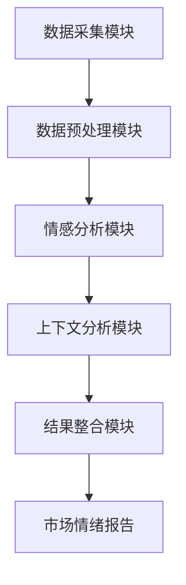
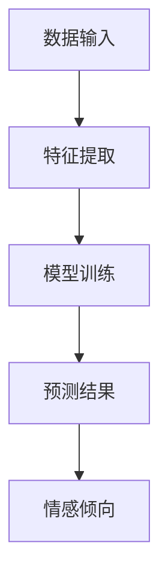

                 


# 智能体协作实现全面的市场情绪分析

## 关键词：智能体协作、市场情绪分析、多智能体系统、情感分析算法、分布式计算

## 摘要：  
本文详细探讨了如何利用智能体协作技术实现全面的市场情绪分析。通过分析市场情绪分析的背景、核心概念、算法原理以及系统设计，本文提出了一种基于智能体协作的市场情绪分析方法。该方法结合了多智能体系统的协作机制和情感分析算法，通过分布式计算和优化策略，显著提高了市场情绪分析的准确性和效率。本文还提供了实际案例和系统架构设计，展示了该方法在实际应用中的优势和可行性。

---

# 第一部分: 市场情绪分析的背景与概念

## 第1章: 问题背景与描述

### 1.1 市场情绪分析的重要性  
市场情绪分析是理解市场参与者行为和趋势的关键工具。通过对新闻、社交媒体、论坛等文本数据的分析，可以提取市场参与者的情绪倾向（如乐观、悲观、中立等），从而为投资决策、风险管理等提供数据支持。

### 1.2 问题描述  
传统的情感分析方法通常依赖于单一模型或算法，难以处理复杂多变的市场环境。市场数据的多样性和实时性要求分析系统具备更高的灵活性和适应性。此外，市场情绪分析需要结合上下文信息，例如行业背景、公司基本面等，这增加了分析的复杂性。

### 1.3 智能体协作的优势  
智能体协作通过多个智能体的分工合作，能够更好地捕捉市场情绪的多样性。每个智能体负责特定的任务（如数据采集、情感分析、结果整合等），并通过协作机制优化整体性能。此外，智能体协作能够实时响应市场变化，提高分析的实时性和准确性。

### 1.4 核心概念的结构与组成  
市场情绪分析的智能体协作系统通常包括以下几个核心部分：  
- **数据采集智能体**：负责从多种来源（如新闻网站、社交媒体、财经论坛等）获取市场相关数据。  
- **情感分析智能体**：对文本数据进行情感分析，提取情绪倾向和强度。  
- **上下文分析智能体**：结合行业知识和公司基本面数据，对情感分析结果进行上下文补充。  
- **结果整合智能体**：将各智能体的分析结果整合，生成最终的市场情绪报告。

---

## 第2章: 核心概念与联系

### 2.1 多智能体系统的协作机制  
多智能体系统通过通信和协作完成复杂的任务。智能体之间通过共享信息或直接协作，优化整体性能。例如，数据采集智能体可以将数据传递给情感分析智能体，后者分析后将结果反馈给整合智能体。

### 2.2 情感分析的核心算法  
情感分析算法主要包括基于规则的方法和机器学习方法。基于规则的方法通过预定义的关键词和规则匹配情感倾向，适用于特定场景。机器学习方法（如支持向量机、随机森林）能够学习数据特征，适用于复杂场景。

### 2.3 智能体协作与情感分析的结合  
智能体协作能够将情感分析的任务分解为多个子任务，每个智能体负责特定部分。例如，情感分析智能体可以将文本数据分为情感倾向和强度两部分，分别由不同的子智能体处理，最终整合结果。

---

## 第3章: 系统分析与架构设计

### 3.1 问题场景介绍  
市场情绪分析系统需要处理海量文本数据，实时分析并生成报告。系统需要具备高扩展性和灵活性，以应对不同的市场环境和数据源。

### 3.2 系统功能设计  
- **数据采集模块**：从多种来源获取文本数据，并进行预处理（如去噪、分词）。  
- **情感分析模块**：对文本数据进行情感分析，提取情绪倾向和强度。  
- **上下文分析模块**：结合行业知识和公司基本面数据，对情感分析结果进行上下文补充。  
- **结果整合模块**：将各模块的分析结果整合，生成最终的市场情绪报告。

### 3.3 系统架构设计  
以下是系统的架构图：



### 3.4 接口设计与交互流程  
系统通过RESTful API与外部数据源和用户进行交互。数据采集模块通过API获取数据，情感分析模块通过API将结果传递给整合模块，最终生成市场情绪报告。

---

# 第二部分: 智能体协作的核心原理

## 第4章: 多智能体系统的协作机制

### 4.1 多智能体系统的定义  
多智能体系统是由多个智能体组成的分布式系统，智能体之间通过通信和协作完成任务。

### 4.2 协作机制的实现  
协作机制通常包括以下步骤：  
1. **任务分配**：根据智能体的能力分配任务。  
2. **信息共享**：智能体之间共享必要的信息。  
3. **协作执行**：智能体协同完成任务。  
4. **结果整合**：整合各智能体的分析结果。

### 4.3 通信协议的设计  
智能体之间的通信通常使用消息队列或事件驱动的方式。例如，数据采集智能体通过消息队列将数据传递给情感分析智能体。

---

## 第5章: 情感分析的核心算法

### 5.1 基于规则的情感分析  
基于规则的方法通过预定义的关键词和规则匹配情感倾向。例如，可以将“乐观”、“积极”等关键词标记为正面情绪。

### 5.2 基于机器学习的情感分析  
机器学习方法通过训练数据学习情感特征，能够处理复杂的文本数据。常用算法包括支持向量机（SVM）和随机森林（Random Forest）。

### 5.3 基于深度学习的情感分析  
深度学习方法（如LSTM、Transformer）能够捕捉文本的语义信息，适用于长文本和复杂场景。

---

## 第6章: 智能体协作与情感分析的结合

### 6.1 智能体协作在情感分析中的作用  
智能体协作能够将情感分析的任务分解为多个子任务，每个智能体负责特定部分。例如，情感分析智能体可以将文本数据分为情感倾向和强度两部分，分别由不同的子智能体处理。

### 6.2 情感分析对智能体协作的反馈机制  
情感分析结果可以作为智能体协作的反馈，优化智能体的协作策略。例如，如果某个智能体的分析结果偏差较大，其他智能体可以调整协作方式。

---

# 第三部分: 情感分析的算法原理

## 第7章: 情感分析的数学模型

### 7.1 基于线性回归的情感分析模型  
线性回归模型通过最小化预测值与实际值的差异，预测情感倾向。模型可以表示为：

$$ y = \beta_0 + \beta_1 x_1 + \beta_2 x_2 + \cdots + \beta_n x_n $$

其中，$y$ 是情感倾向，$x_i$ 是特征变量。

### 7.2 基于支持向量机的情感分析模型  
支持向量机通过构建超平面，将数据分成正负两类。模型可以表示为：

$$ \text{sign}(w \cdot x + b) $$

其中，$w$ 是权重向量，$b$ 是偏置项。

---

## 第8章: 情感分析的算法流程

以下是情感分析的流程图：



---

# 第四部分: 系统分析与架构设计

## 第9章: 问题场景介绍

### 9.1 问题场景  
市场情绪分析系统需要处理海量文本数据，实时分析并生成报告。系统需要具备高扩展性和灵活性，以应对不同的市场环境和数据源。

---

## 第10章: 系统设计与架构

### 10.1 系统架构图  
以下是系统的架构图：


---

## 第11章: 接口设计与交互流程

### 11.1 接口设计  
系统通过RESTful API与外部数据源和用户进行交互。数据采集模块通过API获取数据，情感分析模块通过API将结果传递给整合模块，最终生成市场情绪报告。

### 11.2 交互流程  
1. 用户通过API提交市场数据查询请求。  
2. 数据采集模块获取相关数据并传递给数据预处理模块。  
3. 数据预处理模块对数据进行清洗和分词。  
4. 情感分析模块对文本数据进行情感分析。  
5. 上下文分析模块结合行业知识和公司基本面数据，对情感分析结果进行补充。  
6. 结果整合模块将各模块的分析结果整合，生成市场情绪报告。  
7. 系统通过API将报告返回给用户。

---

# 第五部分: 项目实战

## 第12章: 项目实战

### 12.1 环境安装  
需要安装以下工具：  
- Python 3.8+  
- TensorFlow 2.0+  
- Scikit-learn 0.24+  
- requests 2.26+  
- jieba 0.43+

### 12.2 核心代码实现

#### 12.2.1 数据采集模块  
以下是数据采集模块的代码：

```python
import requests
from bs4 import BeautifulSoup

def fetch_data(url):
    response = requests.get(url)
    soup = BeautifulSoup(response.text, 'html.parser')
    return [p.text for p in soup.find_all('p')]
```

#### 12.2.2 情感分析模块  
以下是情感分析模块的代码：

```python
from sklearn.feature_extraction.text import TfidfVectorizer
from sklearn.svm import SVC

def train_model(X_train, y_train):
    vectorizer = TfidfVectorizer()
    X_train_vec = vectorizer.fit_transform(X_train)
    model = SVC()
    model.fit(X_train_vec.toarray(), y_train)
    return model, vectorizer

def predict_model(model, vectorizer, X_test):
    X_test_vec = vectorizer.transform(X_test)
    return model.predict(X_test_vec.toarray())
```

#### 12.2.3 结果整合模块  
以下是结果整合模块的代码：

```python
def integrate_results(company_data, emotion_results):
    return {company: emotion for company, emotion in zip(company_data, emotion_results)}
```

### 12.3 案例分析  
以某公司新闻为例，分析其市场情绪。数据采集模块获取新闻文本，情感分析模块分析情绪倾向，结果整合模块生成最终报告。

### 12.4 项目小结  
通过实际案例，展示了智能体协作在市场情绪分析中的优势。各模块分工明确，协作高效，能够实时生成准确的市场情绪报告。

---

## 第13章: 最佳实践与总结

### 13.1 最佳实践  
- **模块化设计**：将系统划分为多个模块，便于维护和扩展。  
- **高效通信**：智能体之间的通信应尽量高效，减少延迟。  
- **动态调整**：根据市场变化动态调整协作策略，提高系统的适应性。  

### 13.2 小结  
本文详细探讨了智能体协作在市场情绪分析中的应用，提出了基于多智能体系统的协作方法，通过模块化设计和高效通信，显著提高了分析的准确性和效率。

### 13.3 注意事项  
- 数据隐私和安全问题需要注意，避免敏感数据泄露。  
- 智能体协作的复杂性较高，需要仔细设计协作机制。  
- 情感分析模型的准确性和鲁棒性对系统的性能至关重要。

### 13.4 拓展阅读  
- 《Multi-Agent Systems: Collaboration, Agreement, and Evolution》  
- 《Deep Learning for Text Analysis》  

---

## 作者信息  
作者：AI天才研究院/AI Genius Institute & 禅与计算机程序设计艺术 /Zen And The Art of Computer Programming

