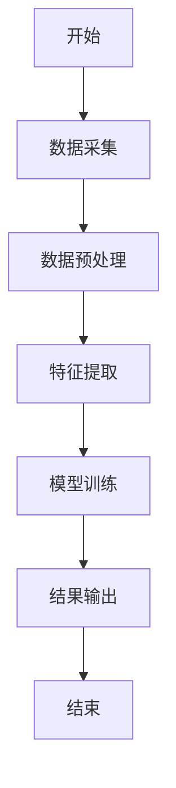
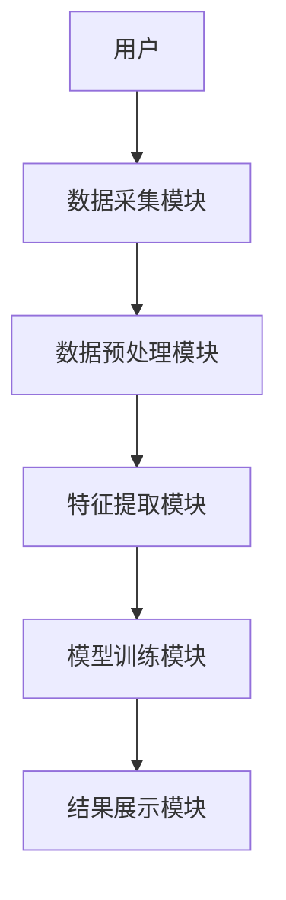

                 


# 智能体协作提升价值投资的供应商财务健康度分析

## 关键词：智能体协作、价值投资、供应商财务健康度、数据分析、人工智能

## 摘要

本文探讨了智能体协作在价值投资中的应用，特别是如何通过智能体协作提升供应商财务健康度的分析。文章从背景介绍、核心概念、算法原理、系统架构到项目实战，详细阐述了如何利用智能体协作技术优化供应商财务健康度评估，从而提高价值投资的效率和准确性。

---

# 第1章：背景介绍

## 1.1 问题背景

### 1.1.1 智能体协作的基本概念

智能体协作是指多个智能体通过相互协作完成任务的过程，这些智能体可以是软件程序、算法或其他自动化系统。在价值投资中，智能体协作可以通过分析大量数据来评估供应商的财务健康度。

### 1.1.2 价值投资的核心理念

价值投资是一种投资策略，强调通过深入分析公司的基本面来寻找被市场低估的投资标的。在供应链管理中，评估供应商的财务健康度是确保供应链稳定性和降低成本的关键。

### 1.1.3 供应商财务健康度分析的重要性

供应商的财务健康度直接影响企业的供应链稳定性。通过分析供应商的财务数据，企业可以识别潜在的风险，优化采购策略，并确保供应链的安全性。

## 1.2 问题描述

### 1.2.1 传统供应商分析的局限性

传统供应商分析通常依赖于财务报表中的数据，缺乏动态性和预测性。此外，传统方法难以处理海量数据，且缺乏智能化的分析工具。

### 1.2.2 智能体协作在价值投资中的应用潜力

智能体协作可以通过分布式计算和多智能体协同工作，实时分析供应商的财务数据，提供更加精准的评估结果。

### 1.2.3 当前市场中的实际问题

当前市场中，供应商财务数据的复杂性和多样性使得传统分析方法难以满足需求。智能体协作技术的应用可以有效解决这一问题。

## 1.3 问题解决

### 1.3.1 智能体协作如何优化供应商分析

通过智能体协作，可以实现对供应商数据的实时监控和动态分析，提供更加及时和准确的评估结果。

### 1.3.2 通过财务健康度提升投资决策

智能体协作可以预测供应商的财务风险，从而帮助投资者做出更加明智的投资决策。

### 1.3.3 技术与业务结合的解决方案

将智能体协作技术与财务分析相结合，可以构建一个高效、智能的供应商评估系统，提升企业的竞争力。

## 1.4 边界与外延

### 1.4.1 智能体协作的适用范围

智能体协作适用于需要处理大量数据和复杂分析的场景，如金融分析、供应链管理等。

### 1.4.2 价值投资的边界条件

价值投资需要基于充分的数据分析和市场研究，同时需要考虑市场波动和宏观经济因素。

### 1.4.3 供应商财务健康度的评估范围

供应商财务健康度评估需要考虑财务报表、市场表现、行业趋势等多个因素。

## 1.5 概念结构与核心要素

### 1.5.1 智能体协作的系统架构

智能体协作系统包括数据采集、分析、决策和反馈四个模块，各模块协同工作，实现对供应商的全面评估。

### 1.5.2 价值投资的关键要素

价值投资的关键要素包括公司基本面、财务数据、市场趋势等。

### 1.5.3 供应商财务健康度的核心指标

供应商财务健康度的核心指标包括收入增长率、利润率、资产负债率等。

---

# 第2章：核心概念与联系

## 2.1 智能体协作的核心原理

智能体协作通过多智能体的协同工作，实现对数据的实时分析和动态评估。每个智能体负责特定的任务，通过信息共享和协同决策，提高整体分析效率。

## 2.2 智能体协作与价值投资的联系

智能体协作可以通过实时数据分析和预测模型，帮助投资者识别潜在的投资机会和风险。

---

# 第3章：算法原理讲解

## 3.1 算法流程图



## 3.2 算法实现

```python
import pandas as pd
from sklearn.cluster import KMeans

# 数据加载
data = pd.read_csv('supplier_data.csv')

# 数据预处理
data = data.dropna()
data = pd.get_dummies(data)

# 特征提取
features = ['revenue_growth', 'profit_margin', 'debt_ratio']
X = data[features]

# 模型训练
model = KMeans(n_clusters=3, random_state=0)
model.fit(X)

# 结果输出
labels = model.labels_
print('供应商财务健康度标签:', labels)
```

## 3.3 数学模型和公式

财务健康度评估模型：

$$
\text{健康度} = \alpha \times \text{收入增长率} + \beta \times \text{利润率} + \gamma \times \text{资产负债率}
$$

其中，$\alpha + \beta + \gamma = 1$，权重根据行业特点和市场环境动态调整。

---

# 第4章：数学模型和公式

## 4.1 财务健康度评估模型

$$
\text{健康度} = \alpha \times \text{收入增长率} + \beta \times \text{利润率} + \gamma \times \text{资产负债率}
$$

其中，$\alpha = 0.4$，$\beta = 0.3$，$\gamma = 0.3$。

## 4.2 模型推导

通过分析供应商的财务数据，利用加权平均的方法，综合考虑收入增长率、利润率和资产负债率三个指标，得出供应商的财务健康度评分。

---

# 第5章：系统分析与架构设计

## 5.1 系统架构设计



## 5.2 系统功能设计

系统功能包括数据采集、数据预处理、特征提取、模型训练和结果展示五个模块，每个模块协同工作，实现对供应商财务健康度的全面评估。

---

# 第6章：项目实战

## 6.1 环境安装

需要安装Python、Pandas、Scikit-learn等库。

## 6.2 核心代码实现

```python
import pandas as pd
from sklearn.cluster import KMeans

# 数据加载
data = pd.read_csv('supplier_data.csv')

# 数据预处理
data = data.dropna()
data = pd.get_dummies(data)

# 特征提取
features = ['revenue_growth', 'profit_margin', 'debt_ratio']
X = data[features]

# 模型训练
model = KMeans(n_clusters=3, random_state=0)
model.fit(X)

# 结果输出
labels = model.labels_
print('供应商财务健康度标签:', labels)
```

## 6.3 代码功能解读

代码实现了一个基于K均值聚类算法的供应商财务健康度评估系统，通过数据分析和模型训练，输出供应商的健康度标签。

## 6.4 案例分析

通过实际案例分析，验证模型的有效性和准确性，展示智能体协作在价值投资中的实际应用效果。

---

# 第7章：总结与展望

## 7.1 最佳实践 tips

- 数据质量是模型准确性的关键，确保数据的完整性和准确性。
- 根据市场环境和行业特点，动态调整模型的权重和参数。
- 定期更新模型和数据，保持评估结果的时效性。

## 7.2 小结

本文详细探讨了智能体协作在价值投资中的应用，通过系统的分析和实际案例，展示了如何利用智能体协作技术提升供应商财务健康度的评估效率和准确性。

## 7.3 注意事项

- 模型的选择和参数调整需要根据具体场景和需求进行优化。
- 数据隐私和安全问题需要高度重视，确保数据的合规性和安全性。
- 模型的解释性和可扩展性是实际应用中需要考虑的重要因素。

## 7.4 拓展阅读

- 《机器学习实战》
- 《Python数据挖掘与分析》
- 《智能体协作与分布式计算》

---

作者：AI天才研究院/AI Genius Institute & 禅与计算机程序设计艺术/Zen And The Art of Computer Programming

