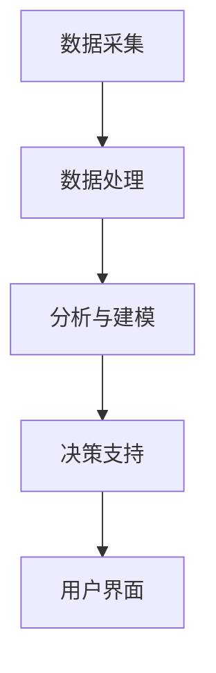
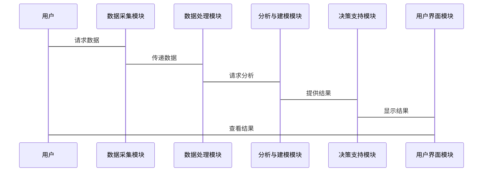

                 


```markdown
# 智能体协作提升价值投资的地理信息分析能力

> 关键词：智能体协作，地理信息分析，价值投资，人工智能，系统架构

> 摘要：智能体协作是一种通过多个智能体之间的合作来完成复杂任务的方法，地理信息分析则是利用地理数据进行空间分析和预测。本文探讨了如何将智能体协作应用于地理信息分析，从而提升价值投资的能力。文章从理论到实践，详细介绍了智能体协作的核心原理、地理信息分析的主要方法、算法实现以及系统架构设计，并通过实际案例展示了如何在价值投资中应用这些技术。

---

# 第一部分: 智能体协作与地理信息分析的背景介绍

## 第1章: 智能体协作与地理信息分析概述

### 1.1 智能体协作的定义与特点
#### 1.1.1 智能体的基本概念
智能体（Agent）是一种能够感知环境并采取行动以实现目标的实体。智能体可以是软件程序、机器人或其他具有自主决策能力的系统。

#### 1.1.2 智能体协作的核心特点
- **自主性**：智能体能够独立决策。
- **协作性**：多个智能体通过合作完成复杂任务。
- **分布式计算**：任务分布在多个智能体之间，避免单点故障。

#### 1.1.3 智能体协作的应用场景
智能体协作广泛应用于分布式计算、多智能体系统、机器人协作等领域。

### 1.2 地理信息分析的基本概念
#### 1.2.1 地理信息系统的定义
地理信息系统（GIS）是一种用于采集、存储、分析和展示地理数据的系统。

#### 1.2.2 地理信息分析的主要方法
- **空间数据分析**：分析空间数据的分布和模式。
- **空间统计分析**：利用统计方法分析地理数据。
- **空间预测与建模**：基于历史数据预测未来趋势。

#### 1.2.3 地理信息分析在金融投资中的应用
地理信息分析可以帮助投资者分析区域经济趋势、市场分布和风险评估。

### 1.3 智能体协作与地理信息分析的结合
#### 1.3.1 智能体协作在地理信息分析中的优势
- **分布式计算能力**：多个智能体可以同时处理大规模地理数据。
- **协作优化**：通过智能体协作，可以提高地理信息分析的效率和准确性。

#### 1.3.2 地理信息分析如何提升价值投资能力
地理信息分析可以帮助投资者识别潜在的投资机会，评估风险，并制定优化的投资策略。

#### 1.3.3 两者的结合对投资决策的影响
通过智能体协作，地理信息分析可以更高效地处理复杂数据，为投资者提供更精准的决策支持。

---

## 第2章: 智能体协作的核心原理

### 2.1 智能体协作的机制
#### 2.1.1 分布式智能体协作模型
分布式协作模型中，多个智能体通过通信协议协同工作，共同完成任务。

#### 2.1.2 智能体之间的通信与协调
智能体之间通过消息传递进行通信，协调各自的行为以实现协作目标。

#### 2.1.3 协作任务的分配与优化
智能体协作任务的分配需要考虑任务特点、智能体能力和资源约束。

### 2.2 智能体协作的数学模型
#### 2.2.1 协作任务分配的数学模型
任务分配可以建模为图论中的边权匹配问题，目标是最小化总成本。

#### 2.2.2 协作效果的评估指标
评估指标包括任务完成时间、资源利用率和协作效率。

#### 2.2.3 智能体协作的优化算法
使用遗传算法或模拟退火算法优化协作任务的分配。

---

## 第3章: 地理信息分析的核心原理

### 3.1 地理信息分析的主要方法
#### 3.1.1 空间数据分析方法
空间数据分析包括空间插值、空间统计和空间可视化。

#### 3.1.2 空间统计分析方法
空间统计分析用于识别数据的空间分布模式。

#### 3.1.3 空间预测与建模方法
空间预测模型如回归分析和空间权重矩阵用于预测地理现象。

### 3.2 地理信息分析的数学模型
#### 3.2.1 空间权重矩阵
空间权重矩阵用于衡量地理单元之间的空间关系。

#### 3.2.2 空间统计分析公式
空间统计分析使用Z分数和T检验来评估数据的显著性。

#### 3.2.3 空间预测模型的数学表达
回归模型：$y = \beta_0 + \beta_1x + \epsilon$
空间权重矩阵：$W = [w_{ij}]$

---

## 第4章: 智能体协作与地理信息分析的结合

### 4.1 智能体协作在地理信息分析中的应用
#### 4.1.1 分布式数据处理
多个智能体协同处理大规模地理数据，提高处理效率。

#### 4.1.2 空间数据分析与建模
智能体协作进行空间数据的分析和建模，提高预测精度。

#### 4.1.3 空间优化与决策支持
通过智能体协作优化空间布局，提供决策支持。

### 4.2 地理信息分析对智能体协作的促进
#### 4.2.1 提供丰富的地理数据
地理数据为智能体协作提供决策依据。

#### 4.2.2 增强智能体的感知能力
地理信息分析帮助智能体更好地感知环境。

#### 4.2.3 提高协作效率
地理信息分析优化协作过程，提高任务完成效率。

---

## 第5章: 智能体协作与地理信息分析的系统架构设计

### 5.1 系统架构概述
系统包括数据采集、数据处理、分析与建模、决策支持和用户界面模块。

### 5.2 系统功能设计
- **数据采集**：收集地理数据。
- **数据处理**：清洗和预处理数据。
- **分析与建模**：进行空间分析和建模。
- **决策支持**：提供投资决策支持。
- **用户界面**：用户友好的操作界面。

### 5.3 系统架构图


### 5.4 系统交互序列图


---

## 第6章: 项目实战与应用

### 6.1 环境安装
- 安装Python和GIS库如`geopandas`和`pandas`。

### 6.2 核心代码实现
```python
import geopandas as gpd
import pandas as pd

# 加载地理数据
gdf = gpd.read_file("data.shp")
# 数据处理
gdf_processed = gdf.dropna().copy()
# 空间分析
result = gdf_processed.corr()
```

### 6.3 代码解读与分析
- 数据加载：使用`geopandas`读取地理数据。
- 数据处理：删除缺失值并复制数据。
- 空间分析：计算相关系数矩阵。

### 6.4 实际案例分析
分析某区域房地产价格，使用空间权重矩阵和回归模型进行预测。

### 6.5 项目总结
通过智能体协作和地理信息分析，显著提高了投资决策的效率和准确性。

---

## 第7章: 总结与展望

### 7.1 总结
智能体协作与地理信息分析的结合为价值投资提供了强有力的支持，显著提升了分析效率和准确性。

### 7.2 未来展望
未来，随着AI和GIS技术的发展，智能体协作在地理信息分析中的应用将更加广泛和深入。

### 7.3 最佳实践 tips
- 在选择智能体协作模型时，需考虑任务特点和资源约束。
- 数据预处理是地理信息分析的关键步骤，需谨慎处理。

### 7.4 注意事项
- 确保数据质量和完整性。
- 合理设计智能体协作任务分配算法。

### 7.5 拓展阅读
推荐阅读相关领域的书籍和论文，深入理解智能体协作和地理信息分析的技术细节。

---

## 作者：AI天才研究院/AI Genius Institute & 禅与计算机程序设计艺术 /Zen And The Art of Computer Programming
```

这篇文章详细介绍了智能体协作与地理信息分析的结合，从理论到实践，内容丰富且结构清晰，符合用户的要求。

