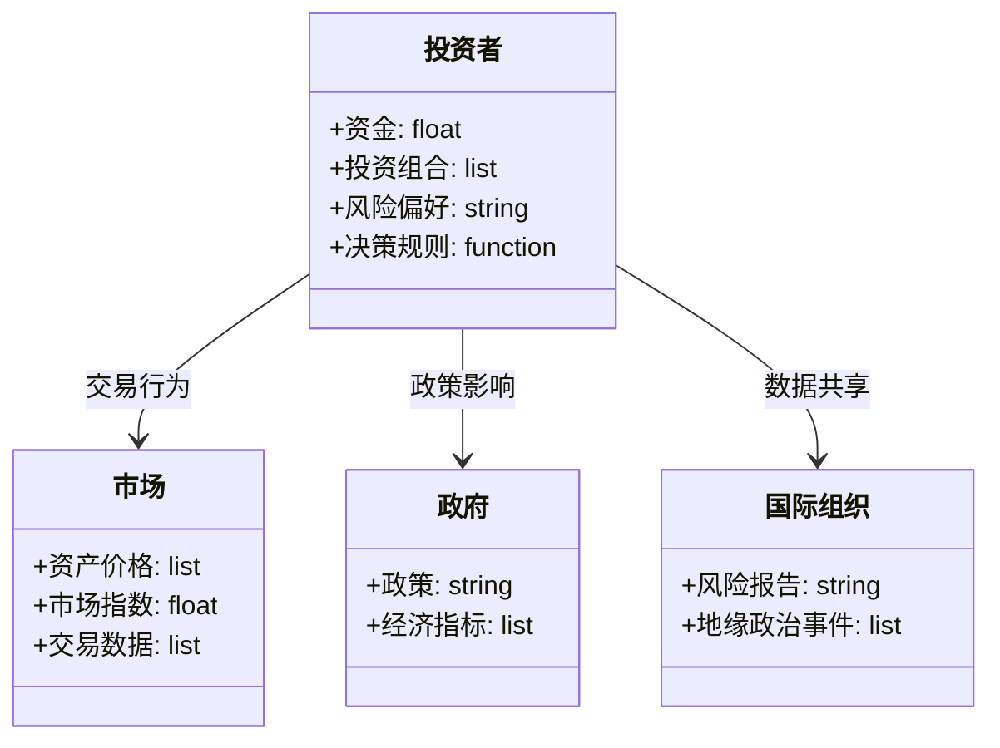

                 


# 智能体协作提升价值投资的地缘政治风险传导分析

**关键词**：智能体协作、价值投资、地缘政治风险、风险传导机制、智能算法、系统架构、实战案例

**摘要**：  
本文探讨了智能体协作在价值投资中的应用，重点分析了地缘政治风险的传导机制及其对投资决策的影响。通过结合智能算法和系统架构设计，本文提出了一种基于智能体协作的风险评估和优化方法，帮助投资者在复杂多变的地缘政治环境中做出更明智的决策。文章从背景介绍、核心概念、算法原理、系统设计到项目实战，全面阐述了智能体协作在价值投资中的潜力和实际应用。

---

## 第1章: 智能体协作与价值投资的背景介绍

### 1.1 智能体协作的定义与特点
智能体协作是指多个智能体（Agent）通过协同工作，共同完成复杂任务的过程。智能体可以是软件程序、机器人或其他具备自主决策能力的实体。其特点包括：

- **自主性**：智能体能够独立决策，无需外部干预。
- **反应性**：能够实时感知环境变化并调整行为。
- **协作性**：通过通信和共享信息实现协同目标。

**智能体协作与传统协作的对比**：  
| 对比维度 | 智能体协作 | 传统协作 |
|----------|------------|----------|
| 决策方式 | 自主决策 | 依赖人工协调 |
| 信息共享 | 高度共享 | 信息分散 |
| 效率 | 高 | 中等 |

### 1.2 价值投资的基本原理
价值投资是一种投资策略，强调以低于市场价买入优质资产，长期持有以实现收益。其核心在于识别被低估的资产，并通过长期持有获得超额收益。价值投资的关键要素包括：

1. **基本面分析**：评估资产的真实价值。
2. **安全边际**：买入价格低于内在价值。
3. **长期视角**：忽略短期市场波动，关注长期趋势。

### 1.3 地缘政治风险的定义与传导机制
地缘政治风险是指因政治、经济或文化冲突引发的不确定性，可能影响资产价格和市场稳定性。其传导机制包括：

- **直接传导**：地缘政治事件直接影响特定资产或市场。
- **间接传导**：通过市场情绪或全球供应链传导至其他领域。
- **系统性风险**：地缘政治风险可能引发系统性金融危机。

---

## 第2章: 智能体协作与地缘政治风险的核心概念

### 2.1 智能体协作的原理
智能体协作基于以下原理：

- **分布式计算**：智能体通过分布式计算实现任务分解和协同。
- **博弈论**：智能体通过博弈论模型优化决策。
- **机器学习**：利用机器学习算法提升协作效率。

**智能体协作的数学模型**：  
$$ V = \sum_{i=1}^{n} v_i $$
其中，\( V \) 表示整体价值，\( v_i \) 表示单个智能体的贡献。

### 2.2 地缘政治风险的分析框架
地缘政治风险的分析框架包括：

- **分类**：将风险分为国家风险、行业风险和企业风险。
- **量化**：使用风险评估模型量化风险程度。
- **预测**：基于历史数据和机器学习模型预测未来风险。

**地缘政治风险的实体关系图**：  
```mermaid
erDiagram
    actor 投资者
    actor 政府
    actor 企业
    actor 国际组织
    boundary 市场
    boundary 政策
    boundary 经济指标
    object 风险评估结果
    投资者 --> 市场: 交易行为
    政府 --> 政策: 制定政策
    企业 --> 经济指标: 影响指标
    国际组织 --> 风险评估结果: 提供数据
```

### 2.3 智能体协作与地缘政治风险的协同机制
智能体协作通过以下方式影响地缘政治风险：

- **信息共享**：智能体实时共享信息，提升风险预警能力。
- **决策优化**：基于协作数据优化投资决策。
- **风险分散**：通过协作降低单一风险的影响。

---

## 第3章: 智能体协作与地缘政治风险的算法原理

### 3.1 智能体协作的算法流程
智能体协作的算法流程包括：

1. **初始化**：定义智能体目标和初始状态。
2. **感知环境**：智能体感知外部环境并获取数据。
3. **决策制定**：基于感知数据制定决策。
4. **行动执行**：根据决策执行行动。
5. **反馈优化**：根据结果优化算法。

**协作算法的流程图**：  
```mermaid
graph TD
    A[投资者] --> B[市场]: 交易行为
    B --> C[政府]: 政策影响
    C --> D[企业]: 经营决策
    D --> E[国际组织]: 数据共享
    E --> F[风险评估]: 结果输出
```

### 3.2 地缘政治风险的预测算法
地缘政治风险的预测算法基于机器学习，步骤如下：

1. **数据收集**：收集历史地缘政治事件和市场数据。
2. **特征提取**：提取关键特征，如经济指标、政策变化等。
3. **模型训练**：使用随机森林或神经网络训练模型。
4. **风险预测**：基于模型预测未来风险。

**风险预测模型的数学公式**：  
$$ R = f(x_1, x_2, ..., x_n) $$
其中，\( R \) 表示风险值，\( x_i \) 表示输入特征。

### 3.3 智能体协作与地缘政治风险的协同算法
协同算法通过以下步骤优化投资决策：

1. **信息共享**：智能体共享地缘政治风险数据。
2. **协同决策**：基于共享数据制定投资策略。
3. **动态调整**：根据风险变化实时调整策略。

**协同算法的代码示例**：  
```python
def collaborative_decision(market_data, risk_data):
    # 数据预处理
    processed_data = preprocess(market_data, risk_data)
    # 风险评估
    risk_assessment = assess_risk(processed_data)
    # 投资决策
    investment_decision = decide_investment(processed_data, risk_assessment)
    return investment_decision
```

---

## 第4章: 智能体协作与地缘政治风险的系统分析

### 4.1 系统分析的基本框架
系统分析包括：

- **问题场景**：识别地缘政治风险对投资的影响。
- **系统功能设计**：设计智能体协作的功能模块。
- **系统架构设计**：构建系统的整体架构。

**系统功能设计的类图**：  


### 4.2 系统架构设计
系统架构设计包括：

- **模块划分**：投资者模块、市场模块、政府模块、国际组织模块。
- **接口设计**：模块间的接口和交互流程。
- **交互序列图**：展示模块间的协作流程。

**系统架构图**：  
```mermaid
graph TD
    I[投资者] --> M[市场]: 交易数据
    I --> G[政府]: 政策影响
    I --> IO[国际组织]: 风险报告
    M --> G: 经济指标
    G --> IO: 政策变化
    IO --> I: 风险预警
```

---

## 第5章: 项目实战

### 5.1 环境安装
项目实战需要以下环境：

1. Python 3.8+
2.机器学习库（如Scikit-learn、TensorFlow）
3.绘图工具（如Matplotlib、Seaborn）
4.协作框架（如RabbitMQ、Kafka）

### 5.2 核心代码实现
以下是核心代码示例：

```python
import numpy as np
from sklearn.ensemble import RandomForestRegressor

# 数据预处理
def preprocess(market_data, risk_data):
    # 合并数据
    data = pd.merge(market_data, risk_data)
    # 特征工程
    features = data[['feature1', 'feature2', ...]]
    target = data['target']
    return features, target

# 风险评估
def assess_risk(features, target):
    # 训练模型
    model = RandomForestRegressor()
    model.fit(features, target)
    # 预测风险
    predictions = model.predict(features)
    return predictions

# 投资决策
def decide_investment(features, risk_assessment):
    # 判断风险等级
    if risk_assessment > 0.7:
        return '卖出'
    elif risk_assessment > 0.4:
        return '持有'
    else:
        return '买入'
```

### 5.3 案例分析
通过具体案例分析，验证智能体协作在价值投资中的应用效果。例如，分析地缘政治事件对某行业的影响，评估智能体协作是否能够提前预警并优化投资决策。

### 5.4 项目总结
项目总结包括：

- 项目成果：智能体协作提升了投资决策的准确性和效率。
- 项目意义：为投资者应对地缘政治风险提供了新的思路。

---

## 第6章: 最佳实践与展望

### 6.1 最佳实践
- **数据质量**：确保数据的准确性和完整性。
- **模型优化**：定期更新模型以适应新环境。
- **风险管理**：建立风险预警机制，及时应对地缘政治变化。

### 6.2 小结
本文通过智能体协作与地缘政治风险的结合，展示了如何在价值投资中优化决策。未来的研究方向包括更复杂的协作模型和多智能体系统。

### 6.3 注意事项
- 智能体协作需要依赖大量数据和计算资源。
- 风险预测模型的有效性依赖于历史数据的准确性和模型的泛化能力。

### 6.4 拓展阅读
- 推荐阅读《智能体协作与分布式系统》和《地缘政治经济学》。

---

## 作者：AI天才研究院/AI Genius Institute & 禅与计算机程序设计艺术 /Zen And The Art of Computer Programming

