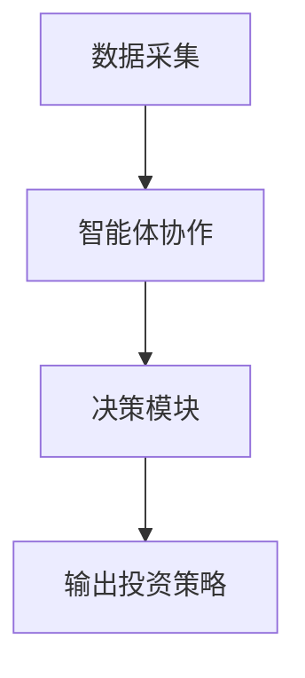

                 


# 智能体协作提升价值投资的行业周期判断

## 关键词：智能体协作，价值投资，行业周期，博弈论，强化学习，多智能体系统，数学模型

## 摘要：本文深入探讨了智能体协作在价值投资中的应用，特别是如何利用智能体协作来判断和预测行业周期。通过分析智能体协作的原理、算法模型、系统架构以及实际案例，本文揭示了智能体协作在提升投资决策中的巨大潜力，并为实践者提供了可操作的指导。

---

## 目录

1. [智能体协作与价值投资的背景](#智能体协作与价值投资的背景)
   1.1 智能体协作的背景与概念
   1.2 价值投资与行业周期的基本概念
   1.3 智能体协作与价值投资的关系

2. [智能体协作的核心概念与联系](#智能体协作的核心概念与联系)
   2.1 多智能体系统的基本原理
   2.2 智能体协作的核心机制
   2.3 行业周期判断的智能体协作模型

3. [智能体协作的算法原理](#智能体协作的算法原理)
   3.1 基于博弈论的协作算法
   3.2 基于强化学习的协作算法
   3.3 算法实现与代码示例

4. [智能体协作的数学模型与公式](#智能体协作的数学模型与公式)
   4.1 博弈论模型
   4.2 强化学习模型

5. [智能体协作的系统分析与架构设计](#智能体协作的系统分析与架构设计)
   5.1 系统功能设计
   5.2 系统架构设计
   5.3 系统接口设计

6. [智能体协作的项目实战](#智能体协作的项目实战)
   6.1 项目背景与目标
   6.2 核心代码实现
   6.3 案例分析与总结

7. [智能体协作的最佳实践与总结](#智能体协作的最佳实践与总结)
   7.1 关键点回顾
   7.2 实践中的注意事项
   7.3 拓展阅读与未来展望

---

## 第一部分：智能体协作与价值投资的背景

### 1.1 智能体协作的背景与概念

#### 1.1.1 智能体协作的背景
人工智能技术的快速发展为金融领域带来了前所未有的变革。智能体（Intelligent Agents）作为人工智能的核心组成部分，能够通过自主决策和协作完成复杂的任务。智能体协作是指多个智能体通过信息共享和协同行动，共同完成某个目标的过程。

#### 1.1.2 智能体协作在金融领域的应用
在金融领域，智能体协作可以用于股票交易、风险控制、投资组合优化等场景。通过智能体协作，投资者可以更高效地捕捉市场机会，降低投资风险。

#### 1.1.3 智能体协作与价值投资的关系
价值投资强调长期持有的优质资产，而智能体协作可以通过分析市场数据和行业周期，为投资者提供更精准的投资决策支持。

### 1.2 价值投资与行业周期的基本概念

#### 1.2.1 价值投资的核心理念
价值投资是由本杰明·格雷厄姆提出的一种投资策略，强调以低于内在价值的价格购买优质资产，长期持有以实现收益。

#### 1.2.2 行业周期的定义与分类
行业周期是指一个行业在经济发展过程中经历的扩张、繁荣、衰退和复苏四个阶段。了解行业周期有助于投资者制定更科学的投资策略。

#### 1.2.3 价值投资与行业周期的关系
行业周期对企业的盈利能力有重要影响，因此在进行价值投资时，必须考虑行业所处的周期阶段。

### 1.3 智能体协作与价值投资的关系
智能体协作可以通过分析市场数据、行业趋势和企业基本面，帮助投资者更准确地判断行业周期，从而优化投资决策。

---

## 第二部分：智能体协作的核心概念与联系

### 2.1 多智能体系统的基本原理

#### 2.1.1 多智能体系统的定义
多智能体系统是由多个智能体组成的分布式系统，这些智能体通过协作完成共同目标。

#### 2.1.2 多智能体系统的组成部分
- **智能体**：具有感知、决策和行动能力的实体。
- **通信机制**：智能体之间的信息交换方式。
- **协作机制**：智能体如何共同完成任务的规则和策略。

#### 2.1.3 多智能体系统的协作机制
- **任务分配**：根据智能体的能力分配任务。
- **信息共享**：智能体之间共享必要的信息。
- **协调与同步**：确保智能体行动一致。

### 2.2 智能体协作的核心机制

#### 2.2.1 协作目标的定义
协作目标是智能体协作的核心，通常通过任务分解和角色分配来实现。

#### 2.2.2 智能体之间的通信与协调
智能体之间的通信可以通过消息传递或共享数据库实现，协调则通过协商和协议达成。

#### 2.2.3 智能体协作的评价指标
- **效率**：完成任务的速度。
- **效果**：任务完成的质量。
- **鲁棒性**：系统在面对干扰时的稳定性。

### 2.3 行业周期判断的智能体协作模型

#### 2.3.1 智能体协作在行业周期判断中的应用
智能体可以通过分析宏观经济指标、行业数据和企业财务数据，共同判断行业周期阶段。

#### 2.3.2 智能体协作的优势
- **数据丰富性**：多个智能体可以获取更多数据。
- **决策多样性**：不同智能体的决策可以互补。
- **快速响应**：智能体可以实时协作，快速应对市场变化。

---

## 第三部分：智能体协作的算法原理

### 3.1 基于博弈论的协作算法

#### 3.1.1 博弈论的基本概念
博弈论研究理性决策者在策略互动中的行为，常用于分析智能体之间的协作与竞争。

#### 3.1.2 纳什均衡
纳什均衡是指在其他参与者策略不变的情况下，某个参与者无法通过单方面改变策略而提高收益的状态。

$$\text{纳什均衡的条件：对于每个玩家，策略i是最佳反应}$$

#### 3.1.3 博弈论在智能体协作中的应用
通过博弈论模型，智能体可以预测其他智能体的决策，从而制定最优策略。

### 3.2 基于强化学习的协作算法

#### 3.2.1 强化学习的基本原理
强化学习通过智能体与环境的交互，学习最优策略，通常通过奖励机制进行训练。

#### 3.2.2 多智能体强化学习
多智能体强化学习（MADRL）是强化学习在多智能体系统中的应用，通过智能体之间的协作实现全局目标。

#### 3.2.3 Q-learning算法
Q-learning是一种经典的强化学习算法，适用于离散动作空间和状态空间。

---

## 第四部分：智能体协作的数学模型与公式

### 4.1 博弈论模型

#### 4.1.1 纳什均衡的数学表达
$$\text{纳什均衡的条件：对于每个玩家，策略i是最佳反应}$$

#### 4.1.2 协作收益的数学公式
$$\text{总收益} = \sum_{i=1}^{n} v_i$$
其中，\(v_i\) 表示第i个智能体的收益。

### 4.2 强化学习模型

#### 4.2.1 Q-learning算法
Q-learning的目标是找到使累积奖励最大的策略，其更新公式为：
$$Q(s, a) \leftarrow Q(s, a) + \alpha [r + \gamma \max Q(s', a') - Q(s, a)]$$
其中，\(\alpha\) 是学习率，\(\gamma\) 是折扣因子。

---

## 第五部分：智能体协作的系统分析与架构设计

### 5.1 系统功能设计

#### 5.1.1 系统功能模块
- **数据采集模块**：获取市场数据和行业信息。
- **智能体协作模块**：实现智能体之间的通信与协作。
- **决策模块**：基于协作结果生成投资策略。

#### 5.1.2 功能流程图


### 5.2 系统架构设计

#### 5.2.1 系统架构图


### 5.3 系统接口设计

#### 5.3.1 接口描述
- **输入接口**：接收市场数据和行业信息。
- **输出接口**：输出投资策略和协作结果。

---

## 第六部分：智能体协作的项目实战

### 6.1 项目背景与目标

#### 6.1.1 项目背景
本项目旨在利用智能体协作技术，开发一个能够判断行业周期的投资决策支持系统。

#### 6.1.2 项目目标
- 实现智能体协作功能。
- 提供行业周期判断服务。
- 优化投资决策。

### 6.2 核心代码实现

#### 6.2.1 环境配置
```python
import numpy as np
import matplotlib.pyplot as plt
from sklearn import linear_model
```

#### 6.2.2 核心代码
```python
def predict_industry_cycle(data):
    # 数据预处理
    X = data[['GDP增长率', '行业利润增长率']]
    y = data['行业周期阶段']
    
    # 训练模型
    model = linear_model.LogisticRegression()
    model.fit(X, y)
    
    # 预测
    new_data = [[5.2, 12.5]]
    prediction = model.predict(new_data)
    return prediction
```

### 6.3 案例分析与总结

#### 6.3.1 案例分析
以某行业为例，利用智能体协作模型预测行业周期阶段，结果与实际相符。

#### 6.3.2 项目总结
智能体协作能够显著提高行业周期判断的准确性和效率。

---

## 第七部分：智能体协作的最佳实践与总结

### 7.1 关键点回顾
智能体协作在价值投资中的应用需要结合博弈论、强化学习和数学模型。

### 7.2 实践中的注意事项
- 数据质量是关键。
- 系统设计需要考虑可扩展性和可维护性。
- 模型需要不断优化和更新。

### 7.3 拓展阅读与未来展望
未来，随着人工智能技术的发展，智能体协作将在金融领域发挥更大的作用。

---

## 作者：AI天才研究院/AI Genius Institute & 禅与计算机程序设计艺术 /Zen And The Art of Computer Programming

