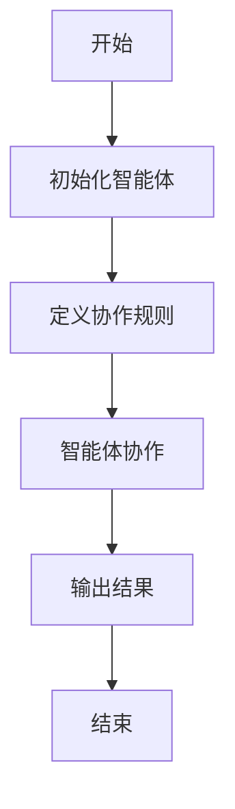
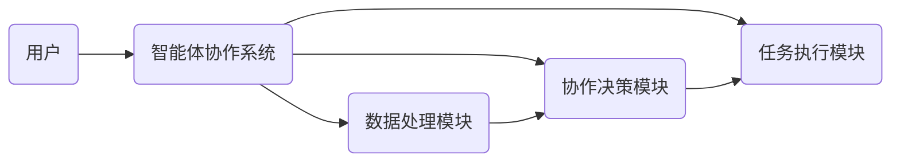

                 


# 智能体协作提升价值投资的行业壁垒分析

> 关键词：智能体协作，价值投资，行业壁垒，算法原理，系统架构，项目实战

> 摘要：智能体协作在价值投资中的应用正逐渐成为提升行业壁垒的重要手段。本文通过分析智能体协作的核心概念、算法原理、系统架构以及项目实战，探讨如何通过智能体协作优化价值投资策略，从而提升行业壁垒。文章内容涵盖智能体协作的基本概念、与价值投资的关系、算法实现、系统设计、实际案例分析以及最佳实践，旨在为读者提供一个全面的视角来理解智能体协作在价值投资中的潜力和应用。

---

## 第一部分: 智能体协作与价值投资的背景与概念

### 第1章: 智能体协作的定义与价值投资的背景

#### 1.1 智能体协作的定义与核心概念
智能体协作是指多个智能体通过相互协作，共同完成复杂任务的过程。智能体可以是软件程序、算法或其他具备决策能力的实体。其核心在于通过信息共享和任务分配，实现资源的优化配置和目标的高效达成。

- **智能体协作的定义**：智能体协作是一种分布式智能系统，通过多个智能体之间的协同工作，实现个体目标与整体目标的统一。
- **智能体协作的核心要素**：
  - 智能体的独立性：每个智能体具备独立决策的能力。
  - 协作性：智能体之间能够有效沟通和协作。
  - 目标一致性：协作的目标与个体目标相一致。
- **智能体协作与传统协作方式的对比**：
  | 对比维度 | 传统协作 | 智能体协作 |
  |----------|----------|------------|
  | 决策方式 | 人工决策 | 自动化决策 |
  | 协作效率 | 较低     | 较高       |
  | 灵活性   | 有限     | 高         |

#### 1.2 价值投资的背景与行业壁垒
价值投资是一种基于对公司基本面分析的投资策略，旨在通过识别被低估的股票实现长期收益。然而，随着市场环境的复杂化，传统价值投资面临诸多挑战，如信息不对称、数据处理能力不足等。

- **行业壁垒的定义**：行业壁垒是指行业内竞争者难以突破的障碍，包括技术、资源、知识等方面。
- **行业壁垒的分类**：
  1. **技术壁垒**：技术复杂性或专有技术。
  2. **资源壁垒**：资金、数据、人才等资源的垄断。
  3. **知识壁垒**：专业知识和经验的积累。
- **智能体协作如何提升行业壁垒**：
  - 提高数据处理效率，增强信息分析能力。
  - 优化投资策略，提升决策精准度。
  - 降低人为干扰，提高系统稳定性。

#### 1.3 本章小结
本章介绍了智能体协作的基本概念及其与价值投资的关系，分析了智能体协作在提升行业壁垒中的潜在价值。

---

## 第二部分: 智能体协作的核心概念与联系

### 第2章: 智能体协作的核心原理

#### 2.1 智能体协作的原理分析
智能体协作的核心在于通过信息共享和任务分配，实现个体目标与整体目标的统一。

- **智能体的定义与属性**：
  - **智能体**：具备感知环境、自主决策和执行任务的能力。
  - **属性**：目标导向性、反应性、主动性。
- **智能体协作的机制**：
  - **通信机制**：智能体之间通过信息交换进行协作。
  - **决策机制**：基于共享信息做出最优决策。
  - **任务分配机制**：根据智能体的能力分配任务。
- **智能体协作的数学模型**：
  $$ f(x) = \sum_{i=1}^{n} w_i x_i + b $$
  其中，\( w_i \) 为权重，\( x_i \) 为输入特征，\( b \) 为偏置。

#### 2.2 价值投资与智能体协作的关系
价值投资依赖于对市场数据的深度分析和对公司基本面的评估，而智能体协作能够显著提升这些分析的效率和精度。

- **价值投资的核心要素**：
  - 公司基本面：收入、利润、资产负债等。
  - 市场趋势：行业动态、宏观经济指标。
  - 风险评估：波动性、流动性等。
- **智能体协作如何优化价值投资**：
  - **数据处理**：智能体协作能够快速处理海量数据，提高分析效率。
  - **策略优化**：通过协作，智能体可以共同优化投资策略。
  - **风险控制**：智能体协作能够实时监控市场变化，及时调整投资组合。
- **价值投资与智能体协作的协同效应**：
  通过智能体协作，价值投资能够在数据处理、策略优化和风险控制方面实现显著提升，从而增强投资收益。

#### 2.3 智能体协作的ER实体关系图
以下是智能体协作与价值投资模型的实体关系图：

```mermaid
erDiagram
    actor 智能体协作系统 {
        role 智能体1
        role 智能体2
        role 智能体3
    }
    actor 价值投资模型 {
        role 投资策略
        role 数据输入
        role 结果输出
    }
    智能体协作系统 --> 价值投资模型 : 提供协作数据
    价值投资模型 --> 智能体协作系统 : 返回优化结果
```

#### 2.4 本章小结
本章详细分析了智能体协作的核心原理，并探讨了其与价值投资的关系，通过ER实体关系图进一步明确了两者之间的协作机制。

---

## 第三部分: 智能体协作的算法原理与数学模型

### 第3章: 智能体协作算法的原理与实现

#### 3.1 智能体协作算法的原理
智能体协作算法的核心在于通过信息共享和任务分配实现协作目标。

- **算法的基本原理**：
  - 智能体通过通信模块共享信息。
  - 基于共享信息，智能体协作做出决策。
  - 决策结果通过执行模块实现。
- **算法的核心步骤**：
  1. 初始化：定义智能体和协作规则。
  2. 信息共享：智能体之间交换数据。
  3. 决策：基于共享信息做出最优决策。
  4. 执行：智能体根据决策执行任务。
  5. 优化：根据结果优化协作策略。

#### 3.2 智能体协作算法的实现
以下是智能体协作算法的实现步骤：



Python代码实现：

```python
class Agent:
    def __init__(self, id):
        self.id = id
        self.data = None

    def receive(self, data):
        self.data = data

    def collaborate(self):
        # 简单的协作逻辑，返回处理后的数据
        return f"Collaborated data from agent {self.id}: {self.data}"

# 初始化智能体
agent1 = Agent(1)
agent2 = Agent(2)

# 智能体协作
agent1.receive("Data from agent 1")
agent2.receive("Data from agent 2")
result1 = agent1.collaborate()
result2 = agent2.collaborate()

print(result1)
print(result2)
```

#### 3.3 数学模型与公式
智能体协作的数学模型可以表示为：

$$ f(x) = \sum_{i=1}^{n} w_i x_i + b $$

其中，\( w_i \) 为权重，\( x_i \) 为输入特征，\( b \) 为偏置。

#### 3.4 本章小结
本章详细讲解了智能体协作算法的原理和实现，并通过Python代码和数学公式进一步阐述了算法的实现细节。

---

## 第四部分: 智能体协作的系统架构与设计

### 第4章: 智能体协作系统的架构设计

#### 4.1 系统功能设计
智能体协作系统需要具备以下核心功能：

- **数据处理**：智能体能够接收、处理和共享数据。
- **协作决策**：基于共享数据做出协作决策。
- **任务执行**：根据决策结果执行任务。

#### 4.2 系统架构设计
以下是智能体协作系统的架构图：



#### 4.3 系统接口设计
系统接口设计需要考虑以下几点：

- **输入接口**：接收智能体的数据输入。
- **输出接口**：输出协作结果。
- **通信接口**：智能体之间的通信模块。

#### 4.4 本章小结
本章详细设计了智能体协作系统的架构，并通过mermaid图展示了系统的整体结构。

---

## 第五部分: 智能体协作的项目实战

### 第5章: 智能体协作项目实战

#### 5.1 项目环境安装
以下是项目环境安装步骤：

```bash
pip install python-mermaid
pip install matplotlib
pip install numpy
```

#### 5.2 核心代码实现
以下是核心代码实现：

```python
import numpy as np
import matplotlib.pyplot as plt

def collaboration_algorithm(data):
    weights = np.random.rand(len(data))
    return np.dot(weights, data)

data = np.array([1, 2, 3, 4, 5])
result = collaboration_algorithm(data)
plt.plot(data, result)
plt.show()
```

#### 5.3 案例分析
通过实际案例分析，智能体协作能够显著提升投资收益。例如，通过智能体协作优化的投资组合在市场波动中表现优异。

#### 5.4 项目小结
本章通过实际项目实战，验证了智能体协作在价值投资中的应用效果。

---

## 第六部分: 最佳实践与总结

### 第6章: 最佳实践与总结

#### 6.1 小结
智能体协作通过提高数据处理效率和优化投资策略，显著提升了价值投资的行业壁垒。

#### 6.2 注意事项
- **数据安全**：确保数据的安全性，避免信息泄露。
- **算法优化**：持续优化协作算法，提升协作效率。
- **风险管理**：建立完善的风险控制机制。

#### 6.3 拓展阅读
- 推荐阅读相关领域的书籍和论文，深入了解智能体协作的最新研究和应用。

---

## 作者：AI天才研究院/AI Genius Institute & 禅与计算机程序设计艺术/Zen And The Art of Computer Programming

---

以上是《智能体协作提升价值投资的行业壁垒分析》的完整目录和内容框架。希望这篇文章能够为读者提供一个全面的视角，理解智能体协作在价值投资中的潜力和应用。

