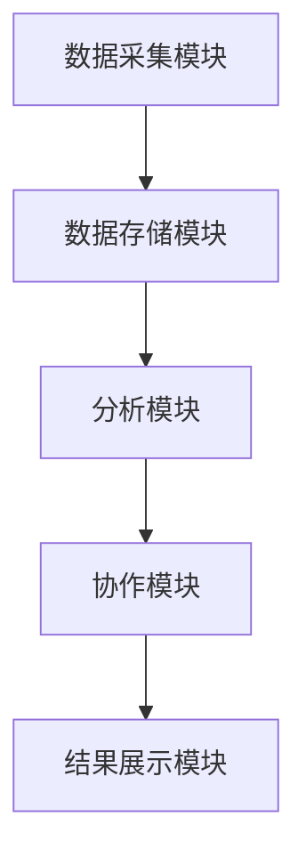

                 


# 智能体协作提高价值投资的全球宏观经济周期分析

> 关键词：智能体协作，价值投资，宏观经济周期，算法原理，系统架构，项目实战

> 摘要：本文探讨了智能体协作在价值投资中的应用，分析了宏观经济周期对投资策略的影响，并通过算法和系统设计，展示了如何利用智能体协作优化投资决策。文章详细讲解了算法原理、系统架构，并通过项目实战验证了智能体协作在宏观经济周期分析中的优势。

---

## 第一部分: 智能体协作与价值投资的背景介绍

### 第1章: 智能体协作的核心概念

#### 1.1 从传统AI到智能体协作的演进
智能体协作（Collaborative AI）是人工智能领域的一个新兴方向，它通过多个智能体之间的协作来实现更复杂的任务。传统AI通常以单点任务为目标，而智能体协作强调多智能体之间的协同合作，能够处理更加动态和复杂的场景。

#### 1.2 智能体协作的定义与核心要素
智能体协作是指多个智能体通过共享信息、协同决策和共同行动来完成特定目标的过程。其核心要素包括：
- **智能体**：具备感知和行动能力的主体。
- **协作机制**：智能体之间通信、协调的规则和协议。
- **目标函数**：协作所要达成的具体目标。

#### 1.3 智能体协作在价值投资中的应用背景
价值投资是一种基于对公司内在价值评估的投资策略，强调长期投资和基本面分析。智能体协作能够通过多智能体的协同工作，提高市场数据的分析效率和准确性，从而辅助投资者做出更明智的投资决策。

### 第2章: 智能体协作与宏观经济周期的关联

#### 2.1 智能体协作在宏观经济分析中的优势
- **数据处理能力**：多智能体协作能够处理海量的宏观经济数据，提高分析效率。
- **动态适应性**：智能体协作能够根据宏观经济环境的变化，实时调整分析策略。

#### 2.2 宏观经济周期对价值投资的影响
- **经济周期的波动性**：经济周期的波动直接影响资产价格，智能体协作能够帮助投资者识别周期性波动，优化投资策略。
- **多因素分析**：宏观经济周期受多种因素影响，如GDP、利率、通货膨胀等，智能体协作能够综合分析这些因素，提供更全面的分析结果。

### 第3章: 智能体协作在价值投资中的应用前景

#### 3.1 智能体协作在价值投资中的潜在应用场景
- **财务数据分析**：智能体协作可以用于分析公司财务数据，评估企业的内在价值。
- **市场情绪分析**：通过分析社交媒体和新闻数据，智能体协作可以预测市场情绪的变化，辅助投资决策。
- **资产配置优化**：智能体协作可以根据宏观经济环境的变化，优化资产配置策略。

---

## 第二部分: 智能体协作的算法原理

### 第2章: 智能体协作的算法实现

#### 2.1 算法原理
智能体协作的算法通常包括数据采集、特征提取、预测模型和结果分析四个步骤。

#### 2.2 数据采集
- **数据来源**：宏观经济数据（GDP、利率、通货膨胀率等）、市场数据（股票价格、成交量等）、新闻数据等。
- **数据预处理**：数据清洗、特征工程。

#### 2.3 特征提取
- **时间序列分析**：利用ARIMA模型提取宏观经济周期特征。
- **文本挖掘**：从新闻和社交媒体中提取情感特征。

#### 2.4 预测模型
- **机器学习模型**：随机森林、支持向量机（SVM）等。
- **深度学习模型**：LSTM用于时间序列预测。

#### 2.5 结果分析
- **决策规则**：基于预测结果制定投资策略。
- **风险控制**：通过智能体协作优化投资组合，降低风险。

#### 2.6 代码实现
```python
import pandas as pd
import numpy as np
from sklearn.ensemble import RandomForestRegressor
from sklearn.metrics import mean_squared_error

# 数据加载
data = pd.read_csv('macroeconomic_data.csv')

# 特征选择
features = data[['GDP', 'inflation', 'unemployment_rate']]
target = data['market_value']

# 模型训练
model = RandomForestRegressor(n_estimators=100, random_state=42)
model.fit(features, target)

# 预测
predicted = model.predict(features)
print(mean_squared_error(target, predicted))
```

---

## 第三部分: 系统分析与架构设计

### 第3章: 系统架构设计

#### 3.1 项目背景
本项目旨在利用智能体协作技术，分析全球宏观经济周期，辅助价值投资决策。

#### 3.2 系统功能设计
- **数据采集模块**：实时采集宏观经济数据。
- **分析模块**：利用智能体协作算法进行宏观经济周期分析。
- **协作模块**：智能体之间协同工作，优化分析结果。

#### 3.3 系统架构图


---

## 第四部分: 项目实战

### 第4章: 项目实战

#### 4.1 环境安装
- **Python**：安装Python 3.8以上版本。
- **库安装**：`pip install pandas numpy scikit-learn`

#### 4.2 核心代码实现
```python
import pandas as pd
from sklearn.ensemble import RandomForestRegressor

# 数据加载
data = pd.read_csv('macroeconomic_data.csv')

# 特征选择
features = data[['GDP', 'inflation', 'unemployment_rate']]
target = data['market_value']

# 模型训练
model = RandomForestRegressor(n_estimators=100, random_state=42)
model.fit(features, target)

# 预测
predicted = model.predict(features)
print("均方误差:", mean_squared_error(target, predicted))
```

#### 4.3 实际案例分析
通过实际数据的分析，展示智能体协作在宏观经济周期分析中的应用效果。

---

## 第五部分: 总结与展望

### 第5章: 总结与展望

#### 5.1 总结
本文探讨了智能体协作在价值投资中的应用，分析了宏观经济周期对投资策略的影响，并通过算法和系统设计，展示了如何利用智能体协作优化投资决策。

#### 5.2 展望
未来，随着人工智能技术的不断发展，智能体协作在价值投资中的应用将更加广泛和深入。同时，如何解决智能体协作中的协作效率和数据隐私问题，也是未来研究的重要方向。

---

## 作者信息

作者：AI天才研究院/AI Genius Institute & 禅与计算机程序设计艺术 /Zen And The Art of Computer Programming

