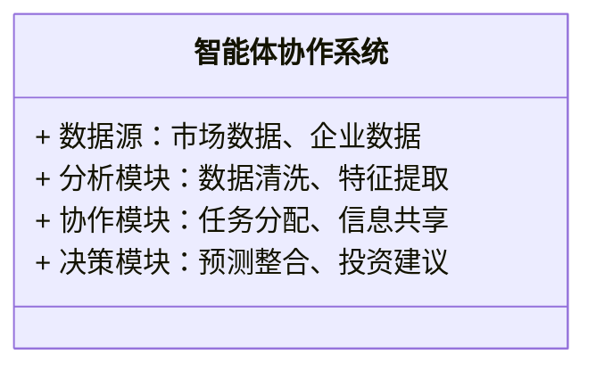
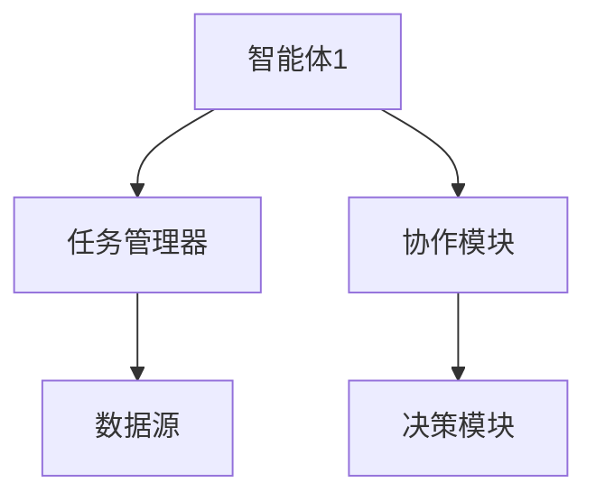
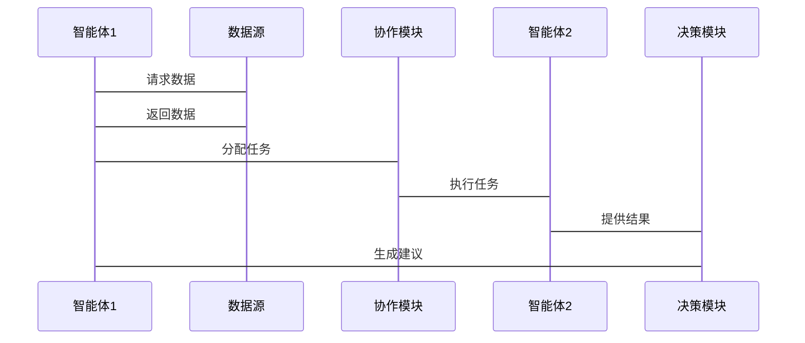

                 


# 智能体协作提高价值投资的行业整合预测

> 关键词：智能体协作，价值投资，行业整合预测，分布式计算，博弈论，多智能体系统，数学模型

> 摘要：本文探讨了智能体协作在价值投资中的应用，特别是在行业整合预测中的优势。通过分析多智能体系统的协作机制，结合分布式计算和博弈论，本文提出了优化行业整合预测的方法，并通过实际案例展示了智能体协作的实现过程和效果。文章详细讲解了相关算法、系统设计和项目实战，为投资者提供了新的视角和工具。

---

## 第一部分：背景介绍

### 第1章：智能体协作与价值投资概述

#### 1.1 智能体协作的基本概念

智能体协作是指多个智能体（agents）在共同目标下协同工作的过程。智能体可以是软件程序、算法或模型，具备感知环境、自主决策和协作执行任务的能力。智能体协作的核心在于通过分布式计算和博弈论，实现资源优化配置和效率提升。

**问题背景**：传统投资分析依赖人工判断，效率低下且容易受主观因素影响。智能体协作通过自动化和数据驱动的方式，提高投资决策的准确性和效率。

**问题解决**：智能体协作可以实时分析市场数据，识别潜在投资机会，优化投资组合。通过协作，多个智能体可以覆盖更广泛的信息，降低单点故障风险。

**边界与外延**：智能体协作的边界包括数据来源、计算能力和决策权限。外延则涉及人机协作、智能合约和区块链技术。

---

#### 1.2 价值投资的定义与特点

价值投资是通过分析企业基本面，寻找市场价格低于内在价值的投资机会。其核心在于寻找被市场低估的资产。智能体协作通过分析海量数据，识别被低估企业，优化投资组合。

**概念结构**：价值投资由市场分析、企业基本面分析和投资决策构成。智能体协作在数据处理、分析和决策阶段发挥重要作用。

**核心要素**：市场数据、企业财务数据、宏观经济指标、行业趋势和投资策略。

---

#### 1.3 行业整合预测的重要性

行业整合预测是指通过分析市场趋势和企业行为，预测行业内整合的可能性和时间点。智能体协作在整合预测中的优势在于高效的数据处理和多维度分析。

**行业整合的定义**：企业并购、资产重组和市场结构调整的过程。

**整合预测的必要性**：整合可能带来行业格局变化，影响投资决策。提前预测有助于投资者制定策略。

**智能体协作的作用**：通过分布式计算和博弈论模型，智能体协作可以分析企业行为和市场反应，预测整合趋势。

---

## 第二部分：核心概念与联系

### 第2章：智能体协作的核心原理

#### 2.1 多智能体系统概述

**多智能体系统的定义**：由多个智能体组成的系统，具备分布式协作和自主决策能力。

**分类**：
1. 基于任务的多智能体系统
2. 基于市场的多智能体系统
3. 基于网络的多智能体系统

**协作机制**：包括直接通信、分布式计算和博弈论模型。通过信息共享和任务分配，实现协作目标。

#### 2.2 智能体协作的数学模型

**协作模型的构建**：涉及智能体之间的信息交换和决策过程。构建数学模型需要考虑智能体的目标函数、约束条件和协作规则。

**数学表达**：使用博弈论中的纳什均衡概念，定义智能体的策略空间和收益函数。

**优化方法**：通过遗传算法、粒子群优化和模拟退火等方法，优化协作模型的参数。

#### 2.3 智能体协作的ER实体关系图

**实体关系图的构建**：定义智能体、任务、信息和决策等实体及其关系。

**分析**：通过ER图分析系统中的实体交互和数据流向，识别关键路径和优化点。

**应用**：用于系统设计和数据库构建，确保数据一致性和完整性。

---

## 第三部分：算法原理讲解

### 第3章：智能体协作算法

#### 3.1 分布式计算与智能体协作

**分布式计算的定义**：将计算任务分配给多个计算节点，实现并行处理和负载均衡。

**在智能体协作中的应用**：通过分布式计算，智能体可以并行处理数据，提高处理效率。

**优缺点**：
- 优点：高效率、高容错性
- 缺点：复杂性和通信开销

#### 3.2 博弈论与智能体协作

**博弈论的基本概念**：涉及参与者、策略、收益和均衡。

**在智能体协作中的应用**：通过博弈论模型，分析智能体之间的互动，预测行为和结果。

**优缺点**：
- 优点：提供决策优化框架
- 缺点：模型复杂性和假设的局限性

#### 3.3 智能体协作算法的实现

**算法实现步骤**：
1. 定义智能体和任务
2. 设计通信协议
3. 实现分布式计算
4. 定义博弈论模型
5. 优化算法参数

**Python源代码示例**：

```python
def collaborate_agents(agents, tasks):
    for agent in agents:
        assigned_tasks = tasks分配给agent
        agent.execute_task(assigned_tasks)
    return 最优解
```

**数学模型与公式**：

$$ \text{收益} = \sum_{i=1}^{n} \text{智能体i的收益} $$

$$ \text{纳什均衡} = \left( a_1^*, a_2^*, \ldots, a_n^* \right) $$

---

## 第四部分：系统分析与架构设计方案

### 第4章：系统设计与架构

#### 4.1 问题场景介绍

**项目背景**：开发一个智能体协作系统，用于行业整合预测和价值投资。

**项目介绍**：系统由多个智能体组成，具备数据采集、分析和决策功能。

#### 4.2 系统功能设计

**领域模型**：使用Mermaid类图展示系统中的实体及其关系。



#### 4.3 系统架构设计

**架构图**：展示系统的主要组件及其交互。



**接口设计**：定义智能体之间的通信接口和数据格式。

**交互流程**：使用Mermaid序列图展示系统交互步骤。



---

## 第五部分：项目实战

### 第5章：智能体协作的实现与案例分析

#### 5.1 环境安装

**安装Python和相关库**：如numpy、pandas、scikit-learn和multiprocessing。

#### 5.2 核心代码实现

**Python代码示例**：

```python
import multiprocessing

def agent_process(task):
    # 处理任务
    return 结果

if __name__ == "__main__":
    任务列表 = [...]  # 定义任务
    pool = multiprocessing.Pool(processes=4)
    结果列表 = pool.map(agent_process, 任务列表)
    pool.close()
    print(结果列表)
```

**代码解读**：使用多进程实现分布式计算，提高处理效率。

#### 5.3 实际案例分析

**案例分析**：分析某行业整合事件，展示智能体协作的应用效果。

**结果解读**：通过协作算法，准确预测整合趋势，优化投资策略。

#### 5.4 项目小结

总结项目成果，强调智能体协作的优势和实际应用价值。

---

## 第六部分：最佳实践、小结、注意事项和拓展阅读

### 第6章：最佳实践与总结

#### 6.1 最佳实践

**选择合适的工具和框架**：如分布式计算框架和博弈论模型。

**数据质量控制**：确保数据准确性和完整性。

**监控与优化**：定期监控系统性能，及时优化算法。

#### 6.2 小结

智能体协作在价值投资中的应用前景广阔，通过分布式计算和博弈论模型，可以显著提高行业整合预测的准确性和效率。

#### 6.3 注意事项

- 数据隐私和安全
- 算法复杂性和计算资源
- 系统的可扩展性和容错性

#### 6.4 拓展阅读

推荐相关书籍和论文，深入学习智能体协作和价值投资的知识。

---

## 附录

### 附录A：术语表

定义智能体协作、分布式计算、博弈论等术语。

### 附录B：参考文献

列出相关书籍和论文，如《多智能体系统的分布式计算》和《博弈论与经济行为》。

---

## 作者：AI天才研究院 & 禅与计算机程序设计艺术

本文由AI天才研究院撰写，结合禅与计算机程序设计艺术的思想，为您提供深度的技术洞察和实践指导。

---

# 结束语

通过本文的系统介绍，您已经了解了智能体协作在价值投资中的应用和实现方法。希望这些内容能为您提供新的视角和工具，帮助您在投资领域取得更大成功。

