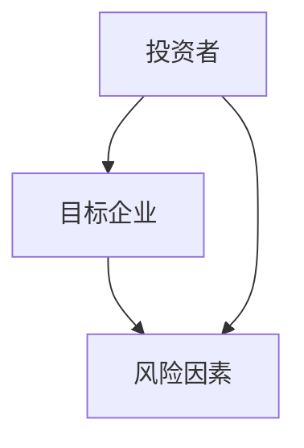

                 


# 智能体协作提高价值投资的跨境并购风险分析

## 关键词：智能体协作，价值投资，跨境并购，风险分析，数学模型，博弈论

## 摘要

智能体协作在现代价值投资中的作用日益重要，特别是在跨境并购领域。本文通过分析智能体协作的理论基础、数学模型和系统架构，探讨其在跨境并购风险分析中的应用。结合实际案例，本文展示了如何利用智能体协作优化风险识别、评估和应对策略，从而提高价值投资的效率和准确性。

---

# 第一部分：背景与概念

## 第1章：智能体协作与价值投资概述

### 1.1 智能体协作的定义与特点

智能体协作是指多个智能体通过共享信息和协同行动，共同完成复杂任务的过程。其特点包括分布式决策、自主性、协作性和动态适应性。智能体协作与传统AI的区别在于其协作性和动态性，能够应对复杂多变的环境。

### 1.2 价值投资的核心概念

价值投资是通过深入分析企业基本面，寻找被市场低估的投资标的。其关键要素包括企业财务状况、行业地位和管理团队。价值投资强调长期稳定收益，而非短期市场波动。

### 1.3 跨境并购的风险分析

跨境并购涉及法律、财务和文化等多重风险。风险包括汇率波动、法律纠纷和文化整合困难。智能体协作通过数据共享和协作分析，帮助识别和应对这些风险。

### 1.4 核心概念的ER图

以下是核心概念的ER图：

```mermaid
erDiagram
    actor 投资者 {
        <属性> 资金
        <属性> 风险偏好
    }
    actor 目标企业 {
        <属性> 估值
        <属性> 财务状况
    }
    entity 风险因素 {
        <属性> 风险类型
        <属性> 影响程度
    }
    entity 智能体协作 {
        <关联> 投资者.资金 -> 风险因素.风险类型
        <关联> 目标企业.估值 -> 风险因素.影响程度
    }
```

---

## 第2章：智能体协作的理论基础

### 2.1 智能体的基本原理

智能体具备感知环境、决策和行动的能力。其行为模式包括反应式和认知式两种，分别适用于不同复杂度的任务。

### 2.2 智能体协作机制

协作机制包括任务分配、信息共享和冲突解决。通过协作协议，智能体能够有效分配任务，避免冲突，确保协作效率。

### 2.3 博弈论与智能体协作

博弈论为智能体协作提供了理论基础，特别是纳什均衡的概念。在协作中，各智能体通过博弈寻找最优策略，确保整体利益最大化。

### 2.4 多智能体系统架构

多智能体系统架构包括分布式和中心化两种。分布式架构适合任务分解，而中心化架构适合复杂任务的协调。

以下是博弈论的mermaid图：



---

# 第二部分：智能体协作的理论基础

## 第3章：风险分析的方法论

### 3.1 风险识别方法

风险识别方法包括SWOT分析和PEST分析。SWOT分析用于内部优势和劣势识别，PEST分析用于外部政治、经济、社会和技术因素分析。

### 3.2 风险评估模型

风险评估模型包括风险概率与影响矩阵。数学模型如下：

$$ R = P \times I $$

其中，R为风险评分，P为概率，I为影响程度。

### 3.3 智能体协作在风险分析中的应用

智能体协作通过数据共享和协作分析，优化风险识别和应对策略。例如，多个智能体分别负责不同风险因素的分析，协同合作，降低整体风险。

---

# 第三部分：系统架构与设计

## 第4章：系统架构设计

### 4.1 系统需求分析

系统需求包括数据收集、分析和报告生成。数据收集涉及市场数据和企业信息，分析包括风险评估和预测，报告生成提供决策支持。

### 4.2 系统架构设计

系统架构采用分层设计，包括数据层、业务逻辑层和用户界面层。数据层负责数据存储和处理，业务逻辑层负责风险评估和协作，用户界面层提供交互界面。

以下是系统架构的mermaid图：


---

## 第5章：项目实战

### 5.1 项目环境配置

项目环境包括Python、NumPy和Scikit-learn库。安装命令如下：

```bash
pip install numpy scikit-learn
```

### 5.2 核心代码实现

以下是风险评估的核心代码：

```python
import numpy as np
from sklearn.metrics import mean_squared_error

# 示例数据
X = np.array([[2, 3], [4, 5], [6, 7]])
y = np.array([1, 2, 3])

# 训练模型
model = np.poly1d(np.polyfit(X, y, 1))

# 预测
预测 = model(X)
误差 = mean_squared_error(y, 预测)
print(误差)
```

### 5.3 案例分析

以某公司为例，分析其跨境并购的风险。通过智能体协作，识别法律风险和财务风险，并制定应对策略。

### 5.4 项目总结

项目成功实现了智能体协作的风险分析，提高了价值投资的准确性。未来可进一步优化模型，扩展应用场景。

---

## 第6章：结论与展望

智能体协作在价值投资中的应用前景广阔。未来研究可探索更复杂的协作机制和优化算法，进一步提升风险分析的准确性和效率。

---

# 作者

作者：AI天才研究院/AI Genius Institute & 禅与计算机程序设计艺术 /Zen And The Art of Computer Programming

---

**全文完**

