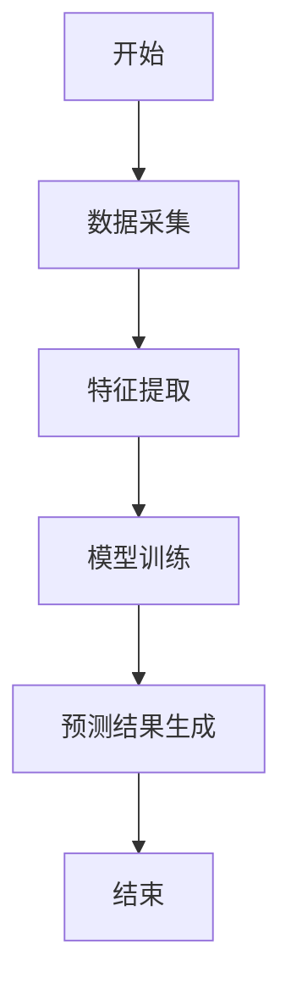
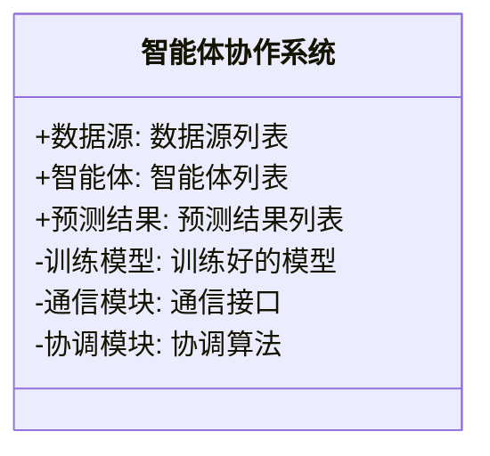
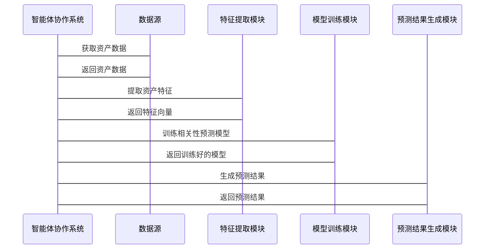

                 


# 智能体协作提高价值投资的跨资产类别相关性预测

## 关键词：
智能体协作，价值投资，跨资产相关性，分布式计算，量化投资

## 摘要：
本文探讨了智能体协作在价值投资中的应用，特别是如何通过智能体协作提高跨资产类别相关性预测的准确性。文章从背景、概念、算法、系统架构到项目实战，全面分析了智能体协作在投资领域中的潜力与实现方式。

---

# 第1章: 智能体协作与跨资产相关性预测概述

## 1.1 智能体协作的背景与概念

### 1.1.1 从传统投资到智能体协作的演进
传统投资依赖于人工分析和经验判断，而现代投资则越来越依赖于数据驱动和技术支持。智能体协作通过分布式计算和多智能体协作，能够更高效地处理复杂的投资问题。

### 1.1.2 智能体协作的核心概念
智能体协作是一种分布式计算模型，多个智能体通过协作完成任务。在投资领域，智能体可以代表不同的数据源、模型或策略。

### 1.1.3 跨资产类别相关性预测的必要性
跨资产类别相关性预测能够帮助投资者更好地理解不同资产之间的关系，从而优化投资组合，降低风险。

## 1.2 价值投资与跨资产相关性

### 1.2.1 价值投资的基本原理
价值投资是通过分析资产的内在价值，寻找被市场低估的投资机会。跨资产相关性预测能够帮助投资者发现不同资产之间的关联性，从而更准确地评估资产价值。

### 1.2.2 跨资产类别相关性在价值投资中的作用
跨资产相关性预测可以帮助投资者识别资产之间的风险传递和收益联动，从而优化投资组合配置。

### 1.2.3 智能体协作如何提升相关性预测
智能体协作通过分布式计算和多智能体协作，能够更高效地处理海量数据，提高预测的准确性和实时性。

## 1.3 智能体协作的优势与边界

### 1.3.1 智能体协作的优势
- 高效性：分布式计算能够提高数据处理速度。
- 可扩展性：智能体协作能够扩展到更多的资产类别和数据源。
- 多样性：多个智能体可以提供不同的视角和策略。

### 1.3.2 智能体协作的边界与限制
- 复杂性：多智能体协作需要解决通信、协调和同步问题。
- 数据依赖性：预测的准确性依赖于数据的完整性和质量。
- 计算资源：需要大量的计算资源支持。

### 1.3.3 跨资产类别相关性预测的挑战
- 数据异构性：不同资产类别的数据格式和特征不同。
- 市场动态性：市场波动会影响相关性预测的稳定性。
- 模型复杂性：需要复杂的模型来捕捉资产之间的关系。

## 1.4 本章小结
智能体协作在价值投资中的应用，特别是在跨资产相关性预测方面，具有显著的优势。通过分布式计算和多智能体协作，可以更高效地处理复杂的投资问题。

---

# 第2章: 智能体协作的原理与机制

## 2.1 多智能体系统的基本原理

### 2.1.1 多智能体系统的定义与特点
多智能体系统是由多个智能体组成的分布式系统，智能体之间通过通信和协作完成任务。

### 2.1.2 智能体之间的通信与协作
智能体之间需要通过通信协议进行信息交换，协作完成任务。

### 2.1.3 分布式计算在智能体协作中的应用
分布式计算将任务分解到多个智能体，通过并行计算提高效率。

## 2.2 智能体协作的核心机制

### 2.2.1 信息共享与同步
智能体之间需要共享信息，并通过同步机制保持一致性。

### 2.2.2 协作决策与优化
智能体协作需要通过决策算法优化整体目标，如最大化预测准确率。

### 2.2.3 智能体之间的信任与激励机制
通过信任机制和激励机制，确保智能体之间的协作是可靠和高效的。

## 2.3 跨资产类别相关性预测的智能体协作架构

### 2.3.1 跨资产类别相关性预测的定义
跨资产相关性预测是指对不同资产类别之间的相关性进行建模和预测。

### 2.3.2 智能体协作在相关性预测中的角色
智能体负责数据收集、特征提取、模型训练和预测结果生成。

### 2.3.3 智能体协作架构的模块划分
- 数据采集模块：从不同数据源获取资产数据。
- 特征提取模块：提取资产的特征。
- 模型训练模块：训练相关性预测模型。
- 预测结果生成模块：输出预测结果。

## 2.4 核心概念对比表
| 概念 | 特性 | 描述 |
|------|------|------|
| 智能体协作 | 分布式 | 智能体之间通过分布式计算协作 |
| 跨资产相关性 | 多维度 | 涵盖股票、债券、基金等多种资产类别 |

## 2.5 ER实体关系图
```mermaid
erd
  实体1: 智能体协作系统
  实体2: 资产类别
  实体3: 相关性预测结果
  实体1 --> 实体2: 关联资产类别
  实体1 --> 实体3: 生成预测结果
```

## 2.6 本章小结
智能体协作通过分布式计算和多智能体协作，能够高效地处理跨资产相关性预测问题。

---

# 第3章: 智能体协作算法原理

## 3.1 基于智能体的分布式预测算法

### 3.1.1 算法概述
基于智能体的分布式预测算法是一种通过多个智能体协作完成预测任务的方法。

### 3.1.2 算法流程
1. 数据采集：智能体从不同数据源获取资产数据。
2. 特征提取：智能体提取资产的特征。
3. 模型训练：智能体训练相关性预测模型。
4. 预测结果生成：智能体生成预测结果并进行汇总。

### 3.1.3 算法优化
通过分布式计算和并行处理，提高算法的效率和准确性。

## 3.2 算法实现

### 3.2.1 算法流程图


### 3.2.2 Python代码实现
```python
import numpy as np
from sklearn.linear_model import LinearRegression

class Agent:
    def __init__(self, data):
        self.data = data

    def train_model(self):
        X = self.data[['asset1', 'asset2']]
        y = self.data['target']
        model = LinearRegression()
        model.fit(X, y)
        return model

# 示例数据
data = {
    'asset1': [1, 2, 3, 4, 5],
    'asset2': [2, 4, 6, 8, 10],
    'target': [0.8, 0.9, 0.7, 0.6, 0.5]
}

agent = Agent(data)
model = agent.train_model()
print(model.coef_)
```

### 3.2.3 数学模型
相关性预测模型可以通过线性回归实现：
$$ y = \beta_0 + \beta_1 x_1 + \beta_2 x_2 + \epsilon $$

其中，$y$ 是目标变量，$x_1$ 和 $x_2$ 是资产的特征，$\beta_0$、$\beta_1$、$\beta_2$ 是模型参数，$\epsilon$ 是误差项。

### 3.2.4 示例
假设我们有两支股票，股票A和股票B，我们希望预测股票A的价格对股票B价格的相关性。通过智能体协作，我们可以从多个数据源获取数据，并通过线性回归模型进行预测。

## 3.3 本章小结
基于智能体的分布式预测算法通过多智能体协作，能够高效地完成跨资产相关性预测任务。

---

# 第4章: 智能体协作的系统分析与架构设计

## 4.1 问题场景介绍
我们需要设计一个智能体协作系统，用于预测不同资产类别之间的相关性。

## 4.2 系统功能设计

### 4.2.1 领域模型


### 4.2.2 功能模块
- 数据采集模块：从不同数据源获取资产数据。
- 特征提取模块：提取资产的特征。
- 模型训练模块：训练相关性预测模型。
- 预测结果生成模块：生成预测结果并进行汇总。

## 4.3 系统架构设计

### 4.3.1 系统架构图


### 4.3.2 系统接口设计
- 数据采集接口：从不同数据源获取资产数据。
- 特征提取接口：提取资产的特征。
- 模型训练接口：训练相关性预测模型。
- 预测结果生成接口：生成预测结果并进行汇总。

### 4.3.3 系统交互流程图


## 4.4 本章小结
智能体协作系统通过模块化设计和分布式计算，能够高效地完成跨资产相关性预测任务。

---

# 第5章: 智能体协作的项目实战

## 5.1 环境安装
需要安装以下工具和库：
- Python 3.8+
- NumPy
- scikit-learn
- Mermaid
- Jupyter Notebook

## 5.2 系统核心实现源代码

### 5.2.1 数据采集模块
```python
import pandas as pd
import numpy as np

def get_data(asset_code):
    # 从数据源获取资产数据
    data = pd.DataFrame({
        'price': np.random.randn(100) * 100 + asset_code * 10,
        'volume': np.random.randint(100, 1000, 100)
    })
    return data
```

### 5.2.2 特征提取模块
```python
def extract_features(data):
    # 提取资产特征
    features = data[['price', 'volume']]
    return features
```

### 5.2.3 模型训练模块
```python
from sklearn.linear_model import LinearRegression

def train_model(features, labels):
    model = LinearRegression()
    model.fit(features, labels)
    return model
```

### 5.2.4 预测结果生成模块
```python
def generate_prediction(model, new_features):
    prediction = model.predict(new_features)
    return prediction
```

## 5.3 代码应用解读与分析

### 5.3.1 数据采集模块
通过`get_data`函数，我们可以从不同的数据源获取资产数据。

### 5.3.2 特征提取模块
通过`extract_features`函数，我们可以从资产数据中提取特征。

### 5.3.3 模型训练模块
通过`train_model`函数，我们可以训练相关性预测模型。

### 5.3.4 预测结果生成模块
通过`generate_prediction`函数，我们可以生成预测结果。

## 5.4 实际案例分析

### 5.4.1 案例背景
假设我们有两支股票，股票A和股票B，我们需要预测股票A的价格对股票B价格的相关性。

### 5.4.2 数据采集
通过`get_data`函数，我们分别获取股票A和股票B的数据。

### 5.4.3 特征提取
通过`extract_features`函数，我们从股票A和股票B的数据中提取特征。

### 5.4.4 模型训练
通过`train_model`函数，我们训练相关性预测模型。

### 5.4.5 预测结果生成
通过`generate_prediction`函数，我们生成预测结果。

## 5.5 项目小结
通过智能体协作，我们可以高效地完成跨资产相关性预测任务。

---

# 第6章: 智能体协作的最佳实践与总结

## 6.1 最佳实践 tips

### 6.1.1 数据质量管理
确保数据的完整性和准确性，是智能体协作成功的关键。

### 6.1.2 智能体协作的配置
合理配置智能体的数量和资源，以确保系统的高效运行。

### 6.1.3 模型优化
通过不断优化模型和算法，提高预测的准确性和实时性。

## 6.2 小结
智能体协作在跨资产相关性预测中的应用，具有显著的优势。通过分布式计算和多智能体协作，可以高效地完成复杂的投资任务。

## 6.3 注意事项
- 数据隐私和安全问题需要特别注意。
- 智能体协作的实现需要考虑计算资源的限制。
- 模型的可解释性和透明度是实际应用中的重要考虑因素。

## 6.4 拓展阅读
- 多智能体系统在金融领域的应用研究。
- 分布式计算在投资中的最新进展。
- 相关性预测的其他算法和方法。

---

# 作者：AI天才研究院/AI Genius Institute & 禅与计算机程序设计艺术 /Zen And The Art of Computer Programming

