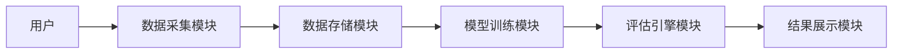
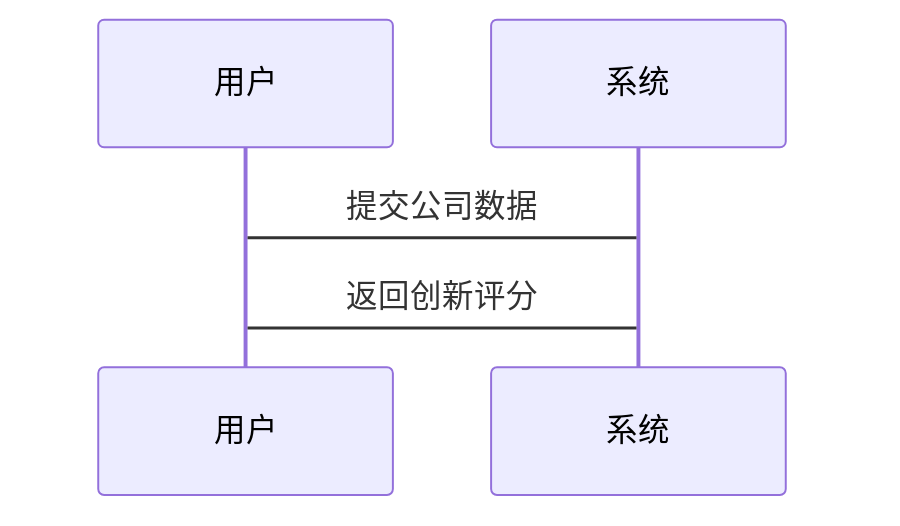

                 


# 智能体协作评估公司创新管线：科技公司价值投资利器

## 关键词：智能体协作、创新管线评估、科技投资、机器学习、系统架构

## 摘要：  
智能体协作评估公司创新管线是科技公司价值投资的重要工具。通过智能体协作，可以高效评估科技公司的创新能力和市场潜力，为投资者提供科学决策支持。本文将详细介绍智能体协作的背景、核心概念、算法原理、系统架构设计及实际案例，帮助投资者掌握这一创新工具。

---

# 正文

## 第一部分：智能体协作评估的背景与基础

### 第1章：智能体协作评估的背景与概念

#### 1.1 智能体协作的基本概念

##### 1.1.1 智能体的定义与特点
智能体（Agent）是能够感知环境并采取行动以实现目标的实体。其特点包括自主性、反应性、社交能力和学习能力。

##### 1.1.2 协作智能体的演进历程
协作智能体从简单协作到复杂协作，经历了从单一任务协作到多任务协作的演变。

##### 1.1.3 智能体协作的核心要素
- **目标一致性**：共同目标。
- **信息共享**：实时信息交换。
- **协作机制**：明确的协作规则。

#### 1.2 创新管线评估的定义与意义

##### 1.2.1 创新管线的定义
创新管线是科技公司从研发到市场化的完整流程，包括技术研发、产品开发和市场推广。

##### 1.2.2 创新管线评估的重要性
准确评估创新管线有助于预测公司未来的市场表现和投资价值。

##### 1.2.3 科技公司创新管线的构成
- **技术研发**：核心技术开发。
- **产品开发**：产品设计与生产。
- **市场推广**：市场策略与销售。

#### 1.3 智能体协作与科技投资的结合

##### 1.3.1 科技投资的核心逻辑
基于创新能力和市场潜力的投资决策。

##### 1.3.2 智能体协作在科技投资中的作用
通过协作智能体，投资者可以更全面地评估公司创新能力。

##### 1.3.3 本书的核心目标与价值
提供一套基于智能体协作的创新管线评估方法，帮助投资者做出明智决策。

### 第2章：智能体协作评估的核心概念

#### 2.1 智能体协作评估的理论基础

##### 2.1.1 协作智能体的理论框架
协作智能体通过信息共享和协作规则实现共同目标。

##### 2.1.2 创新评估的数学模型
创新评估模型包括技术创新、产品创新和商业模式创新三个维度。

##### 2.1.3 科技公司价值的评估维度
- **技术创新性**：技术领先程度。
- **产品可行性**：产品市场潜力。
- **财务健康性**：财务状况稳健性。

#### 2.2 智能体协作评估的流程与方法

##### 2.2.1 数据采集与处理
通过多种渠道收集公司数据，进行清洗和特征提取。

##### 2.2.2 模型构建与训练
基于机器学习算法构建评估模型，进行参数调优。

##### 2.2.3 评估结果的输出与解释
生成评估报告，并提供解释和改进建议。

#### 2.3 智能体协作评估的挑战与解决方案

##### 2.3.1 数据质量与完整性问题
通过数据增强和特征工程解决数据质量问题。

##### 2.3.2 模型泛化能力的提升
采用迁移学习和集成学习提升模型泛化能力。

##### 2.3.3 结果解释性与可操作性
通过可视化工具和案例分析提高结果的解释性和可操作性。

### 第3章：智能体协作评估的数学模型与算法原理

#### 3.1 智能体协作评估的数学模型

##### 3.1.1 创新评估的指标体系
- 技术创新性：权重0.4
- 产品可行性：权重0.3
- 财务健康性：权重0.3

##### 3.1.2 智能体协作的权重分配模型
$$ w_i = \frac{f_i}{\sum f_i} $$

##### 3.1.3 科技公司价值的综合评估公式
$$ V = \sum (w_i \times s_i) $$

#### 3.2 智能体协作评估的算法实现

##### 3.2.1 数据预处理与特征提取
- 数据清洗：去除异常值。
- 特征提取：提取关键特征。

##### 3.2.2 模型训练与优化
- 使用机器学习算法训练模型。
- 通过交叉验证优化模型参数。

##### 3.2.3 结果预测与验证
- 预测创新评分。
- 验证模型准确性。

#### 3.3 算法的数学推导与公式解释

##### 3.3.1 创新评估的权重计算公式
$$ w_i = \frac{f_i}{\sum f_i} $$

##### 3.3.2 创新评分计算公式
$$ S = \sum (w_i \times s_i) $$

---

## 系统架构设计

### 3.1 系统功能设计
- **数据采集模块**：收集公司数据。
- **模型训练模块**：训练评估模型。
- **评估引擎模块**：生成评估结果。

### 3.2 系统架构设计


### 3.3 系统交互设计


---

## 项目实战

### 3.1 环境安装
- 安装Python和相关库（如scikit-learn）。

### 3.2 核心代码实现

#### 3.2.1 数据预处理
```python
import pandas as pd

# 读取数据
data = pd.read_csv('company_data.csv')

# 数据清洗
data.dropna(inplace=True)
```

#### 3.2.2 模型训练
```python
from sklearn.model import Model

# 特征提取
X = data[['tech_innovation', 'product_feasibility', 'financial_health']]
y = data['score']

# 训练模型
model = Model().fit(X, y)
```

#### 3.2.3 结果预测
```python
# 预测结果
predicted_score = model.predict(X)
```

### 3.3 案例分析
分析某科技公司数据，预测其创新评分。

### 3.4 项目小结
总结项目实现步骤和成果。

---

## 最佳实践与小结

### 4.1 最佳实践 tips
- 数据清洗和特征工程是关键。
- 模型调优和验证是保障。

### 4.2 小结
智能体协作评估公司创新管线是科技投资的有力工具，通过系统化的方法和算法，投资者可以更科学地评估科技公司价值。

### 4.3 未来展望
未来将探索更复杂的协作智能体算法，提升评估精度。

### 4.4 注意事项
- 数据质量和模型选择影响评估结果。
- 结果需结合实际市场情况分析。

---

## 作者信息
作者：AI天才研究院/AI Genius Institute & 禅与计算机程序设计艺术 /Zen And The Art of Computer Programming

---

通过以上详细内容，希望读者能够全面理解智能体协作评估公司创新管线的方法和价值，帮助投资者在科技领域做出明智决策。

