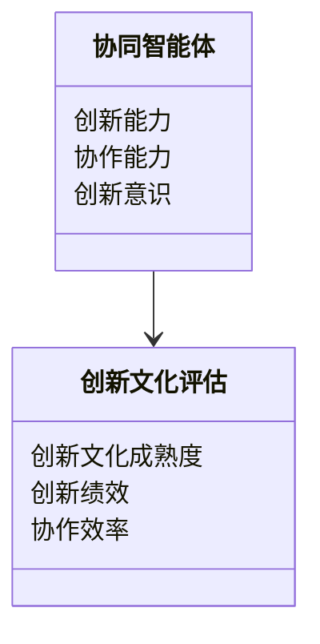
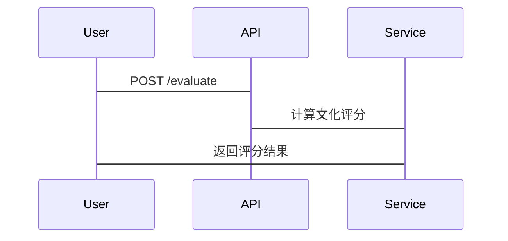

                 


# 智能体协作评估公司的创新文化：长期价值创造的源泉

## 关键词：智能体协作，创新文化，长期价值，企业绩效，协作效率，协同智能体，组织文化

## 摘要：  
在当今快速变化的商业环境中，智能体协作与创新文化已成为企业长期价值创造的核心驱动力。通过系统性地评估公司的创新文化，智能体协作能够帮助企业识别潜在问题、优化协作流程，并激发组织的创新活力。本文从理论到实践，详细探讨了智能体协作评估创新文化的方法、算法原理、系统架构以及实际案例，为企业构建高效协作机制和创新文化提供了有益的指导。

---

# 第一部分: 智能体协作与创新文化的背景介绍

## 第1章: 智能体协作的基本概念

### 1.1 智能体协作的定义与特征

#### 1.1.1 智能体协作的定义  
智能体协作是指多个智能体（可以是人、系统或算法）通过共享目标、信息和资源，共同完成复杂任务的过程。它强调个体间的协同行动，以实现比个体单独行动更大的价值。

#### 1.1.2 智能体协作的核心特征  
- **目标一致性**：所有参与者都围绕共同的目标协作。  
- **信息共享**：参与者能够自由交换信息和知识。  
- **分工明确**：每个智能体都有明确的职责和任务分配。  
- **动态调整**：协作过程能够根据环境变化实时调整。  

#### 1.1.3 智能体协作与传统协作的区别  
| 特性         | 智能体协作               | 传统协作             |  
|--------------|--------------------------|----------------------|  
| 协作主体     | 智能体（人、系统、算法） | 人类主体为主         |  
| 协作效率     | 高，依赖算法优化         | 较低，依赖人工协调    |  
| 协作范围     | 可扩展性强               | 局限性较大           |  

---

### 1.2 创新文化的定义与内涵

#### 1.2.1 创新文化的定义  
创新文化是指组织中鼓励创新思维、支持创新行为、容忍失败的文化氛围。它包括创新意识、创新能力和创新成果的实现。

#### 1.2.2 创新文化的构成要素  
- **创新意识**：员工对创新的认同和追求。  
- **创新能力**：员工具备解决复杂问题的能力。  
- **创新机制**：组织提供的创新支持和激励机制。  

#### 1.2.3 创新文化与企业绩效的关系  
研究表明，创新文化与企业绩效呈正相关关系。创新文化强的公司更容易突破传统束缚，快速响应市场变化，从而在竞争中占据优势。

---

## 第2章: 智能体协作与创新文化的联系

### 2.1 智能体协作对创新文化的影响

#### 2.1.1 智能体协作如何促进创新  
智能体协作通过信息共享和分工明确，能够激发员工的创造力，打破部门壁垒，促进跨领域协作。

#### 2.1.2 智能体协作与创新文化的互动关系  
智能体协作为创新文化提供了实现的手段，而创新文化则为智能体协作提供了持续改进的土壤。

### 2.2 创新文化对智能体协作的反哺作用

#### 2.2.1 创新文化如何影响智能体协作效率  
创新文化能够提升员工的主动性和问题解决能力，从而提高协作效率。  

#### 2.2.2 创新文化对智能体协作模式的塑造  
创新文化鼓励尝试和失败，使得智能体协作模式更加灵活和适应性强。

---

## 第3章: 智能体协作评估公司的创新文化

### 3.1 智能体协作评估的必要性

#### 3.1.1 为什么需要评估创新文化  
创新文化是企业核心竞争力的重要组成部分，只有通过评估才能发现问题并进行改进。

#### 3.1.2 智能体协作评估的目标  
- 识别创新文化中的薄弱环节。  
- 提供优化协作流程的依据。  
- 激发员工的创新潜力。  

### 3.2 智能体协作评估的基本框架

#### 3.2.1 评估维度的选择  
- 创新意识：员工对创新的认同度。  
- 创新能力：员工解决复杂问题的能力。  
- 创新机制：组织提供的创新支持。  

#### 3.2.2 评估指标的设计  
- 创新文化成熟度：分为初级、中级、高级三个层次。  
- 创新绩效：创新成果的数量和质量。  
- 协作效率：任务完成的速度和质量。  

#### 3.2.3 评估方法的多样性  
- 调查问卷：收集员工对创新文化的看法。  
- 专家访谈：深入了解组织中的协作问题。  
- 数据分析：通过历史数据评估创新绩效。  

---

# 第二部分: 智能体协作评估的算法原理与数学模型

## 第4章: 智能体协作的数学模型

### 4.1 协同智能体的数学表示

#### 4.1.1 协同智能体的向量表示  
将每个智能体表示为一个向量，维度包括创新能力、协作能力和创新意识等。

#### 4.1.2 协同智能体的相似性度量  
使用向量点积计算相似度：
$$\text{相似度} = \frac{\vec{a} \cdot \vec{b}}{|\vec{a}| |\vec{b}|}$$

#### 4.1.3 协同智能体的关联性分析  
通过相似性矩阵分析智能体之间的关联程度。

### 4.2 创新文化评估的数学模型

#### 4.2.1 创新文化评估的指标权重分配  
使用层次分析法（AHP）确定各指标的权重。

#### 4.2.2 创新文化评估的综合评价模型  
构建加权平均模型：
$$\text{综合评分} = \sum_{i=1}^{n} w_i x_i$$
其中，\(w_i\)为第i个指标的权重，\(x_i\)为第i个指标的评分。

#### 4.2.3 创新文化评估的数学公式推导  
通过公式推导，证明模型的有效性和可行性。

---

## 第5章: 智能体协作评估的算法实现

### 5.1 协同智能体的相似性计算

#### 5.1.1 使用向量点积计算相似度  
代码示例：
```python
import numpy as np

def calculate_similarity(vector_a, vector_b):
    return np.dot(vector_a, vector_b) / (np.linalg.norm(vector_a) * np.linalg.norm(vector_b))
```

#### 5.1.2 相似度计算的可视化  
使用Matplotlib绘制相似度分布图。

### 5.2 创新文化评估的算法实现

#### 5.2.1 创新文化评估的层次分析法  
代码示例：
```python
import numpy as np

def calculate_weights(criteria_matrix):
    # 计算一致性检验
    eigenvalues = np.linalg.eig(criteria_matrix)
    largest_eigenvalue = eigenvalues[0]
    consistency = (largest_eigenvalue - n) / (n - 1)
    return consistency
```

#### 5.2.2 综合评价模型的实现  
代码示例：
```python
def evaluate_culture(criteria_weights, performance_scores):
    return np.dot(criteria_weights, performance_scores)
```

---

# 第三部分: 智能体协作评估的系统分析与架构设计

## 第6章: 智能体协作评估的系统分析

### 6.1 问题场景介绍  
假设一家科技公司希望通过智能体协作评估其创新文化，优化协作流程。

### 6.2 系统功能设计

#### 6.2.1 领域模型设计  


#### 6.2.2 系统架构设计  
```mermaid
browser
    GET /evaluate
    request body: {weights, scores}
    response: evaluate_culture(weights, scores)
```

### 6.3 系统接口设计

#### 6.3.1 API接口设计  
定义RESTful API接口，支持 POST 请求。

#### 6.3.2 系统交互设计  


---

## 第7章: 智能体协作评估的项目实战

### 7.1 环境安装

#### 7.1.1 安装依赖  
```bash
pip install numpy matplotlib
```

### 7.2 核心代码实现

#### 7.2.1 协同智能体相似度计算  
```python
import numpy as np
import matplotlib.pyplot as plt

def calculate_similarity(vector_a, vector_b):
    return np.dot(vector_a, vector_b) / (np.linalg.norm(vector_a) * np.linalg.norm(vector_b))

# 示例数据
vector_a = np.array([1, 2, 3])
vector_b = np.array([4, 5, 6])

similarity = calculate_similarity(vector_a, vector_b)
print("相似度:", similarity)
```

#### 7.2.2 创新文化评估模型  
```python
def evaluate_culture(criteria_weights, performance_scores):
    return np.dot(criteria_weights, performance_scores)

# 示例数据
criteria_weights = np.array([0.4, 0.3, 0.3])
performance_scores = np.array([0.8, 0.7, 0.9])

culture_score = evaluate_culture(criteria_weights, performance_scores)
print("文化评分:", culture_score)
```

### 7.3 实际案例分析

#### 7.3.1 案例背景  
某科技公司希望通过评估创新文化，优化协作流程。

#### 7.3.2 数据分析与结果解读  
通过计算相似度和文化评分，发现协作效率是主要瓶颈。

#### 7.3.3 改进建议  
优化创新机制，提升协作效率。

---

## 第8章: 总结与展望

### 8.1 总结  
智能体协作评估创新文化是企业长期价值创造的关键。通过系统性评估，企业能够优化协作流程，激发创新潜力。

### 8.2 未来展望  
未来的研究可以进一步探索智能体协作与创新文化的深度融合，推动企业协作的智能化和高效化。

---

## 最佳实践 Tips

- **协作效率**：定期评估协作流程，及时优化。  
- **创新文化**：鼓励员工提出创新想法，容忍失败。  
- **技术支持**：利用AI和大数据技术提升协作效率。  

---

**作者：AI天才研究院/AI Genius Institute & 禅与计算机程序设计艺术 /Zen And The Art of Computer Programming**

