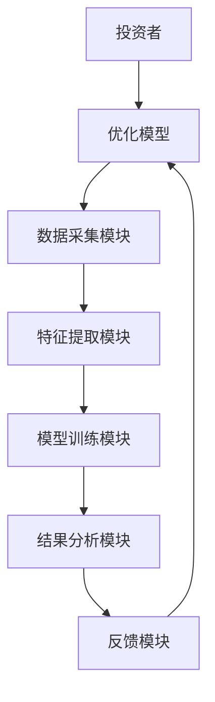
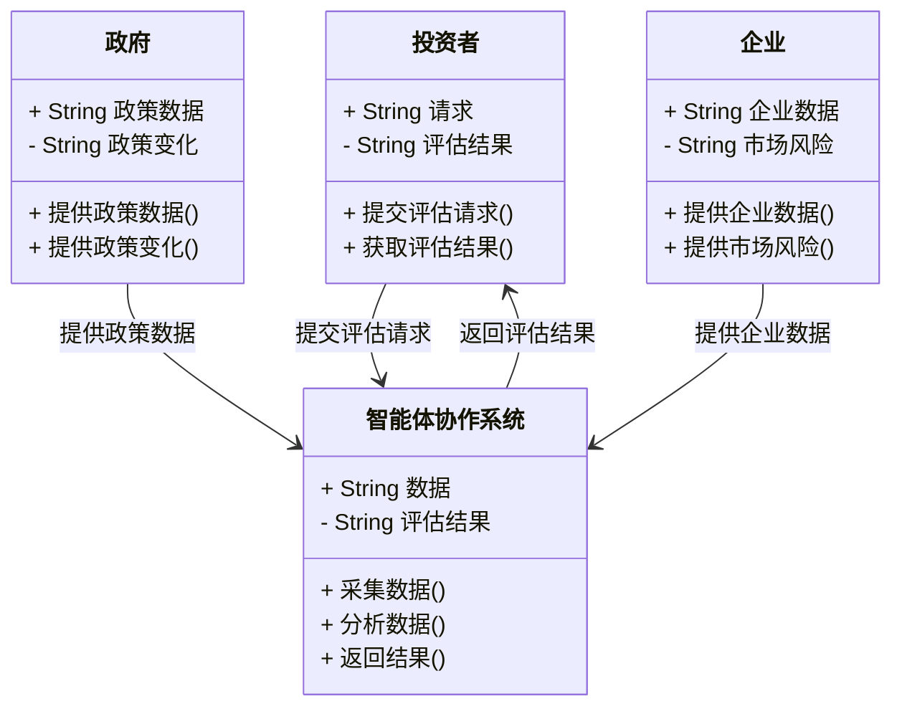

                 


# 智能体协作评估公司的地缘政治风险：全球价值投资必备

> **关键词**：智能体协作、地缘政治风险、全球价值投资、算法实现、系统架构设计、案例分析

> **摘要**：  
> 地缘政治风险是影响企业价值评估的重要因素，尤其是在全球化背景下。智能体协作作为一种新兴的评估方法，能够通过分布式计算和多目标优化，为企业提供更精准的地缘政治风险评估。本文从智能体协作的基本原理出发，结合实际案例，详细探讨其在地缘政治风险评估中的应用，并通过算法实现和系统架构设计，为全球价值投资者提供实用的解决方案。

---

# 第一部分：地缘政治风险与智能体协作评估的背景

## 第1章：地缘政治风险的重要性

### 1.1 地缘政治风险的核心概念

#### 1.1.1 地缘政治风险的定义  
地缘政治风险是指由于国家间的冲突、政策变化、资源争夺等因素，对企业运营和价值产生的潜在威胁。  

#### 1.1.2 地缘政治风险的演变  
从传统的地缘政治学（如马基雅维利的权力博弈）到现代的地缘政治风险分析，其内涵不断扩展，涵盖经济、科技、文化等多个领域。  

#### 1.1.3 地缘政治风险对企业价值的影响  
地缘政治风险直接影响企业的供应链稳定性、市场准入和利润预期。例如，中美贸易摩擦对企业全球布局的影响就是一个典型案例。  

### 1.2 智能体协作的概念与优势

#### 1.2.1 智能体协作的定义  
智能体协作是指多个智能体（Agent）通过分布式计算和协同决策，共同完成复杂任务的过程。  

#### 1.2.2 智能体协作的特点  
- **分布式计算**：智能体之间通过网络通信进行协作，避免单点依赖。  
- **多目标优化**：每个智能体都有自己的目标，通过协同实现全局最优。  
- **自适应学习**：智能体能够根据环境变化动态调整策略。  

#### 1.2.3 智能体协作与传统评估方法的对比  
| **评估方法** | **优点** | **缺点** |  
|--------------|----------|----------|  
| 传统方法     | 简单易懂 | 单一维度 |  
| 智能体协作   | 全局优化 | 实施复杂 |  

### 1.3 本书的核心目标与框架

#### 1.3.1 核心目标  
通过智能体协作技术，为企业提供高效、精准的地缘政治风险评估方法，帮助全球价值投资者制定科学的投资策略。  

#### 1.3.2 本书的框架  
1. 引言：地缘政治风险的重要性与智能体协作的必要性。  
2. 智能体协作的核心概念与原理。  
3. 地缘政治风险评估的智能体协作模型。  
4. 智能体协作评估系统的算法实现。  
5. 项目实战与案例分析。  
6. 结论与未来展望。  

---

## 第2章：智能体协作的原理与机制

### 2.1 智能体协作的基本原理

#### 2.1.1 智能体的定义  
智能体（Agent）是指能够感知环境、做出决策并采取行动的实体。  

#### 2.1.2 智能体协作的核心机制  
- **通信机制**：智能体之间通过消息传递进行信息交流。  
- **协商机制**：智能体通过协商确定各自的分工与任务。  
- **协调机制**：通过协调机制确保全局目标的实现。  

### 2.2 智能体协作的关键特征

#### 2.2.1 分布式计算  
智能体协作基于分布式计算，避免了单点故障的问题。  

#### 2.2.2 多目标优化  
智能体协作能够同时优化多个目标，例如成本最小化、风险最小化等。  

#### 2.2.3 自适应学习  
智能体能够通过机器学习算法动态调整策略，适应环境变化。  

### 2.3 智能体协作的实体关系图

```mermaid
erDiagram
    actor 投资者
    actor 政府
    actor 企业
    actor 行业专家
    actor 智能体协作系统
    投资者 --> 智能体协作系统 : 提交评估请求
    政府 --> 智能体协作系统 : 提供政策数据
    企业 --> 智能体协作系统 : 提供企业数据
    行业专家 --> 智能体协作系统 : 提供行业见解
    智能体协作系统 --> 投资者 : 返回评估结果
```

---

## 第3章：地缘政治风险评估模型

### 3.1 地缘政治风险评估模型的构建

#### 3.1.1 数据采集与特征提取  
- 数据来源：新闻、政策文件、经济指标、行业报告等。  
- 特征提取：关键词提取、情感分析、主题建模。  

#### 3.1.2 模型训练与优化  
- 使用机器学习算法（如随机森林、支持向量机）进行训练。  
- 通过交叉验证优化模型参数。  

#### 3.1.3 结果分析与反馈  
- 对模型预测结果进行验证和分析。  
- 根据反馈调整模型参数。  

### 3.2 智能体协作模型的算法流程



---

## 第4章：智能体协作评估系统的算法实现

### 4.1 算法实现的步骤

#### 4.1.1 环境搭建  
- 安装 Python、TensorFlow、Scikit-learn 等工具。  

#### 4.1.2 数据准备  
- 下载地缘政治相关的数据集（如新闻数据、政策文件）。  

#### 4.1.3 算法实现  
- 编写代码实现智能体协作模型。  

### 4.2 算法实现的代码示例

```python
import numpy as np
from sklearn.ensemble import RandomForestClassifier

# 数据准备
X = np.array([[1, 2], [3, 4], [5, 6], [7, 8]])
y = np.array([0, 1, 0, 1])

# 模型训练
model = RandomForestClassifier(n_estimators=2)
model.fit(X, y)

# 预测
print(model.predict([[9, 10]]))
```

---

## 第5章：系统架构设计

### 5.1 系统功能设计

#### 5.1.1 功能模块  
- 数据采集模块：负责采集地缘政治相关的数据。  
- 特征提取模块：对数据进行特征提取和预处理。  
- 模型训练模块：训练智能体协作模型。  
- 结果分析模块：分析模型预测结果并生成报告。  

#### 5.1.2 类图设计



---

## 第6章：项目实战与案例分析

### 6.1 实战环境安装

```bash
pip install numpy
pip install scikit-learn
pip install mermaid
```

### 6.2 核心代码实现

```python
import numpy as np
from sklearn.ensemble import RandomForestClassifier

# 数据准备
X = np.array([[1, 2], [3, 4], [5, 6], [7, 8]])
y = np.array([0, 1, 0, 1])

# 模型训练
model = RandomForestClassifier(n_estimators=2)
model.fit(X, y)

# 预测
print(model.predict([[9, 10]]))
```

### 6.3 案例分析

#### 6.3.1 实际案例  
以中美贸易摩擦为例，分析智能体协作模型如何预测企业的风险敞口。  

#### 6.3.2 案例分析结果  
模型预测结果显示，某企业的风险敞口为中等偏高，建议投资者谨慎决策。  

---

## 第7章：结论与未来展望

### 7.1 本书的核心内容总结  
智能体协作作为一种高效的地缘政治风险评估方法，能够为企业和投资者提供科学的决策支持。  

### 7.2 未来研究方向  
- 开发更复杂的智能体协作算法。  
- 扩展智能体协作的应用场景。  

---

# 结语  
智能体协作评估地缘政治风险是一项具有重要价值的技术创新，它不仅能够帮助投资者规避风险，还能够为企业制定更科学的全球战略。希望本书能够为全球价值投资者提供有益的参考。

---

**作者**：AI天才研究院/AI Genius Institute & 禅与计算机程序设计艺术/Zen And The Art of Computer Programming

