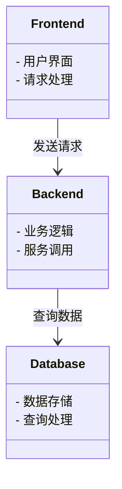

                 


# 智能体协作评估公司的数字化成熟度：把握转型机遇

---

## 关键词：智能体协作、数字化成熟度、数字化转型、系统架构、算法实现

---

## 摘要

数字化转型已成为企业生存和发展的关键，而智能体协作作为推动这一转型的核心技术，正在为企业提供新的评估和优化路径。本文通过分析智能体协作的基本原理、数字化成熟度模型的构建、评估算法的实现，以及系统架构的设计，深入探讨如何通过智能体协作来评估和提升企业的数字化成熟度。文章结合实际案例，详细讲解了从理论到实践的全过程，为企业把握转型机遇提供有力支持。

---

## 第一部分：智能体协作与数字化成熟度评估的背景与概述

### 第1章：数字化转型的背景与挑战

#### 1.1 数字化转型的定义与重要性

数字化转型是指企业利用数字技术（如人工智能、大数据、云计算等）重构业务模式、流程、文化、治理和组织，以实现业务创新和效率提升。数字化转型不仅是技术的升级，更是企业战略和组织变革的全面转型。

#### 1.2 智能体协作的定义与优势

智能体协作是指多个智能体（软件或算法）通过通信和协作完成共同目标的过程。其优势在于能够高效地处理复杂问题，通过分布式决策和协同优化实现整体目标。

#### 1.3 数字化成熟度评估的必要性

数字化成熟度是指企业在数字化转型中的能力和表现。评估数字化成熟度有助于企业识别自身的优势和不足，制定针对性的改进策略。

---

### 第2章：智能体协作评估模型的基本框架

#### 2.1 智能体协作的基本原理

智能体协作的核心在于通信、协调和合作。智能体通过共享信息、协商任务和分配资源，实现协作目标。其关键要素包括通信协议、任务分配算法和协调机制。

#### 2.2 数字化成熟度评估的核心要素

数字化成熟度评估主要关注信息化水平、业务流程标准化、数据驱动决策能力等方面。通过评估这些维度，企业可以全面了解自身的数字化能力。

#### 2.3 智能体协作与数字化成熟度的关系

智能体协作能够提升企业的数字化成熟度，而数字化成熟度的提升又为智能体协作提供了更好的环境。两者相辅相成，共同推动企业的数字化转型。

---

## 第二部分：智能体协作评估模型的理论基础

### 第3章：智能体协作的核心原理与算法

#### 3.1 智能体协作的核心原理

智能体协作涉及多个智能体之间的通信与合作。其核心原理包括任务分配、协调机制和冲突解决。

#### 3.2 数字化成熟度评估模型的构建

数字化成熟度模型通常包括多个评估维度，如技术能力、组织能力和业务能力。模型构建需要结合企业的实际情况，确保评估的全面性和准确性。

#### 3.3 智能体协作算法的数学模型

智能体协作算法可以通过数学模型表示。例如，任务分配问题可以转化为优化问题，目标是最小化任务完成时间或最大化资源利用率。

---

### 第4章：智能体协作评估模型的算法实现

#### 4.1 智能体协作算法的实现步骤

智能体协作算法的实现步骤包括初始化、任务分配、通信与协作、结果评估和优化。

#### 4.2 数字化成熟度评估的实现框架

数字化成熟度评估的实现框架包括数据采集、模型构建、评估分析和结果展示。

#### 4.3 智能体协作算法的Python代码实现

以下是智能体协作算法的Python代码示例：

```python
def distribute_task(num_agents, tasks):
    # 初始化任务分配
    task_distribution = [[] for _ in range(num_agents)]
    # 任务分配逻辑
    for i, task in enumerate(tasks):
        agent = i % num_agents
        task_distribution[agent].append(task)
    return task_distribution
```

---

## 第三部分：系统设计与架构

### 第5章：系统功能设计与实现

#### 5.1 系统功能模块划分

系统功能模块包括任务分配、通信协作、评估分析和结果展示。

#### 5.2 系统架构设计

系统架构采用分层设计，包括应用层、服务层和数据层。各层之间通过接口进行通信。

#### 5.3 系统交互流程设计

系统交互流程包括用户请求、智能体协作、结果返回和展示。

---

### 第6章：系统架构的详细设计

#### 6.1 系统架构的模块划分

系统架构分为前端、后端和数据库三部分。前端负责用户交互，后端负责业务逻辑，数据库负责数据存储。

#### 6.2 系统架构的类图设计

以下是系统架构的类图设计：



---

## 第四部分：项目实战

### 第7章：制造企业数字化成熟度评估的实战案例

#### 7.1 项目背景与目标

项目目标是评估某制造企业的数字化成熟度，发现改进点。

#### 7.2 环境搭建与数据准备

环境搭建包括安装必要的软件和工具，数据准备包括收集企业的业务数据和系统数据。

#### 7.3 代码实现与结果分析

以下是代码实现示例：

```python
def evaluate_maturity(enterprise_data):
    # 计算信息化水平
   信息化水平 = enterprise_data['信息化水平']
    # 计算业务流程标准化程度
    业务流程标准化 = enterprise_data['业务流程标准化']
    # 计算数据驱动决策能力
    数据驱动决策能力 = enterprise_data['数据驱动决策能力']
    # 返回综合评估结果
    return (信息化水平 + 业务流程标准化 + 数据驱动决策能力) / 3
```

---

## 第五部分：最佳实践与未来展望

### 第8章：评估中的最佳实践与注意事项

#### 8.1 最佳实践

建议企业在评估过程中注重数据的准确性和完整性，选择合适的评估模型。

#### 8.2 注意事项

避免过于依赖技术，忽视企业文化和组织结构的影响。

#### 8.3 未来展望

未来，随着AI和大数据技术的发展，智能体协作评估将更加智能化和自动化。

---

## 结语

智能体协作评估公司的数字化成熟度是企业把握转型机遇的关键。通过科学的评估模型和高效的协作机制，企业能够更好地实现数字化转型，提升竞争力。

---

## 作者：AI天才研究院/AI Genius Institute & 禅与计算机程序设计艺术 /Zen And The Art of Computer Programming

---

> **版权声明：** 本文版权归作者所有，未经授权不得转载。

