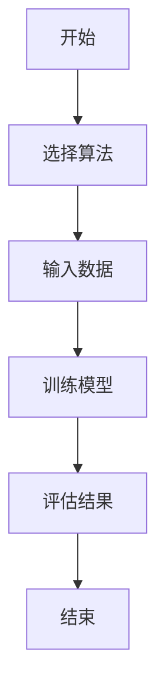
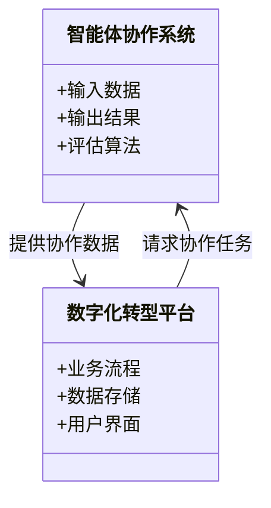

                 


# 智能体协作评估公司的数字化转型进程：把握未来增长点

---

## 关键词：
- 智能体协作，数字化转型，企业评估，人工智能，系统架构

---

## 摘要：
数字化转型已成为企业竞争的关键驱动力，而智能体协作作为一种新兴的技术手段，正在为企业评估数字化转型的进程提供新的视角和解决方案。本文从智能体协作的核心概念出发，分析其在数字化转型中的应用，并通过实际案例展示其算法原理、系统架构和项目实战。同时，结合最佳实践和未来趋势，为企业提供智能化的转型策略建议。

---

## 第一部分：智能体协作与数字化转型的背景介绍

### 第1章：智能体协作与数字化转型概述

#### 1.1 智能体协作的基本概念
智能体协作是指多个智能体（Agent）通过协同工作，共同完成特定任务的过程。智能体可以是软件程序、机器人或其他具备感知和决策能力的实体。协作的核心在于信息共享、任务分配和结果整合。

#### 1.2 数字化转型的背景与意义
数字化转型是企业利用数字技术优化业务流程、商业模式和决策方式的过程。随着人工智能、大数据和云计算等技术的快速发展，企业需要通过数字化转型来提升竞争力和效率。

#### 1.3 智能体协作与数字化转型的联系与区别
智能体协作通过提高系统的智能化水平，为数字化转型提供了新的工具和方法。数字化转型更注重整体业务的重构，而智能体协作则是实现这一目标的技术手段之一。

---

### 第2章：核心概念与联系

#### 2.1 智能体协作的原理
智能体协作涉及任务分配、信息共享和结果整合。通过协同工作，智能体能够更高效地完成复杂任务。

#### 2.2 数字化转型的关键要素
包括技术架构、数据驱动、业务流程优化和员工能力提升等方面。

#### 2.3 智能体协作与数字化转型的对比
| **维度** | **智能体协作** | **数字化转型** |
|----------|----------------|----------------|
| 核心目标 | 提高协作效率 | 优化业务模式 |
| 主要手段 | 智能技术 | 数字技术 |
| 适用场景 | 复杂任务处理 | 业务流程重构 |

#### 2.4 实体关系图
```mermaid
erDiagram
    actor 顾客
    actor 管理者
    actor 开发者
    actor 用户
    boundary 智能体协作系统
    boundary 数字化转型平台
    concept 任务分配
    concept 信息共享
    concept 结果整合
    顾客 --> 智能体协作系统: 提交请求
    管理者 --> 智能体协作系统: 分配任务
    开发者 --> 数字化转型平台: 实现功能
    用户 --> 数字化转型平台: 使用服务
    智能体协作系统 --> 数字化转型平台: 提供数据
```

---

## 第二部分：算法原理与系统架构

### 第3章：智能体协作评估的算法原理

#### 3.1 基于规则的评估算法
规则驱动的评估方法通过预定义的规则来判断协作效果。优点是简单易懂，但灵活性较低。

#### 3.2 基于机器学习的评估算法
使用机器学习模型分析历史数据，预测协作效果。支持向量机（SVM）和随机森林（Random Forest）是常用的算法。

#### 3.3 基于强化学习的评估算法
通过强化学习模型优化协作策略，能够适应动态变化的环境。

#### 3.4 算法流程图


#### 3.5 数学公式
$$
E = \sum_{i=1}^{n} w_i \cdot s_i
$$

其中，$E$是评估结果，$w_i$是权重，$s_i$是评分。

### 第4章：系统架构设计

#### 4.1 系统功能设计


#### 4.2 系统架构图
```mermaid
archiDiagram
    component 智能体协作系统
    component 数字化转型平台
    component 用户端
    智能体协作系统 --> 数字化转型平台: 数据交互
    数字化转型平台 --> 用户端: 提供服务
```

---

## 第三部分：项目实战与最佳实践

### 第5章：项目实战

#### 5.1 环境安装
```bash
pip install numpy
pip install scikit-learn
pip install matplotlib
```

#### 5.2 核心代码实现
```python
from sklearn import svm
from sklearn.ensemble import RandomForestClassifier
import numpy as np

# 训练数据
X = np.array([[1, 2], [3, 4], [5, 6]])
y = np.array([0, 1, 0])

# 选择算法
model = svm.SVC()

# 训练模型
model.fit(X, y)

# 评估结果
print(model.predict([[7, 8]]))
```

#### 5.3 案例分析
以某企业为例，通过智能体协作评估其数字化转型的进度，分析存在的问题并提出改进建议。

### 第6章：最佳实践与注意事项

#### 6.1 小结
智能体协作在数字化转型中的应用前景广阔，但需要结合企业的实际需求和技术能力。

#### 6.2 注意事项
- 数据质量和隐私保护
- 模型调优和泛化能力
- 技术与业务的深度融合

#### 6.3 未来展望
随着人工智能技术的进步，智能体协作将在更多领域发挥重要作用。

---

## 第四部分：拓展阅读

### 7.1 推荐书籍
- 《人工智能：一种现代的方法》
- 《数字化转型：战略与实施》

### 7.2 推荐资源
- 人工智能开源社区
- 数字化转型案例研究

---

## 作者：AI天才研究院 & 禅与计算机程序设计艺术

---

这篇文章详细介绍了智能体协作在数字化转型中的应用，通过理论与实践相结合的方式，为企业提供了智能化转型的解决方案和实施建议。

