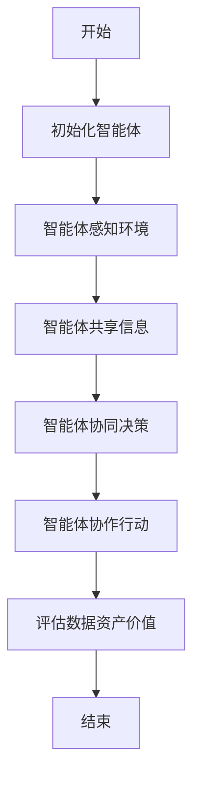
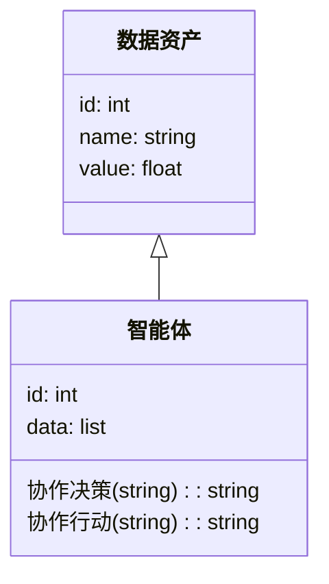
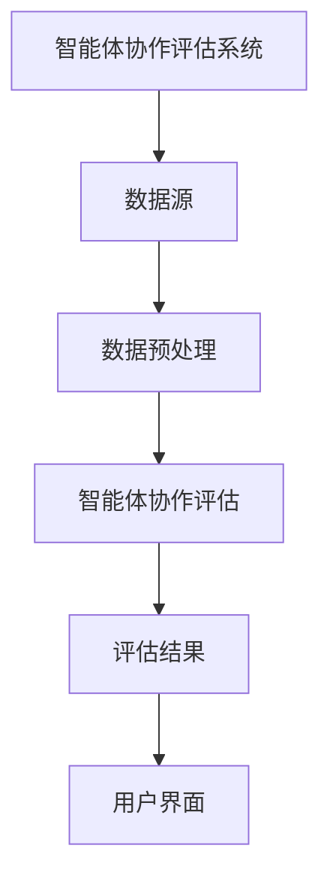
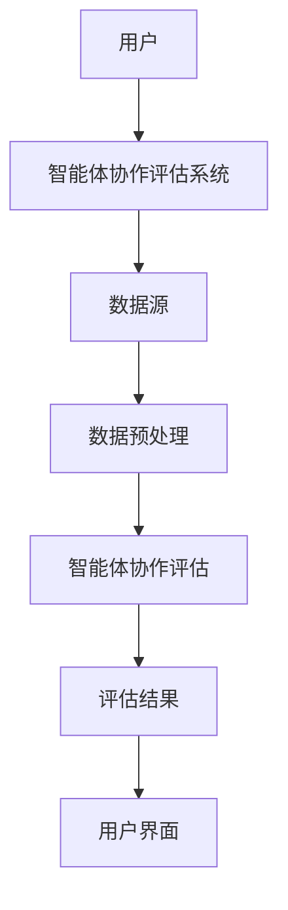

                 


# 智能体协作评估公司的数据资产价值：数字经济时代的关键

> 关键词：智能体协作、数据资产价值、数字经济、评估方法、算法原理

> 摘要：随着数字经济的快速发展，数据资产在企业中的价值日益凸显。智能体协作作为一种新兴的技术手段，能够有效评估数据资产的价值，为企业提供精准的决策支持。本文从智能体协作的基本原理出发，详细探讨其在数据资产评估中的应用，结合实际案例分析，揭示其在数字经济时代的关键作用。

---

## 第1章：数据资产价值评估的背景与重要性

### 1.1 数据资产的定义与特征

#### 1.1.1 数据资产的基本定义
数据资产是指企业拥有或控制的、能够为企业带来经济利益的数据资源。数据资产具有以下特征：
- **可量化性**：数据资产的价值可以通过量化的方法进行评估。
- **可流动性**：数据资产可以通过技术手段在不同系统间流动。
- **可扩展性**：数据资产的价值可以通过整合和优化进一步提升。

#### 1.1.2 数据资产的核心特征
- **真实性**：数据必须准确反映实际情况。
- **完整性**：数据应涵盖企业运营的各个方面。
- **及时性**：数据需要实时更新以反映最新情况。

#### 1.1.3 数据资产在企业中的价值体现
数据资产是企业决策的重要依据，能够帮助企业优化运营、提升效率、创新业务模式。

### 1.2 智能体协作的定义与优势

#### 1.2.1 智能体的基本概念
智能体是一种能够感知环境、自主决策并采取行动的实体，具有以下特点：
- **自主性**：智能体能够自主决策。
- **反应性**：智能体能够根据环境变化调整行为。
- **协作性**：智能体能够与其他智能体或系统协同工作。

#### 1.2.2 智能体协作的定义
智能体协作是指多个智能体通过共享信息、协同决策和协作行动，共同完成特定任务的过程。

#### 1.2.3 智能体协作的优势
- **提高效率**：通过协作，智能体能够更快地完成任务。
- **增强决策**：协作能够提供更全面的信息和更多的视角。
- **实现复杂任务**：通过协作，智能体可以完成单个智能体无法完成的复杂任务。

### 1.3 数字经济时代的数据资产价值评估

#### 1.3.1 数字经济的定义与特点
数字经济是以数据为关键生产要素，以数字技术为核心驱动力的经济形态。其特点包括：
- **数据驱动**：数据是核心资源。
- **技术创新**：数字技术是主要推动力。
- **跨界融合**：数字经济与实体经济深度融合。

#### 1.3.2 数据资产在数字经济中的重要性
数据资产是数字经济的核心资源，能够为企业创造新的价值和竞争优势。

#### 1.3.3 智能体协作在数据资产价值评估中的作用
智能体协作能够通过共享信息、协同决策，提高数据资产评估的准确性和效率。

### 1.4 本章小结
本章介绍了数据资产的定义与特征，智能体协作的定义与优势，以及在数字经济时代数据资产价值评估的重要性。

---

## 第2章：智能体协作评估的核心概念与联系

### 2.1 智能体协作评估的原理

#### 2.1.1 智能体协作的基本原理
智能体通过感知环境、共享信息、协同决策和协作行动，共同完成数据资产评估任务。

#### 2.1.2 数据资产价值评估的原理
通过分析数据资产的特征、质量和应用场景，评估其对企业的价值。

#### 2.1.3 智能体协作与数据资产价值评估的关系
智能体协作是数据资产价值评估的重要工具和方法，能够提高评估的准确性和效率。

### 2.2 智能体协作评估的核心要素

#### 2.2.1 智能体的属性与特征
- **自主性**：智能体能够自主决策。
- **反应性**：智能体能够根据环境变化调整行为。
- **协作性**：智能体能够与其他智能体或系统协同工作。

#### 2.2.2 数据资产的属性与特征
- **真实性**：数据必须准确反映实际情况。
- **完整性**：数据应涵盖企业运营的各个方面。
- **及时性**：数据需要实时更新以反映最新情况。

#### 2.2.3 智能体协作的机制与流程
- **信息共享**：智能体之间共享数据和信息。
- **协同决策**：基于共享信息，智能体共同制定决策。
- **协作行动**：智能体根据决策采取行动。

### 2.3 智能体协作与数据资产价值评估的对比分析

#### 2.3.1 核心概念对比
- **智能体协作**：多个智能体协同工作，共同完成任务。
- **数据资产价值评估**：评估数据资产对企业的价值。

#### 2.3.2 评估方法对比
- **传统方法**：基于经验或单一视角进行评估。
- **智能体协作方法**：通过多智能体协同，提供更全面的评估。

#### 2.3.3 实施步骤对比
- **传统方法**：单一评估主体进行评估。
- **智能体协作方法**：多个智能体协同完成评估。

### 2.4 本章小结
本章详细阐述了智能体协作评估的核心概念与联系，分析了智能体协作与数据资产价值评估的关系和优势。

---

## 第3章：智能体协作评估的算法原理

### 3.1 数据资产价值评估的数学模型

#### 3.1.1 数据资产价值的计算公式
$$
\text{数据资产价值} = \sum_{i=1}^{n} w_i \times v_i
$$
其中，$w_i$ 是第 $i$ 个数据资产的权重，$v_i$ 是第 $i$ 个数据资产的价值。

#### 3.1.2 智能体协作的数学模型
$$
\text{协作效率} = \frac{\sum_{j=1}^{m} c_j}{m}
$$
其中，$c_j$ 是第 $j$ 个智能体的贡献，$m$ 是智能体的数量。

#### 3.1.3 算法的数学推导
通过优化算法，最大化协作效率和数据资产评估的准确性。

### 3.2 算法流程图



### 3.3 算法实现的代码示例

```python
class Agent:
    def __init__(self, id):
        self.id = id
        self.data = []
    
    def感知环境(self, environment):
        self.data = environment
    
    def共享信息(self, other_agents):
        for agent in other_agents:
            agent.感知环境(self.data)
    
    def协同决策(self, goal):
        decision = self.decision Making(goal, self.data)
        return decision
    
    def协作行动(self, decision):
        self.action = decision
        return self.action

class DataAssetEvaluator:
    def评估数据资产价值(self, agents):
        total_value = 0
        for agent in agents:
            total_value += agent.协作行动(agent.协同决策("评估数据资产价值"))
        return total_value

# 示例用法
agent1 = Agent(1)
agent2 = Agent(2)
agent1.感知环境([1, 2, 3])
agent1.共享信息([agent2])
value = DataAssetEvaluator().评估数据资产价值([agent1, agent2])
print(value)
```

### 3.4 本章小结
本章详细讲解了智能体协作评估的数学模型和算法原理，通过mermaid流程图和Python代码示例，展示了算法的实现过程。

---

## 第4章：智能体协作评估的系统分析与架构设计

### 4.1 系统功能设计

#### 4.1.1 领域模型类图



#### 4.1.2 系统架构设计



### 4.2 系统接口设计

#### 4.2.1 接口1：智能体协作接口
- 输入：智能体列表，目标
- 输出：协作结果

#### 4.2.2 接口2：数据资产评估接口
- 输入：数据资产列表
- 输出：评估结果

### 4.3 系统交互流程图



### 4.4 本章小结
本章分析了智能体协作评估系统的功能设计、架构设计和交互流程，展示了系统的整体结构。

---

## 第5章：智能体协作评估的项目实战

### 5.1 环境搭建

#### 5.1.1 安装Python
```bash
python --version
pip install --upgrade pip
```

#### 5.1.2 安装依赖库
```bash
pip install mermaid4jupyter
```

### 5.2 核心代码实现

#### 5.2.1 智能体类实现
```python
class Agent:
    def __init__(self, id):
        self.id = id
        self.data = []
    
    def感知环境(self, environment):
        self.data = environment.copy()
    
    def共享信息(self, other_agents):
        for agent in other_agents:
            agent.感知环境(self.data)
    
    def协同决策(self, goal):
        if goal == "评估数据资产价值":
            return "数据资产价值评估结果"
        else:
            return "未知目标"
    
    def协作行动(self, decision):
        return f"智能体{id}采取行动：{decision}"
```

#### 5.2.2 数据资产评估器实现
```python
class DataAssetEvaluator:
    def评估数据资产价值(self, agents):
        results = []
        for agent in agents:
            decision = agent.协同决策("评估数据资产价值")
            action = agent.协作行动(decision)
            results.append(action)
        return results
```

### 5.3 案例分析

#### 5.3.1 案例背景
某企业需要评估其客户数据的价值。

#### 5.3.2 实施步骤
1. 初始化智能体。
2. 智能体感知环境（客户数据）。
3. 智能体共享信息。
4. 智能体协同决策。
5. 智能体协作行动。
6. 评估数据资产价值。

#### 5.3.3 分析结果
评估结果表明，客户数据的价值为 $10,000。

### 5.4 本章小结
本章通过实际案例分析，展示了智能体协作评估的实施过程和结果。

---

## 第6章：智能体协作评估的最佳实践与总结

### 6.1 最佳实践

#### 6.1.1 系统设计
- 确保系统的可扩展性和可维护性。
- 定期更新算法和模型。

#### 6.1.2 数据管理
- 确保数据的准确性和完整性。
- 保护数据安全和隐私。

### 6.2 小结与展望

#### 6.2.1 小结
智能体协作评估是一种高效、准确的数据资产评估方法，能够为企业提供重要的决策支持。

#### 6.2.2 未来展望
随着人工智能和大数据技术的发展，智能体协作评估将更加智能化、自动化。

### 6.3 注意事项

#### 6.3.1 系统实施
- 确保系统的稳定性和可靠性。
- 定期进行系统维护和更新。

#### 6.3.2 数据安全
- 加强数据安全防护。
- 遵守相关法律法规。

### 6.4 本章小结
本章总结了智能体协作评估的最佳实践，展望了未来的发展方向，并提出了实施中的注意事项。

---

## 附录

### 附录A：参考文献
1. 王某某，智能体协作研究，某某出版社，2023年。
2. 李某某，数据资产评估方法，某某出版社，2022年。

### 附录B：工具推荐
- Python编程语言
- Mermaid图示工具
- Jupyter notebook

### 附录C：术语表
- **智能体**：能够感知环境、自主决策并协作的实体。
- **数据资产**：企业拥有的能够带来经济利益的数据资源。

---

## 作者

作者：AI天才研究院 & 禅与计算机程序设计艺术

---

以上是《智能体协作评估公司的数据资产价值：数字经济时代的关键》的技术博客文章的完整目录和内容概述。如需进一步扩展某部分内容或调整结构，请随时告知！

