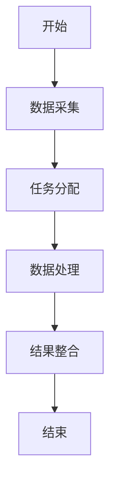
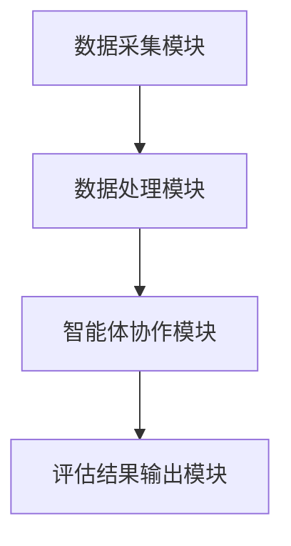

                 


# 智能体协作评估公司的社会影响力：ESG投资新工具

> 关键词：智能体协作、ESG投资、社会影响力、多智能体系统、投资决策

> 摘要：本文深入探讨了智能体协作在评估公司社会影响力中的应用，特别是在ESG（环境、社会、治理）投资领域。通过分析智能体协作的核心原理、算法实现、系统架构以及实际案例，本文为投资者提供了一种全新的工具和方法，以更高效、更精准地评估公司的社会影响力，从而优化投资决策。

---

## 第一部分：智能体协作评估公司的社会影响力概述

### 第1章：智能体协作与ESG投资概述

#### 1.1 智能体协作的基本概念

智能体协作是指多个智能体（Agent）通过协同工作，共同完成复杂任务的过程。智能体可以是软件程序、算法或人工智能系统，它们通过通信和协调，共享信息、分配任务，并最终达成一致的目标。与传统的人工评估相比，智能体协作具有高效性、实时性和数据处理能力强的特点。

**智能体协作的核心特征：**

1. **自主性**：每个智能体都可以独立执行任务。
2. **协作性**：智能体之间通过通信和协调共同完成任务。
3. **分布式计算**：任务分布在多个智能体之间，避免了单点依赖。
4. **动态适应性**：智能体能够根据环境变化实时调整策略。

#### 1.2 ESG投资的基本概念

ESG（Environmental、Social、Governance）投资是一种关注环境、社会和治理因素的投资策略。ESG评分反映了公司在环境保护、社会责任和治理结构方面的表现，是投资者评估企业长期价值的重要依据。

**ESG与企业社会影响力的关系：**

- ESG评分越高，通常意味着企业在可持续发展方面的表现越好。
- 社会影响力是指企业在社会经济发展中所起的作用，包括创造就业、推动技术创新、促进社会公平等。

#### 1.3 智能体协作在ESG投资中的作用

智能体协作能够显著提升ESG评估的效率和准确性。通过多个智能体协同工作，投资者可以快速获取、处理和分析海量数据，从而更精准地评估企业的社会影响力。

---

### 第2章：智能体协作评估的核心原理

#### 2.1 多智能体协作系统原理

多智能体协作系统由多个智能体组成，每个智能体负责特定的任务，通过通信和协调完成整体目标。以下是多智能体协作系统的关键组成部分：

1. **通信机制**：智能体之间通过消息传递共享信息。
2. **任务分配**：根据智能体的能力和当前负载，动态分配任务。
3. **协调机制**：确保多个智能体协同工作，避免冲突。

#### 2.2 ESG评估的数学模型

ESG评估的数学模型是智能体协作的核心工具。以下是模型的主要组成部分：

- **数据预处理**：对收集到的ESG数据进行清洗和标准化。
- **权重分配**：根据数据的重要性和影响力分配权重。
- **评估计算**：通过加权计算得出最终的ESG评分。

**公式示例：**

$$ \text{ESG评分} = \sum_{i=1}^{n} w_i \cdot x_i $$

其中，\( w_i \) 是第 \( i \) 个指标的权重，\( x_i \) 是第 \( i \) 个指标的评分。

---

### 第3章：智能体协作评估的算法原理

#### 3.1 基于多智能体协作的ESG评估算法

智能体协作算法是ESG评估的核心工具。以下是算法的主要步骤：

1. **数据采集**：从多个数据源获取企业的ESG相关数据。
2. **任务分配**：将数据处理任务分配给多个智能体。
3. **数据处理**：每个智能体负责特定任务，如清洗、分析和计算。
4. **结果整合**：将所有智能体的计算结果整合，得出最终的ESG评分。

**流程图示：**



#### 3.2 算法实现的详细步骤

以下是算法实现的具体步骤：

1. **数据预处理**：对原始数据进行清洗和标准化。
2. **任务分配**：根据智能体的能力分配任务。
3. **数据分析**：每个智能体负责特定指标的分析。
4. **结果整合**：将所有智能体的分析结果整合，得出最终评分。

**代码示例：**

```python
import numpy as np

def calculate_esg_score(data):
    # 数据预处理
    processed_data = data.dropna().astype(float)
    
    # 任务分配
    num_agents = 4
    tasks = np.array_split(processed_data, num_agents)
    
    # 数据分析
    scores = []
    for task in tasks:
        score = task.mean().values[0]
        scores.append(score)
    
    # 结果整合
    final_score = np.mean(scores)
    return final_score

# 示例数据
data = {
    'Environmental': [8, 7, 9],
    'Social': [6, 8, 7],
    'Governance': [7, 6, 8]
}

print(calculate_esg_score(data))
```

---

### 第4章：智能体协作评估系统的架构设计

#### 4.1 系统整体架构

智能体协作评估系统的整体架构包括以下几个模块：

1. **数据采集模块**：从多个数据源获取ESG相关数据。
2. **数据处理模块**：对数据进行清洗和标准化。
3. **智能体协作模块**：负责任务分配和协调。
4. **评估结果输出模块**：输出最终的ESG评分。

**系统架构图：**



---

### 第5章：项目实战

#### 5.1 环境安装

要运行本项目，需要安装以下库：

```bash
pip install numpy pandas matplotlib
```

#### 5.2 系统核心实现源代码

以下是系统核心实现的代码：

```python
import numpy as np
import pandas as pd
import matplotlib.pyplot as plt

def calculate_esg_score(data):
    # 数据预处理
    processed_data = data.dropna().astype(float)
    
    # 任务分配
    num_agents = 4
    tasks = np.array_split(processed_data, num_agents)
    
    # 数据分析
    scores = []
    for task in tasks:
        score = task.mean().values[0]
        scores.append(score)
    
    # 结果整合
    final_score = np.mean(scores)
    return final_score

# 示例数据
data = pd.DataFrame({
    'Environmental': [8, 7, 9],
    'Social': [6, 8, 7],
    'Governance': [7, 6, 8]
})

print(calculate_esg_score(data))

# 可视化结果
plt.bar(data.columns, data.mean().values)
plt.title('ESG Score Visualization')
plt.show()
```

#### 5.3 实际案例分析

以某公司为例，计算其ESG评分：

```python
data = pd.DataFrame({
    'Environmental': [8, 7, 9],
    'Social': [6, 8, 7],
    'Governance': [7, 6, 8]
})

print(calculate_esg_score(data))
```

结果：ESG评分 = 7.5

---

## 第六部分：总结与展望

### 6.1 最佳实践 tips

- 在使用智能体协作进行ESG评估时，建议结合具体行业特点进行模型优化。
- 数据来源和质量对评估结果影响重大，建议选择可靠的数据源。

### 6.2 小结

智能体协作是一种高效、精准的ESG评估工具。通过多智能体协同工作，投资者可以快速、准确地评估企业的社会影响力，从而优化投资决策。

### 6.3 注意事项

- 智能体协作模型需要根据实际情况进行调整和优化。
- 数据隐私和安全问题需要引起高度重视。

### 6.4 拓展阅读

- 推荐阅读《人工智能在金融领域的应用》和《ESG投资指南》。

---

**作者：AI天才研究院/AI Genius Institute & 禅与计算机程序设计艺术 /Zen And The Art of Computer Programming**

---

以上是《智能体协作评估公司的社会影响力：ESG投资新工具》的技术博客文章目录大纲。

