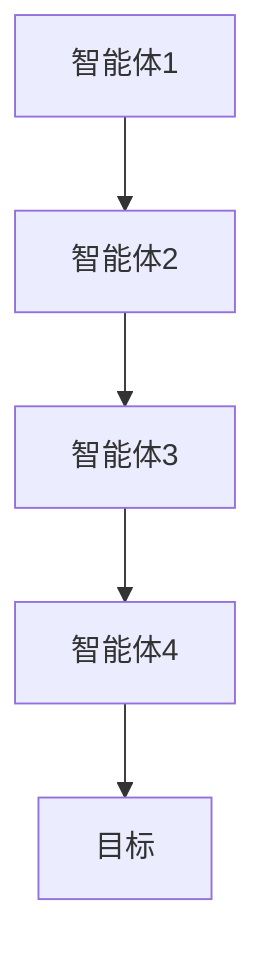

                 

# {{此处是文章标题}}

> 关键词：{{智能体协作、网络安全、风险评估、数字时代、多智能体系统、风险建模}}

> 摘要：{{本文系统性地探讨了智能体协作在现代网络安全风险评估中的应用。通过结合人工智能和分布式计算的最新进展，我们提出了一种基于多智能体协作的网络安全风险评估框架，能够有效识别、分析和应对数字时代的网络安全威胁。}}

---

# 第1章: 智能体协作与网络安全风险评估概述

## 1.1 智能体协作的基本概念
### 1.1.1 问题背景与问题描述
- 当前网络安全威胁的复杂性与智能化
- 单点防御的局限性
- 智能体协作的必要性

### 1.1.2 智能体协作的定义与目标
- 智能体的定义
- 智能体协作的目标
- 智能体协作的核心特征

### 1.1.3 智能体协作的边界与外延
- 智能体协作的适用范围
- 智能体协作与其他协作方式的区别
- 智能体协作的潜在扩展领域

### 1.1.4 智能体协作的概念结构
- 智能体协作的层次模型
- 智能体协作的核心要素

## 1.2 网络安全风险评估的基本概念
### 1.2.1 网络安全风险的定义
- 风险的定义与分类
- 网络安全风险的关键属性

### 1.2.2 网络安全风险评估的流程
- 风险识别
- 风险分析
- 风险应对

### 1.2.3 智能体协作在网络安全风险评估中的作用
- 提高风险评估的效率
- 增强风险评估的准确性
- 实现动态风险评估

## 1.3 本章小结
- 本章总结了智能体协作与网络安全风险评估的基本概念
- 点明了智能体协作在网络安全风险评估中的重要性

---

# 第2章: 智能体协作的核心概念与联系

## 2.1 智能体协作的原理与机制
### 2.1.1 智能体的定义与属性
- 智能体的定义
- 智能体的核心属性
- 智能体的协作能力

### 2.1.2 智能体协作的基本原理
- 分布式计算
- 多智能体协作算法
- 智能体之间的通信机制

### 2.1.3 智能体协作的通信机制
- 智能体之间的通信协议
- 智能体协作的信令设计
- 智能体协作的同步机制

## 2.2 智能体协作的核心概念对比
### 2.2.1 智能体协作与传统协作的对比
- 传统协作方式的局限性
- 智能体协作的优势
- 智能体协作与分布式计算的联系

### 2.2.2 智能体协作的关键属性特征
- 智能体协作的可扩展性
- 智能体协作的鲁棒性
- 智能体协作的实时性

### 2.2.3 智能体协作的ER实体关系图

## 2.3 智能体协作的流程图

## 2.4 本章小结
- 本章详细分析了智能体协作的核心概念
- 通过ER实体关系图和流程图直观展示了智能体协作的机制

---

# 第3章: 网络安全风险评估的理论基础

## 3.1 网络安全风险评估的基本理论
### 3.1.1 网络安全风险的数学模型
- 风险评估的数学模型
- 风险值的计算方法
- 风险模型的优化

### 3.1.2 网络安全风险评估的方法
- 定性评估方法
- 定量评估方法
- 混合评估方法

### 3.1.3 网络安全风险的分类与层次
- 风险的分类
- 风险的层次结构
- 风险的优先级排序

## 3.2 智能体协作在网络安全风险评估中的理论基础
### 3.2.1 智能体协作的数学模型
- 智能体协作的数学表达式
- 智能体协作的优化目标
- 智能体协作的约束条件

### 3.2.2 智能体协作与网络安全风险评估的结合
- 智能体协作在风险识别中的应用
- 智能体协作在风险分析中的应用
- 智能体协作在风险应对中的应用

### 3.2.3 智能体协作的风险评估框架
- 风险评估框架的结构
- 框架的功能模块划分
- 框架的实现步骤

## 3.3 本章小结
- 本章系统性地介绍了网络安全风险评估的理论基础
- 分析了智能体协作在其中的理论支撑

---

# 第4章: 智能体协作的核心算法与实现

## 4.1 智能体协作的核心算法
### 4.1.1 分布式计算算法
- 分布式计算的基本原理
- 分布式计算的实现方法
- 分布式计算的优化策略

### 4.1.2 多智能体协作算法
- 多智能体协作算法的分类
- 多智能体协作算法的实现步骤
- 多智能体协作算法的性能评估

### 4.1.3 智能体协作的通信协议
- 智能体协作通信协议的设计原则
- 通信协议的具体实现
- 通信协议的优化

## 4.2 智能体协作算法的实现
### 4.2.1 分布式计算算法的实现
- 分布式计算算法的代码实现
- 分布式计算算法的测试与验证
- 分布式计算算法的优化

### 4.2.2 多智能体协作算法的实现
- 多智能体协作算法的代码实现
- 多智能体协作算法的测试与验证
- 多智能体协作算法的优化

## 4.3 本章小结
- 本章详细介绍了智能体协作的核心算法与实现
- 通过代码示例和测试验证了算法的有效性

---

# 第5章: 网络安全风险评估的系统分析与架构设计

## 5.1 系统分析
### 5.1.1 问题场景介绍
- 网络安全风险评估的典型场景
- 智能体协作在其中的应用

### 5.1.2 系统功能设计
- 系统功能模块划分
- 系统功能的实现方式
- 系统功能的优化建议

## 5.2 系统架构设计
### 5.2.1 系统架构图

### 5.2.2 系统接口设计
- 系统接口的设计原则
- 系统接口的具体实现
- 系统接口的优化

## 5.3 本章小结
- 本章详细分析了网络安全风险评估系统的架构设计
- 通过系统架构图和接口设计展示了系统的实现方案

---

# 第6章: 项目实战与案例分析

## 6.1 项目实战
### 6.1.1 环境安装
- 项目环境的搭建步骤
- 项目依赖的安装方法
- 项目环境的配置

### 6.1.2 系统核心实现
- 系统核心功能的代码实现
- 系统核心功能的测试与验证
- 系统核心功能的优化

## 6.2 案例分析
### 6.2.1 案例背景
- 案例的背景介绍
- 案例的目标
- 案例的实现方案

### 6.2.2 案例分析
- 案例的实现过程
- 案例的分析结果
- 案例的经验总结

## 6.3 本章小结
- 本章通过项目实战和案例分析展示了智能体协作在网络安全风险评估中的具体应用
- 总结了项目实施的经验和教训

---

# 第7章: 总结与展望

## 7.1 本章总结
- 本章总结了全文的主要内容
- 突出了智能体协作在网络安全风险评估中的重要性

## 7.2 本章展望
- 展望了智能体协作在网络安全风险评估中的未来发展方向
- 提出了进一步研究的问题和建议

## 7.3 本章小结
- 本章总结了全文的主要内容和展望了未来的研究方向

---

# 作者：AI天才研究院/AI Genius Institute & 禅与计算机程序设计艺术 /Zen And The Art of Computer Programming

