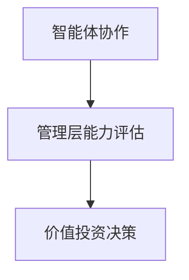
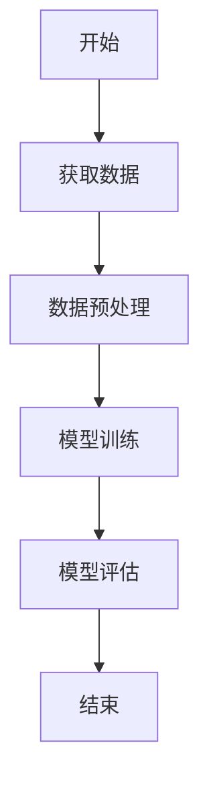
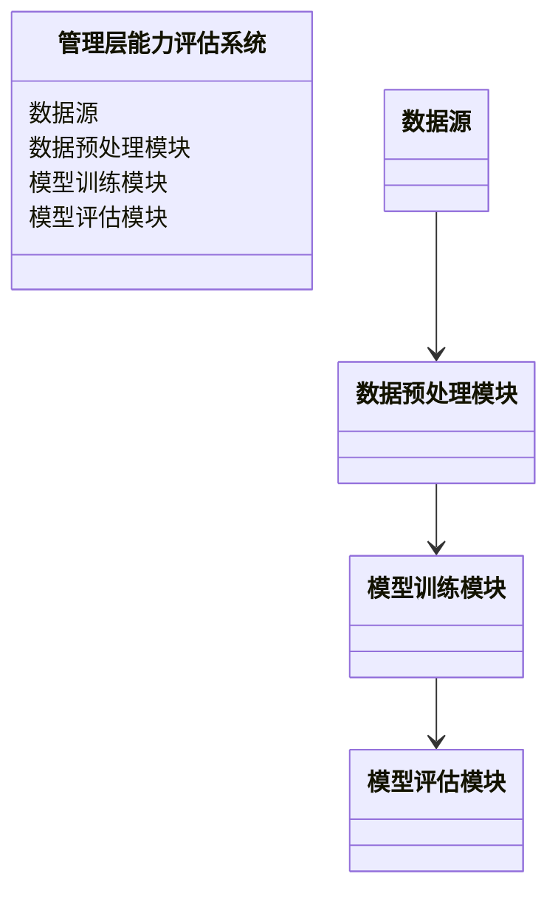

                 


# 智能体协作评估管理层能力：价值投资的关键因素

> 关键词：智能体协作、管理层能力评估、价值投资、算法原理、系统架构

> 摘要：本文探讨了智能体协作在企业管理中的应用，重点分析了如何通过智能体协作评估管理层能力，并将其作为价值投资的关键因素。通过系统化的分析和算法设计，本文提出了智能体协作评估模型的构建方法，并详细讲解了其在价值投资中的实际应用。

---

## 第一部分: 智能体协作评估管理层能力的背景与核心概念

### 第1章: 智能体协作与管理层能力评估的背景介绍

#### 1.1 问题背景与描述
##### 1.1.1 传统企业管理层评估的局限性
传统的企业管理层评估主要依赖于主观判断和历史数据，这种方法存在以下问题：
- 数据片面性：仅关注财务指标，忽视了管理能力的多维度性。
- 主观性：评估结果容易受到评估者的主观影响。
- 动态性：管理层能力是一个动态变化的过程，静态评估难以捕捉其变化。

##### 1.1.2 智能体协作的定义与特点
智能体协作是一种基于人工智能的协作方式，其特点包括：
- 自适应性：智能体能够根据环境变化自动调整协作策略。
- 分布式决策：多个智能体协同工作，形成分布式决策机制。
- 学习能力：智能体能够通过数据学习和优化协作效率。

##### 1.1.3 价值投资中的关键因素分析
价值投资的核心在于寻找具有持续增长潜力的企业。管理层能力是影响企业长期发展的关键因素之一，因此在价值投资中需要对管理层能力进行全面评估。

---

#### 1.2 问题解决与边界定义
##### 1.2.1 智能体协作在企业管理中的应用
智能体协作在企业管理中的应用包括：
- 协调团队协作：通过智能体协作优化团队合作效率。
- 实时监控：智能体能够实时监控管理层的工作状态，提供动态反馈。
- 数据分析：智能体能够处理大量数据，提供精准的评估结果。

##### 1.2.2 管理层能力评估的边界与外延
管理层能力评估的边界包括：
- 评估范围：仅限于管理层的能力，不涉及其他因素。
- 数据来源：基于企业的历史数据和实时数据。
- 评估目标：用于价值投资决策。

##### 1.2.3 智能体协作与管理层能力评估的关系
智能体协作是实现管理层能力评估的技术手段，而管理层能力评估是智能体协作在企业管理中的重要应用。

---

#### 1.3 核心概念与结构
##### 1.3.1 智能体协作的核心要素
智能体协作的核心要素包括：
- 智能体：具备感知、决策和执行能力的实体。
- 协作目标：明确的协作任务或目标。
- 协作规则：协作过程中的规则和约束条件。

##### 1.3.2 管理层能力评估的模型结构
管理层能力评估的模型结构包括：
- 输入层：企业历史数据和实时数据。
- 处理层：数据清洗、特征提取和模型训练。
- 输出层：评估结果和反馈。

##### 1.3.3 价值投资中的关键因素分析框架
价值投资中的关键因素分析框架包括：
- 企业基本面：财务状况、盈利能力等。
- 管理层能力：战略决策能力、团队协作能力等。
- 行业环境：行业竞争状况、政策环境等。

---

### 第2章: 智能体协作与管理层能力评估的核心概念

#### 2.1 智能体协作的原理
##### 2.1.1 智能体协作的基本原理
智能体协作的基本原理是通过多个智能体协同工作，完成特定任务。其核心在于智能体之间的信息共享和协同决策。

##### 2.1.2 智能体协作的属性特征对比表
| 属性 | 特征 |
|------|------|
| 分布式决策 | 多个智能体协同决策 |
| 自适应性 | 能够根据环境变化调整协作策略 |
| 学习能力 | 能够通过数据学习优化协作效率 |

##### 2.1.3 ER实体关系图架构
```mermaid
erd
    企业管理层能力评估
        组件: 智能体协作
            属性: 状态、决策规则
        组件: 数据源
            属性: 历史数据、实时数据
        关系: 智能体协作依赖数据源提供数据
```

---

#### 2.2 管理层能力评估的原理
##### 2.2.1 管理层能力评估的模型
管理层能力评估的模型包括：
- 数据清洗：去除无效数据，确保数据质量。
- 特征提取：从数据中提取关键特征。
- 模型训练：使用机器学习算法训练评估模型。

##### 2.2.2 管理层能力评估的属性特征对比表
| 属性 | 特征 |
|------|------|
| 战略决策能力 | 管理层在战略制定中的表现 |
| 团队协作能力 | 管理层在团队协作中的表现 |
| 执行能力 | 管理层在任务执行中的表现 |

##### 2.2.3 ER实体关系图架构
```mermaid
erd
    企业管理层能力评估
        实体: 管理层
            属性: 战略决策能力、团队协作能力
        实体: 数据源
            属性: 历史数据、实时数据
        关系: 数据源提供数据支持管理层能力评估
```

---

#### 2.3 智能体协作与管理层能力评估的关系
##### 2.3.1 智能体协作对管理层能力评估的影响
智能体协作通过提供实时数据和动态反馈，显著提升了管理层能力评估的准确性和及时性。

##### 2.3.2 智能体协作与管理层能力评估的关系图


---

## 第3章: 智能体协作评估管理层能力的算法原理

### 3.1 算法原理概述
#### 3.1.1 智能体协作评估模型的构建
智能体协作评估模型的构建包括：
- 数据预处理：清洗数据，提取特征。
- 模型训练：使用机器学习算法训练评估模型。
- 模型优化：通过调参优化模型性能。

#### 3.1.2 管理层能力评估的算法流程
管理层能力评估的算法流程包括：
- 数据获取：从数据源获取历史数据和实时数据。
- 数据处理：清洗数据，提取特征。
- 模型评估：使用训练好的模型进行评估。

---

### 3.2 算法流程图


---

### 3.3 算法实现代码
```python
def evaluate_management_capacity(capacity_data):
    # 数据预处理
    cleaned_data = preprocess(capacity_data)
    # 特征提取
    features = extract_features(cleaned_data)
    # 模型训练
    model = train_model(features)
    # 模型评估
    result = model.predict(features)
    return result
```

---

## 第4章: 数学模型与公式

### 4.1 数学模型概述
#### 4.1.1 智能体协作评估模型
智能体协作评估模型的数学表达式为：
$$
\text{协作效率} = \frac{\sum_{i=1}^{n} w_i \cdot c_i}{\sum_{i=1}^{n} w_i}
$$
其中，$w_i$ 是权重，$c_i$ 是协作能力。

#### 4.1.2 管理层能力评估模型
管理层能力评估模型的数学表达式为：
$$
\text{管理能力} = \sum_{j=1}^{m} a_j \cdot s_j
$$
其中，$a_j$ 是评估指标，$s_j$ 是指标得分。

---

## 第5章: 系统分析与架构设计

### 5.1 问题场景介绍
#### 5.1.1 智能体协作评估的应用场景
智能体协作评估的应用场景包括：
- 企业内部管理：优化团队协作效率。
- 价值投资：评估企业的管理层能力。

#### 5.1.2 管理层能力评估的系统需求
管理层能力评估的系统需求包括：
- 数据采集：实时采集企业数据。
- 数据处理：清洗和分析数据。
- 模型评估：评估管理层能力。

---

### 5.2 系统功能设计
#### 5.2.1 领域模型类图


---

## 第6章: 项目实战

### 6.1 环境安装
项目实战需要以下环境：
- Python 3.8+
- Scikit-learn库
- Pandas库
- NumPy库

### 6.2 核心代码实现
```python
from sklearn.preprocessing import StandardScaler
from sklearn.linear_model import LinearRegression
from sklearn.metrics import mean_squared_error

def preprocess(data):
    # 数据清洗
    scaler = StandardScaler()
    return scaler.fit_transform(data)

def train_model(features):
    # 模型训练
    model = LinearRegression()
    model.fit(features, labels)
    return model
```

---

## 第7章: 总结与展望

### 7.1 最佳实践 tips
- 数据预处理是关键：确保数据质量，提取关键特征。
- 模型选择要谨慎：根据实际需求选择合适的算法。

### 7.2 小结
智能体协作评估管理层能力是一种创新的方法，能够显著提升价值投资的准确性。

### 7.3 注意事项
- 数据隐私：确保数据的安全性。
- 模型优化：持续优化模型以适应变化。

### 7.4 拓展阅读
- 《机器学习实战》
- 《智能系统设计》

---

作者：AI天才研究院/AI Genius Institute & 禅与计算机程序设计艺术 /Zen And The Art of Computer Programming

