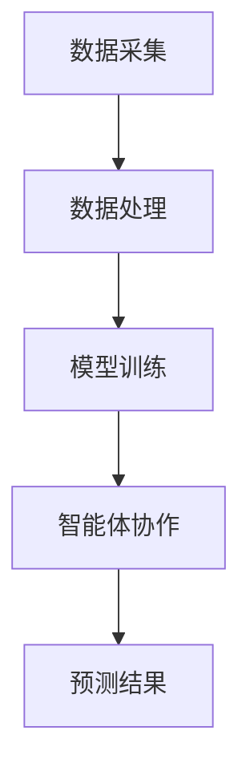
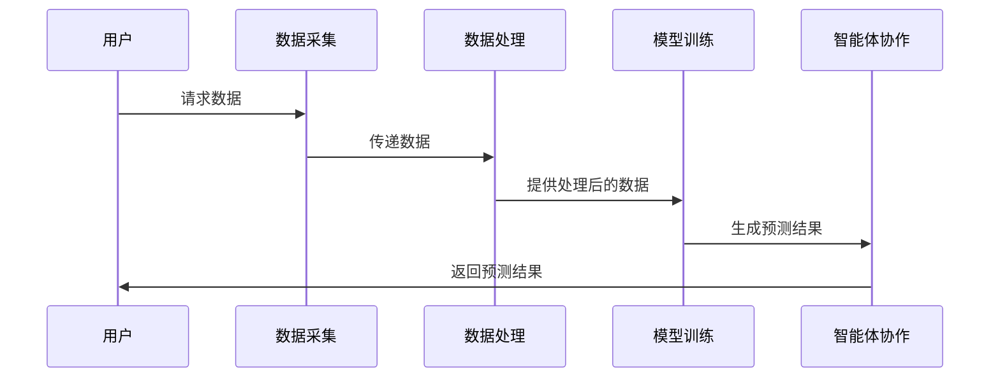

                 


# 智能体协作预测监管环境变化：提前应对政策风险

## 关键词：智能体协作、监管环境变化、政策风险、预测模型、机器学习

## 摘要：智能体协作预测监管环境变化是一种利用智能体之间的协作机制，通过数据分析和机器学习模型，提前预测政策法规的变化趋势，从而帮助企业和社会提前应对可能的风险。本文将详细探讨智能体协作的原理、预测模型的构建、系统架构设计，以及实际应用案例，帮助读者全面理解这一前沿技术。

---

# 第一部分：背景与概念

## 第1章：问题背景与核心概念

### 1.1 问题背景
#### 1.1.1 监管环境变化的复杂性
政策和法规的变化对企业运营和战略决策有着深远影响。监管环境的变化可能涉及税收调整、行业规范修改、环境保护要求提升等多个方面。企业需要及时应对这些变化，否则可能面临罚款、市场风险甚至法律纠纷。

#### 1.1.2 智能体协作的重要性
传统的政策预测方法通常依赖专家的经验和历史数据分析，存在主观性和滞后性。智能体协作通过多个智能体的协同工作，能够更全面地收集和分析数据，提高预测的准确性和实时性。

#### 1.1.3 政策风险对企业的影响
政策风险可能导致企业运营成本增加、市场准入受限等问题。通过提前预测政策变化，企业可以制定相应的战略调整计划，降低风险。

### 1.2 核心概念与定义
#### 1.2.1 智能体的定义与特征
智能体（Agent）是指能够感知环境、自主决策并采取行动的实体。智能体具有主动性、反应性和协作性等特征。

#### 1.2.2 监管环境变化的定义
监管环境变化指的是政策、法规、行业标准等的调整和变化，这些变化可能对企业的运营产生重大影响。

#### 1.2.3 智能体协作的机制
智能体协作是指多个智能体通过通信和协调，共同完成特定任务的机制。智能体之间可以共享信息、分工合作，提高整体预测能力。

### 1.3 问题解决与边界
#### 1.3.1 智能体协作预测监管环境变化的目标
通过智能体协作，提前预测政策变化，帮助企业制定应对策略，降低政策风险。

#### 1.3.2 解决方案的边界与外延
智能体协作预测的边界包括数据收集、模型构建和结果应用。外延则涉及对预测结果的实时监控和动态调整。

#### 1.3.3 核心要素与组成结构
智能体协作预测系统的核心要素包括数据源、智能体、协作机制、预测模型和应用模块。

---

# 第二部分：智能体协作预测的原理与方法

## 第2章：智能体协作预测的原理

### 2.1 智能体协作预测的基本原理
智能体通过协作，利用分布式计算和数据共享，提高预测的准确性和效率。智能体之间可以共享数据、模型和预测结果，共同完成复杂的预测任务。

### 2.2 智能体协作预测的机制
#### 2.2.1 数据共享机制
智能体之间通过通信协议共享数据，确保每个智能体都能获得完整的数据集。

#### 2.2.2 分工合作机制
智能体根据自身能力分工，部分智能体负责数据预处理，部分负责模型训练，部分负责结果分析。

#### 2.2.3 协调控制机制
通过协调机制，智能体能够实时调整协作策略，确保预测过程的顺利进行。

### 2.3 智能体协作预测的方法
#### 2.3.1 基于时间序列分析的预测方法
时间序列分析是一种常用的预测方法，适用于监管环境变化的时间序列数据。

#### 2.3.2 基于机器学习的预测方法
机器学习模型，如随机森林、神经网络等，能够捕捉数据中的复杂模式，提高预测准确率。

#### 2.3.3 基于强化学习的预测方法
强化学习通过智能体与环境的互动，优化预测策略，适用于动态变化的监管环境。

---

# 第三部分：智能体协作预测的系统架构设计

## 第3章：系统架构设计

### 3.1 问题场景介绍
监管环境变化预测是一个复杂的系统工程，涉及数据收集、处理、建模和应用等多个环节。

### 3.2 系统功能设计
#### 3.2.1 数据采集模块
负责从多个来源收集政策、经济、行业等数据。

#### 3.2.2 数据处理模块
对采集的数据进行清洗、转换和特征提取。

#### 3.2.3 模型训练模块
利用机器学习算法训练预测模型。

#### 3.2.4 智能体协作模块
实现智能体之间的通信和协作，提高预测准确率。

### 3.3 系统架构图


### 3.4 接口设计
系统需要提供数据接口、模型接口和用户接口，方便与其他系统的集成和用户操作。

### 3.5 交互序列图


---

# 第四部分：项目实战与案例分析

## 第4章：项目实战

### 4.1 环境安装
需要安装Python、机器学习库（如scikit-learn、TensorFlow）和数据处理工具（如Pandas、NumPy）。

### 4.2 核心代码实现
以下是基于时间序列分析的预测代码示例：
```python
import pandas as pd
import numpy as np
from sklearn.preprocessing import MinMaxScaler
from keras.models import Sequential
from keras.layers import LSTM, Dense

# 数据预处理
data = pd.read_csv('policy_changes.csv')
data = data[['year', 'policy_index']]
scaler = MinMaxScaler()
scaled_data = scaler.fit_transform(data[['policy_index']])

# 划分训练集和测试集
train_size = int(len(scaled_data) * 0.8)
train_data = scaled_data[:train_size]
test_data = scaled_data[train_size:]

# 构建数据集
def create_dataset(data, look_back=1):
    X, Y = [], []
    for i in range(len(data) - look_back):
        X.append(data[i:i+look_back])
        Y.append(data[i+look_back])
    return np.array(X), np.array(Y)

X_train, Y_train = create_dataset(train_data, look_back=3)
X_test, Y_test = create_dataset(test_data, look_back=3)

# 模型训练
model = Sequential()
model.add(LSTM(50, input_shape=(3, 1)))
model.add(Dense(1))
model.compile(loss='mean_squared_error', optimizer='adam')
model.fit(X_train, Y_train, epochs=100, batch_size=32)

# 预测结果
train_predict = model.predict(X_train)
test_predict = model.predict(X_test)
```

### 4.3 案例分析
以某行业为例，分析智能体协作预测监管环境变化的实际效果，展示预测结果与实际政策变化的对比。

---

# 第五部分：最佳实践与未来展望

## 第5章：最佳实践与总结

### 5.1 小结
智能体协作预测监管环境变化是一种高效、准确的预测方法，能够帮助企业提前应对政策风险。

### 5.2 注意事项
数据质量和模型选择对预测结果影响重大，需要谨慎处理。

### 5.3 拓展阅读
推荐相关书籍和论文，帮助读者深入了解智能体协作和预测模型。

## 作者：AI天才研究院/AI Genius Institute & 禅与计算机程序设计艺术 /Zen And The Art of Computer Programming

