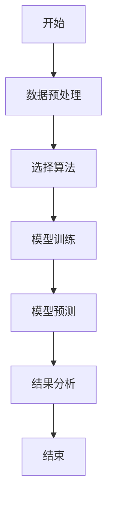
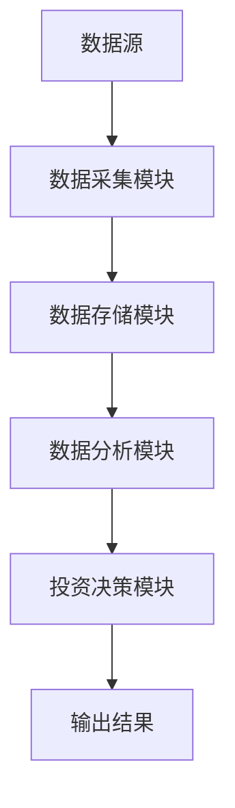

                 


# 智能体系统提升价值投资的宏观经济指标综合分析

## 关键词：
智能体系统，价值投资，宏观经济指标，算法原理，系统架构

## 摘要：
本文探讨智能体系统如何通过宏观经济指标的综合分析提升价值投资的决策效率和准确性。从宏观经济指标的基本概念到智能体系统的算法实现，结合实际案例，分析宏观经济指标对价值投资的影响，提出智能体系统的优化策略，为投资决策提供科学依据。

---

## 第1章: 智能体系统与价值投资的宏观经济视角

### 1.1 智能体系统的定义与特点
智能体系统是一种能够感知环境、做出决策并采取行动的智能系统。其特点包括自主性、反应性、目标导向和社会能力。

- **自主性**：智能体能够独立决策，无需外部干预。
- **反应性**：能够实时感知环境变化并做出反应。
- **目标导向**：通过优化目标函数进行决策。
- **社会能力**：能够与其他智能体或系统协同工作。

### 1.2 价值投资的宏观经济视角
价值投资是一种以内在价值为导向的投资策略，宏观经济指标在其中起着关键作用。

- **内在价值**：资产的真实价值，受宏观经济环境影响。
- **宏观经济指标**：GDP、通货膨胀率、失业率等，反映经济整体状况。
- **投资决策**：通过分析宏观经济指标，识别投资机会，降低风险。

### 1.3 宏观经济指标的分类与特征
宏观经济指标可分为总量指标、结构指标和指标体系。

- **总量指标**：如GDP、CPI，反映整体经济状况。
- **结构指标**：如行业分布，反映经济结构。
- **指标体系**：如PMI、PPI，反映经济运行状况。

---

## 第2章: 智能体系统与宏观经济指标的关系

### 2.1 智能体系统的宏观经济指标分析原理
智能体系统通过分析宏观经济指标，识别经济趋势，优化投资策略。

- **输入数据**：宏观经济指标作为输入数据，构建模型。
- **处理逻辑**：利用算法对数据进行分析，提取特征。
- **输出结果**：生成投资建议，优化决策。

### 2.2 宏观经济指标的ER实体关系图
以下是宏观经济指标的ER实体关系图：

```mermaid
er
    actor 投资者
    actor 经济系统
    entity 宏观经济指标
    entity 投资决策
    entity 投资结果
    relationship - 收集
    relationship - 分析
    relationship - 影响
```

### 2.3 智能体系统与宏观经济指标的联系
智能体系统通过宏观经济指标分析，优化投资策略。

- **动态调整**：实时跟踪指标变化，动态调整投资组合。
- **风险控制**：通过指标分析，识别潜在风险，制定应对策略。

---

## 第3章: 宏观经济指标的智能体系统分析算法

### 3.1 宏观经济指标分析的算法原理
智能体系统采用机器学习算法，对宏观经济指标进行分析。

- **线性回归模型**：用于预测指标趋势。
- **时间序列分析**：分析历史数据，预测未来走势。
- **聚类分析**：识别指标之间的关联性。

### 3.2 宏观经济指标分析的算法流程图
以下是算法流程图：



### 3.3 算法的数学模型与公式
线性回归模型公式：

$$ y = \beta_0 + \beta_1 x + \epsilon $$

时间序列分析模型公式：

$$ ARIMA(p, d, q) $$

聚类分析模型公式：

$$ K-means $$

### 3.4 算法的Python实现
以下是Python代码示例：

```python
import pandas as pd
import numpy as np
from sklearn.linear_model import LinearRegression

# 数据预处理
data = pd.read_csv('macroeconomic.csv')
X = data[['GDP', 'CPI']]
y = data['Target']

# 模型训练
model = LinearRegression()
model.fit(X, y)

# 模型预测
new_data = pd.DataFrame({'GDP': [7.5], 'CPI': [3.2]})
predicted = model.predict(new_data)
print(predicted)
```

---

## 第4章: 宏观经济指标的智能体系统分析系统架构

### 4.1 问题场景介绍
投资者需要通过宏观经济指标分析，优化投资组合，降低风险。

### 4.2 系统功能设计
- 数据采集模块：收集宏观经济指标数据。
- 数据分析模块：对数据进行处理和分析。
- 投资决策模块：生成投资建议。

### 4.3 系统架构设计
以下是系统架构图：



### 4.4 系统接口设计
- 数据接口：与数据源对接，获取宏观经济指标。
- 用户接口：提供投资建议，用户进行决策。

---

## 第5章: 项目实战

### 5.1 环境安装与配置
安装必要的Python库：

```bash
pip install pandas numpy scikit-learn
```

### 5.2 核心代码实现
以下是核心代码示例：

```python
import pandas as pd
import numpy as np
from sklearn.linear_model import LinearRegression

# 数据预处理
data = pd.read_csv('macroeconomic.csv')
X = data[['GDP', 'CPI']]
y = data['Target']

# 模型训练
model = LinearRegression()
model.fit(X, y)

# 模型预测
new_data = pd.DataFrame({'GDP': [7.5], 'CPI': [3.2]})
predicted = model.predict(new_data)
print(predicted)
```

### 5.3 实际案例分析
通过实际案例分析，验证智能体系统的有效性。

---

## 第6章: 最佳实践与小结

### 6.1 最佳实践
- 数据质量：确保数据准确，避免偏差。
- 模型选择：根据具体情况选择合适的算法。
- 持续优化：定期更新模型，适应市场变化。

### 6.2 小结
智能体系统通过宏观经济指标分析，为价值投资提供科学依据，优化投资策略。

---

## 作者：AI天才研究院 & 禅与计算机程序设计艺术

