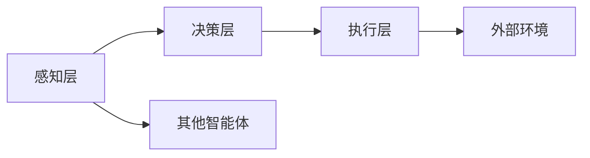
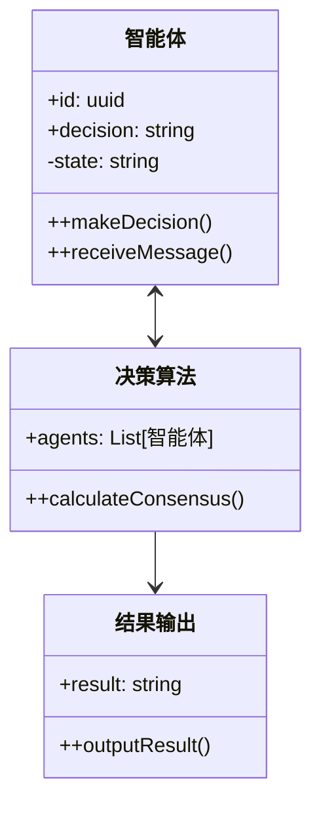

                 


# 智能体群体决策在识别市场异常中的应用：把握特殊机会

## 关键词：智能体群体决策、市场异常识别、群体智能、一致性算法、投票机制、股票交易异常

## 摘要：
智能体群体决策是一种通过多个智能体协作来做出决策的方法，尤其适用于复杂市场环境中的异常识别。本文将从基础概念、算法原理、系统架构到实际案例，全面解析智能体群体决策的应用。通过一致性函数和投票机制，结合Python代码实现，展示其在股票交易异常检测中的实际应用，帮助读者理解并掌握如何利用智能体群体决策来抓住市场中的特殊机会。

---

## 第1章：智能体群体决策概述

### 1.1 智能体的基本概念
智能体（Agent）是指能够感知环境、自主决策并采取行动的实体。单个智能体具备感知、决策、执行和学习能力。与单智能体相比，群体智能体通过协作实现更复杂的任务，增强决策的准确性和鲁棒性。

#### 表格对比：单智能体与群体智能体的属性对比

| 属性         | 单智能体          | 群体智能体          |
|--------------|------------------|--------------------|
| 决策方式     | 中央化决策        | 分布式决策          |
| 计算资源     | 依赖单个实体资源  | 聚焦全局资源分配    |
| 稳定性       | 易受单点故障影响  | 故障容忍度高        |

### 1.2 市场异常识别的重要性
市场异常通常指市场价格偏离正常波动范围，可能是由突发事件或市场操纵引起的。识别这些异常有助于投资者及时采取措施，避免损失或抓住机会。

### 1.3 智能体群体决策的优势
- **分布式计算**：避免单点故障，提高系统的鲁棒性。
- **信息聚合**：多个智能体协同工作，提高决策的准确性。
- **动态适应**：能够快速响应市场变化，适应复杂环境。

---

## 第2章：智能体群体决策的核心概念与联系

### 2.1 智能体的结构与功能
智能体的结构包括感知层、决策层和执行层。群体智能体通过信息交互协议协同工作，实现信息共享和任务分配。

#### Mermaid图示：智能体的协作结构


### 2.2 群体决策的属性特征
群体决策的关键属性包括一致性、收敛性、鲁棒性和可扩展性。通过对比这些属性，可以选择最适合特定场景的决策算法。

#### Mermaid图示：决策结果的收敛性分析


### 2.3 智能体群体决策的ER实体关系图
ER图展示了智能体、决策和结果之间的关系，帮助理解数据流的流动方向。

#### Mermaid图示：实体关系图
```mermaid
erd
actor 智能体 {
  id (uuid,PK)
  name (string)
}
actor 决策结果 {
  id (uuid,PK)
  decision (text)
}
智能体 --> 决策结果
```

---

## 第3章：智能体群体决策算法

### 3.1 基于一致性函数的群体决策算法
一致性函数通过调整个体决策，使群体决策趋于一致。算法步骤如下：

#### Mermaid流程图：一致性函数算法


#### Python代码实现
```python
def一致性函数(decision_list):
    # 计算一致性
   一致性 = sum(1 for i in range(len(decision_list)) if decision_list[i] == decision_list[0])
    return 一致性 / len(decision_list)
```

### 3.2 投票机制在群体决策中的应用
投票机制是一种简单有效的决策方法，适用于多选项决策场景。通过权重投票，可以提高决策的准确性。

#### Mermaid流程图：投票机制流程


#### 代码示例
```python
def投票机制(options, weights):
    总权重 = sum(weights)
    决策 = max(options, key=lambda x: (weights[x] / 总权重))
    return 决策
```

---

## 第4章：智能体群体决策的系统分析与架构设计

### 4.1 系统功能设计
系统功能模块包括数据采集、决策算法、结果输出和反馈机制。模块之间的协作确保系统的高效运行。

#### Mermaid类图：系统功能模块


### 4.2 系统架构设计
系统采用分层架构，包括数据层、算法层和应用层。每一层负责不同的功能模块，确保系统的可扩展性和可维护性。

#### Mermaid架构图：系统架构
```mermaid
docker
server 智能体群体决策系统 {
    智能体1
    智能体2
    ...
}
```

---

## 第5章：智能体群体决策的项目实战

### 5.1 股票交易异常检测案例
通过分析股票交易数据，利用智能体群体决策算法识别市场操纵行为。

#### 数据采集与预处理
```python
import pandas as pd
data = pd.read_csv('stock_data.csv')
```

#### 核心代码实现
```python
def detect_anomaly(data):
    agents = [_AGENT1, AGENT2, AGENT3]
    decisions = [agent.decision for agent in agents]
    consensus = calculate_consensus(decisions)
    return consensus
```

### 5.2 实际案例分析
通过对历史数据的分析，验证算法的有效性，并总结经验教训，优化系统性能。

---

## 第6章：总结与展望

### 6.1 全文总结
智能体群体决策通过多个智能体的协作，有效识别市场异常，帮助投资者抓住特殊机会。本文详细介绍了算法原理、系统架构和实际案例。

### 6.2 未来展望
未来研究可以关注算法的可扩展性、实时性和抗干扰能力，进一步提升决策的准确性和效率。

### 6.3 最佳实践 Tips
- 确保数据的高质量，避免噪声干扰。
- 选择合适的算法，根据实际场景调整参数。
- 定期更新系统，适应市场变化。

---

## 作者：AI天才研究院

通过本文的详细讲解，希望读者能够理解并掌握智能体群体决策在识别市场异常中的应用，抓住市场中的特殊机会。

