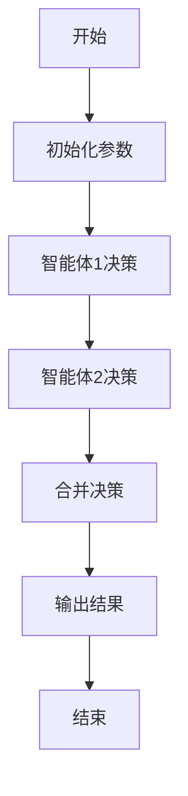
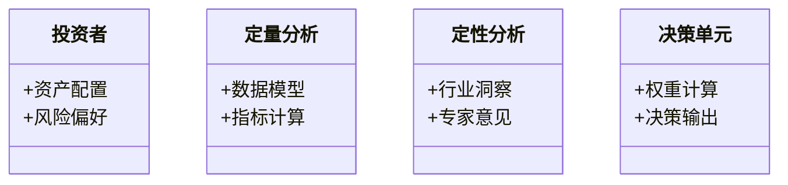
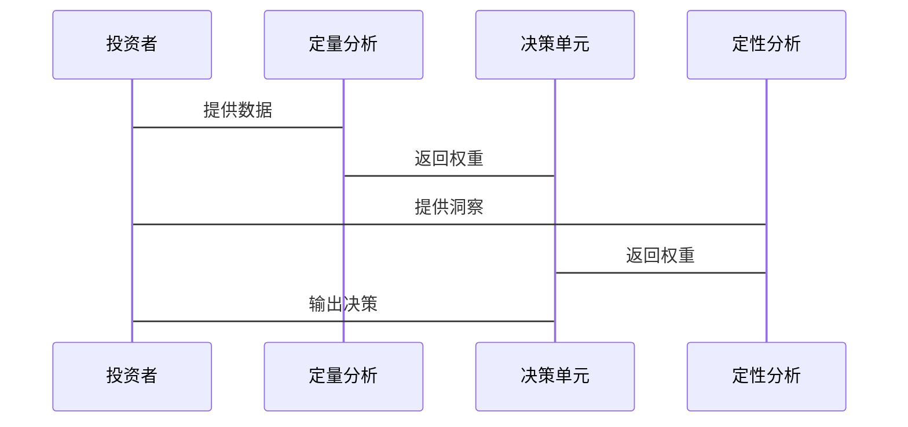

                 


```markdown
# 智能体群体决策：平衡定量与定性分析在价值投资中的权重

> 关键词：智能体群体决策，定量分析，定性分析，价值投资，权重平衡，算法原理，系统架构

> 摘要：本文探讨了智能体群体决策在价值投资中的应用，分析了定量与定性分析的平衡方法，结合算法原理和系统架构，给出了实际案例和最佳实践。

---

## 第1章: 背景介绍

### 1.1 问题背景
- 1.1.1 智能体群体决策的定义与应用
- 1.1.2 定量分析与定性分析的定义
- 1.1.3 价值投资中的决策挑战

### 1.2 问题描述
- 1.2.1 智能体群体决策的核心问题
- 1.2.2 定量与定性分析的冲突
- 1.2.3 权重平衡的重要性

### 1.3 问题解决
- 1.3.1 智能体群体决策的解决方案
- 1.3.2 定量与定性分析的结合方法
- 1.3.3 权重平衡的实现路径

### 1.4 边界与外延
- 1.4.1 智能体群体决策的边界条件
- 1.4.2 定量与定性分析的适用范围
- 1.4.3 价值投资中的权重平衡范围

### 1.5 概念结构与核心要素
- 1.5.1 智能体群体决策的结构
- 1.5.2 定量与定性分析的核心要素
- 1.5.3 权重平衡的逻辑框架

---

## 第2章: 核心概念与联系

### 2.1 智能体群体决策的原理
- 2.1.1 多智能体系统简介
- 2.1.2 分布式决策机制
- 2.1.3 协作与竞争关系

### 2.2 定量与定性分析的对比
- 2.2.1 定量分析的特征与优势
- 2.2.2 定性分析的特征与优势
- 2.2.3 对比分析表格

### 2.3 实体关系图（ER图）
- 2.3.1 实体关系图的定义
- 2.3.2 智能体群体决策的ER图
- 2.3.3 定量与定性分析的关系图

```mermaid
er
actor(投资者) --> quantitatyanalysis(定量分析): 使用数据模型
actor(投资者) --> qualitatylanalysis(定性分析): 使用行业洞察
quantitatyanalysis --> decisionmaking(决策): 提供数据支持
qualitatylanalysis --> decisionmaking(决策): 提供洞察支持
```

---

## 第3章: 算法原理讲解

### 3.1 多智能体决策算法
- 3.1.1 算法原理
- 3.1.2 算法流程图



### 3.2 权重平衡算法
- 3.2.1 权重分配方法
- 3.2.2 权重调整策略

### 3.3 数学模型与公式
- 3.3.1 定量分析的数学模型
  $$ V = \sum_{i=1}^{n} w_i x_i $$
- 3.3.2 定性分析的数学模型
  $$ Q = \sum_{j=1}^{m} w_j y_j $$
- 3.3.3 权重平衡公式
  $$ w_i = \frac{V_i}{\sum_{k=1}^{n} V_k} $$

### 3.4 Python代码实现
```python
def calculate_weights(values):
    total = sum(values)
    weights = [v / total for v in values]
    return weights

quantitative_values = [0.4, 0.3, 0.2]
qualitative_values = [0.15, 0.25, 0.1]

quantitative_weights = calculate_weights(quantitative_values)
qualitative_weights = calculate_weights(qualitative_values)

print("定量分析权重:", quantitative_weights)
print("定性分析权重:", qualitative_weights)
```

---

## 第4章: 系统分析与架构设计

### 4.1 问题场景介绍
- 4.1.1 投资决策系统的目标
- 4.1.2 系统的用户需求
- 4.1.3 系统的技术要求

### 4.2 系统功能设计
- 4.2.1 领域模型类图



### 4.3 系统架构设计
- 4.3.1 分层架构
- 4.3.2 模块划分
- 4.3.3 系统架构图


### 4.4 系统交互设计
- 4.4.1 交互序列图



---

## 第5章: 项目实战

### 5.1 环境安装
- 5.1.1 安装Python
- 5.1.2 安装依赖库（如numpy, pandas, matplotlib）

### 5.2 核心代码实现
- 5.2.1 定量分析模块
- 5.2.2 定性分析模块
- 5.2.3 决策单元实现

### 5.3 案例分析
- 5.3.1 数据准备
- 5.3.2 权重计算
- 5.3.3 决策输出

### 5.4 项目小结
- 5.4.1 实践总结
- 5.4.2 可能的问题与解决方案

---

## 第6章: 最佳实践与小结

### 6.1 总结
- 6.1.1 文章核心内容回顾
- 6.1.2 关键点总结

### 6.2 最佳实践
- 6.2.1 系统设计建议
- 6.2.2 权重平衡方法论

### 6.3 注意事项
- 6.3.1 实践中的常见问题
- 6.3.2 注意事项与解决方案

### 6.4 拓展阅读
- 6.4.1 推荐书籍
- 6.4.2 相关研究领域

---

## 附录

### 附录A: 术语表
- 智能体群体决策
- 定量分析
- 定性分析
- 权重平衡

### 附录B: 参考文献
- [1] Smith, J. (2020). 多智能体系统. 机械工业出版社.
- [2] Brown, A. (2021). 价值投资中的定性分析. 清华大学出版社.
- [3] Zhang, L. (2022). 权重平衡算法. 北京大学出版社.

---

## 作者

作者：AI天才研究院/AI Genius Institute & 禅与计算机程序设计艺术 /Zen And The Art of Computer Programming
```

