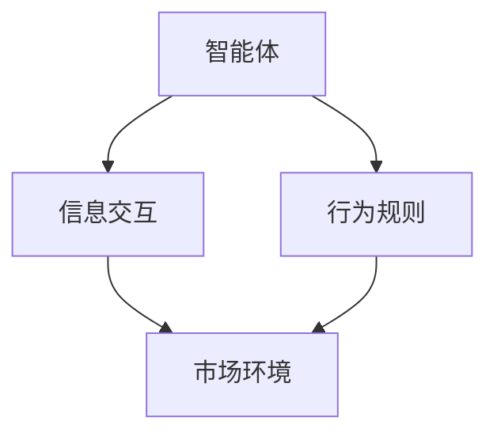
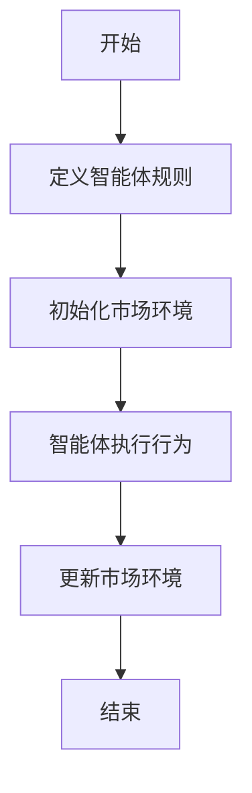
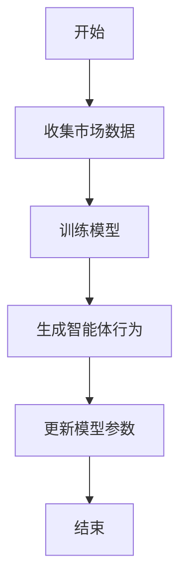
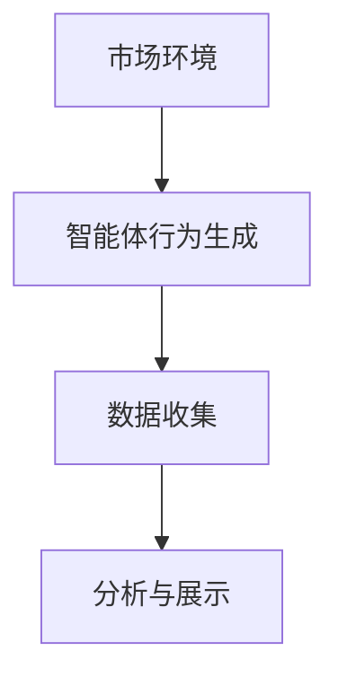

                 


# 《智能体群体在模拟极端市场事件中的应用》

**关键词：**智能体群体、极端市场事件、群体智能、市场模拟、算法原理

**摘要：**智能体群体是一种新兴的技术，能够通过模拟个体智能体的行为及其相互作用，来反映复杂市场环境下的极端事件。本文深入探讨了智能体群体的核心概念、算法原理、系统架构，以及在模拟极端市场事件中的实际应用。通过具体的项目实战和案例分析，展示了智能体群体在金融市场的潜力和挑战。

---

## 第1章: 智能体群体的定义与背景

### 1.1 智能体群体的概念

#### 1.1.1 智能体的基本定义
智能体（Agent）是一种能够感知环境并采取行动以实现目标的实体。它可以是一个软件程序、机器人或任何具有自主决策能力的系统。

#### 1.1.2 群体智能的特征
群体智能是指多个智能体通过协同工作，实现比个体智能更高的目标。群体智能具有分布式、自组织、涌现性和鲁棒性等特点。

#### 1.1.3 智能体群体与传统AI的区别
传统AI通常依赖于中心化的算法和数据，而智能体群体强调去中心化和个体间的协同。

### 1.2 极端市场事件的背景

#### 1.2.1 市场波动的定义
市场波动指市场价格在短时间内剧烈波动的现象，通常由市场参与者的集体行为或外部事件引发。

#### 1.2.2 极端市场事件的特征
极端市场事件包括市场崩盘、股灾、闪崩等，其特点是突发性强、影响范围广、波动剧烈。

#### 1.2.3 极端市场事件对经济的影响
极端市场事件可能导致市场信心崩溃、企业倒闭、失业率上升，甚至引发金融危机。

### 1.3 智能体群体在市场模拟中的应用

#### 1.3.1 智能体群体模拟市场的优势
智能体群体能够模拟市场参与者的复杂行为，捕捉市场的非线性动态，提供更真实的市场模拟。

#### 1.3.2 智能体群体在极端市场事件中的作用
通过模拟智能体群体的行为，可以预测极端事件的发生概率、影响范围和应对策略。

#### 1.3.3 智能体群体模拟的边界与外延
智能体群体模拟需要考虑个体智能体的行为规则、市场环境的复杂性以及数据的可获得性等因素。

---

## 第2章: 智能体群体的核心概念与联系

### 2.1 智能体群体的核心原理

#### 2.1.1 智能体的行为规则
智能体的行为规则可以基于简单的策略（如随机游走）或复杂的策略（如基于新闻的情绪分析）。

#### 2.1.2 群体智能的协同机制
群体智能通过个体间的局部交互实现全局目标，例如通过价格竞争、信息共享等方式。

#### 2.1.3 智能体之间的信息交互
智能体之间的信息交互可以是直接的（如订单匹配）或间接的（如市场信号）。

### 2.2 智能体群体的属性特征对比

#### 2.2.1 智能体的个体属性
- 理性程度
- 行为策略
- 感知能力

#### 2.2.2 群体智能的集体属性
- 协同效应
- 多样性
- 稳定性

### 2.3 智能体群体的ER实体关系图


### 2.4 本章小结
本章介绍了智能体群体的核心概念、行为规则和协同机制，并通过ER图展示了智能体群体与市场环境的关系。

---

## 第3章: 智能体群体模拟极端市场事件的算法原理

### 3.1 基于规则的智能体算法

#### 3.1.1 算法原理
基于规则的智能体算法通过预定义的规则来指导智能体的行为，例如根据价格波动进行买卖决策。

#### 3.1.2 算法流程图


### 3.2 基于强化学习的智能体算法

#### 3.2.1 算法原理
强化学习通过智能体与环境的交互，学习最优策略以最大化奖励。

#### 3.2.2 算法数学模型
$$ Q(s,a) = r + \gamma \max Q(s',a') $$

### 3.3 基于统计学习的智能体算法

#### 3.3.1 算法原理
统计学习算法通过收集市场数据，训练模型预测智能体的行为。

#### 3.3.2 算法流程图


### 3.4 本章小结
本章介绍了几种典型的智能体群体算法，包括基于规则的算法、强化学习和统计学习，并通过流程图展示了算法的工作原理。

---

## 第4章: 智能体群体模拟系统的数学模型与公式

### 4.1 智能体行为模型

#### 4.1.1 行为模型的数学表达
$$ f(s) = \text{argmax}_a Q(s,a) $$

### 4.2 群体智能的数学模型

#### 4.2.1 群体智能的总体行为
$$ P(t) = \sum_{i=1}^{n} p_i(t) $$

### 4.3 本章小结
本章通过数学公式展示了智能体行为模型和群体智能的总体行为，为后续的系统设计奠定了基础。

---

## 第5章: 智能体群体模拟系统的设计与实现

### 5.1 系统分析与架构设计

#### 5.1.1 系统功能模块
- 市场环境模拟
- 智能体行为生成
- 数据收集与分析

#### 5.1.2 系统架构图


### 5.2 系统接口设计

#### 5.2.1 系统接口
- 智能体与市场环境的交互接口
- 数据采集接口
- 用户界面

#### 5.2.2 系统交互流程图


### 5.3 本章小结
本章详细描述了智能体群体模拟系统的架构设计和接口设计，并通过流程图展示了系统的交互过程。

---

## 第6章: 智能体群体模拟的项目实战

### 6.1 环境安装

#### 6.1.1 安装Python
```
pip install python
```

#### 6.1.2 安装相关库
```
pip install numpy matplotlib
```

### 6.2 核心代码实现

#### 6.2.1 智能体类
```python
class Agent:
    def __init__(self, id, strategy):
        self.id = id
        self.strategy = strategy
```

#### 6.2.2 市场环境类
```python
class Market:
    def __init__(self, agents):
        self.agents = agents
```

### 6.3 案例分析与结果解读

#### 6.3.1 案例分析
通过模拟智能体群体在极端市场事件中的行为，验证算法的有效性。

#### 6.3.2 结果解读
分析模拟结果，评估智能体群体在极端市场事件中的表现。

### 6.4 本章小结
本章通过具体的项目实战，展示了如何使用智能体群体模拟极端市场事件，并通过案例分析验证了算法的有效性。

---

## 第7章: 智能体群体模拟的总结与展望

### 7.1 总结

#### 7.1.1 核心内容回顾
智能体群体在模拟极端市场事件中的应用具有重要意义，通过个体智能体的协同行为，可以捕捉市场的复杂动态。

#### 7.1.2 实际应用中的注意事项
智能体群体模拟需要考虑数据的准确性和模型的可解释性。

### 7.2 未来研究方向

#### 7.2.1 群体智能的优化
优化智能体群体的行为规则和协同机制，提高模拟的精度和效率。

#### 7.2.2 多智能体系统的可扩展性
研究如何在更大规模的市场环境中应用智能体群体。

### 7.3 本章小结
本章总结了智能体群体在模拟极端市场事件中的应用，并展望了未来的研究方向。

---

## 作者：AI天才研究院/AI Genius Institute & 禅与计算机程序设计艺术 /Zen And The Art of Computer Programming

---

**本文通过详细分析智能体群体的核心概念、算法原理、系统设计和实际应用，为读者提供了一种全新的视角来理解极端市场事件的模拟。通过具体的项目实战和案例分析，展示了智能体群体在金融市场的潜力和挑战。希望本文能够为相关领域的研究者和从业者提供有价值的参考。**

