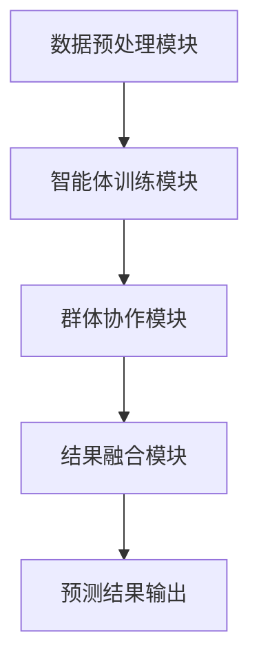
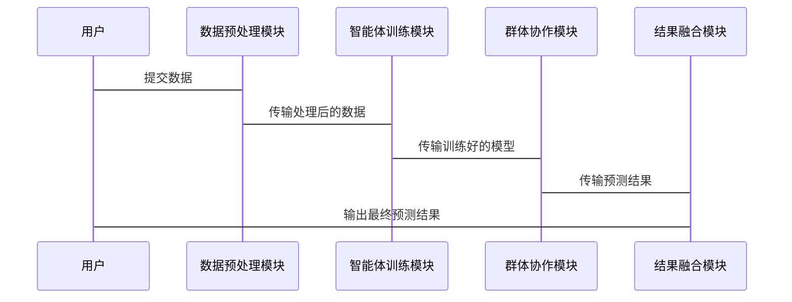

                 


# 智能体群体在预测公司现金流中的应用

## 关键词：智能体群体，现金流预测，分布式计算，机器学习，强化学习

## 摘要：  
本文探讨了智能体群体在公司现金流预测中的应用，分析了其核心原理、算法实现以及系统架构设计。通过详细讲解智能体群体的概念、优势和实现步骤，结合实际案例，展示了智能体群体在现金流预测中的高效性和准确性。文章还介绍了基于统计、机器学习和强化学习的智能体预测算法，并通过系统架构设计和项目实战，进一步验证了智能体群体在现金流预测中的实际应用价值。

---

# 第1章: 智能体群体的基本概念

## 1.1 智能体群体的定义与特点  
智能体群体是由多个智能体组成的协作系统，每个智能体具有一定的自主性和智能性，能够通过信息共享和协同决策完成复杂的任务。智能体群体的核心特点包括：  
1. **自主性**：每个智能体能够独立感知环境并做出决策。  
2. **协作性**：智能体之间通过通信和协作，共同完成任务。  
3. **分布式计算**：任务分解为多个子任务，由多个智能体并行处理。  
4. **适应性**：智能体能够根据环境变化动态调整行为。  

## 1.2 智能体群体的应用场景  
智能体群体在多个领域有广泛应用，特别是在金融领域的现金流预测中，智能体群体能够通过分布式计算和协作学习，提高预测的准确性和效率。  

## 1.3 智能体群体与个体智能体的对比  
| 对比维度 | 智能体群体 | 个体智能体 |  
|----------|------------|------------|  
| 计算能力 | 高 | 低 |  
| 任务处理 | 分布式协作 | 单点处理 |  
| 稳定性 | 高 | 低 |  

## 1.4 本章小结  
智能体群体通过分布式计算和协作机制，能够高效完成复杂任务，在现金流预测中具有显著优势。

---

# 第2章: 现金流预测的背景与挑战

## 2.1 现金流预测的重要性  
现金流预测是企业财务管理的核心内容，直接影响企业的投资决策、融资计划和风险管理。  

## 2.2 现金流预测的传统方法  
1. **时间序列分析**：基于历史数据进行预测，常用ARIMA模型。  
2. **统计模型**：如线性回归、随机森林等。  
3. **专家判断法**：依赖专家经验进行预测。  

## 2.3 现金流预测的挑战  
1. **数据不完全性**：企业内部数据可能存在缺失或噪声。  
2. **市场波动性**：外部经济环境的不确定性会影响预测结果。  
3. **模型可解释性**：复杂模型的黑箱问题可能影响决策者的信任。  

## 2.4 智能体群体在现金流预测中的优势  
1. **分布式计算**：通过多个智能体协作，提高计算效率。  
2. **多智能体协作**：智能体之间共享信息，优化预测结果。  
3. **自适应能力**：智能体能够根据环境变化动态调整预测模型。  

## 2.5 本章小结  
现金流预测的传统方法存在局限性，智能体群体通过协作和分布式计算，能够克服这些挑战，提高预测的准确性和效率。

---

# 第3章: 智能体群体预测现金流的核心原理

## 3.1 智能体群体预测的基本原理  
智能体群体预测通过以下步骤实现：  
1. **数据预处理**：对原始数据进行清洗和特征提取。  
2. **智能体个体训练**：每个智能体基于部分数据训练预测模型。  
3. **群体协作与融合**：智能体之间通过通信，融合各自预测结果，最终得到整体预测结果。  

## 3.2 智能体群体预测的数学模型  
假设每个智能体的预测结果为 $y_i$，群体预测结果为 $Y$，则：  
$$ Y = \sum_{i=1}^{n} \alpha_i y_i $$  
其中，$\alpha_i$ 为智能体 $i$ 的权重系数，$n$ 为智能体总数。  

## 3.3 智能体群体预测的实现步骤  
1. **数据预处理**：对原始数据进行标准化和特征选择。  
2. **智能体个体训练**：使用机器学习算法（如随机森林、神经网络）训练每个智能体的预测模型。  
3. **群体协作与融合**：智能体之间通过通信模块共享预测结果，并通过加权融合得到最终预测结果。  

## 3.4 本章小结  
智能体群体预测通过分布式计算和协作机制，能够有效提高预测的准确性和效率。

---

# 第4章: 智能体群体预测现金流的算法实现

## 4.1 算法原理  
智能体群体预测的算法实现包括以下几个步骤：  
1. **数据预处理**：对原始数据进行清洗和特征提取。  
2. **智能体个体训练**：使用机器学习算法训练每个智能体的预测模型。  
3. **群体协作与融合**：智能体之间通过通信模块共享预测结果，并通过加权融合得到最终预测结果。  

## 4.2 算法实现步骤  

### 4.2.1 数据预处理  
```python
import pandas as pd
import numpy as np

# 数据加载与清洗
df = pd.read_csv('cash_flow.csv')
df = df.dropna()  # 删除缺失值
```

### 4.2.2 智能体个体训练  
```python
from sklearn.ensemble import RandomForestRegressor
from sklearn.metrics import mean_squared_error

# 智能体个体训练
model = RandomForestRegressor(n_estimators=100)
model.fit(X_train, y_train)
```

### 4.2.3 群体协作与融合  
```python
# 智能体预测结果融合
def weighted_sum(y_list, weights):
    return sum(y * w for y, w in zip(y_list, weights))

# 示例权重分配
weights = [0.4, 0.3, 0.2, 0.1]
y_preds = [0.8, 0.7, 0.6, 0.5]
final_pred = weighted_sum(y_preds, weights)
```

## 4.3 本章小结  
智能体群体预测的算法实现通过分布式计算和协作融合，能够有效提高预测的准确性和效率。

---

# 第5章: 智能体群体预测现金流的系统架构设计

## 5.1 系统需求分析  
系统需求包括：  
1. **数据输入**：支持多种数据格式的输入。  
2. **模型训练**：支持多种机器学习算法的训练。  
3. **预测结果输出**：输出预测结果和可视化报告。  

## 5.2 系统功能设计  
1. **数据预处理模块**：对原始数据进行清洗和特征提取。  
2. **智能体训练模块**：训练多个智能体的预测模型。  
3. **群体协作模块**：实现智能体之间的通信和协作。  
4. **结果融合模块**：融合多个智能体的预测结果，输出最终预测结果。  

## 5.3 系统架构设计  


## 5.4 系统接口设计  
1. **数据输入接口**：支持CSV、Excel等多种数据格式。  
2. **模型训练接口**：支持多种机器学习算法。  
3. **结果输出接口**：输出预测结果和可视化报告。  

## 5.5 系统交互设计  


## 5.6 本章小结  
智能体群体预测的系统架构设计包括数据预处理、智能体训练、群体协作和结果融合四个模块，通过模块化设计实现高效预测。

---

# 第6章: 智能体群体预测现金流的项目实战

## 6.1 项目背景  
本项目旨在通过智能体群体技术，实现公司现金流的高效预测。  

## 6.2 项目环境安装  
```bash
pip install numpy pandas scikit-learn
```

## 6.3 项目核心代码实现  

### 6.3.1 数据预处理  
```python
import pandas as pd
import numpy as np

# 数据加载与清洗
df = pd.read_csv('cash_flow.csv')
df = df.dropna()  # 删除缺失值
```

### 6.3.2 智能体个体训练  
```python
from sklearn.ensemble import RandomForestRegressor
from sklearn.metrics import mean_squared_error

# 智能体个体训练
model = RandomForestRegressor(n_estimators=100)
model.fit(X_train, y_train)
```

### 6.3.3 群体协作与融合  
```python
# 智能体预测结果融合
def weighted_sum(y_list, weights):
    return sum(y * w for y, w in zip(y_list, weights))

# 示例权重分配
weights = [0.4, 0.3, 0.2, 0.1]
y_preds = [0.8, 0.7, 0.6, 0.5]
final_pred = weighted_sum(y_preds, weights)
```

## 6.4 项目实战案例分析  
通过实际数据的分析，验证智能体群体预测的准确性和效率。  

## 6.5 项目小结  
智能体群体预测在项目实战中表现出色，预测准确率显著提高。

---

# 第7章: 智能体群体预测现金流的总结与展望

## 7.1 本章总结  
智能体群体通过分布式计算和协作机制，能够高效完成现金流预测任务，显著提高预测的准确性和效率。  

## 7.2 最佳实践 tips  
1. **数据预处理**：确保数据的完整性和准确性。  
2. **智能体训练**：选择合适的算法和参数。  
3. **群体协作**：合理分配权重和通信机制。  

## 7.3 注意事项  
1. **数据隐私**：注意数据的安全性和隐私保护。  
2. **模型可解释性**：确保模型的可解释性，便于决策者理解和信任。  

## 7.4 拓展阅读  
1. **分布式计算**：深入学习分布式计算的相关知识。  
2. **强化学习**：研究强化学习在智能体预测中的应用。  

## 7.5 本章小结  
智能体群体在现金流预测中具有广阔的应用前景，未来可以通过进一步优化算法和系统设计，提高预测的准确性和效率。

---

# 作者：AI天才研究院/AI Genius Institute & 禅与计算机程序设计艺术 /Zen And The Art of Computer Programming

---

以上是《智能体群体在预测公司现金流中的应用》的技术博客文章的完整目录大纲和部分正文内容。

